Cal Poly Herpetology CURE - Baseline Analyses
================
Spring Quarter 2021

  - [Packages](#packages)
  - [Background and Goals](#background-and-goals)
  - [ggbiplot](#ggbiplot)
  - [Data](#data)
      - [Morphometrics and Blood Data](#morphometrics-and-blood-data)
      - [CEWL Data](#cewl-data)
      - [Weather Data](#weather-data)
      - [Rain & Humidity](#rain-humidity)
      - [Join Data](#join-data)
  - [Check Data Distributions](#check-data-distributions)
      - [Histograms & Q-Q Plots](#histograms-q-q-plots)
          - [SVL](#svl)
          - [mass](#mass)
          - [hematocrit](#hematocrit)
          - [osmolality](#osmolality)
          - [cloacal temperature](#cloacal-temperature)
          - [dewlap CEWL](#dewlap-cewl)
          - [dorsum CEWL](#dorsum-cewl)
          - [head CEWL](#head-cewl)
          - [mite patch CEWL](#mite-patch-cewl)
          - [ventrum CEWL](#ventrum-cewl)
      - [Transformations](#transformations)
          - [SVL](#svl-1)
          - [mass](#mass-1)
          - [hematocrit](#hematocrit-1)
          - [cloacal temperature](#cloacal-temperature-1)
          - [dewlap CEWL](#dewlap-cewl-1)
          - [dorsum CEWL](#dorsum-cewl-1)
          - [head CEWL](#head-cewl-1)
          - [mite patch CEWL](#mite-patch-cewl-1)
          - [ventrum CEWL](#ventrum-cewl-1)
  - [Basic Figs & GLMs](#basic-figs-glms)
      - [What affects hydration &
        health?](#what-affects-hydration-health)
          - [Hct \~ SVL](#hct-svl)
          - [Osml \~ SVL](#osml-svl)
          - [Hct \~ Mass](#hct-mass)
          - [Osml \~ Mass](#osml-mass)
          - [Hct \~ Sex](#hct-sex)
          - [Osml \~ Sex](#osml-sex)
          - [Hct \~ Gravidity](#hct-gravidity)
          - [Osml \~ Gravidity](#osml-gravidity)
          - [Hct \~ Sample Eye](#hct-sample-eye)
          - [Osml \~ Sample Eye](#osml-sample-eye)
          - [Hct \~ Hemolyzed/Not](#hct-hemolyzednot)
          - [Osml \~ Hemolyzed/Not](#osml-hemolyzednot)
          - [Hct \~ Week](#hct-week)
          - [Osml \~ Week](#osml-week)
          - [Humidity \~ Week](#humidity-week)
          - [Osml, Humidity, Week](#osml-humidity-week)
          - [Osml \~ R. Humidity](#osml-r.-humidity)
          - [Osml \~ Abs. Humidity](#osml-abs.-humidity)
          - [Osml \~ Avg. Abs. Humidity](#osml-avg.-abs.-humidity)
          - [Osml \~ Rain](#osml-rain)
          - [Hct \~ Humidity](#hct-humidity)
          - [Hct \~ Temperature](#hct-temperature)
          - [Osml \~ Temperature](#osml-temperature)
          - [Hct \~ Individual](#hct-individual)
          - [Osml \~ Individual](#osml-individual)
      - [Conclusion](#conclusion)
      - [What affects evaporative water
        loss?](#what-affects-evaporative-water-loss)
          - [CEWL \~ Body Region](#cewl-body-region)
          - [CEWL \~ Osmolality](#cewl-osmolality)
          - [Dorsum CEWL \~ Osmolality](#dorsum-cewl-osmolality)
          - [Ventrum CEWL \~ Osmolality](#ventrum-cewl-osmolality)
          - [Dewlap CEWL \~ Osmolality](#dewlap-cewl-osmolality)
          - [Mite Patch CEWL \~ Osmolality](#mite-patch-cewl-osmolality)
          - [Head CEWL \~ Osmolality](#head-cewl-osmolality)
          - [CEWL \~ Hematocrit](#cewl-hematocrit)
          - [CEWL \~ Cloacal Temperature](#cewl-cloacal-temperature)
          - [CEWL \~ Capture Temperature](#cewl-capture-temperature)
          - [CEWL \~ Capture Humidity](#cewl-capture-humidity)
          - [CEWL \~ Abs Humidity](#cewl-abs-humidity)
          - [CEWL \~ Measurement
            Temperature](#cewl-measurement-temperature)
          - [CEWL \~ Measurement Humidity](#cewl-measurement-humidity)
          - [CEWL \~ Wind Speed](#cewl-wind-speed)
          - [CEWL \~ Solar Rad](#cewl-solar-rad)
          - [CEWL \~ Individual](#cewl-individual)
          - [CEWL \~ SVL](#cewl-svl)
          - [CEWL \~ Mass](#cewl-mass)
          - [CEWL \~ Sex](#cewl-sex)
          - [CEWL \~ Gravidity](#cewl-gravidity)
          - [CEWL \~ Week](#cewl-week)
          - [CEWL \~ holding time](#cewl-holding-time)
      - [Conclusion](#conclusion-1)
  - [PCA](#pca)
  - [GLMMs](#glmms)
      - [Hydration](#hydration)
          - [Multicollinearity](#multicollinearity)
          - [Models](#models)
          - [Selection](#selection)
          - [Conclusion](#conclusion-2)
      - [CEWL](#cewl)
          - [Multicollinearity](#multicollinearity-1)
          - [Models](#models-1)
          - [Selection](#selection-1)
          - [Updates](#updates)
          - [Conclusion](#conclusion-3)
  - [to-do:](#to-do)
  - [What to Present in the Paper](#what-to-present-in-the-paper)

# Packages

# Background and Goals

This data was collected April - May 2021 during a course-based
undergraduate research experience (CURE) in Herpetology, taught by Emily
Taylor at Cal Poly, San Luis Obispo. This part of the study was
conducted to describe the variation in hydrophysiology in *Sceloporus
occidentalis* and to investigate that drives that variation. Please
refer to **doi:** for full details.

In this document, we investigate differences in cutaneous evaporative
water loss (CEWL) across body regions and dependent on environment, body
size, health, and hydration.

# ggbiplot

Code to prep for Principle Component Analyses Plots

``` r
# 
#  ggbiplot.r
#  
#  Copyright 2011 Vincent Q. Vu.
# 
#  This program is free software; you can redistribute it and/or
#  modify it under the terms of the GNU General Public License
#  as published by the Free Software Foundation; either version 2
#  of the License, or (at your option) any later version.
#  
#  This program is distributed in the hope that it will be useful,
#  but WITHOUT ANY WARRANTY; without even the implied warranty of
#  MERCHANTABILITY or FITNESS FOR A PARTICULAR PURPOSE.  See the
#  GNU General Public License for more details.
#  
#  You should have received a copy of the GNU General Public License
#  along with this program; if not, write to the Free Software
#  Foundation, Inc., 51 Franklin Street, Fifth Floor, Boston, MA  02110-1301, USA.
# 

#' Biplot for Principal Components using ggplot2
#'
#' @param pcobj           an object returned by prcomp() or princomp()
#' @param choices         which PCs to plot
#' @param scale           covariance biplot (scale = 1), form biplot (scale = 0). When scale = 1, the inner product between the variables approximates the covariance and the distance between the points approximates the Mahalanobis distance.
#' @param obs.scale       scale factor to apply to observations
#' @param var.scale       scale factor to apply to variables
#' @param pc.biplot       for compatibility with biplot.princomp()
#' @param groups          optional factor variable indicating the groups that the observations belong to. If provided the points will be colored according to groups
#' @param ellipse         draw a normal data ellipse for each group?
#' @param ellipse.prob    size of the ellipse in Normal probability
#' @param labels          optional vector of labels for the observations
#' @param labels.size     size of the text used for the labels
#' @param alpha           alpha transparency value for the points (0 = transparent, 1 = opaque)
#' @param circle          draw a correlation circle? (only applies when prcomp was called with scale = TRUE and when var.scale = 1)
#' @param var.axes        draw arrows for the variables?
#' @param varname.size    size of the text for variable names
#' @param varname.adjust  adjustment factor the placement of the variable names, >= 1 means farther from the arrow
#' @param varname.abbrev  whether or not to abbreviate the variable names
#'
#' @return                a ggplot2 plot
#' @export
#' @examples
#'   data(wine)
#'   wine.pca <- prcomp(wine, scale. = TRUE)
#'   print(ggbiplot(wine.pca, obs.scale = 1, var.scale = 1, groups = wine.class, ellipse = TRUE, circle = TRUE))
#'
ggbiplot <- function(pcobj, choices = 1:2, scale = 1, pc.biplot = TRUE, 
                     obs.scale = 1 - scale, var.scale = scale, 
                     groups = NULL, ellipse = FALSE, ellipse.prob = 0.68, 
                     labels = NULL, labels.size = 3, alpha = 1, 
                     var.axes = TRUE, 
                     circle = FALSE, circle.prob = 0.69, 
                     varname.size = 3, varname.adjust = 1.5, 
                     varname.abbrev = FALSE, ...)
{
  library(ggplot2)
  library(plyr)
  library(scales)
  library(grid)
  
  stopifnot(length(choices) == 2)
  
  # Recover the SVD
  if(inherits(pcobj, 'prcomp')){
    nobs.factor <- sqrt(nrow(pcobj$x) - 1)
    d <- pcobj$sdev
    u <- sweep(pcobj$x, 2, 1 / (d * nobs.factor), FUN = '*')
    v <- pcobj$rotation
  } else if(inherits(pcobj, 'princomp')) {
    nobs.factor <- sqrt(pcobj$n.obs)
    d <- pcobj$sdev
    u <- sweep(pcobj$scores, 2, 1 / (d * nobs.factor), FUN = '*')
    v <- pcobj$loadings
  } else if(inherits(pcobj, 'PCA')) {
    nobs.factor <- sqrt(nrow(pcobj$call$X))
    d <- unlist(sqrt(pcobj$eig)[1])
    u <- sweep(pcobj$ind$coord, 2, 1 / (d * nobs.factor), FUN = '*')
    v <- sweep(pcobj$var$coord,2,sqrt(pcobj$eig[1:ncol(pcobj$var$coord),1]),FUN="/")
  } else if(inherits(pcobj, "lda")) {
    nobs.factor <- sqrt(pcobj$N)
    d <- pcobj$svd
    u <- predict(pcobj)$x/nobs.factor
    v <- pcobj$scaling
    d.total <- sum(d^2)
  } else {
    stop('Expected a object of class prcomp, princomp, PCA, or lda')
  }
  
  # Scores
  choices <- pmin(choices, ncol(u))
  df.u <- as.data.frame(sweep(u[,choices], 2, d[choices]^obs.scale, FUN='*'))
  
  # Directions
  v <- sweep(v, 2, d^var.scale, FUN='*')
  df.v <- as.data.frame(v[, choices])
  
  names(df.u) <- c('xvar', 'yvar')
  names(df.v) <- names(df.u)
  
  if(pc.biplot) {
    df.u <- df.u * nobs.factor
  }
  
  # Scale the radius of the correlation circle so that it corresponds to 
  # a data ellipse for the standardized PC scores
  r <- sqrt(qchisq(circle.prob, df = 2)) * prod(colMeans(df.u^2))^(1/4)
  
  # Scale directions
  v.scale <- rowSums(v^2)
  df.v <- r * df.v / sqrt(max(v.scale))
  
  # Change the labels for the axes
  if(obs.scale == 0) {
    u.axis.labs <- paste('standardized PC', choices, sep='')
  } else {
    u.axis.labs <- paste('PC', choices, sep='')
  }
  
  # Append the proportion of explained variance to the axis labels
  u.axis.labs <- paste(u.axis.labs, 
                       sprintf('(%0.1f%% explained var.)', 
                               100 * pcobj$sdev[choices]^2/sum(pcobj$sdev^2)))
  
  # Score Labels
  if(!is.null(labels)) {
    df.u$labels <- labels
  }
  
  # Grouping variable
  if(!is.null(groups)) {
    df.u$groups <- groups
  }
  
  # Variable Names
  if(varname.abbrev) {
    df.v$varname <- abbreviate(rownames(v))
  } else {
    df.v$varname <- rownames(v)
  }
  
  # Variables for text label placement
  df.v$angle <- with(df.v, (180/pi) * atan(yvar / xvar))
  df.v$hjust = with(df.v, (1 - varname.adjust * sign(xvar)) / 2)
  
  # Base plot
  g <- ggplot(data = df.u, aes(x = xvar, y = yvar)) + 
    xlab(u.axis.labs[1]) + ylab(u.axis.labs[2]) + coord_equal()
  
  if(var.axes) {
    # Draw circle
    if(circle) 
    {
      theta <- c(seq(-pi, pi, length = 50), seq(pi, -pi, length = 50))
      circle <- data.frame(xvar = r * cos(theta), yvar = r * sin(theta))
      g <- g + geom_path(data = circle, color = muted('white'), 
                         size = 1/2, alpha = 1/3)
    }
    
    # Draw directions
    g <- g +
      geom_segment(data = df.v,
                   aes(x = 0, y = 0, xend = xvar, yend = yvar),
                   arrow = arrow(length = unit(1/2, 'picas')), 
                   color = muted('red'))
  }
  
  # Draw either labels or points
  if(!is.null(df.u$labels)) {
    if(!is.null(df.u$groups)) {
      g <- g + geom_text(aes(label = labels, color = groups), 
                         size = labels.size)
    } else {
      g <- g + geom_text(aes(label = labels), size = labels.size)      
    }
  } else {
    if(!is.null(df.u$groups)) {
      g <- g + geom_point(aes(color = groups), alpha = alpha)
    } else {
      g <- g + geom_point(alpha = alpha)      
    }
  }
  
  # Overlay a concentration ellipse if there are groups
  if(!is.null(df.u$groups) && ellipse) {
    theta <- c(seq(-pi, pi, length = 50), seq(pi, -pi, length = 50))
    circle <- cbind(cos(theta), sin(theta))
    
    ell <- ddply(df.u, 'groups', function(x) {
      if(nrow(x) <= 2) {
        return(NULL)
      }
      sigma <- var(cbind(x$xvar, x$yvar))
      mu <- c(mean(x$xvar), mean(x$yvar))
      ed <- sqrt(qchisq(ellipse.prob, df = 2))
      data.frame(sweep(circle %*% chol(sigma) * ed, 2, mu, FUN = '+'), 
                 groups = x$groups[1])
    })
    names(ell)[1:2] <- c('xvar', 'yvar')
    g <- g + geom_path(data = ell, aes(color = groups, group = groups))
  }
  
  # Label the variable axes
  if(var.axes) {
    g <- g + 
      geom_text(data = df.v, 
                aes(label = varname, x = xvar, y = yvar, 
                    angle = angle, hjust = hjust), 
                color = 'darkred', size = varname.size)
  }
  # Change the name of the legend for groups
  # if(!is.null(groups)) {
  #   g <- g + scale_color_brewer(name = deparse(substitute(groups)), 
  #                               palette = 'Dark2')
  # }
  
  # TODO: Add a second set of axes
  
  return(g)
}
```

# Data

### Morphometrics and Blood Data

This data was collected upon capture of each lizard.

Variables in this dataframe: - date - collection/capture time for each
lizard - individual ID for each lizard - sock ID used to capture each
lizard (removed, not relevant to analyses) - SVL = snout-vent length -
mass in grams - sex - if female, whether or not gravid (with eggs) -
which eye the blood sample was taken from - percent hematocrit = percent
of blood that’s red blood cells - osmolality = a proxy of hydration,
should be inversely related to water content of a lizard (this is the
average of 1-3 replicates) - cloacal temperature at the time of CEWL
measurement - processing time for each lizard, when all measurements
were finished - hemolyzed = whether or not red blood cells burst and
contaminated plasma

Before loading in this data, some incorrectly-measured hematocrit and
osmolality were omitted: - hematocrit for individuals 1-16, due to
observer error - osmolality for individual 19, due to instrumental error

``` r
# load and format data
morpho_blood_dat <- read.csv("./data/Herpetology_Data.csv", # filename
                             na.strings=c("","NA") # fix empty cells
                             ) %>%
  dplyr::mutate(# put date and time together
                collect_date_time = (paste(date, collect_time)), 
                # replace some date-time values that have missing times
                collect_date_time = replace(collect_date_time, 
                                            collect_date_time == "4/5/21 NA", NA),
                # correctly format date-time variable
                collect_date_time = as.POSIXct(collect_date_time, 
                                               format = "%m/%d/%y %H:%M"),
                # correctly format date-only variable
                date = as.Date(date, format = "%m/%d/%y"),
                # correctly format collection time variable
                # format extracts just time after posix adds arbitrary date
                collect_time = (as.POSIXct(collect_time, format = "%H:%M")),
                # correctly format processing time variable
                processing_time = (as.POSIXct(processing_time, format = "%H:%M")),
                # set sex variable as a factor, not character
                sex_M_F = as.factor(sex_M_F),
                # set gravidity variable as a factor, not character
                gravid_Y_N = as.factor(gravid_Y_N),
                # set blood sample eye variable as a factor, not character
                blood_sample_eye = as.factor(blood_sample_eye),
                # set hemolyzed variable as a factor, not character
                hemolyzed = as.factor(hemolyzed),
                # compute holding time as capture time - cloacal measurement time:
                hold_time = as.numeric(processing_time - collect_time)
                ) %>%
  # remove two columns not relevant for statistics
  dplyr::select(-sock_ID, -notes)
summary(morpho_blood_dat)
```

    ##       date             collect_time                 individual_ID   
    ##  Min.   :2021-04-05   Min.   :2021-05-25 10:17:00   Min.   :  1.00  
    ##  1st Qu.:2021-04-19   1st Qu.:2021-05-25 12:36:00   1st Qu.: 38.75  
    ##  Median :2021-04-26   Median :2021-05-25 12:48:00   Median : 76.50  
    ##  Mean   :2021-04-27   Mean   :2021-05-25 12:51:12   Mean   : 75.99  
    ##  3rd Qu.:2021-05-10   3rd Qu.:2021-05-25 13:03:00   3rd Qu.:113.25  
    ##  Max.   :2021-05-17   Max.   :2021-05-25 15:57:00   Max.   :150.00  
    ##                       NA's   :3                                     
    ##      SVL_mm          mass_g       sex_M_F gravid_Y_N blood_sample_eye
    ##  Min.   :42.00   Min.   : 2.300   F: 48   N   : 22   L   :  4        
    ##  1st Qu.:63.00   1st Qu.: 9.125   M:100   Y   : 26   R   :123        
    ##  Median :67.00   Median :11.200           NA's:100   R&L :  1        
    ##  Mean   :64.97   Mean   :10.586                      R+L :  1        
    ##  3rd Qu.:69.00   3rd Qu.:12.725                      NA's: 19        
    ##  Max.   :73.00   Max.   :15.000                                      
    ##                                                                      
    ##  hematocrit_percent osmolality_mmol_kg cloacal_temp_C 
    ##  Min.   :16.00      Min.   :293        Min.   :20.00  
    ##  1st Qu.:33.00      1st Qu.:341        1st Qu.:22.00  
    ##  Median :35.00      Median :366        Median :23.00  
    ##  Mean   :35.36      Mean   :365        Mean   :23.48  
    ##  3rd Qu.:38.00      3rd Qu.:387        3rd Qu.:25.00  
    ##  Max.   :54.00      Max.   :436        Max.   :28.00  
    ##  NA's   :27         NA's   :3          NA's   :7      
    ##  processing_time               hemolyzed  collect_date_time            
    ##  Min.   :2021-05-25 12:44:00   Maybe: 1   Min.   :2021-04-05 10:17:00  
    ##  1st Qu.:2021-05-25 14:05:00   N    :85   1st Qu.:2021-04-19 12:49:00  
    ##  Median :2021-05-25 15:20:00   Y    :39   Median :2021-04-26 15:34:00  
    ##  Mean   :2021-05-25 15:14:37   NA's :23   Mean   :2021-04-28 20:28:01  
    ##  3rd Qu.:2021-05-25 16:23:30              3rd Qu.:2021-05-10 12:44:00  
    ##  Max.   :2021-05-25 17:38:00              Max.   :2021-05-17 13:01:00  
    ##  NA's   :49                               NA's   :3                    
    ##    hold_time    
    ##  Min.   : 27.0  
    ##  1st Qu.: 90.0  
    ##  Median :152.0  
    ##  Mean   :144.9  
    ##  3rd Qu.:199.0  
    ##  Max.   :268.0  
    ##  NA's   :51

I want to test if any IDs are missing, and which ones if so.

``` r
test <- c(seq(1, 150, by = 1))
lost <- test[test %nin% morpho_blood_dat$individual_ID]
lost
```

    ## [1] 23 56

Individuals 23 and 56 actually both do not exist because those numbers
were skipped when assigning IDs, so we have all the individuals measured
in the dataframe.

Finally, compute some mean values for each sampling day:

``` r
mean_blood_dat <- morpho_blood_dat %>%
  dplyr::filter(complete.cases(osmolality_mmol_kg)) %>%
  group_by(date) %>%
  summarise(mean_osml = mean(osmolality_mmol_kg))
```

    ## `summarise()` ungrouping output (override with `.groups` argument)

### CEWL Data

First, load it all in and merge.

Variables in this dataframe are: - date - time - date\_time combined
variable - individual\_ID for each lizard measured - region = where on
the body CEWL was measured - TEWL\_g\_m2h = CEWL measurement value in
grams/sq-meter/hour - CV = coefficient of variation of the measurements
immediately before the final measurement - SSWL\_g\_m2 = ? -
ambient\_temp\_C = temperature when and where measurement was taken -
ambient\_RH\_percent = relative humidity when and where measurement was
taken - abs\_humidity = computed from RH using formula on this website:
<https://carnotcycle.wordpress.com/2012/08/04/how-to-convert-relative-humidity-to-absolute-humidity/>

``` r
# week 1
CEWL_April_05 <- read.csv("./data/capture_CEWL/4-5-21-CEWL.csv", # filename
                          na.strings=c("","NA")) %>% # fix empty cells
  # rename and select the pertinent variables/cols
  # I have to do this for each one 
  # so they all have the same number of columns for joining
  dplyr::select(date = Date, 
                Time, Status,
                ID = Comments,
                TEWL_g_m2h = TEWL..g..m2h.., # rename
                CV = CV...., # rename
                SSWL_g_m2 = SSWL..g..m2.., # rename
                ambient_temp_C = AmbT..C., # rename
                ambient_RH_percent = AmbRH....
                )

# week 2
CEWL_April_19 <- read.csv("./data/capture_CEWL/4-19-21-CEWL.csv",
                          na.strings=c("","NA")) %>%
  dplyr::select(date = Date, 
                Time, Status,
                ID = Comments,
                TEWL_g_m2h = TEWL..g..m2h.., # rename
                CV = CV...., # rename
                SSWL_g_m2 = SSWL..g..m2.., # rename
                ambient_temp_C = AmbT..C., # rename
                ambient_RH_percent = AmbRH....
                )

# week 3
CEWL_April_26 <- read.csv("./data/capture_CEWL/4-26-21-CEWL.csv",
                          na.strings=c("","NA")) %>%
  dplyr::select(date = Date, 
                Time, Status,
                ID = Comments,
                TEWL_g_m2h = TEWL..g..m2h.., # rename
                CV = CV...., # rename
                SSWL_g_m2 = SSWL..g..m2.., # rename
                ambient_temp_C = AmbT..C., # rename
                ambient_RH_percent = AmbRH....
                )

# week 4
CEWL_May_3 <- read.csv("./data/capture_CEWL/5-3-21-CEWL.csv",
                          na.strings=c("","NA")) %>%
  dplyr::select(date = Date, 
                Time, Status,
                ID = Comments,
                TEWL_g_m2h = TEWL..g..m2h.., # rename
                CV = CV...., # rename
                SSWL_g_m2 = SSWL..g..m2.., # rename
                ambient_temp_C = AmbT..C., # rename
                ambient_RH_percent = AmbRH....
                )

# week 5
CEWL_May_10 <- read.csv("./data/capture_CEWL/5-10-21-CEWL.csv",
                          na.strings=c("","NA")) %>%
  dplyr::select(date = Date, 
                Time, Status,
                ID = Comments,
                TEWL_g_m2h = TEWL..g..m2h.., # rename
                CV = CV...., # rename
                SSWL_g_m2 = SSWL..g..m2.., # rename
                ambient_temp_C = AmbT..C., # rename
                ambient_RH_percent = AmbRH....
                )

# week 6
CEWL_May_17 <- read.csv("./data/capture_CEWL/5-17-21-CEWL.csv",
                          na.strings=c("","NA")) %>%
  dplyr::select(date = Date, 
                Time, Status,
                ID = Comments,
                TEWL_g_m2h = TEWL..g..m2h.., # rename
                CV = CV...., # rename
                SSWL_g_m2 = SSWL..g..m2.., # rename
                ambient_temp_C = AmbT..C., # rename
                ambient_RH_percent = AmbRH....
                )

# merge all CEWL datafiles & reformat
CEWL <- CEWL_April_05 %>% # week 1
  # join with weeks 2-6
  rbind(., CEWL_April_19, 
        CEWL_April_26,
        CEWL_May_3,
        CEWL_May_10,
        CEWL_May_17
        ) %>%
  # remove any unsuccessful measurements
  dplyr::filter(Status == "Normal") %>%
  # extract individual_ID and region separately from the "ID" variable
  separate(ID, c("individual_ID", "region")) %>%
  # reformat data
  dplyr::mutate(# paste and format date-time variable
                CEWL_date_time = as.POSIXct(paste(date, Time), 
                                            format = "%m/%d/%y %I:%M:%S %p"),
                # reformat date only
                date = as.Date(date, format = "%m/%d/%y"),
                # reformat time 
                # format extracts just time after posix adds arbitrary date
                # but then it's a character again... 
                Time = format(as.POSIXct(Time, format = "%I:%M:%S %p"), 
                              format = "%H:%M:%S"),
                # format individual ID as a number
                individual_ID = as.numeric(individual_ID),
                # set body region as a factor variable after getting only the consistent characters due to typos
                region = as.factor(substring(region, 1, 4)),
                # convert RH to absolute humidity
                abs_humidity_g_m3 = ((6.112 * exp((17.67*ambient_temp_C)/(ambient_temp_C + 243.5)) * ambient_RH_percent * 2.1674) / (273.15 + ambient_temp_C))
                ) %>%
  # remove cols not relecant to stats
  dplyr::select(-Status) %>%
  # remove any rows with missing values
  dplyr::filter(complete.cases(.))
summary(CEWL)
```

    ##       date                Time           individual_ID     region   
    ##  Min.   :2021-04-05   Length:700         Min.   :  1.00   dewl:139  
    ##  1st Qu.:2021-04-19   Class :character   1st Qu.: 40.00   dors:141  
    ##  Median :2021-04-26   Mode  :character   Median : 78.00   head:142  
    ##  Mean   :2021-04-28                      Mean   : 77.13   mite:137  
    ##  3rd Qu.:2021-05-10                      3rd Qu.:114.25   vent:141  
    ##  Max.   :2021-05-17                      Max.   :150.00             
    ##    TEWL_g_m2h          CV           SSWL_g_m2         ambient_temp_C 
    ##  Min.   : 3.41   Min.   :0.0300   Min.   :0.0000000   Min.   :22.30  
    ##  1st Qu.:17.09   1st Qu.:0.1800   1st Qu.:0.0000821   1st Qu.:23.00  
    ##  Median :22.00   Median :0.3000   Median :0.0467000   Median :23.20  
    ##  Mean   :25.88   Mean   :0.3182   Mean   :0.0859232   Mean   :23.44  
    ##  3rd Qu.:32.61   3rd Qu.:0.4100   3rd Qu.:0.1430588   3rd Qu.:23.80  
    ##  Max.   :96.16   Max.   :2.0100   Max.   :0.4600273   Max.   :25.30  
    ##  ambient_RH_percent CEWL_date_time                abs_humidity_g_m3
    ##  Min.   :34.00      Min.   :2021-04-05 13:24:15   Min.   : 6.989   
    ##  1st Qu.:41.30      1st Qu.:2021-04-19 14:07:45   1st Qu.: 8.613   
    ##  Median :45.20      Median :2021-04-26 17:11:20   Median : 9.483   
    ##  Mean   :43.56      Mean   :2021-04-29 00:03:41   Mean   : 9.190   
    ##  3rd Qu.:46.30      3rd Qu.:2021-05-10 16:02:25   3rd Qu.: 9.901   
    ##  Max.   :53.10      Max.   :2021-05-17 17:22:31   Max.   :10.632

Next, split CEWL data by region and compute the average among them.

``` r
# select each CEWL region separately 
CEWL_dorsum <- CEWL %>%
  dplyr::filter(region == "dors") %>%
  dplyr::select(date, individual_ID, 
                dorsum_TEWL_g_m2h = TEWL_g_m2h)
CEWL_ventrum <- CEWL %>%
  dplyr::filter(region == "vent") %>%
  dplyr::select(date, individual_ID, 
                ventrum_TEWL_g_m2h = TEWL_g_m2h)
CEWL_dewlap <- CEWL %>%
  dplyr::filter(region == "dewl") %>%
  dplyr::select(date, individual_ID, 
                dewlap_TEWL_g_m2h = TEWL_g_m2h)
CEWL_head <- CEWL %>%
  dplyr::filter(region == "head") %>%
  dplyr::select(date, individual_ID, 
                head_TEWL_g_m2h = TEWL_g_m2h)
CEWL_mitepatch <- CEWL %>%
  dplyr::filter(region == "mite") %>%
  dplyr::select(date, individual_ID, 
                mitepatch_TEWL_g_m2h = TEWL_g_m2h)

# also get average across body regions
CEWL_avg <- CEWL %>%
  group_by(individual_ID) %>%
  summarise(avg_CEWL = mean(TEWL_g_m2h)) %>%
  dplyr::select(individual_ID, avg_CEWL)
```

    ## `summarise()` ungrouping output (override with `.groups` argument)

Finally, rearrange and re-join CEWL data.

``` r
# join all CEWL regions to morpho and blood data
data_full <- morpho_blood_dat %>%
  left_join(CEWL_dorsum, by = c("date", "individual_ID")) %>%
  left_join(CEWL_ventrum, by = c("date", "individual_ID")) %>%
  left_join(CEWL_dewlap, by = c("date", "individual_ID")) %>%
  left_join(CEWL_head, by = c("date", "individual_ID")) %>%
  left_join(CEWL_mitepatch, by = c("date", "individual_ID")) %>%
  left_join(CEWL_avg, by = "individual_ID")
```

### Weather Data

This data was obtained from <http://www.itrc.org/databases/precip/>
(Adcon Server Data) to test the effect of ambient conditions on CEWL.
This is different from the ambient conditions already measured with
CEWL, which are the temperature and humidity around the measurement
device at the time of measurement. We think that the temperature,
humidity, wind speed, and solar radiation the lizard was exposed to
prior to capture may also affect CEWL.

tbd = daylight savings

``` r
# load in csvs and put all in one dataframe
weather <- read.csv("./data/weather/4_5Weather.csv", sep = ';') %>%
  rbind(read.csv("./data/weather/4_19Weather.csv", sep = ';')) %>%
  rbind(read.csv("./data/weather/5_3Weather.csv", sep = ';')) %>%
  rbind(read.csv("./data/weather/5_10Weather.csv", sep = ';')) %>%
  rbind(read.csv("./data/weather/5_17Weather.csv", sep = ';')) %>%
  # add a variable for combined date-time
  mutate(collect_date_time = as.POSIXct(paste(Date, Time),
                                format = "%m/%d/%y %I:%M:%S %p")) %>%
  # remove lonely date and time
  dplyr::select(-Date, -Time)
```

The weather data is only every 15 minutes, but I want to match it to any
minute measurement, so I need to interpolate the values for each minute.

First, make a separate dataframe with every minute for each of those
days.

``` r
all_times <- data.frame(collect_date_time = c(# April 5
                           seq(from = as.POSIXct("2021-04-05 10:00"),
                               to = as.POSIXct("2021-04-05 16:00"),
                               by="min"),
                           # April 19
                           seq(from = as.POSIXct("2021-04-19 10:00"),
                               to = as.POSIXct("2021-04-19 16:00"),
                               by="min"),
                           # April 26
                           seq(from = as.POSIXct("2021-04-26 10:00"),
                               to = as.POSIXct("2021-04-26 16:00"),
                               by="min"),
                           # May 3
                           seq(from = as.POSIXct("2021-05-03 10:00"),
                               to = as.POSIXct("2021-05-03 16:00"),
                               by="min"),
                           # May 10
                           seq(from = as.POSIXct("2021-05-10 10:00"),
                               to = as.POSIXct("2021-05-10 16:00"),
                               by="min"),
                           # May 17
                           seq(from = as.POSIXct("2021-05-17 10:00"),
                               to = as.POSIXct("2021-05-17 16:00"),
                               by="min")
                           ))
```

Next, merge the weather data into the times dataframe and interpolate
the temperature and humidity between measurements.

``` r
all_times_weather <- all_times %>% # time only dataframe
  # add weather measurements based on matching date-time
  left_join(weather, by = 'collect_date_time') %>%
  # convert temperature units, thanks America
  mutate(temp_C = fahrenheit.to.celsius(Temperature_F, round = 2),
         # interpolate temperatures
         temp_C_interpol = na.approx(temp_C),
         # interpolate humidities
         RH_percent_interpol = na.approx(RH_percent),
         # interpolate Wind Speeds
         Wind_mph_interpol = na.approx(Wind_Speed_mph),
         # interpolate solar radiation
         Solar_rad_Wm2_interpol = na.approx(Pyranometer_W_m),
         # compute absolute humidity
         abs_humidity_g_m3_interpol = ((6.112 * exp((17.67*temp_C_interpol)/(temp_C_interpol + 243.5)) * RH_percent_interpol * 2.1674) / (273.15 + temp_C_interpol))
         ) %>%
  # keep only the relevant variables
  dplyr::select(collect_date_time, 
                temp_C_interpol, 
                RH_percent_interpol, 
                abs_humidity_g_m3_interpol,
                Wind_mph_interpol, 
                Solar_rad_Wm2_interpol)
summary(all_times_weather)
```

    ##  collect_date_time             temp_C_interpol RH_percent_interpol
    ##  Min.   :2021-04-05 10:00:00   Min.   :13.28   Min.   :38.20      
    ##  1st Qu.:2021-04-19 13:00:15   1st Qu.:16.54   1st Qu.:56.77      
    ##  Median :2021-04-30 01:00:00   Median :17.78   Median :67.65      
    ##  Mean   :2021-04-28 21:00:00   Mean   :18.78   Mean   :65.52      
    ##  3rd Qu.:2021-05-10 12:59:45   3rd Qu.:20.48   3rd Qu.:72.30      
    ##  Max.   :2021-05-17 16:00:00   Max.   :25.78   Max.   :92.10      
    ##  abs_humidity_g_m3_interpol Wind_mph_interpol Solar_rad_Wm2_interpol
    ##  Min.   : 8.497             Min.   :0.100     Min.   : 356.9        
    ##  1st Qu.: 9.634             1st Qu.:4.340     1st Qu.: 743.2        
    ##  Median :10.616             Median :4.567     Median : 882.6        
    ##  Mean   :10.361             Mean   :4.574     Mean   : 860.2        
    ##  3rd Qu.:10.912             3rd Qu.:5.020     3rd Qu.: 979.5        
    ##  Max.   :11.790             Max.   :7.100     Max.   :1037.5

### Rain & Humidity

Load data:

``` r
rain_humd <- read.csv("./data/weather/rain_humidity.csv", sep = ';') %>%
  # add a variable for combined date-time
  mutate(date_time = as.POSIXct(paste(Date, Time),
                                format = "%m/%d/%y %I:%M:%S %p"),
         # fix date only variable format
         Date = as.POSIXct(Date, format = "%m/%d/%y"),
         # convert temperature units, thanks America
         temp_C = fahrenheit.to.celsius(Temp_F, round = 2),
         # compute absolute humidity
         abs_humidity_g_m3 = ((6.112 * exp((17.67*temp_C)/(temp_C + 243.5)) * RH_percent * 2.1674) / (273.15 + temp_C))
         )
summary(rain_humd)
```

    ##       Date                         Time               Temp_F     
    ##  Min.   :2021-03-27 00:00:00   Length:5706        Min.   :38.20  
    ##  1st Qu.:2021-04-10 00:00:00   Class :character   1st Qu.:49.80  
    ##  Median :2021-04-25 00:00:00   Mode  :character   Median :53.30  
    ##  Mean   :2021-04-25 05:17:58                      Mean   :56.07  
    ##  3rd Qu.:2021-05-10 00:00:00                      3rd Qu.:61.50  
    ##  Max.   :2021-05-25 00:00:00                      Max.   :87.20  
    ##  Precip_inches         RH_percent       date_time                  
    ##  Min.   :0.000e+00   Min.   : 13.70   Min.   :2021-03-27 00:00:00  
    ##  1st Qu.:0.000e+00   1st Qu.: 67.30   1st Qu.:2021-04-10 20:33:45  
    ##  Median :0.000e+00   Median : 86.75   Median :2021-04-25 17:07:30  
    ##  Mean   :5.608e-06   Mean   : 80.69   Mean   :2021-04-25 17:07:30  
    ##  3rd Qu.:0.000e+00   3rd Qu.:100.00   3rd Qu.:2021-05-10 13:41:15  
    ##  Max.   :8.000e-03   Max.   :100.00   Max.   :2021-05-25 10:15:00  
    ##      temp_C      abs_humidity_g_m3
    ##  Min.   : 3.44   Min.   : 4.023   
    ##  1st Qu.: 9.89   1st Qu.: 8.357   
    ##  Median :11.83   Median : 9.132   
    ##  Mean   :13.37   Mean   : 9.023   
    ##  3rd Qu.:16.39   3rd Qu.: 9.831   
    ##  Max.   :30.67   Max.   :12.641

Compute cumulative values in the days leading up to lizard capture days:

``` r
# for April 5
cumul_water_4_05 <- rain_humd %>%
  dplyr::filter(Date < '2021-04-05' & Date > '2021-03-28') %>%
  summarise(total_precip = sum(Precip_inches),
            avg_abs_humd = mean(abs_humidity_g_m3)
            ) %>%
  mutate(sample_date = as.Date("2021-04-05", format = "%Y-%m-%d"))

# for April 19
cumul_water_4_19 <- rain_humd %>%
  dplyr::filter(Date < '2021-04-19' & Date > '2021-04-11') %>%
  summarise(total_precip = sum(Precip_inches),
            avg_abs_humd = mean(abs_humidity_g_m3)
            ) %>%
  mutate(sample_date = as.Date("2021-04-19", format = "%Y-%m-%d"))

# for April 26
cumul_water_4_26 <- rain_humd %>%
  dplyr::filter(Date < '2021-04-26' & Date > '2021-03-18') %>%
  summarise(total_precip = sum(Precip_inches),
            avg_abs_humd = mean(abs_humidity_g_m3)
            ) %>%
  mutate(sample_date = as.Date("2021-04-26", format = "%Y-%m-%d"))

# for May 3
cumul_water_5_03 <- rain_humd %>%
  dplyr::filter(Date < '2021-05-03' & Date > '2021-04-25') %>%
  summarise(total_precip = sum(Precip_inches),
            avg_abs_humd = mean(abs_humidity_g_m3)
            ) %>%
  mutate(sample_date = as.Date("2021-05-03", format = "%Y-%m-%d"))

# for May 10
cumul_water_5_10 <- rain_humd %>%
  dplyr::filter(Date < '2021-05-10' & Date > '2021-05-02') %>%
  summarise(total_precip = sum(Precip_inches),
            avg_abs_humd = mean(abs_humidity_g_m3)
            ) %>%
  mutate(sample_date = as.Date("2021-05-10", format = "%Y-%m-%d"))

# for May 17
cumul_water_5_17 <- rain_humd %>%
  dplyr::filter(Date < '2021-05-17' & Date > '2021-05-09') %>%
  summarise(total_precip = sum(Precip_inches),
            avg_abs_humd = mean(abs_humidity_g_m3)
            ) %>%
  mutate(sample_date = as.Date("2021-05-17", format = "%Y-%m-%d"))

# join them
cumul_water <- cumul_water_4_05 %>%
  rbind(cumul_water_4_19) %>%
  rbind(cumul_water_4_26) %>%
  rbind(cumul_water_5_03) %>%
  rbind(cumul_water_5_10) %>%
  rbind(cumul_water_5_17) %>%
  mutate(prior_rain_Y_N = c("N", "N", "N", "Y", "N", "Y"))
```

### Join Data

There are several CEWL measurements for each of the other measures, so
I’m going to join two ways. Each way allows slightly different
analyses.

First, with CEWL as the primary dataframe. This means each of the other
variables will be duplicated for each lizards CEWL measurements.

``` r
all_data_long <- CEWL %>%
  left_join(morpho_blood_dat, 
            by = c("date", "individual_ID")
            ) %>%
  left_join(all_times_weather, 
            by = c("collect_date_time")
            )
```

Second, with morpho\_blood\_dat as the primary dataframe, and each
region’s CEWL measurement as an individual column.

``` r
all_data_wide <- morpho_blood_dat %>%
  left_join(cumul_water, 
            by = c("date" = "sample_date")
            ) %>%
  left_join(all_times_weather, 
            by = c("collect_date_time")
            ) %>%
  left_join(CEWL_dewlap,
            by = c("date", "individual_ID")
            ) %>%
  left_join(CEWL_dorsum,
            by = c("date", "individual_ID")
            ) %>%
  left_join(CEWL_head,
            by = c("date", "individual_ID")
            ) %>%
  left_join(CEWL_mitepatch,
            by = c("date", "individual_ID")
            ) %>%
  left_join(CEWL_ventrum,
            by = c("date", "individual_ID")
            )
```

Join the osmolality and rain by week data:

``` r
osml_rain_wk <- cumul_water %>%
  left_join(mean_blood_dat, by = c("sample_date" = "date")) %>%
  # compute osml change between weeks
  mutate(osml_change = mean_osml - lag(mean_osml))
```

# Check Data Distributions

## Histograms & Q-Q Plots

### SVL

skewed left - not normal

``` r
all_data_wide %>%
  ggplot(., aes(x = SVL_mm)) +
  geom_histogram(color = "black", fill="steelblue", bins=50) + 
  theme_classic() +
  xlab("SVL (mm)") + 
  ylab("Count")
```

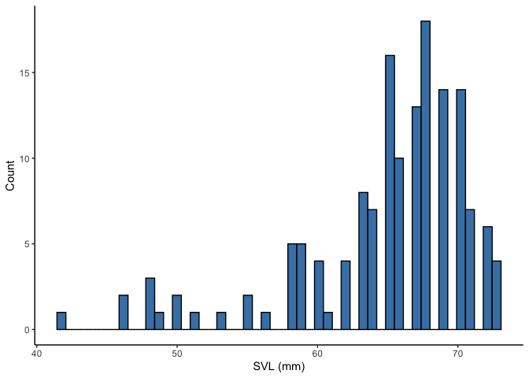<!-- -->

``` r
simple.eda(all_data_wide$SVL_mm)
```

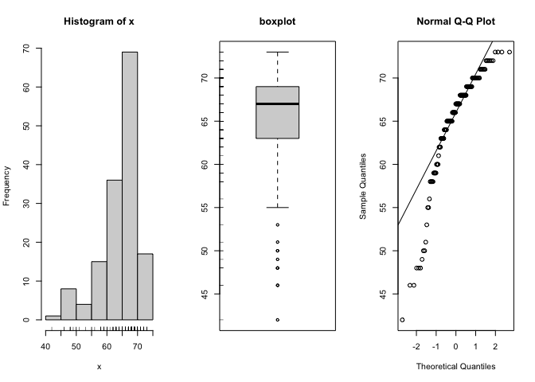<!-- -->

``` r
# Normality test if p > .05, data is normal. Data is not normal.
shapiro.test(all_data_wide$SVL_mm)
```

    ## 
    ##  Shapiro-Wilk normality test
    ## 
    ## data:  all_data_wide$SVL_mm
    ## W = 0.85594, p-value = 8.234e-11

### mass

slightly skewed left, but nearly a bell curve: - not normal

``` r
all_data_wide %>%
  ggplot(., aes(x = mass_g)) +
  geom_histogram(color = "black", fill="steelblue", bins=50) + 
  theme_classic() +
  xlab("Mass (g)") + 
  ylab("Count")
```

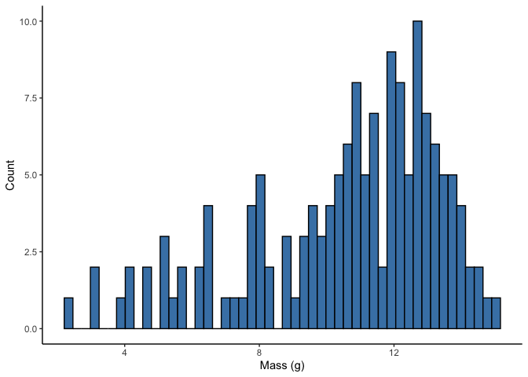<!-- -->

``` r
simple.eda(all_data_wide$mass_g)
```

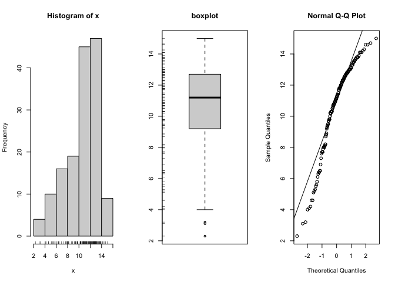<!-- -->

``` r
# Normality test if p > .05, data is normal. Data is not normal.
shapiro.test(all_data_wide$mass_g)
```

    ## 
    ##  Shapiro-Wilk normality test
    ## 
    ## data:  all_data_wide$mass_g
    ## W = 0.92647, p-value = 5.679e-07

### hematocrit

looks pretty normally distributed around \~35%: - not normal

``` r
all_data_wide %>%
  ggplot(., aes(x = hematocrit_percent)) +
  geom_histogram(color = "black", fill="steelblue", bins=50) + 
  theme_classic() +
  xlab("Hematocrit (%)") + 
  ylab("Count")
```

    ## Warning: Removed 27 rows containing non-finite values (stat_bin).

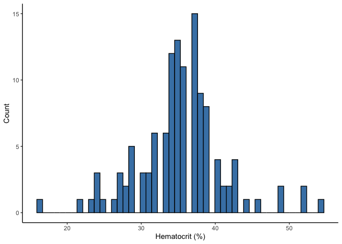<!-- -->

``` r
simple.eda(all_data_wide$hematocrit_percent)
```

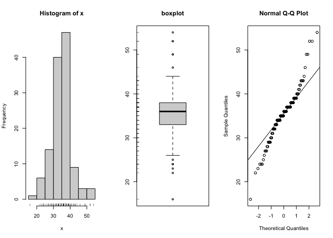<!-- -->

``` r
# Normality test if p > .05, data is normal. Data is not normal
shapiro.test(all_data_wide$hematocrit_percent)
```

    ## 
    ##  Shapiro-Wilk normality test
    ## 
    ## data:  all_data_wide$hematocrit_percent
    ## W = 0.95706, p-value = 0.0006198

### osmolality

also pretty normally distributed around \~370: - normal: only variable
to pass normality test (LOL)

``` r
all_data_wide %>%
  ggplot(., aes(x = osmolality_mmol_kg)) +
  geom_histogram(color = "black", fill="steelblue", bins=50) + 
  theme_classic() +
  xlab("Osmolality (mmol/kg)") + 
  ylab("Count")
```

    ## Warning: Removed 3 rows containing non-finite values (stat_bin).

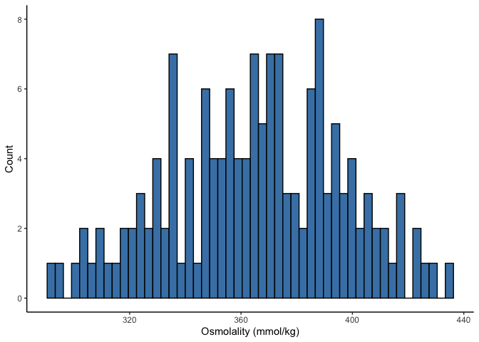<!-- -->

``` r
simple.eda(all_data_wide$osmolality_mmol_kg)
```

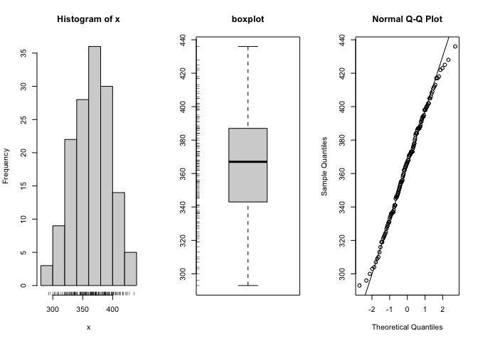<!-- -->

``` r
# Normality test if p > .05, data is normal. Data is normal
shapiro.test(all_data_wide$osmolality_mmol_kg)
```

    ## 
    ##  Shapiro-Wilk normality test
    ## 
    ## data:  all_data_wide$osmolality_mmol_kg
    ## W = 0.99173, p-value = 0.5498

### cloacal temperature

seems normally distributed: - not normal

``` r
all_data_wide %>%
  ggplot(., aes(x = cloacal_temp_C)) +
  geom_histogram(color = "black", fill="steelblue", bins=10) + 
  theme_classic() +
  xlab("cloacal temperature (C)") + 
  ylab("Count")
```

    ## Warning: Removed 7 rows containing non-finite values (stat_bin).

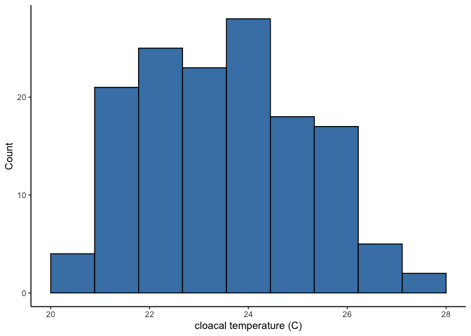<!-- -->

``` r
simple.eda(all_data_wide$cloacal_temp_C)
```

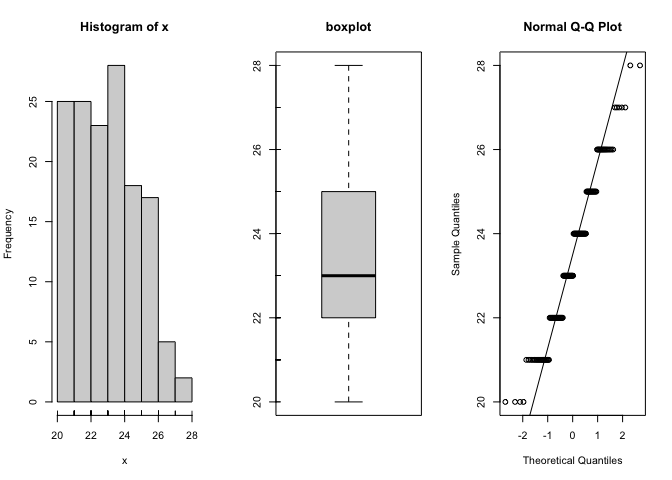<!-- -->

``` r
# Normality test if p > .05, data is normal. Data is not normal
shapiro.test(all_data_wide$cloacal_temp_C)
```

    ## 
    ##  Shapiro-Wilk normality test
    ## 
    ## data:  all_data_wide$cloacal_temp_C
    ## W = 0.95594, p-value = 0.0001569

### dewlap CEWL

very skewed to the right: - not normal

``` r
all_data_wide %>%
  ggplot(., aes(x = dewlap_TEWL_g_m2h)) +
  geom_histogram(color = "black", fill="steelblue", bins=50) + 
  theme_classic() +
  xlab("Dewlap CEWL (g/m^2/h)") + 
  ylab("Count")
```

    ## Warning: Removed 10 rows containing non-finite values (stat_bin).

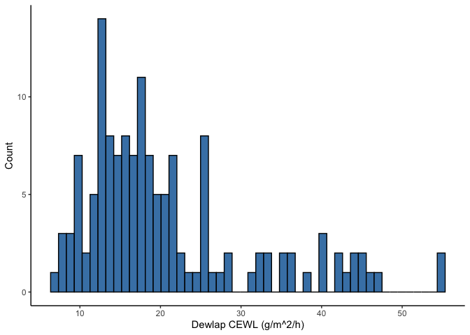<!-- -->

``` r
simple.eda(all_data_wide$dewlap_TEWL_g_m2h)
```

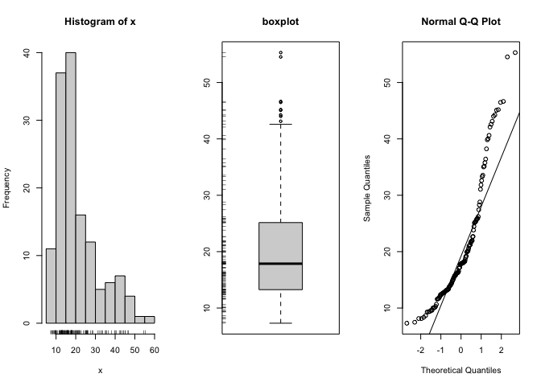<!-- -->

``` r
# Normality test if p > .05, data is normal. Data is not normal
shapiro.test(all_data_wide$dewlap_TEWL_g_m2h)
```

    ## 
    ##  Shapiro-Wilk normality test
    ## 
    ## data:  all_data_wide$dewlap_TEWL_g_m2h
    ## W = 0.86276, p-value = 4.53e-10

### dorsum CEWL

slightly skewed to the right: - not normal

``` r
all_data_wide %>%
  ggplot(., aes(x = dorsum_TEWL_g_m2h)) +
  geom_histogram(color = "black", fill="steelblue", bins=40) + 
  theme_classic() +
  xlab("Dorsum CEWL (g/m^2/h)") + 
  ylab("Count")
```

    ## Warning: Removed 7 rows containing non-finite values (stat_bin).

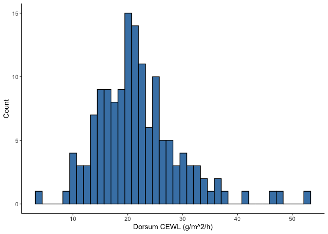<!-- -->

``` r
simple.eda(all_data_wide$dorsum_TEWL_g_m2h)
```

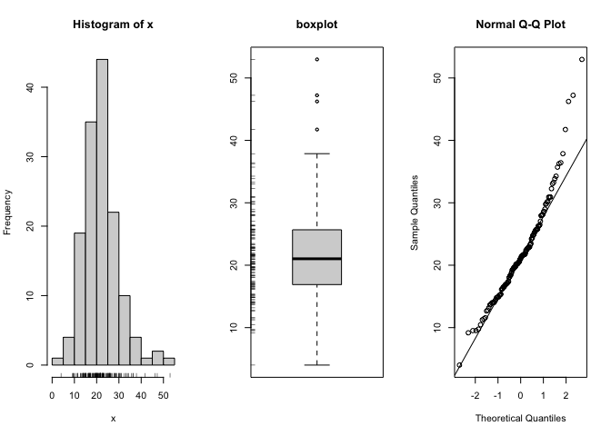<!-- -->

``` r
# Normality test if p > .05, data is normal. Data is not normal
shapiro.test(all_data_wide$dorsum_TEWL_g_m2h)
```

    ## 
    ##  Shapiro-Wilk normality test
    ## 
    ## data:  all_data_wide$dorsum_TEWL_g_m2h
    ## W = 0.94363, p-value = 1.585e-05

### head CEWL

very skewed to the right: - not normal

``` r
all_data_wide %>%
  ggplot(., aes(x = head_TEWL_g_m2h)) +
  geom_histogram(color = "black", fill="steelblue", bins=40) + 
  theme_classic() +
  xlab("Head CEWL (g/m^2/h)") + 
  ylab("Count")
```

    ## Warning: Removed 7 rows containing non-finite values (stat_bin).

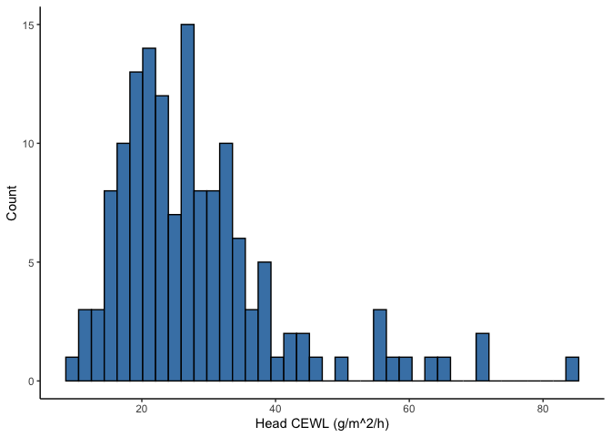<!-- -->

``` r
simple.eda(all_data_wide$head_TEWL_g_m2h)
```

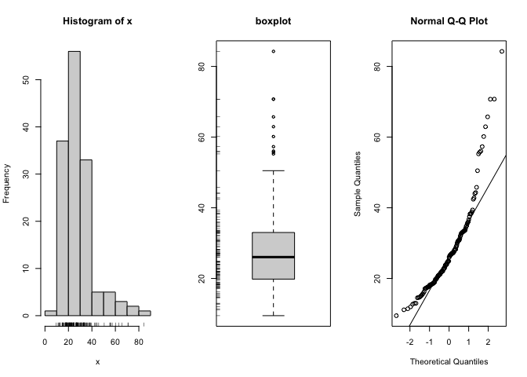<!-- -->

``` r
# Normality test if p > .05, data is normal. Data is not normal
shapiro.test(all_data_wide$head_TEWL_g_m2h)
```

    ## 
    ##  Shapiro-Wilk normality test
    ## 
    ## data:  all_data_wide$head_TEWL_g_m2h
    ## W = 0.85491, p-value = 1.501e-10

### mite patch CEWL

very skewed to the right: - not normal

``` r
all_data_wide %>%
  ggplot(., aes(x = mitepatch_TEWL_g_m2h)) +
  geom_histogram(color = "black", fill="steelblue", bins=40) + 
  theme_classic() +
  xlab("Mite Patch CEWL (g/m^2/h)") + 
  ylab("Count")
```

    ## Warning: Removed 12 rows containing non-finite values (stat_bin).

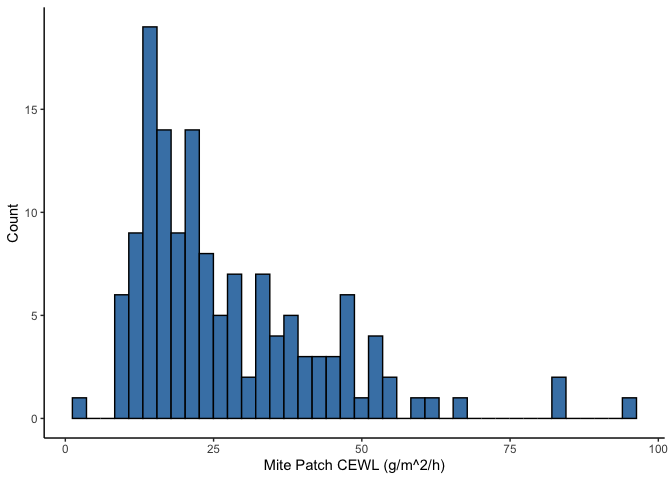<!-- -->

``` r
simple.eda(all_data_wide$mitepatch_TEWL_g_m2h)
```

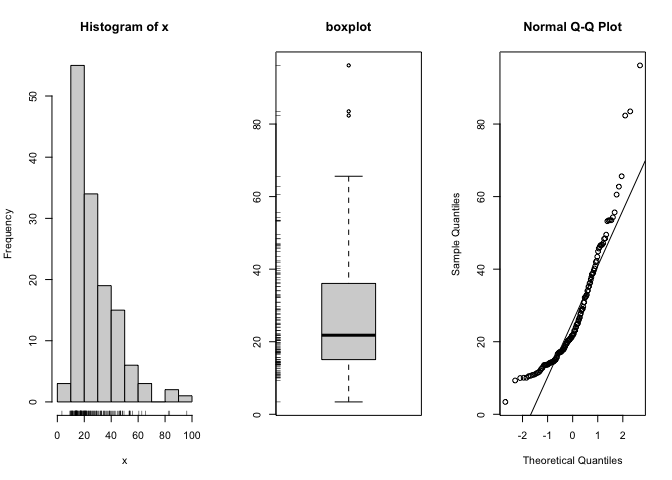<!-- -->

``` r
# Normality test if p > .05, data is normal. Data is not normal
shapiro.test(all_data_wide$mitepatch_TEWL_g_m2h)
```

    ## 
    ##  Shapiro-Wilk normality test
    ## 
    ## data:  all_data_wide$mitepatch_TEWL_g_m2h
    ## W = 0.86712, p-value = 8.726e-10

### ventrum CEWL

slightly skewed to the right, somewhat evenly distributed: - not normal

``` r
all_data_wide %>%
  ggplot(., aes(x = ventrum_TEWL_g_m2h)) +
  geom_histogram(color = "black", fill="steelblue", bins=30) + 
  theme_classic() +
  xlab("Ventrum CEWL (g/m^2/h)") + 
  ylab("Count")
```

    ## Warning: Removed 7 rows containing non-finite values (stat_bin).

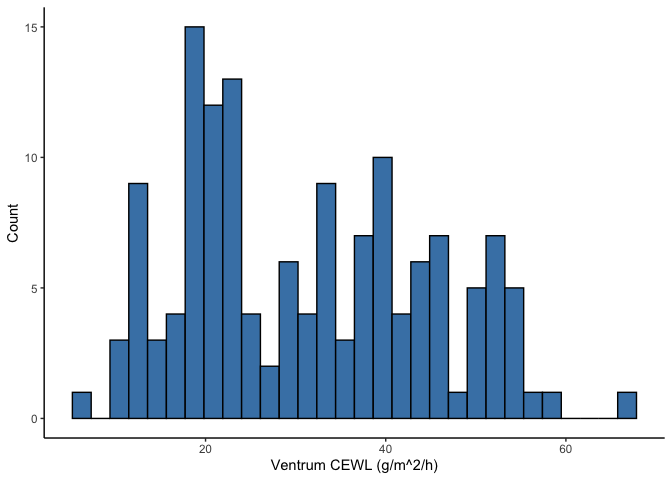<!-- -->

``` r
simple.eda(all_data_wide$ventrum_TEWL_g_m2h)
```

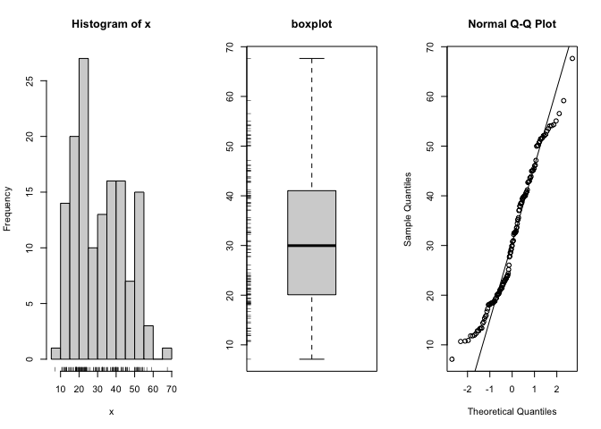<!-- -->

``` r
# Normality test if p > .05, data is normal. Data is not normal
shapiro.test(all_data_wide$ventrum_TEWL_g_m2h)
```

    ## 
    ##  Shapiro-Wilk normality test
    ## 
    ## data:  all_data_wide$ventrum_TEWL_g_m2h
    ## W = 0.95684, p-value = 0.0001877

## Transformations

This function is in the MASS package, which we already have loaded:
<https://rdrr.io/cran/MASS/man/boxcox.html>

@ dylan I also didn’t test any of the temp/humidity variables for
normality…

### SVL

### mass

### hematocrit

### cloacal temperature

### dewlap CEWL

### dorsum CEWL

### head CEWL

### mite patch CEWL

### ventrum CEWL

# Basic Figs & GLMs

## What affects hydration & health?

Potential relationships: - Hct \~ SVL, mass, sex, gravidity, eye,
hemolyzed, week - Omol \~ SVL, mass, sex, gravidity, eye, hemolyzed,
week

### Hct \~ SVL

  - No sig relationship

<!-- end list -->

``` r
all_data_wide %>% 
  ggplot(data = .) + 
  geom_point(aes(x = SVL_mm,
                 y = hematocrit_percent, 
                 ), 
             size = 1, 
             alpha = 0.6) + 
  stat_smooth(aes(x = SVL_mm, 
                  y = hematocrit_percent, 
                  ), 
              formula = y ~ x, 
              method = "lm", 
              color = "gray",
              se = F, 
              size = 1.6, 
              alpha = 1 ) + 
  theme_classic() + 
  xlab("SVL") + 
  ylab("Hct") + 
  theme(text = element_text(color = "black", 
                            family = "sans", 
                            size = 12),
        axis.text = element_text(color = "black", 
                                 family = "sans", 
                                 size = 10),
        legend.text.align = 0,
)
```

    ## Warning: Removed 27 rows containing non-finite values (stat_smooth).

    ## Warning: Removed 27 rows containing missing values (geom_point).

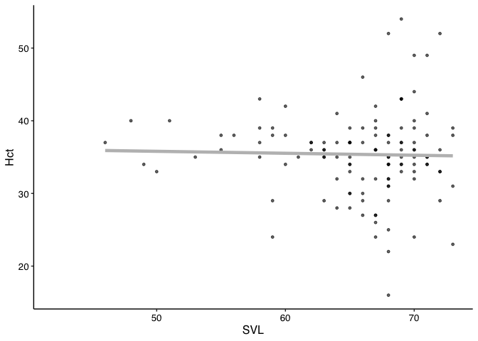<!-- -->

``` r
# glm
glm_hct_SVL <- lm(hematocrit_percent ~ SVL_mm,
           data = all_data_wide)
summary(glm_hct_SVL)
```

    ## 
    ## Call:
    ## lm(formula = hematocrit_percent ~ SVL_mm, data = all_data_wide)
    ## 
    ## Residuals:
    ##      Min       1Q   Median       3Q      Max 
    ## -19.3108  -2.5932   0.3395   2.6758  18.7161 
    ## 
    ## Coefficients:
    ##             Estimate Std. Error t value Pr(>|t|)    
    ## (Intercept) 37.14004    6.44832   5.760 6.53e-08 ***
    ## SVL_mm      -0.02690    0.09789  -0.275    0.784    
    ## ---
    ## Signif. codes:  0 '***' 0.001 '**' 0.01 '*' 0.05 '.' 0.1 ' ' 1
    ## 
    ## Residual standard error: 5.906 on 121 degrees of freedom
    ##   (27 observations deleted due to missingness)
    ## Multiple R-squared:  0.0006238,  Adjusted R-squared:  -0.007636 
    ## F-statistic: 0.07552 on 1 and 121 DF,  p-value: 0.7839

### Osml \~ SVL

  - no sig relationship

<!-- end list -->

``` r
all_data_wide %>% 
  ggplot(data = .) + 
  geom_point(aes(x = SVL_mm,
                 y = osmolality_mmol_kg, 
                 ), 
             size = 1, 
             alpha = 0.6) + 
  stat_smooth(aes(x = SVL_mm, 
                  y = osmolality_mmol_kg, 
                  ), 
              formula = y ~ x, 
              method = "lm", 
              color = "gray",
              se = F, 
              size = 1.6, 
              alpha = 1 ) + 
  theme_classic() + 
  xlab("SVL") + 
  ylab("Osmolality") + 
  theme(text = element_text(color = "black", 
                            family = "sans", 
                            size = 12),
        axis.text = element_text(color = "black", 
                                 family = "sans", 
                                 size = 10),
        legend.text.align = 0,
)
```

    ## Warning: Removed 3 rows containing non-finite values (stat_smooth).

    ## Warning: Removed 3 rows containing missing values (geom_point).

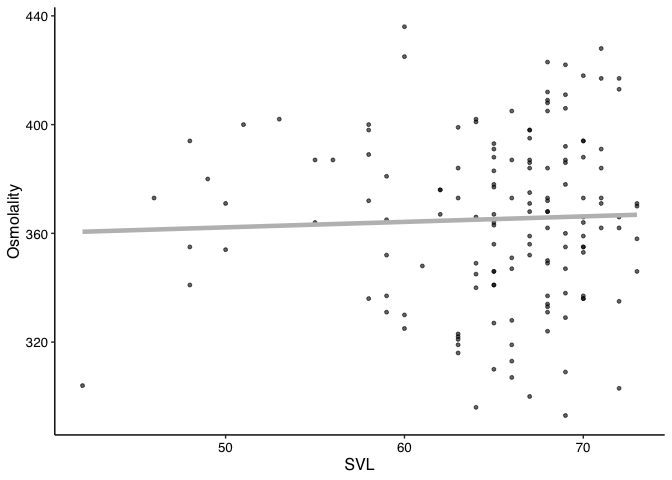<!-- -->

``` r
# glm
glm_osml_SVL <- lm(osmolality_mmol_kg ~ SVL_mm,
           data = all_data_wide)
summary(glm_osml_SVL)
```

    ## 
    ## Call:
    ## lm(formula = osmolality_mmol_kg ~ SVL_mm, data = all_data_wide)
    ## 
    ## Residuals:
    ##    Min     1Q Median     3Q    Max 
    ## -73.04 -20.82   1.77  22.27  71.78 
    ## 
    ## Coefficients:
    ##             Estimate Std. Error t value Pr(>|t|)    
    ## (Intercept) 352.1275    28.0395   12.56   <2e-16 ***
    ## SVL_mm        0.2016     0.4288    0.47    0.639    
    ## ---
    ## Signif. codes:  0 '***' 0.001 '**' 0.01 '*' 0.05 '.' 0.1 ' ' 1
    ## 
    ## Residual standard error: 31.19 on 145 degrees of freedom
    ##   (3 observations deleted due to missingness)
    ## Multiple R-squared:  0.001521,   Adjusted R-squared:  -0.005365 
    ## F-statistic: 0.2209 on 1 and 145 DF,  p-value: 0.639

### Hct \~ Mass

  - no sig relationship

<!-- end list -->

``` r
all_data_wide %>% 
  ggplot(data = .) + 
  geom_point(aes(x = mass_g,
                 y = hematocrit_percent, 
                 ), 
             size = 1, 
             alpha = 0.6) +
  stat_smooth(aes(x = mass_g, 
                  y = hematocrit_percent, 
                  ), 
              formula = y ~ x, 
              method = "lm", 
              color = "gray",
              se = F, 
              size = 1.6, 
              alpha = 1 ) + 
  theme_classic() + 
  xlab("Mass") + 
  ylab("Hematocrit") + 
  theme(text = element_text(color = "black", 
                            family = "sans", 
                            size = 12),
        axis.text = element_text(color = "black", 
                                 family = "sans", 
                                 size = 10),
        legend.text.align = 0,
)
```

    ## Warning: Removed 27 rows containing non-finite values (stat_smooth).

    ## Warning: Removed 27 rows containing missing values (geom_point).

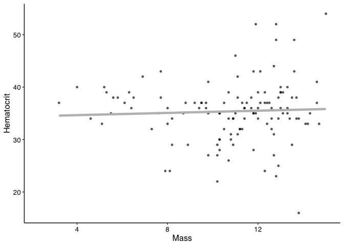<!-- -->

``` r
# glm
glm_hct_mass <- lm(hematocrit_percent ~ mass_g,
           data = all_data_wide)
summary(glm_hct_mass)
```

    ## 
    ## Call:
    ## lm(formula = hematocrit_percent ~ mass_g, data = all_data_wide)
    ## 
    ## Residuals:
    ##      Min       1Q   Median       3Q      Max 
    ## -19.6926  -2.7614   0.3604   2.7735  18.1803 
    ## 
    ## Coefficients:
    ##             Estimate Std. Error t value Pr(>|t|)    
    ## (Intercept)  34.2307     2.2835  14.991   <2e-16 ***
    ## mass_g        0.1059     0.2058   0.515    0.608    
    ## ---
    ## Signif. codes:  0 '***' 0.001 '**' 0.01 '*' 0.05 '.' 0.1 ' ' 1
    ## 
    ## Residual standard error: 5.901 on 121 degrees of freedom
    ##   (27 observations deleted due to missingness)
    ## Multiple R-squared:  0.002186,   Adjusted R-squared:  -0.00606 
    ## F-statistic: 0.2651 on 1 and 121 DF,  p-value: 0.6076

### Osml \~ Mass

  - no sig relationship

<!-- end list -->

``` r
all_data_wide %>% 
  ggplot(data = .) + 
  geom_point(aes(x = mass_g,
                 y = osmolality_mmol_kg, 
                 ), 
             size = 1, 
             alpha = 0.6) + 
  stat_smooth(aes(x = mass_g, 
                  y = osmolality_mmol_kg), 
              formula = y ~ x, 
              method = "lm", 
              se = F, 
              color = "gray",
              size = 1.6, 
              alpha = 1 ) + 
  theme_classic() + 
  xlab("Mass") + 
  ylab("Osmolality") + 
  theme(text = element_text(color = "black", 
                            family = "sans", 
                            size = 12),
        axis.text = element_text(color = "black", 
                                 family = "sans", 
                                 size = 10),
        legend.text.align = 0,
)
```

    ## Warning: Removed 3 rows containing non-finite values (stat_smooth).

    ## Warning: Removed 3 rows containing missing values (geom_point).

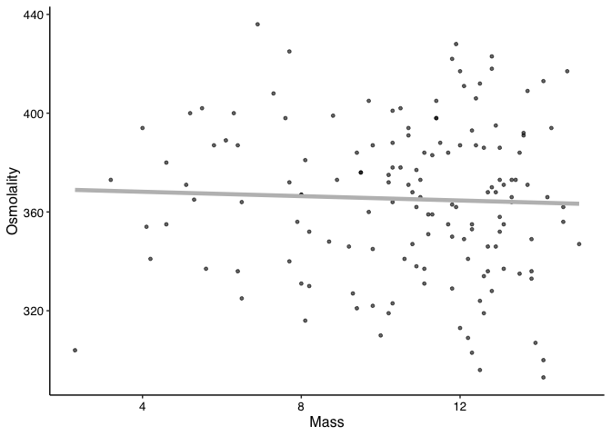<!-- -->

``` r
# glm
glm_osml_mass <- lm(osmolality_mmol_kg ~ mass_g,
           data = all_data_wide)
summary(glm_osml_mass)
```

    ## 
    ## Call:
    ## lm(formula = osmolality_mmol_kg ~ mass_g, data = all_data_wide)
    ## 
    ## Residuals:
    ##     Min      1Q  Median      3Q     Max 
    ## -70.719 -22.087   1.928  22.075  69.104 
    ## 
    ## Coefficients:
    ##             Estimate Std. Error t value Pr(>|t|)    
    ## (Intercept) 369.9414    10.1201  36.555   <2e-16 ***
    ## mass_g       -0.4413     0.9210  -0.479    0.633    
    ## ---
    ## Signif. codes:  0 '***' 0.001 '**' 0.01 '*' 0.05 '.' 0.1 ' ' 1
    ## 
    ## Residual standard error: 31.18 on 145 degrees of freedom
    ##   (3 observations deleted due to missingness)
    ## Multiple R-squared:  0.001581,   Adjusted R-squared:  -0.005305 
    ## F-statistic: 0.2296 on 1 and 145 DF,  p-value: 0.6326

### Hct \~ Sex

  - sig relationship, males have a higher hematocrit %

<!-- end list -->

``` r
all_data_wide %>% 
  ggplot(data = .) + 
  geom_boxplot(aes(x = sex_M_F, 
                   y = hematocrit_percent, 
                   color = sex_M_F
                   ), 
               size = 1,
               alpha = 1) + 
  theme_classic() + 
  xlab("Sex") + 
  ylab("Hematocrit (%)") + 
  annotate("text", x = 1.5, y = 45, 
           label = "paste(italic(p), \" = 0.0152\")", 
           parse = TRUE,
           size = 6) +
  ylim(10, 50) +
  scale_x_discrete(labels = c("F" = "Female",
                              "M" = "Male")) +
  scale_color_brewer(palette = "Set2") +
  theme(text = element_text(color = "black", 
                            family = "sans", 
                            size = 18),
        axis.text = element_text(color = "black", 
                                 family = "sans", 
                                 size = 14),
        legend.text.align = 0,
        legend.position = "none"
) -> hct_sex_fig
hct_sex_fig
```

    ## Warning: Removed 30 rows containing non-finite values (stat_boxplot).

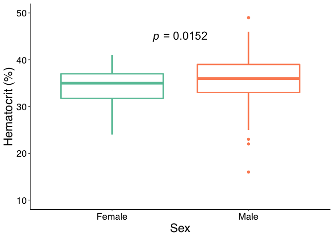<!-- -->

``` r
# export figure
#ggsave(filename = "hct_sex_fig.tiff",
 #      plot = hct_sex_fig,
  #     path = "./final_figures",
   #    device = "tiff",
    #   dpi = 1200,
     #  width = 6, height = 4)

# glms
aov_hct_sex <- aov(hematocrit_percent ~ sex_M_F,
           data = all_data_wide)
TukeyHSD(aov_hct_sex)
```

    ##   Tukey multiple comparisons of means
    ##     95% family-wise confidence level
    ## 
    ## Fit: aov(formula = hematocrit_percent ~ sex_M_F, data = all_data_wide)
    ## 
    ## $sex_M_F
    ##         diff       lwr      upr     p adj
    ## M-F 2.670023 0.5230915 4.816954 0.0152201

``` r
glm_hct_sex_mass <- glm(hematocrit_percent ~ sex_M_F*mass_g - mass_g,
           data = all_data_wide)
summary(glm_hct_sex_mass)
```

    ## 
    ## Call:
    ## glm(formula = hematocrit_percent ~ sex_M_F * mass_g - mass_g, 
    ##     data = all_data_wide)
    ## 
    ## Deviance Residuals: 
    ##      Min        1Q    Median        3Q       Max  
    ## -20.6295   -2.6209    0.6418    3.1033   17.2318  
    ## 
    ## Coefficients:
    ##                 Estimate Std. Error t value Pr(>|t|)    
    ## (Intercept)      35.9163     3.6925   9.727   <2e-16 ***
    ## sex_M_FM         -0.8820     4.7066  -0.187    0.852    
    ## sex_M_FF:mass_g  -0.2244     0.3567  -0.629    0.530    
    ## sex_M_FM:mass_g   0.1156     0.2539   0.455    0.650    
    ## ---
    ## Signif. codes:  0 '***' 0.001 '**' 0.01 '*' 0.05 '.' 0.1 ' ' 1
    ## 
    ## (Dispersion parameter for gaussian family taken to be 33.6223)
    ## 
    ##     Null deviance: 4222.8  on 122  degrees of freedom
    ## Residual deviance: 4001.1  on 119  degrees of freedom
    ##   (27 observations deleted due to missingness)
    ## AIC: 787.36
    ## 
    ## Number of Fisher Scoring iterations: 2

Hematocrit is significantly predicted by sex, but the interaction
between sex and mass is \~nonexistent.

### Osml \~ Sex

  - barely not significant (p=.0749), females have higher osmolarity

<!-- end list -->

``` r
all_data_wide %>% 
  ggplot(data = .) + 
  geom_boxplot(aes(x = sex_M_F, 
                   y = osmolality_mmol_kg, 
                   color = sex_M_F
                   ), 
               size = 1,
               alpha = 0.6) + 
  scale_colour_manual(name = "Sex", 
                      values = c("green4", "salmon1") ) +
  theme_classic() + 
  xlab("Sex") + 
  ylab("Osmolality") + 
  theme(text = element_text(color = "black", family = "sans", size = 12),
        axis.text = element_text(color = "black", family = "sans", size = 10),
        legend.text.align = 0,
        legend.position = "none"
)
```

    ## Warning: Removed 3 rows containing non-finite values (stat_boxplot).

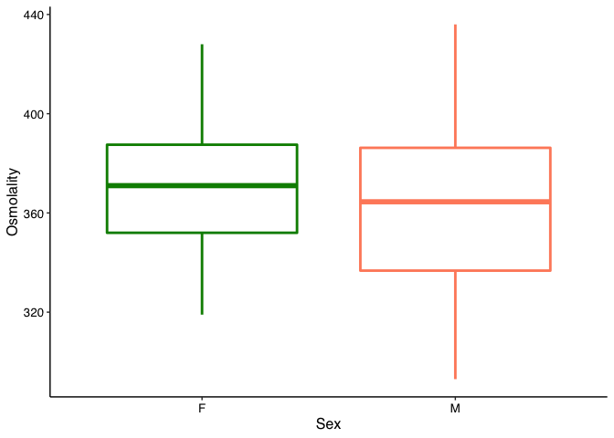<!-- -->

``` r
# glm
glm_osml_sex <- lm(osmolality_mmol_kg ~ sex_M_F,
           data = all_data_wide)
summary(glm_osml_sex)
```

    ## 
    ## Call:
    ## lm(formula = osmolality_mmol_kg ~ sex_M_F, data = all_data_wide)
    ## 
    ## Residuals:
    ##     Min      1Q  Median      3Q     Max 
    ## -69.120 -22.915   1.085  21.983  73.880 
    ## 
    ## Coefficients:
    ##             Estimate Std. Error t value Pr(>|t|)    
    ## (Intercept)  371.915      4.503  82.600   <2e-16 ***
    ## sex_M_FM      -9.795      5.459  -1.794   0.0749 .  
    ## ---
    ## Signif. codes:  0 '***' 0.001 '**' 0.01 '*' 0.05 '.' 0.1 ' ' 1
    ## 
    ## Residual standard error: 30.87 on 145 degrees of freedom
    ##   (3 observations deleted due to missingness)
    ## Multiple R-squared:  0.02172,    Adjusted R-squared:  0.01497 
    ## F-statistic: 3.219 on 1 and 145 DF,  p-value: 0.07486

### Hct \~ Gravidity

  - no sig diff

<!-- end list -->

``` r
all_data_wide %>% 
  dplyr::filter(sex_M_F == 'F') %>%
  ggplot(data = .) + 
  geom_boxplot(aes(x = gravid_Y_N, 
                   y = hematocrit_percent, 
                   color = gravid_Y_N
                   ), 
               size = 1,
               alpha = 0.6) + 
  scale_colour_manual(name = "Gravid", 
                      values = c("green4", "salmon1") ) +
  theme_classic() + 
  xlab("Gravid (Females Only)") + 
  ylab("Hematocrit") + 
  theme(text = element_text(color = "black", family = "sans", size = 12),
        axis.text = element_text(color = "black", family = "sans", size = 10),
        legend.text.align = 0,
        legend.position = "none"
)
```

    ## Warning: Removed 4 rows containing non-finite values (stat_boxplot).

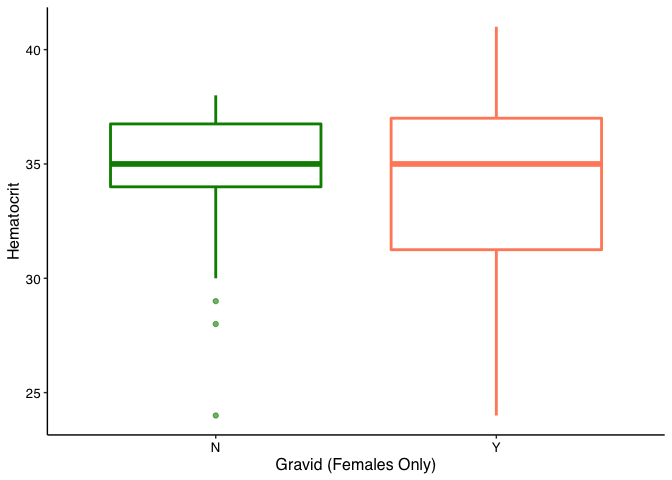<!-- -->

``` r
# glm
glm_hct_gravid <- lm(hematocrit_percent ~ gravid_Y_N,
           data = all_data_wide)
summary(glm_hct_gravid)
```

    ## 
    ## Call:
    ## lm(formula = hematocrit_percent ~ gravid_Y_N, data = all_data_wide)
    ## 
    ## Residuals:
    ##     Min      1Q  Median      3Q     Max 
    ## -10.111  -1.596   1.271   3.080   7.654 
    ## 
    ## Coefficients:
    ##             Estimate Std. Error t value Pr(>|t|)    
    ## (Intercept)   34.111      1.017  33.546   <2e-16 ***
    ## gravid_Y_NY   -0.765      1.323  -0.578    0.566    
    ## ---
    ## Signif. codes:  0 '***' 0.001 '**' 0.01 '*' 0.05 '.' 0.1 ' ' 1
    ## 
    ## Residual standard error: 4.314 on 42 degrees of freedom
    ##   (106 observations deleted due to missingness)
    ## Multiple R-squared:  0.0079, Adjusted R-squared:  -0.01572 
    ## F-statistic: 0.3344 on 1 and 42 DF,  p-value: 0.5662

### Osml \~ Gravidity

  - barely not significant (p=.0756), gravid F have higher osmolarity

<!-- end list -->

``` r
all_data_wide %>% 
  dplyr::filter(sex_M_F == 'F') %>%
  ggplot(data = .) + 
  geom_boxplot(aes(x = gravid_Y_N, 
                   y = osmolality_mmol_kg, 
                   color = gravid_Y_N
                   ), 
               size = 1,
               alpha = 0.6) + 
  scale_colour_manual(name = "Gravid", 
                      values = c("green4", "salmon1") ) +
  theme_classic() + 
  xlab("Gravid (Females Only)") + 
  ylab("Osmolality") + 
  theme(text = element_text(color = "black", family = "sans", size = 12),
        axis.text = element_text(color = "black", family = "sans", size = 10),
        legend.text.align = 0,
        legend.position = "none"
)
```

    ## Warning: Removed 1 rows containing non-finite values (stat_boxplot).

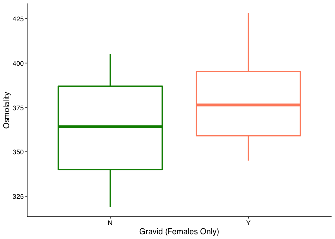<!-- -->

``` r
# glm
glm_osml_gravid <- lm(osmolality_mmol_kg ~ gravid_Y_N,
           data = all_data_wide)
summary(glm_osml_gravid)
```

    ## 
    ## Call:
    ## lm(formula = osmolality_mmol_kg ~ gravid_Y_N, data = all_data_wide)
    ## 
    ## Residuals:
    ##     Min      1Q  Median      3Q     Max 
    ## -45.333 -22.186  -0.333  22.667  49.962 
    ## 
    ## Coefficients:
    ##             Estimate Std. Error t value Pr(>|t|)    
    ## (Intercept)  364.333      5.604  65.011   <2e-16 ***
    ## gravid_Y_NY   13.705      7.535   1.819   0.0756 .  
    ## ---
    ## Signif. codes:  0 '***' 0.001 '**' 0.01 '*' 0.05 '.' 0.1 ' ' 1
    ## 
    ## Residual standard error: 25.68 on 45 degrees of freedom
    ##   (103 observations deleted due to missingness)
    ## Multiple R-squared:  0.06848,    Adjusted R-squared:  0.04778 
    ## F-statistic: 3.308 on 1 and 45 DF,  p-value: 0.07559

### Hct \~ Sample Eye

``` r
all_data_wide %>% 
  dplyr::filter(blood_sample_eye %in% c("R", "L")) %>%
  ggplot(data = .) + 
  geom_boxplot(aes(x = blood_sample_eye, 
                   y = hematocrit_percent, 
                   color = blood_sample_eye
                   ), 
               size = 1,
               alpha = 0.6) + 
  scale_colour_manual(name = "Blood Sample Eye", 
                      values = c("green4", "salmon1") ) +
  theme_classic() + 
  xlab("Blood Sample Eye") + 
  ylab("Hematocrit") + 
  theme(text = element_text(color = "black", family = "sans", size = 12),
        axis.text = element_text(color = "black", family = "sans", size = 10),
        legend.text.align = 0,
        legend.position = "none"
)
```

    ## Warning: Removed 27 rows containing non-finite values (stat_boxplot).

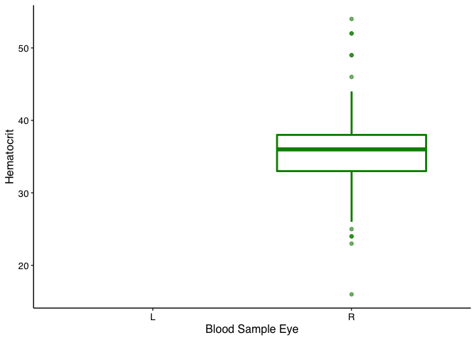<!-- -->

``` r
# can't do a glm
```

### Osml \~ Sample Eye

``` r
all_data_wide %>% 
  dplyr::filter(blood_sample_eye %in% c("R", "L")) %>%
  ggplot(data = .) + 
  geom_boxplot(aes(x = blood_sample_eye, 
                   y = osmolality_mmol_kg, 
                   color = blood_sample_eye
                   ), 
               size = 1,
               alpha = 0.6) + 
  scale_colour_manual(name = "Blood Sample Eye", 
                      values = c("green4", "salmon1") ) +
  theme_classic() + 
  xlab("Blood Sample Eye") + 
  ylab("Osmolality") + 
  theme(text = element_text(color = "black", family = "sans", size = 12),
        axis.text = element_text(color = "black", family = "sans", size = 10),
        legend.text.align = 0,
        legend.position = "none"
)
```

    ## Warning: Removed 3 rows containing non-finite values (stat_boxplot).

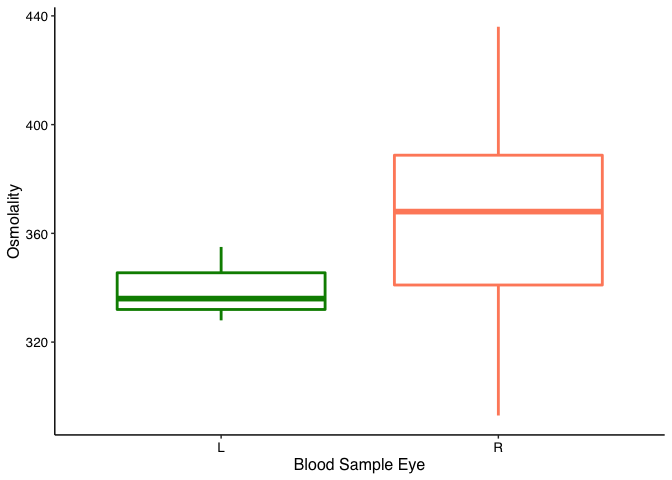<!-- -->

``` r
# glm
glm_osml_eye <- lm(osmolality_mmol_kg ~ blood_sample_eye,
           data = all_data_wide)
summary(glm_osml_eye)
```

    ## 
    ## Call:
    ## lm(formula = osmolality_mmol_kg ~ blood_sample_eye, data = all_data_wide)
    ## 
    ## Residuals:
    ##     Min      1Q  Median      3Q     Max 
    ## -72.385 -24.385   1.615  22.615  70.615 
    ## 
    ## Coefficients:
    ##                     Estimate Std. Error t value Pr(>|t|)    
    ## (Intercept)           339.67      18.71  18.151   <2e-16 ***
    ## blood_sample_eyeR      25.72      18.94   1.358   0.1770    
    ## blood_sample_eyeR&L    33.33      37.43   0.891   0.3749    
    ## blood_sample_eyeR+L    88.33      37.43   2.360   0.0198 *  
    ## ---
    ## Signif. codes:  0 '***' 0.001 '**' 0.01 '*' 0.05 '.' 0.1 ' ' 1
    ## 
    ## Residual standard error: 32.41 on 123 degrees of freedom
    ##   (23 observations deleted due to missingness)
    ## Multiple R-squared:  0.04411,    Adjusted R-squared:  0.02079 
    ## F-statistic: 1.892 on 3 and 123 DF,  p-value: 0.1345

### Hct \~ Hemolyzed/Not

  - no sig diff

<!-- end list -->

``` r
all_data_wide %>% 
  dplyr::filter(hemolyzed %in% c("Y", "N")) %>%
  ggplot(data = .) + 
  geom_boxplot(aes(x = hemolyzed, 
                   y = hematocrit_percent, 
                   color = hemolyzed
                   ), 
               size = 1,
               alpha = 0.6) + 
  scale_colour_manual(name = "Blood Sample Eye", 
                      values = c("green4", "salmon1", "green4", "salmon1") ) +
  theme_classic() + 
  xlab("Whether or not Sample Hemolyzed") + 
  ylab("Hematocrit") + 
  theme(text = element_text(color = "black", family = "sans", size = 12),
        axis.text = element_text(color = "black", family = "sans", size = 10),
        legend.text.align = 0,
        legend.position = "none"
)
```

    ## Warning: Removed 25 rows containing non-finite values (stat_boxplot).

<!-- -->

``` r
# glm
glm_hct_hem <- lm(hematocrit_percent ~ hemolyzed,
           data = all_data_wide)
summary(glm_hct_hem)
```

    ## 
    ## Call:
    ## lm(formula = hematocrit_percent ~ hemolyzed, data = all_data_wide)
    ## 
    ## Residuals:
    ##      Min       1Q   Median       3Q      Max 
    ## -19.1385  -2.6179  -0.0692   2.2222  18.8615 
    ## 
    ## Coefficients:
    ##             Estimate Std. Error t value Pr(>|t|)    
    ## (Intercept)   40.000      6.003   6.663 1.53e-09 ***
    ## hemolyzedN    -4.862      6.049  -0.804    0.424    
    ## hemolyzedY    -4.222      6.086  -0.694    0.489    
    ## ---
    ## Signif. codes:  0 '***' 0.001 '**' 0.01 '*' 0.05 '.' 0.1 ' ' 1
    ## 
    ## Residual standard error: 6.003 on 99 degrees of freedom
    ##   (48 observations deleted due to missingness)
    ## Multiple R-squared:  0.008539,   Adjusted R-squared:  -0.01149 
    ## F-statistic: 0.4263 on 2 and 99 DF,  p-value: 0.6541

### Osml \~ Hemolyzed/Not

``` r
all_data_wide %>% 
  dplyr::filter(hemolyzed %in% c("Y", "N")) %>%
  ggplot(data = .) + 
  geom_boxplot(aes(x = hemolyzed, 
                   y = osmolality_mmol_kg, 
                   color = hemolyzed
                   ), 
               size = 1,
               alpha = 0.6) + 
  scale_colour_manual(name = "Blood Sample Eye", 
                      values = c("green4", "salmon1", "green4", "salmon1") ) +
  theme_classic() + 
  xlab("Whether or not Sample Hemolyzed") + 
  ylab("Osmolality") + 
  theme(text = element_text(color = "black", family = "sans", size = 12),
        axis.text = element_text(color = "black", family = "sans", size = 10),
        legend.text.align = 0,
        legend.position = "none"
)
```

    ## Warning: Removed 1 rows containing non-finite values (stat_boxplot).

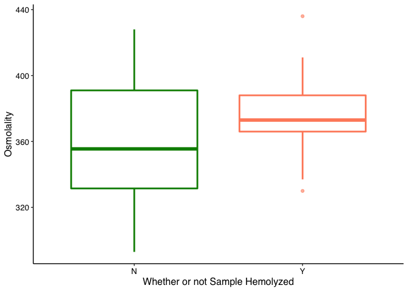<!-- -->

``` r
# glm
glm_osml_hem <- lm(osmolality_mmol_kg ~ hemolyzed,
           data = all_data_wide)
summary(glm_osml_hem)
```

    ## 
    ## Call:
    ## lm(formula = osmolality_mmol_kg ~ hemolyzed, data = all_data_wide)
    ## 
    ## Residuals:
    ##     Min      1Q  Median      3Q     Max 
    ## -67.326 -24.326  -2.026  23.674  67.674 
    ## 
    ## Coefficients:
    ##             Estimate Std. Error t value Pr(>|t|)    
    ## (Intercept)   394.00      32.24  12.222   <2e-16 ***
    ## hemolyzedN    -33.67      32.42  -1.039    0.301    
    ## hemolyzedY    -18.97      32.65  -0.581    0.562    
    ## ---
    ## Signif. codes:  0 '***' 0.001 '**' 0.01 '*' 0.05 '.' 0.1 ' ' 1
    ## 
    ## Residual standard error: 32.24 on 123 degrees of freedom
    ##   (24 observations deleted due to missingness)
    ## Multiple R-squared:  0.04936,    Adjusted R-squared:  0.03391 
    ## F-statistic: 3.194 on 2 and 123 DF,  p-value: 0.04445

### Hct \~ Week

  - no sig diff

<!-- end list -->

``` r
all_data_wide %>% 
  ggplot(data = .) + 
  geom_boxplot(aes(x = as.factor(date), 
                   y = hematocrit_percent, 
                   color = as.factor(date)
                   ), 
               size = 1,
               alpha = 0.6) + 
  theme_classic() + 
  xlab("Sampling Date") + 
  ylab("Hematocrit") + 
  theme(text = element_text(color = "black", family = "sans", size = 12),
        axis.text = element_text(color = "black", family = "sans", size = 10),
        legend.text.align = 0,
        legend.position = "none"
)
```

    ## Warning: Removed 27 rows containing non-finite values (stat_boxplot).

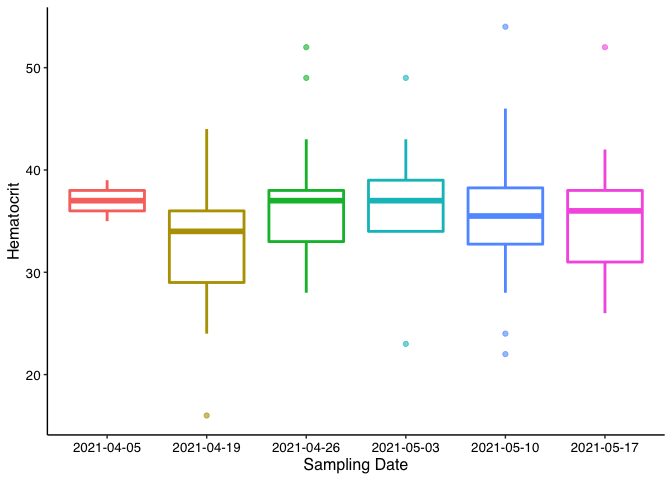<!-- -->

``` r
# glm
glm_hct_wk <- lm(hematocrit_percent ~ date,
           data = all_data_wide)
summary(glm_hct_wk)
```

    ## 
    ## Call:
    ## lm(formula = hematocrit_percent ~ date, data = all_data_wide)
    ## 
    ## Residuals:
    ##      Min       1Q   Median       3Q      Max 
    ## -18.8647  -2.7482   0.1353   2.6239  18.3683 
    ## 
    ## Coefficients:
    ##               Estimate Std. Error t value Pr(>|t|)
    ## (Intercept) -649.44284  931.98258  -0.697    0.487
    ## date           0.03652    0.04971   0.735    0.464
    ## 
    ## Residual standard error: 5.894 on 121 degrees of freedom
    ##   (27 observations deleted due to missingness)
    ## Multiple R-squared:  0.004442,   Adjusted R-squared:  -0.003785 
    ## F-statistic: 0.5399 on 1 and 121 DF,  p-value: 0.4639

### Osml \~ Week

  - Sig difference in osmolarity by week

<!-- end list -->

``` r
all_data_wide %>% 
  ggplot(data = .) + 
  geom_boxplot(aes(x = as.factor(date), 
                   y = osmolality_mmol_kg, 
                   color = as.factor(date)
                   ), 
               size = 1,
               alpha = 0.6) + 
  theme_classic() + 
  xlab("Date") + 
  ylab("Osmolality (mmol / kg)") + 
  annotate("text", x = 1, y = 365, label = "a", size = 6) +
  annotate("text", x = 2, y = 390, label = "b", size = 6) +
  annotate("text", x = 3, y = 437, label = "c", size = 6) +
  annotate("text", x = 4, y = 427, label = "c", size = 6) +
  annotate("text", x = 5, y = 417, label = "d", size = 6) +
  annotate("text", x = 6, y = 447, label = "d", size = 6) +
  scale_x_discrete(labels = c("2021-04-05" = "Apr 5", 
                              "2021-04-19" = "Apr 19",
                              "2021-04-26" = "Apr 26",
                              "2021-05-03" = "May 3", 
                              "2021-05-10" = "May 10",
                              "2021-05-17" = "May 17")) +
  scale_color_brewer(palette = "Set2") +
  ylim(300, 450) +
  theme(text = element_text(color = "black", 
                            family = "sans", 
                            size = 18),
        axis.text = element_text(color = "black", 
                                 family = "sans", 
                                 size = 14),
        legend.text.align = 0,
        legend.position = "none"
) -> osml_date_fig
osml_date_fig
```

    ## Warning: Removed 5 rows containing non-finite values (stat_boxplot).

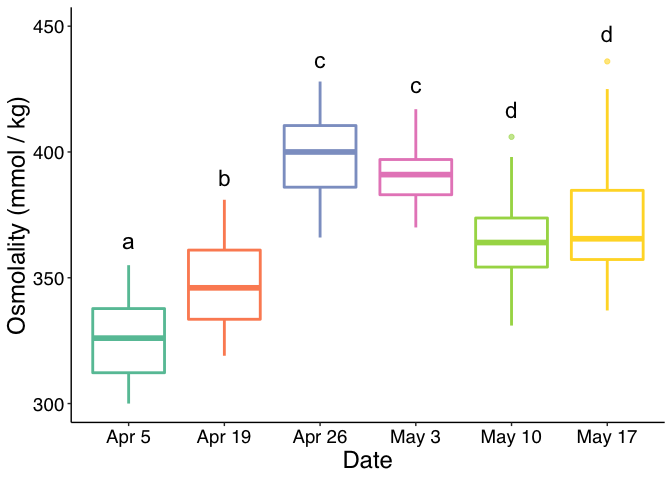<!-- -->

``` r
# export figure
#ggsave(filename = "osml_date_fig.tiff",
 #      plot = osml_date_fig,
  #     path = "./final_figures",
   #    device = "tiff",
    #   dpi = 1200,
     #  width = 6, height = 4)

# glm
glm_osml_wk <- glm(osmolality_mmol_kg ~ date,
           data = all_data_wide)
summary(glm_osml_wk)
```

    ## 
    ## Call:
    ## glm(formula = osmolality_mmol_kg ~ date, data = all_data_wide)
    ## 
    ## Deviance Residuals: 
    ##     Min       1Q   Median       3Q      Max  
    ## -48.402  -21.463   -2.099   20.249   65.325  
    ## 
    ## Coefficients:
    ##               Estimate Std. Error t value Pr(>|t|)    
    ## (Intercept) -1.992e+04  2.944e+03  -6.766 3.03e-10 ***
    ## date         1.082e+00  1.571e-01   6.890 1.58e-10 ***
    ## ---
    ## Signif. codes:  0 '***' 0.001 '**' 0.01 '*' 0.05 '.' 0.1 ' ' 1
    ## 
    ## (Dispersion parameter for gaussian family taken to be 733.761)
    ## 
    ##     Null deviance: 141232  on 146  degrees of freedom
    ## Residual deviance: 106395  on 145  degrees of freedom
    ##   (3 observations deleted due to missingness)
    ## AIC: 1391.1
    ## 
    ## Number of Fisher Scoring iterations: 2

There was a little rain on April 27…. could that be why there was a
slight drop in osmolality?\! Not sure if the May 3-\> 10 drop was
because of rain or fixing the osmometer, though… Need to look for better
daily rainfall records, maybe look in relation to humidity?.

Also try a pairwise ANOVA test:

``` r
osml_date_aov <- aov(osmolality_mmol_kg ~ as.factor(date), 
                     data = all_data_wide)
TukeyHSD(osml_date_aov)
```

    ##   Tukey multiple comparisons of means
    ##     95% family-wise confidence level
    ## 
    ## Fit: aov(formula = osmolality_mmol_kg ~ as.factor(date), data = all_data_wide)
    ## 
    ## $`as.factor(date)`
    ##                             diff        lwr        upr     p adj
    ## 2021-04-19-2021-04-05  22.891304   8.069604  37.713005 0.0002351
    ## 2021-04-26-2021-04-05  75.055556  60.828339  89.282773 0.0000000
    ## 2021-05-03-2021-04-05  66.657895  51.030256  82.285533 0.0000000
    ## 2021-05-10-2021-04-05  42.000000  27.343061  56.656939 0.0000000
    ## 2021-05-17-2021-04-05  46.785714  32.683680  60.887749 0.0000000
    ## 2021-04-26-2021-04-19  52.164251  37.471952  66.856551 0.0000000
    ## 2021-05-03-2021-04-19  43.766590  27.714393  59.818788 0.0000000
    ## 2021-05-10-2021-04-19  19.108696   3.999896  34.217495 0.0047987
    ## 2021-05-17-2021-04-19  23.894410   9.323297  38.465523 0.0000755
    ## 2021-05-03-2021-04-26  -8.397661 -23.902627   7.107305 0.6229313
    ## 2021-05-10-2021-04-26 -33.055556 -47.581627 -18.529485 0.0000000
    ## 2021-05-17-2021-04-26 -28.269841 -42.235809 -14.303874 0.0000005
    ## 2021-05-10-2021-05-03 -24.657895 -40.558087  -8.757702 0.0002183
    ## 2021-05-17-2021-05-03 -19.872180 -35.262360  -4.482001 0.0036866
    ## 2021-05-17-2021-05-10   4.785714  -9.617772  19.189200 0.9296595

### Humidity \~ Week

  - Significant difference in humidity by week

<!-- end list -->

``` r
all_data_wide %>% 
  ggplot(data = .) + 
  geom_boxplot(aes(x = as.factor(date), 
                   y = RH_percent_interpol, 
                   color = as.factor(date)
                   ), 
               size = 1,
               alpha = 0.6) + 
  theme_classic() + 
  xlab("Sampling Date") + 
  ylab("Relative Humidity") + 
  theme(text = element_text(color = "black", family = "sans", size = 12),
        axis.text = element_text(color = "black", family = "sans", size = 10),
        legend.text.align = 0,
        legend.position = "none"
)
```

    ## Warning: Removed 3 rows containing non-finite values (stat_boxplot).

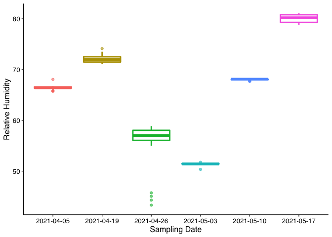<!-- -->

``` r
# glm
glm_hum_wk <- glm(RH_percent_interpol ~ date,
           data = all_data_wide)
summary(glm_hum_wk)
```

    ## 
    ## Call:
    ## glm(formula = RH_percent_interpol ~ date, data = all_data_wide)
    ## 
    ## Deviance Residuals: 
    ##     Min       1Q   Median       3Q      Max  
    ## -22.439   -7.929    4.105    7.839   11.303  
    ## 
    ## Coefficients:
    ##               Estimate Std. Error t value Pr(>|t|)    
    ## (Intercept) -3.553e+03  1.033e+03  -3.441 0.000758 ***
    ## date         1.931e-01  5.508e-02   3.505 0.000608 ***
    ## ---
    ## Signif. codes:  0 '***' 0.001 '**' 0.01 '*' 0.05 '.' 0.1 ' ' 1
    ## 
    ## (Dispersion parameter for gaussian family taken to be 90.24041)
    ## 
    ##     Null deviance: 14193  on 146  degrees of freedom
    ## Residual deviance: 13085  on 145  degrees of freedom
    ##   (3 observations deleted due to missingness)
    ## AIC: 1083
    ## 
    ## Number of Fisher Scoring iterations: 2

try for absolute humidity:

``` r
all_data_wide %>% 
  ggplot(data = .) + 
  geom_boxplot(aes(x = as.factor(date), 
                   y = abs_humidity_g_m3_interpol, 
                   color = as.factor(date)
                   ), 
               size = 1,
               alpha = 0.6) + 
  theme_classic() + 
  xlab("Sampling Date") + 
  ylab("Absolute Humidity") + 
  theme(text = element_text(color = "black", family = "sans", size = 12),
        axis.text = element_text(color = "black", family = "sans", size = 10),
        legend.text.align = 0,
        legend.position = "none"
)
```

    ## Warning: Removed 3 rows containing non-finite values (stat_boxplot).

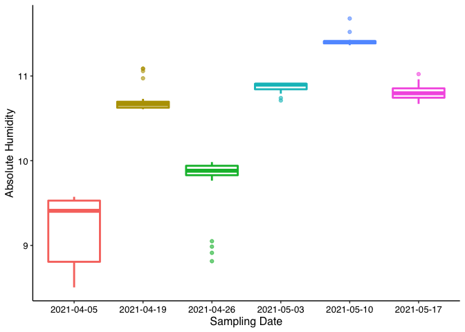<!-- -->

``` r
# glm
glm_abshum_wk <- glm(abs_humidity_g_m3_interpol ~ as.factor(date),
           data = all_data_wide)
summary(glm_abshum_wk)
```

    ## 
    ## Call:
    ## glm(formula = abs_humidity_g_m3_interpol ~ as.factor(date), data = all_data_wide)
    ## 
    ## Deviance Residuals: 
    ##      Min        1Q    Median        3Q       Max  
    ## -0.94037  -0.05647   0.00538   0.10640   0.36569  
    ## 
    ## Coefficients:
    ##                           Estimate Std. Error t value Pr(>|t|)    
    ## (Intercept)                9.22053    0.04642 198.641  < 2e-16 ***
    ## as.factor(date)2021-04-19  1.50164    0.06775  22.164  < 2e-16 ***
    ## as.factor(date)2021-04-26  0.53379    0.06503   8.208 1.28e-13 ***
    ## as.factor(date)2021-05-03  1.64334    0.07144  23.005  < 2e-16 ***
    ## as.factor(date)2021-05-10  2.19274    0.06700  32.728  < 2e-16 ***
    ## as.factor(date)2021-05-17  1.58637    0.06446  24.609  < 2e-16 ***
    ## ---
    ## Signif. codes:  0 '***' 0.001 '**' 0.01 '*' 0.05 '.' 0.1 ' ' 1
    ## 
    ## (Dispersion parameter for gaussian family taken to be 0.05602026)
    ## 
    ##     Null deviance: 90.9778  on 146  degrees of freedom
    ## Residual deviance:  7.8989  on 141  degrees of freedom
    ##   (3 observations deleted due to missingness)
    ## AIC: 1.3819
    ## 
    ## Number of Fisher Scoring iterations: 2

``` r
aov_abshum_wk <- aov(abs_humidity_g_m3_interpol ~ as.factor(date),
           data = all_data_wide)
TukeyHSD(aov_abshum_wk)
```

    ##   Tukey multiple comparisons of means
    ##     95% family-wise confidence level
    ## 
    ## Fit: aov(formula = abs_humidity_g_m3_interpol ~ as.factor(date), data = all_data_wide)
    ## 
    ## $`as.factor(date)`
    ##                              diff         lwr        upr     p adj
    ## 2021-04-19-2021-04-05  1.50164382  1.30588872  1.6973989 0.0000000
    ## 2021-04-26-2021-04-05  0.53379095  0.34588739  0.7216945 0.0000000
    ## 2021-05-03-2021-04-05  1.64334398  1.43694458  1.8497434 0.0000000
    ## 2021-05-10-2021-04-05  2.19273823  1.99915919  2.3863173 0.0000000
    ## 2021-05-17-2021-04-05  1.58637368  1.40012345  1.7726239 0.0000000
    ## 2021-04-26-2021-04-19 -0.96785287 -1.16189894 -0.7738068 0.0000000
    ## 2021-05-03-2021-04-19  0.14170016 -0.07030653  0.3537068 0.3876843
    ## 2021-05-10-2021-04-19  0.69109441  0.49154749  0.8906413 0.0000000
    ## 2021-05-17-2021-04-19  0.08472986 -0.10771565  0.2771754 0.7996834
    ## 2021-05-03-2021-04-26  1.10955303  0.90477382  1.3143322 0.0000000
    ## 2021-05-10-2021-04-26  1.65894728  1.46709666  1.8507979 0.0000000
    ## 2021-05-17-2021-04-26  1.05258273  0.86812958  1.2370359 0.0000000
    ## 2021-05-10-2021-05-03  0.54939425  0.33939515  0.7593934 0.0000000
    ## 2021-05-17-2021-05-03 -0.05697030 -0.26023349  0.1462929 0.9653251
    ## 2021-05-17-2021-05-10 -0.60636455 -0.79659616 -0.4161329 0.0000000

### Osml, Humidity, Week

``` r
all_data_wide %>% 
  ggplot(data = .) + 
  geom_boxplot(aes(x = as.factor(date), 
                   y = osmolality_mmol_kg, 
                   color = as.factor(date)
                   ), 
               size = 1,
               alpha = 0.6) + 
  geom_jitter(aes(x = as.factor(date), 
                   y = 35*abs_humidity_g_m3_interpol)) +
  theme_classic() + 
  xlab("Sampling Date") + 
  ylab("Osmolality (mmol/kg)") + 
  theme(text = element_text(color = "black", family = "sans", size = 12),
        axis.text = element_text(color = "black", family = "sans", size = 10),
        legend.text.align = 0,
        legend.position = "none"
)
```

    ## Warning: Removed 3 rows containing non-finite values (stat_boxplot).

    ## Warning: Removed 3 rows containing missing values (geom_point).

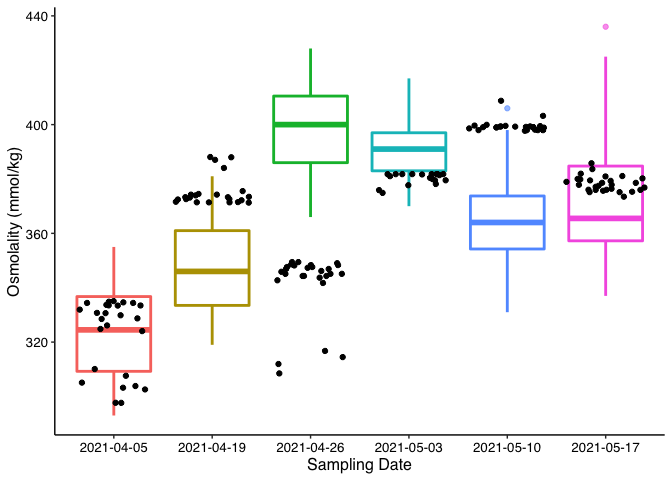<!-- -->

### Osml \~ R. Humidity

  - Sig difference, negative relationship. With every percent increase
    in relative humidity osmolarity drops 1.2.

<!-- end list -->

``` r
all_data_wide %>% 
  ggplot(data = .) + 
  geom_point(aes(x = RH_percent_interpol,
                 y = osmolality_mmol_kg, 
                 ), 
             size = 1, 
             alpha = 0.6) + 
  stat_smooth(aes(x = RH_percent_interpol, 
                  y = osmolality_mmol_kg), 
              formula = y ~ x, 
              method = "lm", 
              se = F, 
              color = "gray",
              size = 1.6, 
              alpha = 1 ) + 
  theme_classic() + 
  xlab("Relative Humidity") + 
  ylab("Osmolality") + 
  theme(text = element_text(color = "black", 
                            family = "sans", 
                            size = 12),
        axis.text = element_text(color = "black", 
                                 family = "sans", 
                                 size = 10),
        legend.text.align = 0,
)
```

    ## Warning: Removed 5 rows containing non-finite values (stat_smooth).

    ## Warning: Removed 5 rows containing missing values (geom_point).

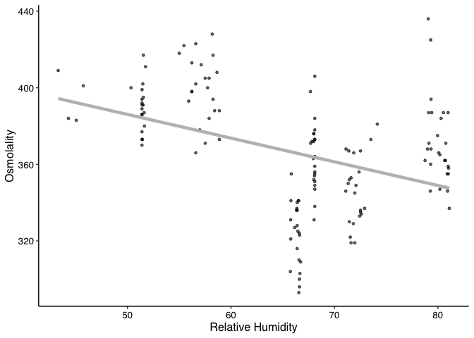<!-- -->

``` r
# glm
glm_osml_hum <- lm(osmolality_mmol_kg ~ RH_percent_interpol,
           data = all_data_wide)
summary(glm_osml_hum)
```

    ## 
    ## Call:
    ## lm(formula = osmolality_mmol_kg ~ RH_percent_interpol, data = all_data_wide)
    ## 
    ## Residuals:
    ##     Min      1Q  Median      3Q     Max 
    ## -72.568 -14.328   2.936  16.303  85.909 
    ## 
    ## Coefficients:
    ##                     Estimate Std. Error t value Pr(>|t|)    
    ## (Intercept)         447.9337    15.8137  28.326  < 2e-16 ***
    ## RH_percent_interpol  -1.2375     0.2363  -5.238  5.7e-07 ***
    ## ---
    ## Signif. codes:  0 '***' 0.001 '**' 0.01 '*' 0.05 '.' 0.1 ' ' 1
    ## 
    ## Residual standard error: 28.15 on 143 degrees of freedom
    ##   (5 observations deleted due to missingness)
    ## Multiple R-squared:  0.161,  Adjusted R-squared:  0.1551 
    ## F-statistic: 27.43 on 1 and 143 DF,  p-value: 5.699e-07

That’s a pretty good relationship…

### Osml \~ Abs. Humidity

``` r
all_data_wide %>% 
  ggplot(data = .) + 
  geom_point(aes(x = abs_humidity_g_m3_interpol,
                 y = osmolality_mmol_kg, 
                 ), 
             size = 1, 
             alpha = 0.4) + 
  stat_smooth(aes(x = abs_humidity_g_m3_interpol, 
                  y = osmolality_mmol_kg), 
              formula = y ~ x, 
              method = "lm", 
              se = F, 
              color = "royalblue",
              size = 1.6, 
              alpha = 1 ) + 
  theme_classic() + 
  xlab(bquote('Absolute Humidity at Capture (g / '*m^2*')')) + 
  ylab("Osmolality (mmol / kg)") + 
  xlim(8, 12) +
  ylim(300, 450) +
  annotate("text", x = 8.5, y = 440, 
           label = "paste(italic(R) ^ 2, \" = 0.036\")", 
           parse = TRUE,
           size = 6) +
  annotate("text", x = 8.5, y = 428, 
           label = "paste(italic(p), \" = 0.0126\")", 
           parse = TRUE,
           size = 6) +
  theme(text = element_text(color = "black", 
                            family = "sans", 
                            size = 18),
        axis.text = element_text(color = "black", 
                                 family = "sans", 
                                 size = 14),
        legend.text.align = 0,
) -> osml_abhum_fig
osml_abhum_fig
```

    ## Warning: Removed 7 rows containing non-finite values (stat_smooth).

    ## Warning: Removed 7 rows containing missing values (geom_point).

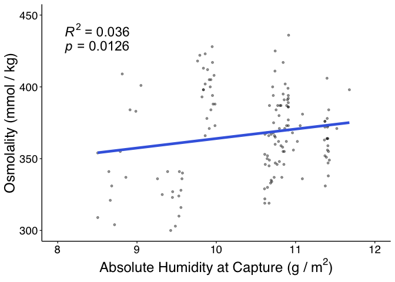<!-- -->

``` r
# export figure
#ggsave(filename = "osml_abhum_fig.tiff",
 #      plot = osml_abhum_fig,
  #     path = "./final_figures",
   #    device = "tiff",
    #   dpi = 1200,
     #  width = 6, height = 4)

# glm
glm_osml_abshum <- lm(osmolality_mmol_kg ~ abs_humidity_g_m3_interpol,
           data = all_data_wide)
summary(glm_osml_abshum)
```

    ## 
    ## Call:
    ## lm(formula = osmolality_mmol_kg ~ abs_humidity_g_m3_interpol, 
    ##     data = all_data_wide)
    ## 
    ## Residuals:
    ##     Min      1Q  Median      3Q     Max 
    ## -64.568 -21.448  -1.049  21.630  66.179 
    ## 
    ## Coefficients:
    ##                            Estimate Std. Error t value Pr(>|t|)    
    ## (Intercept)                 281.859     33.384   8.443 3.14e-14 ***
    ## abs_humidity_g_m3_interpol    8.061      3.189   2.528   0.0126 *  
    ## ---
    ## Signif. codes:  0 '***' 0.001 '**' 0.01 '*' 0.05 '.' 0.1 ' ' 1
    ## 
    ## Residual standard error: 30.06 on 143 degrees of freedom
    ##   (5 observations deleted due to missingness)
    ## Multiple R-squared:  0.04278,    Adjusted R-squared:  0.03608 
    ## F-statistic:  6.39 on 1 and 143 DF,  p-value: 0.01256

*positive* correlation…

### Osml \~ Avg. Abs. Humidity

``` r
all_data_wide %>% 
  ggplot(data = .) + 
  geom_point(aes(x = avg_abs_humd,
                 y = osmolality_mmol_kg, 
                 ), 
             size = 1, 
             alpha = 0.6) + 
  stat_smooth(aes(x = avg_abs_humd, 
                  y = osmolality_mmol_kg), 
              formula = y ~ x, 
              method = "lm", 
              se = F, 
              color = "gray",
              size = 1.6, 
              alpha = 1 ) + 
  theme_classic() + 
  xlab("Prior Week's Average Absolute Humidity") + 
  ylab("Osmolality (mmol/kg)") + 
  theme(text = element_text(color = "black", 
                            family = "sans", 
                            size = 12),
        axis.text = element_text(color = "black", 
                                 family = "sans", 
                                 size = 10),
        legend.text.align = 0,
)
```

    ## Warning: Removed 3 rows containing non-finite values (stat_smooth).

    ## Warning: Removed 3 rows containing missing values (geom_point).

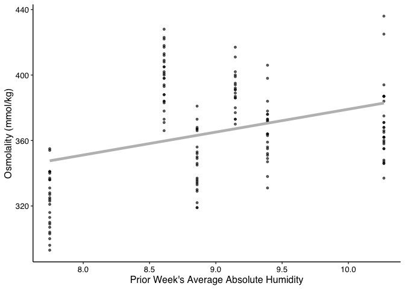<!-- -->

``` r
# glm
glm_osml_avgabshum <- lm(osmolality_mmol_kg ~ avg_abs_humd,
           data = all_data_wide)
summary(glm_osml_avgabshum)
```

    ## 
    ## Call:
    ## lm(formula = osmolality_mmol_kg ~ avg_abs_humd, data = all_data_wide)
    ## 
    ## Residuals:
    ##     Min      1Q  Median      3Q     Max 
    ## -54.602 -22.093  -6.584  22.573  68.328 
    ## 
    ## Coefficients:
    ##              Estimate Std. Error t value Pr(>|t|)    
    ## (Intercept)   239.207     27.083   8.832 3.08e-15 ***
    ## avg_abs_humd   13.991      2.994   4.672 6.74e-06 ***
    ## ---
    ## Signif. codes:  0 '***' 0.001 '**' 0.01 '*' 0.05 '.' 0.1 ' ' 1
    ## 
    ## Residual standard error: 29.1 on 145 degrees of freedom
    ##   (3 observations deleted due to missingness)
    ## Multiple R-squared:  0.1309, Adjusted R-squared:  0.1249 
    ## F-statistic: 21.83 on 1 and 145 DF,  p-value: 6.736e-06

*positive* correlation…

### Osml \~ Rain

``` r
all_data_wide %>% 
  ggplot(data = .) + 
  geom_point(aes(x = total_precip,
                 y = osmolality_mmol_kg, 
                 ), 
             size = 1, 
             alpha = 0.6) + 
  stat_smooth(aes(x = total_precip, 
                  y = osmolality_mmol_kg), 
              formula = y ~ x, 
              method = "lm", 
              se = F, 
              color = "gray",
              size = 1.6, 
              alpha = 1 ) + 
  theme_classic() + 
  xlab("Prior Week's Total Precipitation (inches)") + 
  ylab("Osmolality (mmol/kg)") + 
  theme(text = element_text(color = "black", 
                            family = "sans", 
                            size = 12),
        axis.text = element_text(color = "black", 
                                 family = "sans", 
                                 size = 10),
        legend.text.align = 0,
)
```

    ## Warning: Removed 3 rows containing non-finite values (stat_smooth).

    ## Warning: Removed 3 rows containing missing values (geom_point).

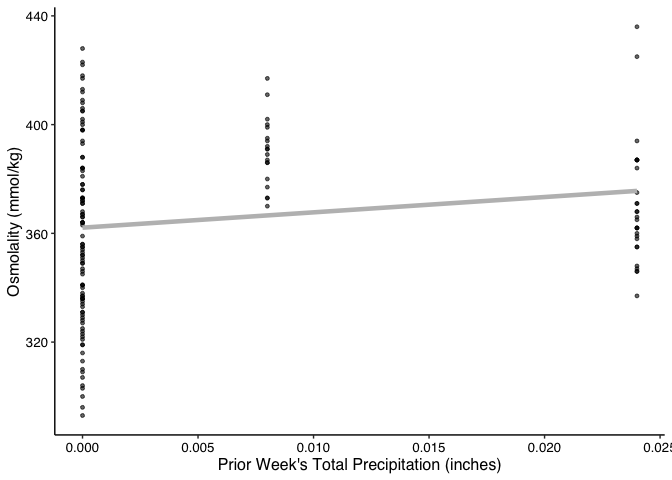<!-- -->

This isn’t really helpful considering how little variation in
precipitation there was.

Maybe try a binary predictor of whether or not there was rain in the
week prior to sampling:

``` r
# ANOVA
osml_rain_aov <- aov(data = all_data_wide, 
                     osmolality_mmol_kg ~ prior_rain_Y_N)
TukeyHSD(osml_rain_aov)
```

    ##   Tukey multiple comparisons of means
    ##     95% family-wise confidence level
    ## 
    ## Fit: aov(formula = osmolality_mmol_kg ~ prior_rain_Y_N, data = all_data_wide)
    ## 
    ## $prior_rain_Y_N
    ##         diff      lwr      upr     p adj
    ## Y-N 19.20915 8.765846 29.65245 0.0003847

``` r
# plot
all_data_wide %>% 
  ggplot(data = .) + 
  geom_boxplot(aes(x = prior_rain_Y_N, 
                   y = osmolality_mmol_kg, 
                   color = prior_rain_Y_N
                   ), 
               size = 1,
               alpha = 0.6) + 
  theme_classic() + 
  xlab("Whether it Rained in the Last Week") + 
  ylab("Osmolality (mmol/kg)") + 
  theme(text = element_text(color = "black", family = "sans", size = 12),
        axis.text = element_text(color = "black", family = "sans", size = 10),
        legend.text.align = 0,
        legend.position = "none"
)
```

    ## Warning: Removed 3 rows containing non-finite values (stat_boxplot).

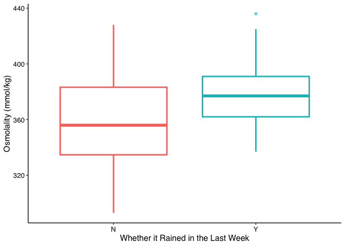<!-- -->

Wow, very counter to our predictions.

But, actually, we’re not after the osmolality values themselves, but
whether it increases or decreases… so what if I did change in mean
osmolality \~ whether or not it rained in the past week?

``` r
# plot
osml_rain_wk %>% 
  ggplot(data = .) + 
  geom_boxplot(aes(x = prior_rain_Y_N, 
                   y = osml_change, 
                   color = prior_rain_Y_N
                   ), 
               size = 1,
               alpha = 0.6) + 
  theme_classic() + 
  xlab("Whether it Rained in the Last Week") + 
  ylab("Change in Osmolality (mmol/kg)") + 
  theme(text = element_text(color = "black", family = "sans", size = 12),
        axis.text = element_text(color = "black", family = "sans", size = 10),
        legend.text.align = 0,
        legend.position = "none"
)
```

    ## Warning: Removed 1 rows containing non-finite values (stat_boxplot).

<!-- -->

``` r
# glm of change ~ inches precip
osml_precip_glm <- glm(data = osml_rain_wk, osml_change ~ total_precip)
summary(osml_precip_glm)
```

    ## 
    ## Call:
    ## glm(formula = osml_change ~ total_precip, data = osml_rain_wk)
    ## 
    ## Deviance Residuals: 
    ##       2        3        4        5        6  
    ##   9.991   39.285  -16.890  -38.015    5.630  
    ## 
    ## Coefficients:
    ##              Estimate Std. Error t value Pr(>|t|)
    ## (Intercept)     12.90      18.27   0.706    0.531
    ## total_precip  -553.69    1614.99  -0.343    0.754
    ## 
    ## (Dispersion parameter for gaussian family taken to be 1135.081)
    ## 
    ##     Null deviance: 3538.7  on 4  degrees of freedom
    ## Residual deviance: 3405.2  on 3  degrees of freedom
    ##   (1 observation deleted due to missingness)
    ## AIC: 52.808
    ## 
    ## Number of Fisher Scoring iterations: 2

Try Linear plot again:

``` r
osml_rain_wk %>% 
  ggplot(data = .) + 
  geom_point(aes(x = total_precip,
                 y = osml_change, 
                 ), 
             size = 1, 
             alpha = 0.6) + 
  stat_smooth(aes(x = total_precip, 
                  y = osml_change), 
              formula = y ~ x, 
              method = "lm", 
              se = F, 
              color = "gray",
              size = 1.6, 
              alpha = 1 ) + 
  theme_classic() + 
  xlab("Prior Week's Total Precipitation (inches)") + 
  ylab("Change in Osmolality (mmol/kg)") + 
  theme(text = element_text(color = "black", 
                            family = "sans", 
                            size = 12),
        axis.text = element_text(color = "black", 
                                 family = "sans", 
                                 size = 10),
        legend.text.align = 0,
)
```

    ## Warning: Removed 1 rows containing non-finite values (stat_smooth).

    ## Warning: Removed 1 rows containing missing values (geom_point).

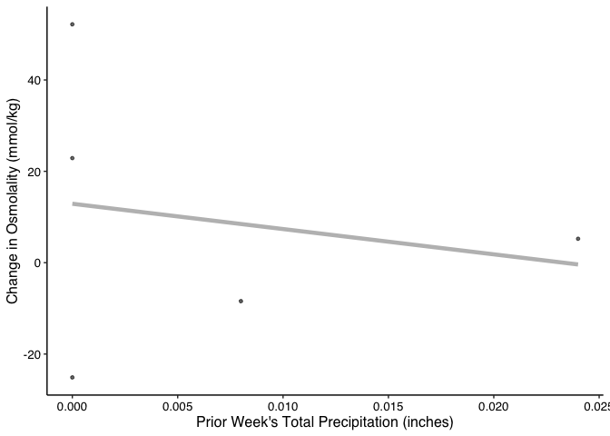<!-- -->

### Hct \~ Humidity

  - almost significant (p=0.0734)

<!-- end list -->

``` r
all_data_wide %>% 
  ggplot(data = .) + 
  geom_point(aes(x = RH_percent_interpol,
                 y = hematocrit_percent, 
                 ), 
             size = 1, 
             alpha = 0.6) + 
  stat_smooth(aes(x = RH_percent_interpol, 
                  y = hematocrit_percent), 
              formula = y ~ x, 
              method = "lm", 
              se = F, 
              color = "blue",
              size = 1.6, 
              alpha = 1 ) + 
  theme_classic() + 
  xlab("Ambient Relative Humidity at Capture (%)") + 
  ylab("Hematocrit (%)") + 
  theme(text = element_text(color = "black", 
                            family = "sans", 
                            size = 12),
        axis.text = element_text(color = "black", 
                                 family = "sans", 
                                 size = 10),
        legend.text.align = 0,
)
```

    ## Warning: Removed 28 rows containing non-finite values (stat_smooth).

    ## Warning: Removed 28 rows containing missing values (geom_point).

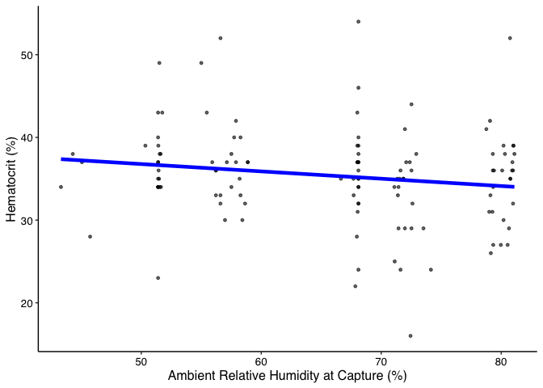<!-- -->

``` r
# glm
glm_hct_RH <- lm(hematocrit_percent ~ RH_percent_interpol,
           data = all_data_wide)
summary(glm_hct_RH)
```

    ## 
    ## Call:
    ## lm(formula = hematocrit_percent ~ RH_percent_interpol, data = all_data_wide)
    ## 
    ## Residuals:
    ##      Min       1Q   Median       3Q      Max 
    ## -18.7877  -3.1402   0.1449   2.3254  18.8276 
    ## 
    ## Coefficients:
    ##                     Estimate Std. Error t value Pr(>|t|)    
    ## (Intercept)         41.20780    3.28888  12.529   <2e-16 ***
    ## RH_percent_interpol -0.08863    0.04906  -1.806   0.0734 .  
    ## ---
    ## Signif. codes:  0 '***' 0.001 '**' 0.01 '*' 0.05 '.' 0.1 ' ' 1
    ## 
    ## Residual standard error: 5.844 on 120 degrees of freedom
    ##   (28 observations deleted due to missingness)
    ## Multiple R-squared:  0.02647,    Adjusted R-squared:  0.01836 
    ## F-statistic: 3.263 on 1 and 120 DF,  p-value: 0.07337

### Hct \~ Temperature

  - barely not signficant (0.062), as hematocrit increases ambient temp
    increases

<!-- end list -->

``` r
all_data_wide %>% 
  ggplot(data = .) + 
  geom_point(aes(x = temp_C_interpol,
                 y = hematocrit_percent, 
                 ), 
             size = 1, 
             alpha = 0.6) + 
  stat_smooth(aes(x = temp_C_interpol, 
                  y = hematocrit_percent), 
              formula = y ~ x, 
              method = "lm", 
              se = F, 
              color = "maroon",
              size = 1.6, 
              alpha = 1 ) + 
  theme_classic() + 
  xlab("Ambient Temperature at Capture (C)") + 
  ylab("Hematocrit (%)") + 
  theme(text = element_text(color = "black", 
                            family = "sans", 
                            size = 12),
        axis.text = element_text(color = "black", 
                                 family = "sans", 
                                 size = 10),
        legend.text.align = 0,
)
```

    ## Warning: Removed 28 rows containing non-finite values (stat_smooth).

    ## Warning: Removed 28 rows containing missing values (geom_point).

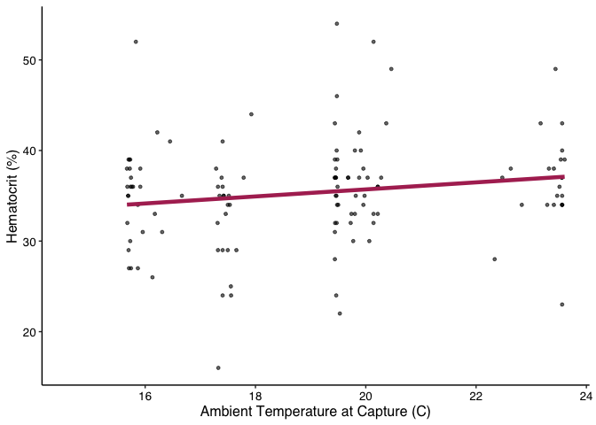<!-- -->

``` r
# glm
glm_hct_temp <- lm(hematocrit_percent ~ temp_C_interpol,
           data = all_data_wide)
summary(glm_hct_temp)
```

    ## 
    ## Call:
    ## lm(formula = hematocrit_percent ~ temp_C_interpol, data = all_data_wide)
    ## 
    ## Residuals:
    ##      Min       1Q   Median       3Q      Max 
    ## -18.6666  -3.0722   0.2958   2.3118  18.4989 
    ## 
    ## Coefficients:
    ##                 Estimate Std. Error t value Pr(>|t|)    
    ## (Intercept)      27.9395     3.9654   7.046 1.26e-10 ***
    ## temp_C_interpol   0.3883     0.2061   1.884    0.062 .  
    ## ---
    ## Signif. codes:  0 '***' 0.001 '**' 0.01 '*' 0.05 '.' 0.1 ' ' 1
    ## 
    ## Residual standard error: 5.837 on 120 degrees of freedom
    ##   (28 observations deleted due to missingness)
    ## Multiple R-squared:  0.02873,    Adjusted R-squared:  0.02064 
    ## F-statistic:  3.55 on 1 and 120 DF,  p-value: 0.06197

### Osml \~ Temperature

  - very strong positive relationship

<!-- end list -->

``` r
all_data_wide %>% 
  ggplot(data = .) + 
  geom_point(aes(x = temp_C_interpol,
                 y = osmolality_mmol_kg, 
                 ), 
             size = 1, 
             alpha = 0.4) + 
  stat_smooth(aes(x = temp_C_interpol, 
                  y = osmolality_mmol_kg), 
              formula = y ~ x, 
              method = "lm", 
              se = F, 
              color = "maroon",
              size = 1.6, 
              alpha = 1 ) + 
  theme_classic() + 
  xlab("Ambient Temperature at Capture (°C)") + 
  ylab("Osmolality (mmol / kg)") + 
  annotate("text", x = 22, y = 320, 
           label = "paste(italic(R) ^ 2, \" = 0.2952\")", 
           parse = TRUE,
           size = 6) +
  annotate("text", x = 22, y = 308, 
           label = "paste(italic(p), \" < 0.0001\")", 
           parse = TRUE,
           size = 6) +
  xlim(14, 24) +
  ylim(300,450) +
  theme(text = element_text(color = "black", 
                            family = "sans", 
                            size = 18),
        axis.text = element_text(color = "black", 
                                 family = "sans", 
                                 size = 14),
        legend.text.align = 0,
) -> osml_temp_fig
osml_temp_fig
```

    ## Warning: Removed 7 rows containing non-finite values (stat_smooth).

    ## Warning: Removed 7 rows containing missing values (geom_point).

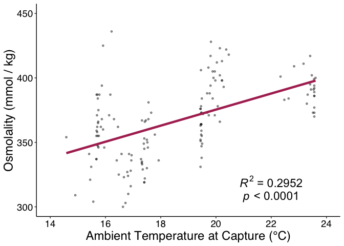<!-- -->

``` r
# export figure
#ggsave(filename = "osml_temp_fig.tiff",
 #      plot = osml_temp_fig,
  #     path = "./final_figures",
   #    device = "tiff",
    #   dpi = 1200,
     #  width = 6, height = 4)

# glm
glm_osml_temp <- lm(osmolality_mmol_kg ~ temp_C_interpol,
           data = all_data_wide)
summary(glm_osml_temp)
```

    ## 
    ## Call:
    ## lm(formula = osmolality_mmol_kg ~ temp_C_interpol, data = all_data_wide)
    ## 
    ## Residuals:
    ##     Min      1Q  Median      3Q     Max 
    ## -59.827 -16.201  -1.977  15.576  85.555 
    ## 
    ## Coefficients:
    ##                 Estimate Std. Error t value Pr(>|t|)    
    ## (Intercept)     245.4719    15.5415   15.79  < 2e-16 ***
    ## temp_C_interpol   6.4718     0.8265    7.83 9.96e-13 ***
    ## ---
    ## Signif. codes:  0 '***' 0.001 '**' 0.01 '*' 0.05 '.' 0.1 ' ' 1
    ## 
    ## Residual standard error: 25.71 on 143 degrees of freedom
    ##   (5 observations deleted due to missingness)
    ## Multiple R-squared:  0.3001, Adjusted R-squared:  0.2952 
    ## F-statistic: 61.31 on 1 and 143 DF,  p-value: 9.962e-13

### Hct \~ Individual

  - not sig

<!-- end list -->

``` r
all_data_wide %>% 
  ggplot(data = .) + 
  geom_point(aes(x = individual_ID,
                 y = hematocrit_percent, 
                 ), 
             size = 1, 
             alpha = 0.6) + 
  stat_smooth(aes(x = individual_ID, 
                  y = hematocrit_percent, 
                  ), 
              formula = y ~ x, 
              method = "lm", 
              color = "gray",
              se = F, 
              size = 1.6, 
              alpha = 1 ) + 
  theme_classic() + 
  xlab("Individual Lizard") + 
  ylab("Hematocrit (%)") + 
  theme(text = element_text(color = "black", 
                            family = "sans", 
                            size = 12),
        axis.text = element_text(color = "black", 
                                 family = "sans", 
                                 size = 10),
        legend.text.align = 0,
)
```

    ## Warning: Removed 27 rows containing non-finite values (stat_smooth).

    ## Warning: Removed 27 rows containing missing values (geom_point).

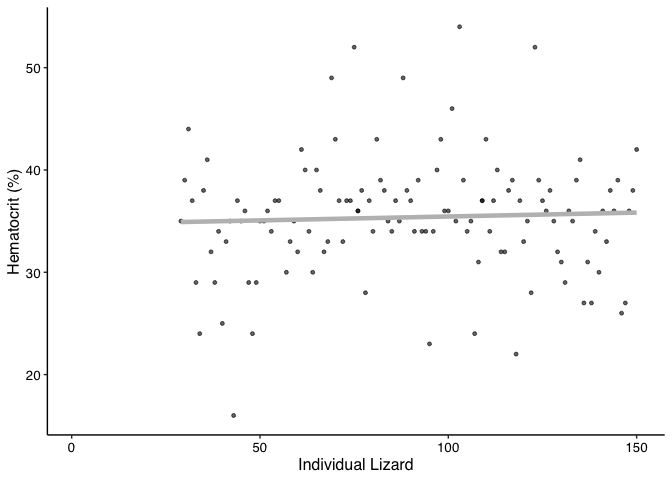<!-- -->

``` r
# glm
glm_hct_ID <- lm(hematocrit_percent ~ individual_ID,
           data = all_data_wide)
summary(glm_hct_ID)
```

    ## 
    ## Call:
    ## lm(formula = hematocrit_percent ~ individual_ID, data = all_data_wide)
    ## 
    ## Residuals:
    ##      Min       1Q   Median       3Q      Max 
    ## -19.0173  -2.6877   0.1828   2.6551  18.5256 
    ## 
    ## Coefficients:
    ##                Estimate Std. Error t value Pr(>|t|)    
    ## (Intercept)   34.689783   1.465318  23.674   <2e-16 ***
    ## individual_ID  0.007617   0.015200   0.501    0.617    
    ## ---
    ## Signif. codes:  0 '***' 0.001 '**' 0.01 '*' 0.05 '.' 0.1 ' ' 1
    ## 
    ## Residual standard error: 5.901 on 121 degrees of freedom
    ##   (27 observations deleted due to missingness)
    ## Multiple R-squared:  0.002071,   Adjusted R-squared:  -0.006176 
    ## F-statistic: 0.2511 on 1 and 121 DF,  p-value: 0.6172

### Osml \~ Individual

  - sig relationship…

<!-- end list -->

``` r
all_data_wide %>% 
  ggplot(data = .) + 
  geom_point(aes(x = individual_ID,
                 y = osmolality_mmol_kg, 
                 ), 
             size = 1, 
             alpha = 0.6) + 
  stat_smooth(aes(x = individual_ID, 
                  y = osmolality_mmol_kg, 
                  ), 
              formula = y ~ x, 
              method = "lm", 
              color = "gray",
              se = F, 
              size = 1.6, 
              alpha = 1 ) + 
  theme_classic() + 
  xlab("Individual Lizard") + 
  ylab("Osmolality") + 
  theme(text = element_text(color = "black", 
                            family = "sans", 
                            size = 12),
        axis.text = element_text(color = "black", 
                                 family = "sans", 
                                 size = 10),
        legend.text.align = 0,
)
```

    ## Warning: Removed 3 rows containing non-finite values (stat_smooth).

    ## Warning: Removed 3 rows containing missing values (geom_point).

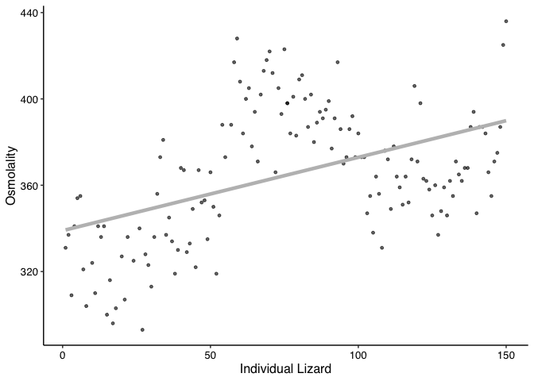<!-- -->

``` r
# glm
glm_osml_ID <- lm(osmolality_mmol_kg ~ individual_ID,
           data = all_data_wide)
summary(glm_osml_ID)
```

    ## 
    ## Call:
    ## lm(formula = osmolality_mmol_kg ~ individual_ID, data = all_data_wide)
    ## 
    ## Residuals:
    ##     Min      1Q  Median      3Q     Max 
    ## -55.128 -20.583  -2.635  19.798  69.000 
    ## 
    ## Coefficients:
    ##                Estimate Std. Error t value Pr(>|t|)    
    ## (Intercept)   338.95546    4.70463  72.047  < 2e-16 ***
    ## individual_ID   0.33974    0.05321   6.385 2.18e-09 ***
    ## ---
    ## Signif. codes:  0 '***' 0.001 '**' 0.01 '*' 0.05 '.' 0.1 ' ' 1
    ## 
    ## Residual standard error: 27.57 on 145 degrees of freedom
    ##   (3 observations deleted due to missingness)
    ## Multiple R-squared:  0.2195, Adjusted R-squared:  0.2141 
    ## F-statistic: 40.77 on 1 and 145 DF,  p-value: 2.181e-09

## Conclusion

Hydration seems to be affected by: - mass (NS) - sex (NS) - gravid/not
(NS) - sample eye (NS) - whether or not the sample was hemolyzed (NS) -
week/date of sampling\!\! (***) - individual (*** but likely confounded
with week/date…) - capture temp & RH (both \*\*\*)

Health seems to be affected by: - mass (NS) - sex (\*) - capture temp &
RH (NS)

Quick regression of individual\_ID \~ date:

@Savannah: why have this, expect positive right?

``` r
glm_date_ID <- lm(individual_ID ~ date,
           data = all_data_wide)
summary(glm_date_ID)
```

    ## 
    ## Call:
    ## lm(formula = individual_ID ~ date, data = all_data_wide)
    ## 
    ## Residuals:
    ##      Min       1Q   Median       3Q      Max 
    ## -19.1675  -6.4543  -0.3923   6.0089  20.7317 
    ## 
    ## Coefficients:
    ##               Estimate Std. Error t value Pr(>|t|)    
    ## (Intercept) -5.468e+04  9.371e+02  -58.36   <2e-16 ***
    ## date         2.921e+00  4.999e-02   58.44   <2e-16 ***
    ## ---
    ## Signif. codes:  0 '***' 0.001 '**' 0.01 '*' 0.05 '.' 0.1 ' ' 1
    ## 
    ## Residual standard error: 8.851 on 148 degrees of freedom
    ## Multiple R-squared:  0.9585, Adjusted R-squared:  0.9582 
    ## F-statistic:  3415 on 1 and 148 DF,  p-value: < 2.2e-16

## What affects evaporative water loss?

Potential relationships: - CEWL \~ date/week, individual, SVL, mass,
gravidity, hct, osml, cloacal temp, ambient temp, ambient RH,
measurement temp, measurement RH, **body region**

### CEWL \~ Body Region

figure:

``` r
CEWL %>% 
  ggplot(data = .) + 
  geom_boxplot(aes(x = reorder(region, TEWL_g_m2h), 
                   y = TEWL_g_m2h, 
                   color = region
                   ), 
               size = 1,
               alpha = 1) +
  scale_x_discrete(labels = c("Dewlap", "Dorsum",
                              "Mite Patch", "Head", "Ventrum")) +
  theme_classic() + 
  xlab("Body Region") + 
  ylab(bquote('CEWL (g / '*m^2~h*')')) + 
  annotate("text", x = 1, y = 65, label = "a", size = 6) +
  annotate("text", x = 2, y = 62, label = "a", size = 6) +
  annotate("text", x = 3, y = 105, label = "b", size = 6) +
  annotate("text", x = 4, y = 92, label = "b", size = 6) +
  annotate("text", x = 5, y = 75, label = "b", size = 6) +
  scale_color_brewer(palette = "Set2") +
  ylim(1, 110) +
  theme(text = element_text(color = "black", 
                            family = "sans", 
                            size = 18),
        axis.text = element_text(color = "black", 
                                 family = "sans", 
                                 size = 14),
        legend.text.align = 0,
        legend.position = "none"
) -> CEWL_region_fig
CEWL_region_fig
```

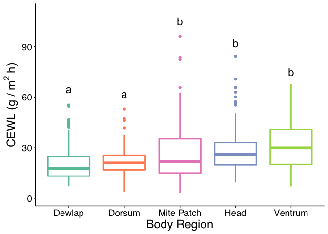<!-- -->

``` r
# export figure
#ggsave(filename = "CEWL_region_fig.tiff",
 #      plot = CEWL_region_fig,
  #     path = "./final_figures",
   #    device = "tiff",
    #   dpi = 1200,
     #  width = 6, height = 4)
```

stats:

``` r
# GLM
glm1 <- lm(TEWL_g_m2h ~ region, data = CEWL)
summary(glm1)
```

    ## 
    ## Call:
    ## lm(formula = TEWL_g_m2h ~ region, data = CEWL)
    ## 
    ## Residuals:
    ##     Min      1Q  Median      3Q     Max 
    ## -24.153  -8.365  -2.351   5.625  68.934 
    ## 
    ## Coefficients:
    ##             Estimate Std. Error t value Pr(>|t|)    
    ## (Intercept)   20.648      1.051  19.655  < 2e-16 ***
    ## regiondors     1.255      1.480   0.848    0.397    
    ## regionhead     7.671      1.478   5.191 2.75e-07 ***
    ## regionmite     6.578      1.491   4.412 1.19e-05 ***
    ## regionvent    10.615      1.480   7.171 1.91e-12 ***
    ## ---
    ## Signif. codes:  0 '***' 0.001 '**' 0.01 '*' 0.05 '.' 0.1 ' ' 1
    ## 
    ## Residual standard error: 12.39 on 695 degrees of freedom
    ## Multiple R-squared:  0.09518,    Adjusted R-squared:  0.08997 
    ## F-statistic: 18.28 on 4 and 695 DF,  p-value: 2.739e-14

``` r
# base 
plot(TEWL_g_m2h ~ region, data=CEWL, ylab="TEWL", xlab="region", pch=20, col="blue")
abline(reg=glm1, col="orange")
```

    ## Warning in abline(reg = glm1, col = "orange"): only using the first two of 5
    ## regression coefficients

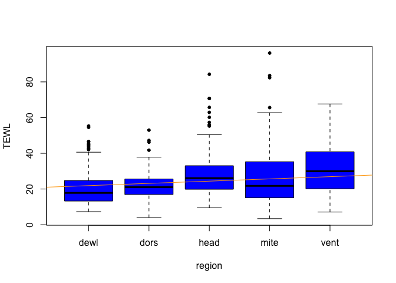<!-- -->

``` r
# ggplot
ggplot(CEWL) + 
  geom_point(aes(region, TEWL_g_m2h), alpha=0.25, color="blue") + 
  geom_smooth(aes(region, TEWL_g_m2h, color="orange"), method="lm", se=T) + 
  labs(x="region", y="TEWL_g_m2h", title="")
```

    ## `geom_smooth()` using formula 'y ~ x'

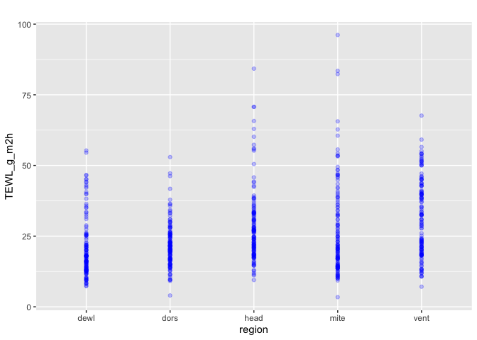<!-- -->

``` r
visreg(glm1, overlay=T)
```

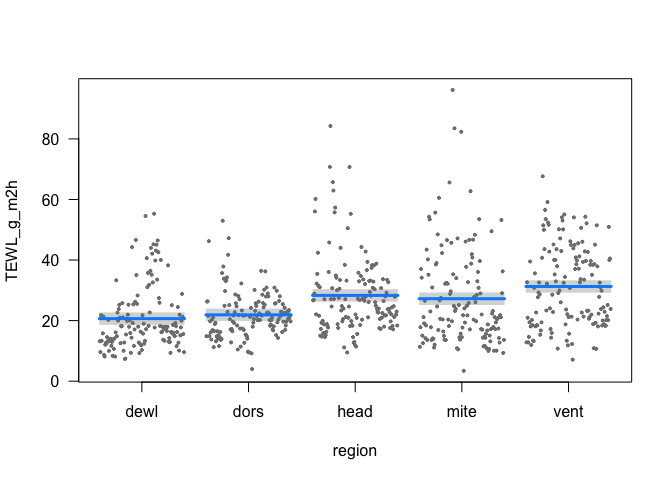<!-- -->

``` r
# I really like this visualization style, but I think I'll try to do it in ggplot

# Tukey
anova1 <- aov(glm1)
TukeyHSD(anova1)
```

    ##   Tukey multiple comparisons of means
    ##     95% family-wise confidence level
    ## 
    ## Fit: aov(formula = glm1)
    ## 
    ## $region
    ##                diff         lwr       upr     p adj
    ## dors-dewl  1.254852 -2.79386697  5.303572 0.9155065
    ## head-dewl  7.670889  3.62925320 11.712525 0.0000027
    ## mite-dewl  6.578364  2.50040840 10.656319 0.0001157
    ## vent-dewl 10.615491  6.56677133 14.664210 0.0000000
    ## head-dors  6.416037  2.38891202 10.443162 0.0001472
    ## mite-dors  5.323511  1.25993752  9.387085 0.0033342
    ## vent-dors  9.360638  5.32640467 13.394872 0.0000000
    ## mite-head -1.092525 -5.14904197  2.963991 0.9478798
    ## vent-head  2.944601 -1.08252340  6.971726 0.2671247
    ## vent-mite  4.037127 -0.02644701  8.100701 0.0524730

``` r
# Model assumptions
plot(glm1, which = 3)
```

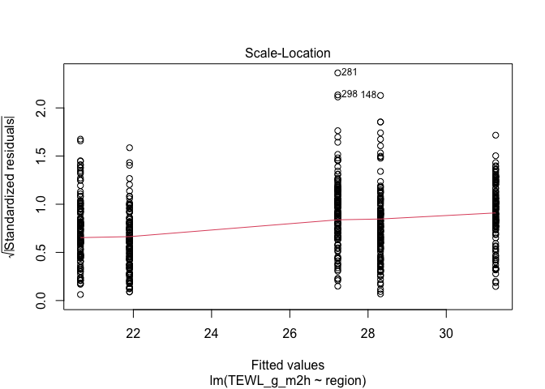<!-- -->

I think that the way the GLM tests differences is not preferable. It
tests how different each category is from the one reference category,
rather than testing differences of each region against each other
region, in a pairwise test. So, I will try an ANOVA to see if I can get
those pairwise statistics.

``` r
# one-way ANOVA
CEWL_region_aov <- aov(data = all_data_long,
                       TEWL_g_m2h ~ region)
# post-hoc pairwise analysis
TukeyHSD(CEWL_region_aov)
```

    ##   Tukey multiple comparisons of means
    ##     95% family-wise confidence level
    ## 
    ## Fit: aov(formula = TEWL_g_m2h ~ region, data = all_data_long)
    ## 
    ## $region
    ##                diff         lwr       upr     p adj
    ## dors-dewl  1.254852 -2.79386697  5.303572 0.9155065
    ## head-dewl  7.670889  3.62925320 11.712525 0.0000027
    ## mite-dewl  6.578364  2.50040840 10.656319 0.0001157
    ## vent-dewl 10.615491  6.56677133 14.664210 0.0000000
    ## head-dors  6.416037  2.38891202 10.443162 0.0001472
    ## mite-dors  5.323511  1.25993752  9.387085 0.0033342
    ## vent-dors  9.360638  5.32640467 13.394872 0.0000000
    ## mite-head -1.092525 -5.14904197  2.963991 0.9478798
    ## vent-head  2.944601 -1.08252340  6.971726 0.2671247
    ## vent-mite  4.037127 -0.02644701  8.100701 0.0524730

### CEWL \~ Osmolality

``` r
all_data_long %>% 
  ggplot(data = .) + 
  geom_point(aes(x = osmolality_mmol_kg,
                 y = TEWL_g_m2h, 
                 color = region
                 ), 
             size = 1, 
             alpha = 0.6) + 
  scale_colour_manual(values = c("palegreen4", "lightblue4", 
                                 "plum4", "lightpink3", "seashell4")) +
  stat_smooth(aes(x = osmolality_mmol_kg, 
                  y = TEWL_g_m2h, 
                  color = region
                  ), 
              formula = y ~ x, 
              method = "lm", 
              se = F, 
              size = 1.6, 
              alpha = 1 ) + 
  theme_classic() + 
  xlab("Osmolality") + 
  ylab("CEWL") + 
  theme(text = element_text(color = "black", 
                            family = "sans", 
                            size = 12),
        axis.text = element_text(color = "black", 
                                 family = "sans", 
                                 size = 10),
        legend.text.align = 0,
)
```

    ## Warning: Removed 10 rows containing non-finite values (stat_smooth).

    ## Warning: Removed 10 rows containing missing values (geom_point).

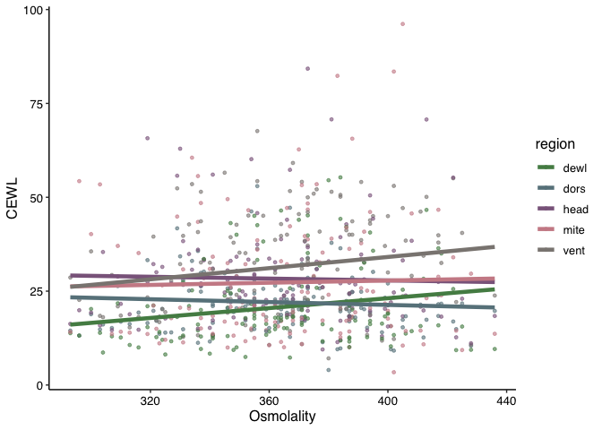<!-- -->

``` r
# glm
glm2 <- lm(TEWL_g_m2h ~ region*osmolality_mmol_kg,
           data = all_data_long)
summary(glm2)
```

    ## 
    ## Call:
    ## lm(formula = TEWL_g_m2h ~ region * osmolality_mmol_kg, data = all_data_long)
    ## 
    ## Residuals:
    ##     Min      1Q  Median      3Q     Max 
    ## -25.507  -8.475  -2.259   5.381  68.257 
    ## 
    ## Coefficients:
    ##                                Estimate Std. Error t value Pr(>|t|)  
    ## (Intercept)                   -3.132411  12.477645  -0.251   0.8019  
    ## regiondors                    32.033192  17.601564   1.820   0.0692 .
    ## regionhead                    35.861001  17.587557   2.039   0.0418 *
    ## regionmite                    25.130240  17.779709   1.413   0.1580  
    ## regionvent                     7.480037  17.593744   0.425   0.6709  
    ## osmolality_mmol_kg             0.065615   0.034104   1.924   0.0548 .
    ## regiondors:osmolality_mmol_kg -0.084527   0.048088  -1.758   0.0792 .
    ## regionhead:osmolality_mmol_kg -0.077785   0.048041  -1.619   0.1059  
    ## regionmite:osmolality_mmol_kg -0.051035   0.048575  -1.051   0.2938  
    ## regionvent:osmolality_mmol_kg  0.008778   0.048064   0.183   0.8551  
    ## ---
    ## Signif. codes:  0 '***' 0.001 '**' 0.01 '*' 0.05 '.' 0.1 ' ' 1
    ## 
    ## Residual standard error: 12.37 on 680 degrees of freedom
    ##   (10 observations deleted due to missingness)
    ## Multiple R-squared:  0.1074, Adjusted R-squared:  0.09554 
    ## F-statistic: 9.087 on 9 and 680 DF,  p-value: 4.797e-13

``` r
# base 
visreg(glm2, "osmolality_mmol_kg", by="region", overlay=T)
```

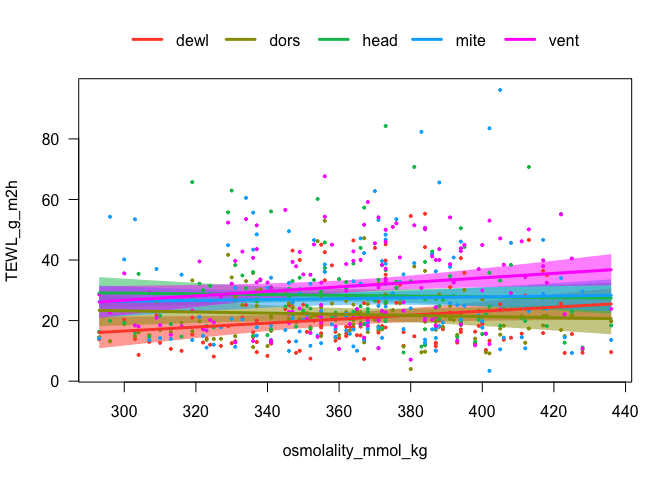<!-- -->

``` r
# Facet ggplot
ggplot(aes(osmolality_mmol_kg, TEWL_g_m2h), data = all_data_long) + 
  geom_point() + 
  stat_smooth(aes(x = osmolality_mmol_kg, 
                  y = TEWL_g_m2h, 
                  color = region
                  ), 
              formula = y ~ x, 
              method = "lm", 
              se = F, 
              size = 1.6, 
              alpha = 1 )+
    theme_classic() + 
  xlab("Osmolality") + 
  ylab("CEWL") + 
  theme(text = element_text(color = "black", 
                            family = "sans", 
                            size = 12),
        axis.text = element_text(color = "black", 
                                 family = "sans", 
                                 size = 10),
        legend.text.align = 0,
)+
  facet_wrap(~ region) # create a facet for each body region
```

    ## Warning: Removed 10 rows containing non-finite values (stat_smooth).
    
    ## Warning: Removed 10 rows containing missing values (geom_point).

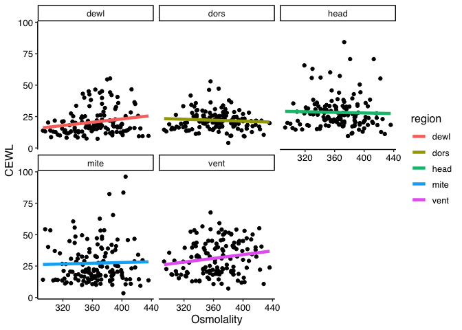<!-- -->

### Dorsum CEWL \~ Osmolality

  - Not sig

<!-- end list -->

``` r
all_data_wide %>% 
  ggplot(data = .) + 
  geom_point(aes(x = osmolality_mmol_kg,
                 y = dorsum_TEWL_g_m2h, 
                 ), 
             size = 1, 
             alpha = 0.6) + 
  stat_smooth(aes(x = osmolality_mmol_kg, 
                  y = dorsum_TEWL_g_m2h, 
                  ), 
              formula = y ~ x, 
              method = "lm", 
              se = F, 
              size = 1.6, 
              alpha = 1, 
              color = "lightblue4") + 
  theme_classic() + 
  xlab("Osmolality") + 
  ylab("Dorsum CEWL") + 
  theme(text = element_text(color = "black", 
                            family = "sans", 
                            size = 12),
        axis.text = element_text(color = "black", 
                                 family = "sans", 
                                 size = 10),
        legend.text.align = 0)
```

    ## Warning: Removed 9 rows containing non-finite values (stat_smooth).

    ## Warning: Removed 9 rows containing missing values (geom_point).

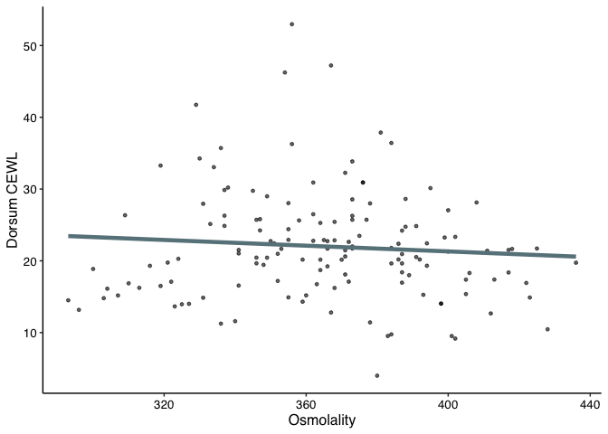<!-- -->

``` r
# glm
glm2_dorsum <- lm(dorsum_TEWL_g_m2h ~ osmolality_mmol_kg,
           data = all_data_wide)
summary(glm2_dorsum)
```

    ## 
    ## Call:
    ## lm(formula = dorsum_TEWL_g_m2h ~ osmolality_mmol_kg, data = all_data_wide)
    ## 
    ## Residuals:
    ##      Min       1Q   Median       3Q      Max 
    ## -17.7113  -5.0704  -0.6315   3.4397  30.7794 
    ## 
    ## Coefficients:
    ##                    Estimate Std. Error t value Pr(>|t|)    
    ## (Intercept)        29.29957    7.63485   3.838 0.000188 ***
    ## osmolality_mmol_kg -0.01997    0.02083  -0.959 0.339440    
    ## ---
    ## Signif. codes:  0 '***' 0.001 '**' 0.01 '*' 0.05 '.' 0.1 ' ' 1
    ## 
    ## Residual standard error: 7.633 on 139 degrees of freedom
    ##   (9 observations deleted due to missingness)
    ## Multiple R-squared:  0.006567,   Adjusted R-squared:  -0.0005799 
    ## F-statistic: 0.9189 on 1 and 139 DF,  p-value: 0.3394

### Ventrum CEWL \~ Osmolality

  - not sig barely (0.0536)

<!-- end list -->

``` r
all_data_wide %>% 
  ggplot(data = .) + 
  geom_point(aes(x = osmolality_mmol_kg,
                 y = ventrum_TEWL_g_m2h, 
                 ), 
             size = 1, 
             alpha = 0.6) + 
  stat_smooth(aes(x = osmolality_mmol_kg, 
                  y = ventrum_TEWL_g_m2h, 
                  ), 
              formula = y ~ x, 
              method = "lm", 
              se = F, 
              size = 1.6, 
              alpha = 1, 
              color = "seashell4") + 
  theme_classic() + 
  xlab("Osmolality") + 
  ylab("Ventrum CEWL") + 
  theme(text = element_text(color = "black", 
                            family = "sans", 
                            size = 12),
        axis.text = element_text(color = "black", 
                                 family = "sans", 
                                 size = 10),
        legend.text.align = 0)
```

    ## Warning: Removed 9 rows containing non-finite values (stat_smooth).

    ## Warning: Removed 9 rows containing missing values (geom_point).

<!-- -->

``` r
# glm
glm2_ventrum <- lm(ventrum_TEWL_g_m2h ~ osmolality_mmol_kg,
           data = all_data_wide)
summary(glm2_ventrum)
```

    ## 
    ## Call:
    ## lm(formula = ventrum_TEWL_g_m2h ~ osmolality_mmol_kg, data = all_data_wide)
    ## 
    ## Residuals:
    ##     Min      1Q  Median      3Q     Max 
    ## -25.434 -10.894  -0.781  10.491  36.790 
    ## 
    ## Coefficients:
    ##                    Estimate Std. Error t value Pr(>|t|)  
    ## (Intercept)         5.72152   13.29238   0.430   0.6675  
    ## osmolality_mmol_kg  0.07059    0.03627   1.946   0.0536 .
    ## ---
    ## Signif. codes:  0 '***' 0.001 '**' 0.01 '*' 0.05 '.' 0.1 ' ' 1
    ## 
    ## Residual standard error: 13.3 on 139 degrees of freedom
    ##   (9 observations deleted due to missingness)
    ## Multiple R-squared:  0.02653,    Adjusted R-squared:  0.01953 
    ## F-statistic: 3.788 on 1 and 139 DF,  p-value: 0.05363

### Dewlap CEWL \~ Osmolality

  - sig

<!-- end list -->

``` r
all_data_wide %>% 
  ggplot(data = .) + 
  geom_point(aes(x = osmolality_mmol_kg,
                 y = dewlap_TEWL_g_m2h, 
                 ), 
             size = 1, 
             alpha = 0.6) + 
  stat_smooth(aes(x = osmolality_mmol_kg, 
                  y = dewlap_TEWL_g_m2h, 
                  ), 
              formula = y ~ x, 
              method = "lm", 
              se = F, 
              size = 1.6, 
              alpha = 1, 
              color = "palegreen4") + 
  theme_classic() + 
  xlab("Osmolality") + 
  ylab("Dewlap CEWL") + 
  theme(text = element_text(color = "black", 
                            family = "sans", 
                            size = 12),
        axis.text = element_text(color = "black", 
                                 family = "sans", 
                                 size = 10),
        legend.text.align = 0)
```

    ## Warning: Removed 12 rows containing non-finite values (stat_smooth).

    ## Warning: Removed 12 rows containing missing values (geom_point).

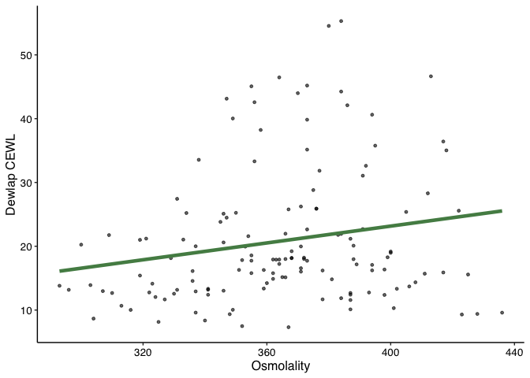<!-- -->

``` r
# glm
glm2_dewlap <- lm(dewlap_TEWL_g_m2h ~ osmolality_mmol_kg,
           data = all_data_wide)
summary(glm2_dewlap)
```

    ## 
    ## Call:
    ## lm(formula = dewlap_TEWL_g_m2h ~ osmolality_mmol_kg, data = all_data_wide)
    ## 
    ## Residuals:
    ##     Min      1Q  Median      3Q     Max 
    ## -15.944  -6.481  -2.916   4.315  33.198 
    ## 
    ## Coefficients:
    ##                    Estimate Std. Error t value Pr(>|t|)  
    ## (Intercept)        -3.23786   10.45796  -0.310   0.7573  
    ## osmolality_mmol_kg  0.06599    0.02858   2.309   0.0224 *
    ## ---
    ## Signif. codes:  0 '***' 0.001 '**' 0.01 '*' 0.05 '.' 0.1 ' ' 1
    ## 
    ## Residual standard error: 10.37 on 136 degrees of freedom
    ##   (12 observations deleted due to missingness)
    ## Multiple R-squared:  0.03773,    Adjusted R-squared:  0.03065 
    ## F-statistic: 5.332 on 1 and 136 DF,  p-value: 0.02244

### Mite Patch CEWL \~ Osmolality

  - not sig

<!-- end list -->

``` r
all_data_wide %>% 
  ggplot(data = .) + 
  geom_point(aes(x = osmolality_mmol_kg,
                 y = mitepatch_TEWL_g_m2h, 
                 ), 
             size = 1, 
             alpha = 0.6) + 
  stat_smooth(aes(x = osmolality_mmol_kg, 
                  y = mitepatch_TEWL_g_m2h, 
                  ), 
              formula = y ~ x, 
              method = "lm", 
              se = F, 
              size = 1.6, 
              alpha = 1, 
              color = "lightpink3") + 
  theme_classic() + 
  xlab("Osmolality") + 
  ylab("Mite Patch CEWL") + 
  theme(text = element_text(color = "black", 
                            family = "sans", 
                            size = 12),
        axis.text = element_text(color = "black", 
                                 family = "sans", 
                                 size = 10),
        legend.text.align = 0)
```

    ## Warning: Removed 14 rows containing non-finite values (stat_smooth).

    ## Warning: Removed 14 rows containing missing values (geom_point).

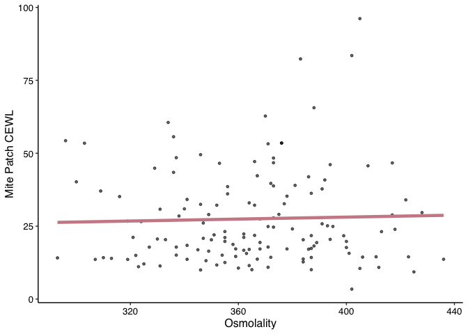<!-- -->

``` r
# glm
glm2_mitepatch <- lm(mitepatch_TEWL_g_m2h ~ osmolality_mmol_kg,
           data = all_data_wide)
summary(glm2_mitepatch)
```

    ## 
    ## Call:
    ## lm(formula = mitepatch_TEWL_g_m2h ~ osmolality_mmol_kg, data = all_data_wide)
    ## 
    ## Residuals:
    ##     Min      1Q  Median      3Q     Max 
    ## -24.723 -12.022  -5.659   8.525  67.976 
    ## 
    ## Coefficients:
    ##                    Estimate Std. Error t value Pr(>|t|)
    ## (Intercept)        21.37019   16.72738   1.278    0.204
    ## osmolality_mmol_kg  0.01682    0.04567   0.368    0.713
    ## 
    ## Residual standard error: 16.34 on 134 degrees of freedom
    ##   (14 observations deleted due to missingness)
    ## Multiple R-squared:  0.001012,   Adjusted R-squared:  -0.006444 
    ## F-statistic: 0.1357 on 1 and 134 DF,  p-value: 0.7132

### Head CEWL \~ Osmolality

  - not sig

<!-- end list -->

``` r
all_data_wide %>% 
  ggplot(data = .) + 
  geom_point(aes(x = osmolality_mmol_kg,
                 y = head_TEWL_g_m2h, 
                 ), 
             size = 1, 
             alpha = 0.6) + 
  stat_smooth(aes(x = osmolality_mmol_kg, 
                  y = head_TEWL_g_m2h, 
                  ), 
              formula = y ~ x, 
              method = "lm", 
              se = F, 
              size = 1.6, 
              alpha = 1, 
              color = "plum4") + 
  theme_classic() + 
  xlab("Osmolality") + 
  ylab("Head CEWL") + 
  theme(text = element_text(color = "black", 
                            family = "sans", 
                            size = 12),
        axis.text = element_text(color = "black", 
                                 family = "sans", 
                                 size = 10),
        legend.text.align = 0)
```

    ## Warning: Removed 9 rows containing non-finite values (stat_smooth).

    ## Warning: Removed 9 rows containing missing values (geom_point).

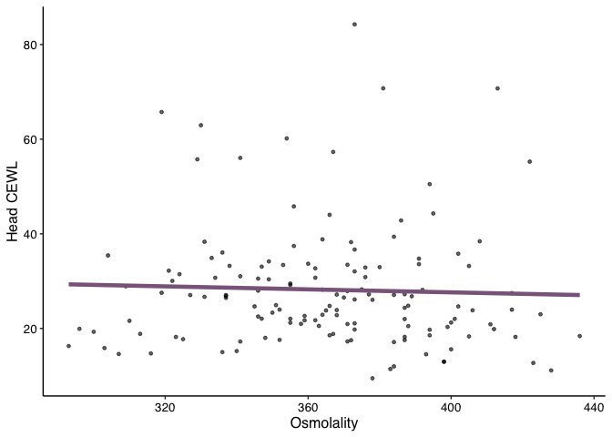<!-- -->

``` r
# glm
glm2_head <- lm(head_TEWL_g_m2h ~ osmolality_mmol_kg,
           data = all_data_wide)
summary(glm2_head)
```

    ## 
    ## Call:
    ## lm(formula = head_TEWL_g_m2h ~ osmolality_mmol_kg, data = all_data_wide)
    ## 
    ## Residuals:
    ##     Min      1Q  Median      3Q     Max 
    ## -18.506  -7.994  -2.164   4.622  56.205 
    ## 
    ## Coefficients:
    ##                    Estimate Std. Error t value Pr(>|t|)   
    ## (Intercept)        33.94781   12.80617   2.651  0.00896 **
    ## osmolality_mmol_kg -0.01580    0.03494  -0.452  0.65184   
    ## ---
    ## Signif. codes:  0 '***' 0.001 '**' 0.01 '*' 0.05 '.' 0.1 ' ' 1
    ## 
    ## Residual standard error: 12.82 on 139 degrees of freedom
    ##   (9 observations deleted due to missingness)
    ## Multiple R-squared:  0.001469,   Adjusted R-squared:  -0.005715 
    ## F-statistic: 0.2045 on 1 and 139 DF,  p-value: 0.6518

### CEWL \~ Hematocrit

``` r
all_data_long %>% 
  ggplot(data = .) + 
  geom_point(aes(x = hematocrit_percent,
                 y = TEWL_g_m2h, 
                 color = region
                 ), 
             size = 1, 
             alpha = 0.6) + 
  scale_colour_manual(values = c("palegreen4", "lightblue4", 
                                 "plum4", "lightpink3", "seashell4")) +
  stat_smooth(aes(x = hematocrit_percent, 
                  y = TEWL_g_m2h, 
                  color = region
                  ), 
              formula = y ~ x, 
              method = "lm", 
              se = F, 
              size = 1.6, 
              alpha = 1 ) + 
  theme_classic() + 
  xlab("Hematocrit") + 
  ylab("CEWL") + 
  theme(text = element_text(color = "black", 
                            family = "sans", 
                            size = 12),
        axis.text = element_text(color = "black", 
                                 family = "sans", 
                                 size = 10),
        legend.text.align = 0,
)
```

    ## Warning: Removed 119 rows containing non-finite values (stat_smooth).

    ## Warning: Removed 119 rows containing missing values (geom_point).

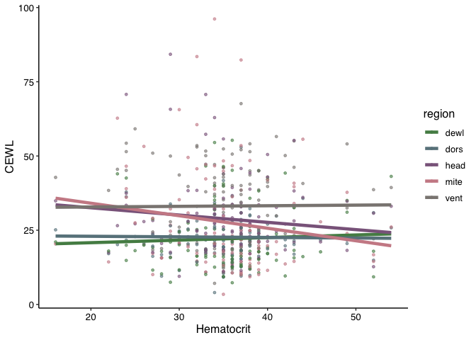<!-- -->

``` r
# glms
# CEWL ~ region + hct
glm3 <- lm(TEWL_g_m2h ~ region*hematocrit_percent,
           data = all_data_long)
summary(glm3)
```

    ## 
    ## Call:
    ## lm(formula = TEWL_g_m2h ~ region * hematocrit_percent, data = all_data_long)
    ## 
    ## Residuals:
    ##     Min      1Q  Median      3Q     Max 
    ## -26.008  -8.571  -2.315   5.850  67.969 
    ## 
    ## Coefficients:
    ##                               Estimate Std. Error t value Pr(>|t|)   
    ## (Intercept)                   19.06834    7.01937   2.717   0.0068 **
    ## regiondors                     4.28061    9.91924   0.432   0.6662   
    ## regionhead                    18.40315    9.91501   1.856   0.0640 . 
    ## regionmite                    23.45205    9.93815   2.360   0.0186 * 
    ## regionvent                    13.34360    9.91198   1.346   0.1788   
    ## hematocrit_percent             0.08656    0.19525   0.443   0.6577   
    ## regiondors:hematocrit_percent -0.10618    0.27618  -0.384   0.7008   
    ## regionhead:hematocrit_percent -0.33205    0.27582  -1.204   0.2291   
    ## regionmite:hematocrit_percent -0.50803    0.27697  -1.834   0.0671 . 
    ## regionvent:hematocrit_percent -0.06579    0.27587  -0.238   0.8116   
    ## ---
    ## Signif. codes:  0 '***' 0.001 '**' 0.01 '*' 0.05 '.' 0.1 ' ' 1
    ## 
    ## Residual standard error: 12.59 on 571 degrees of freedom
    ##   (119 observations deleted due to missingness)
    ## Multiple R-squared:  0.1064, Adjusted R-squared:  0.09229 
    ## F-statistic: 7.552 on 9 and 571 DF,  p-value: 1.721e-10

``` r
# dorsum CEWL ~ hct
glm3_dorsum <- lm(dorsum_TEWL_g_m2h ~ hematocrit_percent,
           data = all_data_wide)
summary(glm3_dorsum)
```

    ## 
    ## Call:
    ## lm(formula = dorsum_TEWL_g_m2h ~ hematocrit_percent, data = all_data_wide)
    ## 
    ## Residuals:
    ##      Min       1Q   Median       3Q      Max 
    ## -18.6766  -4.4543  -0.7546   3.2915  30.3464 
    ## 
    ## Coefficients:
    ##                    Estimate Std. Error t value Pr(>|t|)    
    ## (Intercept)        23.27730    4.20338   5.538 1.91e-07 ***
    ## hematocrit_percent -0.01767    0.11711  -0.151     0.88    
    ## ---
    ## Signif. codes:  0 '***' 0.001 '**' 0.01 '*' 0.05 '.' 0.1 ' ' 1
    ## 
    ## Residual standard error: 7.552 on 117 degrees of freedom
    ##   (31 observations deleted due to missingness)
    ## Multiple R-squared:  0.0001945,  Adjusted R-squared:  -0.008351 
    ## F-statistic: 0.02276 on 1 and 117 DF,  p-value: 0.8803

``` r
# ventrum CEWL ~ hct
glm3_ventrum <- lm(ventrum_TEWL_g_m2h ~ hematocrit_percent,
           data = all_data_wide)
summary(glm3_ventrum)
```

    ## 
    ## Call:
    ## lm(formula = ventrum_TEWL_g_m2h ~ hematocrit_percent, data = all_data_wide)
    ## 
    ## Residuals:
    ##     Min      1Q  Median      3Q     Max 
    ## -25.982 -11.894  -0.217  10.513  34.473 
    ## 
    ## Coefficients:
    ##                    Estimate Std. Error t value Pr(>|t|)    
    ## (Intercept)        32.24277    7.60047   4.242 4.45e-05 ***
    ## hematocrit_percent  0.02498    0.21159   0.118    0.906    
    ## ---
    ## Signif. codes:  0 '***' 0.001 '**' 0.01 '*' 0.05 '.' 0.1 ' ' 1
    ## 
    ## Residual standard error: 13.68 on 117 degrees of freedom
    ##   (31 observations deleted due to missingness)
    ## Multiple R-squared:  0.0001191,  Adjusted R-squared:  -0.008427 
    ## F-statistic: 0.01393 on 1 and 117 DF,  p-value: 0.9062

``` r
# dewlap CEWL ~ hct
glm3_dewlap <- lm(dewlap_TEWL_g_m2h ~ hematocrit_percent,
           data = all_data_wide)
summary(glm3_dewlap)
```

    ## 
    ## Call:
    ## lm(formula = dewlap_TEWL_g_m2h ~ hematocrit_percent, data = all_data_wide)
    ## 
    ## Residuals:
    ##     Min      1Q  Median      3Q     Max 
    ## -14.907  -7.179  -3.630   3.646  33.083 
    ## 
    ## Coefficients:
    ##                    Estimate Std. Error t value Pr(>|t|)   
    ## (Intercept)        19.05195    6.06369   3.142  0.00214 **
    ## hematocrit_percent  0.08791    0.16863   0.521  0.60317   
    ## ---
    ## Signif. codes:  0 '***' 0.001 '**' 0.01 '*' 0.05 '.' 0.1 ' ' 1
    ## 
    ## Residual standard error: 10.88 on 114 degrees of freedom
    ##   (34 observations deleted due to missingness)
    ## Multiple R-squared:  0.002378,   Adjusted R-squared:  -0.006373 
    ## F-statistic: 0.2718 on 1 and 114 DF,  p-value: 0.6032

``` r
# head CEWL ~ hct
glm3_head <- lm(head_TEWL_g_m2h ~ hematocrit_percent,
           data = all_data_wide)
summary(glm3_head)
```

    ## 
    ## Call:
    ## lm(formula = head_TEWL_g_m2h ~ hematocrit_percent, data = all_data_wide)
    ## 
    ## Residuals:
    ##     Min      1Q  Median      3Q     Max 
    ## -20.516  -8.164  -3.066   4.669  54.026 
    ## 
    ## Coefficients:
    ##                    Estimate Std. Error t value Pr(>|t|)    
    ## (Intercept)         37.4125     7.1334   5.245 7.05e-07 ***
    ## hematocrit_percent  -0.2475     0.1985  -1.247    0.215    
    ## ---
    ## Signif. codes:  0 '***' 0.001 '**' 0.01 '*' 0.05 '.' 0.1 ' ' 1
    ## 
    ## Residual standard error: 12.83 on 117 degrees of freedom
    ##   (31 observations deleted due to missingness)
    ## Multiple R-squared:  0.01312,    Adjusted R-squared:  0.004689 
    ## F-statistic: 1.556 on 1 and 117 DF,  p-value: 0.2148

``` r
# mitepatch CEWL ~ hct
glm3_mitepatch <- lm(mitepatch_TEWL_g_m2h ~ hematocrit_percent,
           data = all_data_wide)
summary(glm3_mitepatch)
```

    ## 
    ## Call:
    ## lm(formula = mitepatch_TEWL_g_m2h ~ hematocrit_percent, data = all_data_wide)
    ## 
    ## Residuals:
    ##     Min      1Q  Median      3Q     Max 
    ## -24.587 -11.589  -5.254   7.580  67.753 
    ## 
    ## Coefficients:
    ##                    Estimate Std. Error t value Pr(>|t|)    
    ## (Intercept)         42.3684     9.2759   4.568 1.27e-05 ***
    ## hematocrit_percent  -0.4106     0.2589  -1.586    0.116    
    ## ---
    ## Signif. codes:  0 '***' 0.001 '**' 0.01 '*' 0.05 '.' 0.1 ' ' 1
    ## 
    ## Residual standard error: 16.6 on 113 degrees of freedom
    ##   (35 observations deleted due to missingness)
    ## Multiple R-squared:  0.02177,    Adjusted R-squared:  0.01311 
    ## F-statistic: 2.515 on 1 and 113 DF,  p-value: 0.1156

``` r
# base visualization
visreg(glm3, "hematocrit_percent", by="region", overlay=T, band=F)
```

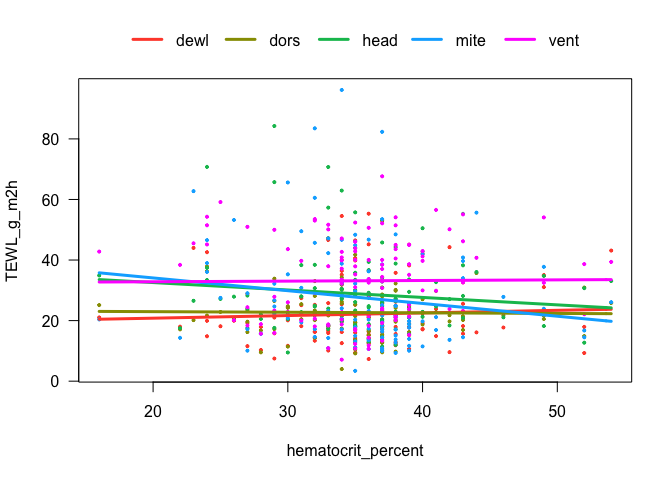<!-- -->

### CEWL \~ Cloacal Temperature

figure:

``` r
all_data_long %>% 
  ggplot(data = .) + 
  geom_point(aes(x = cloacal_temp_C,
                 y = TEWL_g_m2h, 
                 color = region
                 ), 
             size = 1, 
             alpha = 0.4) + 
  stat_smooth(aes(x = cloacal_temp_C, 
                  y = TEWL_g_m2h, 
                  color = region
                  ), 
              formula = y ~ x, 
              method = "lm", 
              se = F, 
              size = 1.6, 
              alpha = 1) + 
  theme_classic() + 
  xlab("Cloacal Temperature (°C)") + 
  ylab(bquote('CEWL (g / '*m^2~h*')')) + 
  #annotate("text", x = 1, y = 65, label = "a", size = 6) +
  scale_color_brewer(palette = "Set2",
                     labels = c("Dewlap", "Dorsum", "Head",
                              "Mite Patch", "Ventrum"),
                     name = "") +
  ylim(1, 100) +
  xlim(20, 28) +
  theme(text = element_text(color = "black", 
                            family = "sans", 
                            size = 18),
        axis.text = element_text(color = "black", 
                                 family = "sans", 
                                 size = 14),
        legend.text = element_text(color = "black", 
                                 family = "sans", 
                                 size = 12),
        legend.text.align = 0,
        legend.position = c(0.9, 0.85)
  #) +
  #guides(color = guide_legend(nrow = 2, byrow = TRUE)
         ) -> CEWL_ctemp_fig
CEWL_ctemp_fig
```

    ## Warning: Removed 10 rows containing non-finite values (stat_smooth).

    ## Warning: Removed 10 rows containing missing values (geom_point).

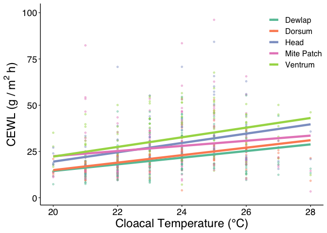<!-- -->

``` r
# export figure
#ggsave(filename = "CEWL_ctemp_fig.tiff",
 #      plot = CEWL_ctemp_fig,
  #     path = "./final_figures",
   #    device = "tiff",
    #   dpi = 1200,
     #  width = 6, height = 4)
```

stats:

``` r
# glms
# CEWL ~ region + ctemp
glm4 <- lm(TEWL_g_m2h ~ region*cloacal_temp_C,
           data = all_data_long)
summary(glm4)
```

    ## 
    ## Call:
    ## lm(formula = TEWL_g_m2h ~ region * cloacal_temp_C, data = all_data_long)
    ## 
    ## Residuals:
    ##     Min      1Q  Median      3Q     Max 
    ## -30.832  -7.448  -2.136   5.354  66.757 
    ## 
    ## Coefficients:
    ##                           Estimate Std. Error t value Pr(>|t|)    
    ## (Intercept)               -21.4495    12.6986  -1.689  0.09165 .  
    ## regiondors                 -3.9883    17.9063  -0.223  0.82381    
    ## regionhead                 -9.4029    17.8870  -0.526  0.59928    
    ## regionmite                 16.1282    18.1961   0.886  0.37574    
    ## regionvent                 -8.4109    17.9407  -0.469  0.63935    
    ## cloacal_temp_C              1.7960     0.5401   3.325  0.00093 ***
    ## regiondors:cloacal_temp_C   0.2227     0.7611   0.293  0.76996    
    ## regionhead:cloacal_temp_C   0.7232     0.7602   0.951  0.34180    
    ## regionmite:cloacal_temp_C  -0.4070     0.7739  -0.526  0.59917    
    ## regionvent:cloacal_temp_C   0.8095     0.7627   1.061  0.28889    
    ## ---
    ## Signif. codes:  0 '***' 0.001 '**' 0.01 '*' 0.05 '.' 0.1 ' ' 1
    ## 
    ## Residual standard error: 11.85 on 680 degrees of freedom
    ##   (10 observations deleted due to missingness)
    ## Multiple R-squared:  0.186,  Adjusted R-squared:  0.1752 
    ## F-statistic: 17.26 on 9 and 680 DF,  p-value: < 2.2e-16

``` r
# dorsum CEWL ~ ctemp
glm4_dorsum <- lm(dorsum_TEWL_g_m2h ~ cloacal_temp_C,
           data = all_data_wide)
summary(glm4_dorsum)
```

    ## 
    ## Call:
    ## lm(formula = dorsum_TEWL_g_m2h ~ cloacal_temp_C, data = all_data_wide)
    ## 
    ## Residuals:
    ##      Min       1Q   Median       3Q      Max 
    ## -21.9880  -3.4140  -0.7497   2.4422  27.8841 
    ## 
    ## Coefficients:
    ##                Estimate Std. Error t value Pr(>|t|)    
    ## (Intercept)    -25.5155     7.0689  -3.610 0.000427 ***
    ## cloacal_temp_C   2.0241     0.3005   6.735 3.99e-10 ***
    ## ---
    ## Signif. codes:  0 '***' 0.001 '**' 0.01 '*' 0.05 '.' 0.1 ' ' 1
    ## 
    ## Residual standard error: 6.685 on 139 degrees of freedom
    ##   (9 observations deleted due to missingness)
    ## Multiple R-squared:  0.246,  Adjusted R-squared:  0.2406 
    ## F-statistic: 45.36 on 1 and 139 DF,  p-value: 3.989e-10

``` r
# ventrum CEWL ~ ctemp
glm4_ventrum <- lm(ventrum_TEWL_g_m2h ~ cloacal_temp_C,
           data = all_data_wide)
summary(glm4_ventrum)
```

    ## 
    ## Call:
    ## lm(formula = ventrum_TEWL_g_m2h ~ cloacal_temp_C, data = all_data_wide)
    ## 
    ## Residuals:
    ##     Min      1Q  Median      3Q     Max 
    ## -31.102  -9.079  -1.419   8.440  32.230 
    ## 
    ## Coefficients:
    ##                Estimate Std. Error t value Pr(>|t|)    
    ## (Intercept)    -30.8521    13.4205  -2.299    0.023 *  
    ## cloacal_temp_C   2.6505     0.5707   4.644 7.84e-06 ***
    ## ---
    ## Signif. codes:  0 '***' 0.001 '**' 0.01 '*' 0.05 '.' 0.1 ' ' 1
    ## 
    ## Residual standard error: 12.64 on 139 degrees of freedom
    ##   (9 observations deleted due to missingness)
    ## Multiple R-squared:  0.1343, Adjusted R-squared:  0.1281 
    ## F-statistic: 21.57 on 1 and 139 DF,  p-value: 7.839e-06

``` r
# dewlap CEWL ~ ctemp
glm4_dewlap <- lm(dewlap_TEWL_g_m2h ~ cloacal_temp_C,
           data = all_data_wide)
summary(glm4_dewlap)
```

    ## 
    ## Call:
    ## lm(formula = dewlap_TEWL_g_m2h ~ cloacal_temp_C, data = all_data_wide)
    ## 
    ## Residuals:
    ##     Min      1Q  Median      3Q     Max 
    ## -15.675  -6.434  -3.068   3.767  32.846 
    ## 
    ## Coefficients:
    ##                Estimate Std. Error t value Pr(>|t|)    
    ## (Intercept)    -21.2782    10.8076  -1.969 0.051007 .  
    ## cloacal_temp_C   1.7905     0.4597   3.895 0.000153 ***
    ## ---
    ## Signif. codes:  0 '***' 0.001 '**' 0.01 '*' 0.05 '.' 0.1 ' ' 1
    ## 
    ## Residual standard error: 10.09 on 136 degrees of freedom
    ##   (12 observations deleted due to missingness)
    ## Multiple R-squared:  0.1003, Adjusted R-squared:  0.09373 
    ## F-statistic: 15.17 on 1 and 136 DF,  p-value: 0.0001534

``` r
# head CEWL ~ ctemp
glm4_head <- lm(head_TEWL_g_m2h ~ cloacal_temp_C,
           data = all_data_wide)
summary(glm4_head)
```

    ## 
    ## Call:
    ## lm(formula = head_TEWL_g_m2h ~ cloacal_temp_C, data = all_data_wide)
    ## 
    ## Residuals:
    ##     Min      1Q  Median      3Q     Max 
    ## -21.669  -7.155  -3.015   3.663  52.129 
    ## 
    ## Coefficients:
    ##                Estimate Std. Error t value Pr(>|t|)    
    ## (Intercept)    -31.9683    12.6232  -2.533   0.0124 *  
    ## cloacal_temp_C   2.5640     0.5365   4.779 4.43e-06 ***
    ## ---
    ## Signif. codes:  0 '***' 0.001 '**' 0.01 '*' 0.05 '.' 0.1 ' ' 1
    ## 
    ## Residual standard error: 11.96 on 139 degrees of freedom
    ##   (9 observations deleted due to missingness)
    ## Multiple R-squared:  0.1411, Adjusted R-squared:  0.1349 
    ## F-statistic: 22.84 on 1 and 139 DF,  p-value: 4.425e-06

``` r
# mitepatch CEWL ~ ctemp
glm4_mitepatch <- lm(mitepatch_TEWL_g_m2h ~ cloacal_temp_C,
           data = all_data_wide)
summary(glm4_mitepatch)
```

    ## 
    ## Call:
    ## lm(formula = mitepatch_TEWL_g_m2h ~ cloacal_temp_C, data = all_data_wide)
    ## 
    ## Residuals:
    ##     Min      1Q  Median      3Q     Max 
    ## -30.242 -11.114  -5.347   9.051  66.599 
    ## 
    ## Coefficients:
    ##                Estimate Std. Error t value Pr(>|t|)  
    ## (Intercept)     -4.5267    17.7554  -0.255   0.7992  
    ## cloacal_temp_C   1.3635     0.7554   1.805   0.0733 .
    ## ---
    ## Signif. codes:  0 '***' 0.001 '**' 0.01 '*' 0.05 '.' 0.1 ' ' 1
    ## 
    ## Residual standard error: 16.16 on 134 degrees of freedom
    ##   (14 observations deleted due to missingness)
    ## Multiple R-squared:  0.02374,    Adjusted R-squared:  0.01645 
    ## F-statistic: 3.258 on 1 and 134 DF,  p-value: 0.07331

``` r
# base visualization
visreg(glm4, "cloacal_temp_C", by="region", overlay=T, band=F)
```

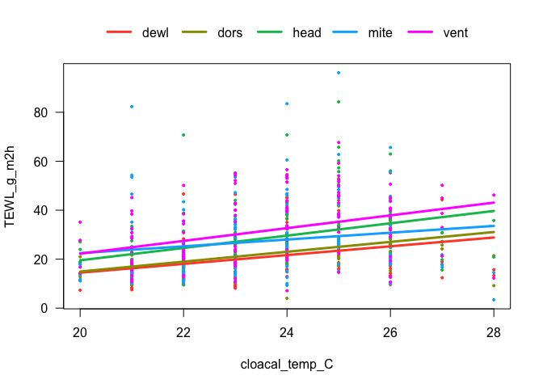<!-- -->

### CEWL \~ Capture Temperature

``` r
all_data_long %>% 
  ggplot(data = .) + 
  geom_point(aes(x = temp_C_interpol,
                 y = TEWL_g_m2h, 
                 color = region
                 ), 
             size = 1, 
             alpha = 0.6) + 
  scale_colour_manual(values = c("palegreen4", "lightblue4", 
                                 "plum4", "lightpink3", "seashell4")) +
  stat_smooth(aes(x = temp_C_interpol, 
                  y = TEWL_g_m2h, 
                  color = region
                  ), 
              formula = y ~ x, 
              method = "lm", 
              se = F, 
              size = 1.6, 
              alpha = 1 ) + 
  theme_classic() + 
  xlab("Ambient Temperature at Capture") + 
  ylab("CEWL") + 
  theme(text = element_text(color = "black", 
                            family = "sans", 
                            size = 12),
        axis.text = element_text(color = "black", 
                                 family = "sans", 
                                 size = 10),
        legend.text.align = 0,
)
```

    ## Warning: Removed 15 rows containing non-finite values (stat_smooth).

    ## Warning: Removed 15 rows containing missing values (geom_point).

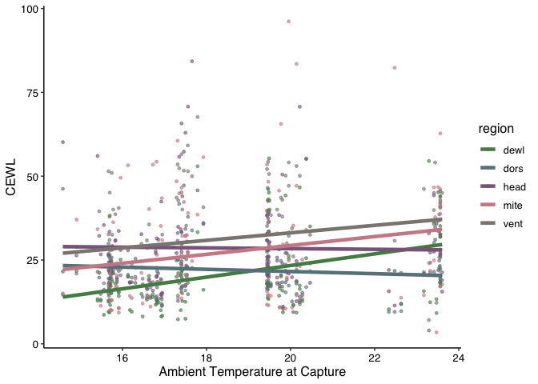<!-- -->

``` r
# glms
# CEWL ~ region + capture temp
glm7 <- lm(TEWL_g_m2h ~ region*temp_C_interpol,
           data = all_data_long)
summary(glm7)
```

    ## 
    ## Call:
    ## lm(formula = TEWL_g_m2h ~ region * temp_C_interpol, data = all_data_long)
    ## 
    ## Residuals:
    ##     Min      1Q  Median      3Q     Max 
    ## -30.526  -8.184  -1.983   5.607  66.876 
    ## 
    ## Coefficients:
    ##                            Estimate Std. Error t value Pr(>|t|)    
    ## (Intercept)                -11.3696     7.5326  -1.509 0.131667    
    ## regiondors                  39.4750    10.5910   3.727 0.000210 ***
    ## regionhead                  41.9074    10.6481   3.936 9.16e-05 ***
    ## regionmite                  14.2300    10.6313   1.338 0.181187    
    ## regionvent                  22.0696    10.6489   2.072 0.038600 *  
    ## temp_C_interpol              1.7365     0.4024   4.316 1.83e-05 ***
    ## regiondors:temp_C_interpol  -2.0634     0.5651  -3.652 0.000281 ***
    ## regionhead:temp_C_interpol  -1.8434     0.5685  -3.243 0.001243 ** 
    ## regionmite:temp_C_interpol  -0.4125     0.5673  -0.727 0.467415    
    ## regionvent:temp_C_interpol  -0.6165     0.5686  -1.084 0.278668    
    ## ---
    ## Signif. codes:  0 '***' 0.001 '**' 0.01 '*' 0.05 '.' 0.1 ' ' 1
    ## 
    ## Residual standard error: 12.14 on 675 degrees of freedom
    ##   (15 observations deleted due to missingness)
    ## Multiple R-squared:  0.1443, Adjusted R-squared:  0.1328 
    ## F-statistic: 12.64 on 9 and 675 DF,  p-value: < 2.2e-16

``` r
# dorsum CEWL ~ capture temp
glm7_dorsum <- lm(dorsum_TEWL_g_m2h ~ temp_C_interpol,
           data = all_data_wide)
summary(glm7_dorsum)
```

    ## 
    ## Call:
    ## lm(formula = dorsum_TEWL_g_m2h ~ temp_C_interpol, data = all_data_wide)
    ## 
    ## Residuals:
    ##      Min       1Q   Median       3Q      Max 
    ## -16.4844  -5.0589  -0.3763   3.4984  30.6613 
    ## 
    ## Coefficients:
    ##                 Estimate Std. Error t value Pr(>|t|)    
    ## (Intercept)      28.2040     4.6757   6.032 1.41e-08 ***
    ## temp_C_interpol  -0.3315     0.2489  -1.331    0.185    
    ## ---
    ## Signif. codes:  0 '***' 0.001 '**' 0.01 '*' 0.05 '.' 0.1 ' ' 1
    ## 
    ## Residual standard error: 7.632 on 138 degrees of freedom
    ##   (10 observations deleted due to missingness)
    ## Multiple R-squared:  0.01268,    Adjusted R-squared:  0.005529 
    ## F-statistic: 1.773 on 1 and 138 DF,  p-value: 0.1852

``` r
# ventrum CEWL ~ capture temp
glm7_ventrum <- lm(ventrum_TEWL_g_m2h ~ temp_C_interpol,
           data = all_data_wide)
summary(glm7_ventrum)
```

    ## 
    ## Call:
    ## lm(formula = ventrum_TEWL_g_m2h ~ temp_C_interpol, data = all_data_wide)
    ## 
    ## Residuals:
    ##     Min      1Q  Median      3Q     Max 
    ## -29.568 -10.111  -0.867   9.860  37.016 
    ## 
    ## Coefficients:
    ##                 Estimate Std. Error t value Pr(>|t|)  
    ## (Intercept)       11.059      8.214   1.346   0.1804  
    ## temp_C_interpol    1.100      0.438   2.511   0.0132 *
    ## ---
    ## Signif. codes:  0 '***' 0.001 '**' 0.01 '*' 0.05 '.' 0.1 ' ' 1
    ## 
    ## Residual standard error: 13.26 on 138 degrees of freedom
    ##   (10 observations deleted due to missingness)
    ## Multiple R-squared:  0.0437, Adjusted R-squared:  0.03677 
    ## F-statistic: 6.307 on 1 and 138 DF,  p-value: 0.01318

``` r
# dewlap CEWL ~ capture temp
glm7_dewlap <- lm(dewlap_TEWL_g_m2h ~ temp_C_interpol,
           data = all_data_wide)
summary(glm7_dewlap)
```

    ## 
    ## Call:
    ## lm(formula = dewlap_TEWL_g_m2h ~ temp_C_interpol, data = all_data_wide)
    ## 
    ## Residuals:
    ##     Min      1Q  Median      3Q     Max 
    ## -17.158  -6.148  -2.073   4.850  32.799 
    ## 
    ## Coefficients:
    ##                 Estimate Std. Error t value Pr(>|t|)    
    ## (Intercept)     -11.4077     5.9526  -1.916   0.0574 .  
    ## temp_C_interpol   1.7400     0.3179   5.474 2.08e-07 ***
    ## ---
    ## Signif. codes:  0 '***' 0.001 '**' 0.01 '*' 0.05 '.' 0.1 ' ' 1
    ## 
    ## Residual standard error: 9.595 on 135 degrees of freedom
    ##   (13 observations deleted due to missingness)
    ## Multiple R-squared:  0.1816, Adjusted R-squared:  0.1756 
    ## F-statistic: 29.96 on 1 and 135 DF,  p-value: 2.078e-07

``` r
# head CEWL ~ capture temp
glm7_head <- lm(head_TEWL_g_m2h ~ temp_C_interpol,
           data = all_data_wide)
summary(glm7_head)
```

    ## 
    ## Call:
    ## lm(formula = head_TEWL_g_m2h ~ temp_C_interpol, data = all_data_wide)
    ## 
    ## Residuals:
    ##     Min      1Q  Median      3Q     Max 
    ## -18.773  -7.992  -2.239   4.756  55.693 
    ## 
    ## Coefficients:
    ##                 Estimate Std. Error t value Pr(>|t|)    
    ## (Intercept)      30.9403     7.9585   3.888 0.000157 ***
    ## temp_C_interpol  -0.1344     0.4244  -0.317 0.751904    
    ## ---
    ## Signif. codes:  0 '***' 0.001 '**' 0.01 '*' 0.05 '.' 0.1 ' ' 1
    ## 
    ## Residual standard error: 12.85 on 138 degrees of freedom
    ##   (10 observations deleted due to missingness)
    ## Multiple R-squared:  0.0007266,  Adjusted R-squared:  -0.006515 
    ## F-statistic: 0.1003 on 1 and 138 DF,  p-value: 0.7519

``` r
# mitepatch CEWL ~ capture temp
glm7_mitepatch <- lm(mitepatch_TEWL_g_m2h ~ temp_C_interpol,
           data = all_data_wide)
summary(glm7_mitepatch)
```

    ## 
    ## Call:
    ## lm(formula = mitepatch_TEWL_g_m2h ~ temp_C_interpol, data = all_data_wide)
    ## 
    ## Residuals:
    ##     Min      1Q  Median      3Q     Max 
    ## -30.824 -11.094  -5.025   6.859  66.660 
    ## 
    ## Coefficients:
    ##                 Estimate Std. Error t value Pr(>|t|)  
    ## (Intercept)        2.615      9.852   0.265   0.7911  
    ## temp_C_interpol    1.347      0.525   2.566   0.0114 *
    ## ---
    ## Signif. codes:  0 '***' 0.001 '**' 0.01 '*' 0.05 '.' 0.1 ' ' 1
    ## 
    ## Residual standard error: 15.95 on 133 degrees of freedom
    ##   (15 observations deleted due to missingness)
    ## Multiple R-squared:  0.04718,    Adjusted R-squared:  0.04001 
    ## F-statistic: 6.585 on 1 and 133 DF,  p-value: 0.01139

### CEWL \~ Capture Humidity

  - sig

<!-- end list -->

``` r
all_data_long %>% 
  ggplot(data = .) + 
  geom_point(aes(x = RH_percent_interpol,
                 y = TEWL_g_m2h, 
                 color = region
                 ), 
             size = 1, 
             alpha = 0.6) + 
  scale_colour_manual(values = c("palegreen4", "lightblue4", 
                                 "plum4", "lightpink3", "seashell4")) +
  stat_smooth(aes(x = RH_percent_interpol, 
                  y = TEWL_g_m2h, 
                  color = region
                  ), 
              formula = y ~ x, 
              method = "lm", 
              se = F, 
              size = 1.6, 
              alpha = 1 ) + 
  theme_classic() + 
  xlab("Ambient Relative Humidity at Capture") + 
  ylab("CEWL") + 
  theme(text = element_text(color = "black", 
                            family = "sans", 
                            size = 12),
        axis.text = element_text(color = "black", 
                                 family = "sans", 
                                 size = 10),
        legend.text.align = 0,
)
```

    ## Warning: Removed 15 rows containing non-finite values (stat_smooth).

    ## Warning: Removed 15 rows containing missing values (geom_point).

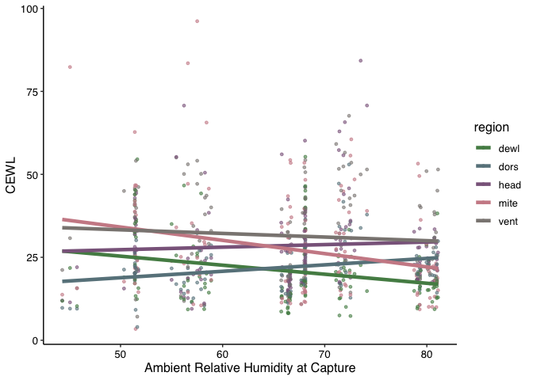<!-- -->

``` r
# glms
# CEWL ~ region + capture RH
glm8 <- lm(TEWL_g_m2h ~ region*RH_percent_interpol,
           data = all_data_long)
summary(glm8)
```

    ## 
    ## Call:
    ## lm(formula = TEWL_g_m2h ~ region * RH_percent_interpol, data = all_data_long)
    ## 
    ## Residuals:
    ##     Min      1Q  Median      3Q     Max 
    ## -30.113  -8.277  -2.026   6.019  65.051 
    ## 
    ## Coefficients:
    ##                                Estimate Std. Error t value Pr(>|t|)    
    ## (Intercept)                     38.9460     7.1846   5.421 8.27e-08 ***
    ## regiondors                     -29.8079    10.0948  -2.953  0.00326 ** 
    ## regionhead                     -15.4886    10.1277  -1.529  0.12665    
    ## regionmite                      15.1915    10.1555   1.496  0.13515    
    ## regionvent                      -0.1998    10.1277  -0.020  0.98426    
    ## RH_percent_interpol             -0.2721     0.1067  -2.549  0.01101 *  
    ## regiondors:RH_percent_interpol   0.4662     0.1501   3.105  0.00198 ** 
    ## regionhead:RH_percent_interpol   0.3488     0.1506   2.316  0.02085 *  
    ## regionmite:RH_percent_interpol  -0.1283     0.1508  -0.851  0.39512    
    ## regionvent:RH_percent_interpol   0.1629     0.1506   1.082  0.27980    
    ## ---
    ## Signif. codes:  0 '***' 0.001 '**' 0.01 '*' 0.05 '.' 0.1 ' ' 1
    ## 
    ## Residual standard error: 12.25 on 675 degrees of freedom
    ##   (15 observations deleted due to missingness)
    ## Multiple R-squared:  0.1289, Adjusted R-squared:  0.1173 
    ## F-statistic:  11.1 on 9 and 675 DF,  p-value: 2.99e-16

``` r
# dorsum CEWL ~ capture RH
glm8_dorsum <- lm(dorsum_TEWL_g_m2h ~ RH_percent_interpol,
           data = all_data_wide)
summary(glm8_dorsum)
```

    ## 
    ## Call:
    ## lm(formula = dorsum_TEWL_g_m2h ~ RH_percent_interpol, data = all_data_wide)
    ## 
    ## Residuals:
    ##     Min      1Q  Median      3Q     Max 
    ## -15.099  -5.229  -1.330   4.208  29.731 
    ## 
    ## Coefficients:
    ##                     Estimate Std. Error t value Pr(>|t|)   
    ## (Intercept)          8.78911    4.27551   2.056  0.04170 * 
    ## RH_percent_interpol  0.19964    0.06373   3.133  0.00212 **
    ## ---
    ## Signif. codes:  0 '***' 0.001 '**' 0.01 '*' 0.05 '.' 0.1 ' ' 1
    ## 
    ## Residual standard error: 7.421 on 138 degrees of freedom
    ##   (10 observations deleted due to missingness)
    ## Multiple R-squared:  0.06639,    Adjusted R-squared:  0.05963 
    ## F-statistic: 9.814 on 1 and 138 DF,  p-value: 0.002116

``` r
# ventrum CEWL ~ capture RH
glm8_ventrum <- lm(ventrum_TEWL_g_m2h ~ RH_percent_interpol,
           data = all_data_wide)
summary(glm8_ventrum)
```

    ## 
    ## Call:
    ## lm(formula = ventrum_TEWL_g_m2h ~ RH_percent_interpol, data = all_data_wide)
    ## 
    ## Residuals:
    ##     Min      1Q  Median      3Q     Max 
    ## -25.726 -11.336  -0.575  10.324  36.690 
    ## 
    ## Coefficients:
    ##                     Estimate Std. Error t value Pr(>|t|)    
    ## (Intercept)         37.53195    7.84651   4.783 4.37e-06 ***
    ## RH_percent_interpol -0.09094    0.11689  -0.778    0.438    
    ## ---
    ## Signif. codes:  0 '***' 0.001 '**' 0.01 '*' 0.05 '.' 0.1 ' ' 1
    ## 
    ## Residual standard error: 13.53 on 138 degrees of freedom
    ##   (10 observations deleted due to missingness)
    ## Multiple R-squared:  0.004367,   Adjusted R-squared:  -0.002848 
    ## F-statistic: 0.6053 on 1 and 138 DF,  p-value: 0.4379

``` r
# dewlap CEWL ~ capture RH
glm8_dewlap <- lm(dewlap_TEWL_g_m2h ~ RH_percent_interpol,
           data = all_data_wide)
summary(glm8_dewlap)
```

    ## 
    ## Call:
    ## lm(formula = dewlap_TEWL_g_m2h ~ RH_percent_interpol, data = all_data_wide)
    ## 
    ## Residuals:
    ##     Min      1Q  Median      3Q     Max 
    ## -16.229  -7.087  -2.527   4.788  34.843 
    ## 
    ## Coefficients:
    ##                     Estimate Std. Error t value Pr(>|t|)    
    ## (Intercept)         38.94708    6.01947   6.470 1.66e-09 ***
    ## RH_percent_interpol -0.27152    0.08942  -3.037  0.00287 ** 
    ## ---
    ## Signif. codes:  0 '***' 0.001 '**' 0.01 '*' 0.05 '.' 0.1 ' ' 1
    ## 
    ## Residual standard error: 10.26 on 135 degrees of freedom
    ##   (13 observations deleted due to missingness)
    ## Multiple R-squared:  0.06393,    Adjusted R-squared:  0.057 
    ## F-statistic: 9.221 on 1 and 135 DF,  p-value: 0.002873

``` r
# head CEWL ~ capture RH
glm8_head <- lm(head_TEWL_g_m2h ~ RH_percent_interpol,
           data = all_data_wide)
summary(glm8_head)
```

    ## 
    ## Call:
    ## lm(formula = head_TEWL_g_m2h ~ RH_percent_interpol, data = all_data_wide)
    ## 
    ## Residuals:
    ##     Min      1Q  Median      3Q     Max 
    ## -18.144  -8.159  -2.506   4.479  55.192 
    ## 
    ## Coefficients:
    ##                     Estimate Std. Error t value Pr(>|t|)   
    ## (Intercept)         22.60429    7.43671   3.040  0.00284 **
    ## RH_percent_interpol  0.08792    0.11078   0.794  0.42879   
    ## ---
    ## Signif. codes:  0 '***' 0.001 '**' 0.01 '*' 0.05 '.' 0.1 ' ' 1
    ## 
    ## Residual standard error: 12.82 on 138 degrees of freedom
    ##   (10 observations deleted due to missingness)
    ## Multiple R-squared:  0.004543,   Adjusted R-squared:  -0.00267 
    ## F-statistic: 0.6298 on 1 and 138 DF,  p-value: 0.4288

``` r
# mitepatch CEWL ~ capture RH
glm8_mitepatch <- lm(mitepatch_TEWL_g_m2h ~ RH_percent_interpol,
           data = all_data_wide)
summary(glm8_mitepatch)
```

    ## 
    ## Call:
    ## lm(formula = mitepatch_TEWL_g_m2h ~ RH_percent_interpol, data = all_data_wide)
    ## 
    ## Residuals:
    ##     Min      1Q  Median      3Q     Max 
    ## -30.268 -11.552  -4.574   6.910  64.879 
    ## 
    ## Coefficients:
    ##                     Estimate Std. Error t value Pr(>|t|)    
    ## (Intercept)          54.1508     9.2860   5.831 3.96e-08 ***
    ## RH_percent_interpol  -0.3977     0.1378  -2.885  0.00457 ** 
    ## ---
    ## Signif. codes:  0 '***' 0.001 '**' 0.01 '*' 0.05 '.' 0.1 ' ' 1
    ## 
    ## Residual standard error: 15.85 on 133 degrees of freedom
    ##   (15 observations deleted due to missingness)
    ## Multiple R-squared:  0.05889,    Adjusted R-squared:  0.05182 
    ## F-statistic: 8.323 on 1 and 133 DF,  p-value: 0.004568

### CEWL \~ Abs Humidity

``` r
all_data_long %>% 
  ggplot(data = .) + 
  geom_jitter(aes(x = abs_humidity_g_m3_interpol,
                 y = TEWL_g_m2h, 
                 color = region
                 ), 
             size = 1, 
             alpha = 0.4) + 
  stat_smooth(aes(x = abs_humidity_g_m3_interpol, 
                  y = TEWL_g_m2h, 
                  color = region
                  ), 
              formula = y ~ x, 
              method = "lm", 
              se = F, 
              size = 1.6, 
              alpha = 1 ) + 
  theme_classic() + 
  xlab('Absolute Humidity at Capture (g / '*m^3~')') + 
  ylab(bquote('CEWL (g / '*m^2~h*')')) + 
  #annotate("text", x = 1, y = 65, label = "a", size = 6) +
  scale_color_brewer(palette = "Set2",
                     labels = c("Dewlap", "Dorsum",
                              "Head", "Mite Patch", "Ventrum"),
                     name = "") +
  ylim(1, 100) +
  xlim(8, 12) +
  theme(text = element_text(color = "black", 
                            family = "sans", 
                            size = 18),
        axis.text = element_text(color = "black", 
                                 family = "sans", 
                                 size = 14),
        legend.text = element_text(color = "black", 
                                 family = "sans", 
                                 size = 12),
        legend.text.align = 0,
        legend.position = c(0.15, 0.85)
         ) -> CEWL_abshum_fig
CEWL_abshum_fig
```

    ## Warning: Removed 15 rows containing non-finite values (stat_smooth).

    ## Warning: Removed 15 rows containing missing values (geom_point).

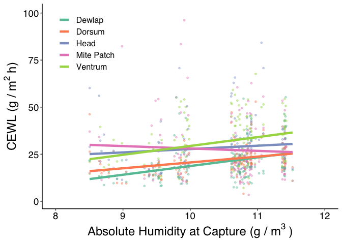<!-- -->

``` r
# export figure
#ggsave(filename = "CEWL_abshum_fig.tiff",
 #      plot = CEWL_abshum_fig,
  #     path = "./final_figures",
   #    device = "tiff",
    #   dpi = 1200,
     #  width = 6, height = 4)
```

### CEWL \~ Measurement Temperature

``` r
all_data_long %>% 
  ggplot(data = .) + 
  geom_point(aes(x = ambient_temp_C,
                 y = TEWL_g_m2h, 
                 color = region
                 ), 
             size = 1, 
             alpha = 0.6) + 
  scale_colour_manual(values = c("palegreen4", "lightblue4", 
                                 "plum4", "lightpink3", "seashell4")) +
  stat_smooth(aes(x = ambient_temp_C, 
                  y = TEWL_g_m2h, 
                  color = region
                  ), 
              formula = y ~ x, 
              method = "lm", 
              se = F, 
              size = 1.6, 
              alpha = 1 ) + 
  theme_classic() + 
  xlab("Ambient Temperature During Measurement") + 
  ylab("CEWL") + 
  theme(text = element_text(color = "black", 
                            family = "sans", 
                            size = 12),
        axis.text = element_text(color = "black", 
                                 family = "sans", 
                                 size = 10),
        legend.text.align = 0,
)
```

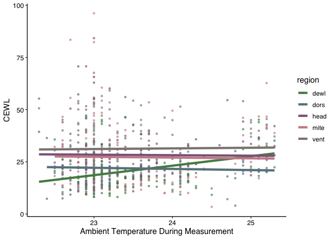<!-- -->

``` r
# glm
# CEWL ~ region + aquaflux measurement temp
glm9 <- lm(TEWL_g_m2h ~ region*ambient_temp_C,
           data = all_data_long)
summary(glm9)
```

    ## 
    ## Call:
    ## lm(formula = TEWL_g_m2h ~ region * ambient_temp_C, data = all_data_long)
    ## 
    ## Residuals:
    ##     Min      1Q  Median      3Q     Max 
    ## -24.542  -8.443  -2.221   5.704  68.764 
    ## 
    ## Coefficients:
    ##                           Estimate Std. Error t value Pr(>|t|)   
    ## (Intercept)                -85.690     35.606  -2.407  0.01636 * 
    ## regiondors                 120.409     49.873   2.414  0.01602 * 
    ## regionhead                 119.559     49.793   2.401  0.01661 * 
    ## regionmite                 121.357     49.702   2.442  0.01487 * 
    ## regionvent                 109.812     49.618   2.213  0.02722 * 
    ## ambient_temp_C               4.535      1.518   2.988  0.00291 **
    ## regiondors:ambient_temp_C   -5.082      2.127  -2.389  0.01714 * 
    ## regionhead:ambient_temp_C   -4.772      2.124  -2.247  0.02496 * 
    ## regionmite:ambient_temp_C   -4.894      2.118  -2.311  0.02111 * 
    ## regionvent:ambient_temp_C   -4.230      2.116  -1.999  0.04600 * 
    ## ---
    ## Signif. codes:  0 '***' 0.001 '**' 0.01 '*' 0.05 '.' 0.1 ' ' 1
    ## 
    ## Residual standard error: 12.35 on 690 degrees of freedom
    ## Multiple R-squared:  0.1071, Adjusted R-squared:  0.09543 
    ## F-statistic: 9.193 on 9 and 690 DF,  p-value: 3.156e-13

### CEWL \~ Measurement Humidity

  - Very interesting relationship\! Mite patch CEWL decreases as ambient
    humidity increases, but every other location appears to increase.

<!-- end list -->

``` r
all_data_long %>% 
  ggplot(data = .) + 
  geom_point(aes(x = ambient_RH_percent,
                 y = TEWL_g_m2h, 
                 color = region
                 ), 
             size = 1, 
             alpha = 0.6) + 
  scale_colour_manual(values = c("palegreen4", "lightblue4", 
                                 "plum4", "lightpink3", "seashell4")) +
  stat_smooth(aes(x = ambient_RH_percent, 
                  y = TEWL_g_m2h, 
                  color = region
                  ), 
              formula = y ~ x, 
              method = "lm", 
              se = F, 
              size = 1.6, 
              alpha = 1 ) + 
  theme_classic() + 
  xlab("Ambient Relative Humidity During Measurement") + 
  ylab("CEWL") + 
  theme(text = element_text(color = "black", 
                            family = "sans", 
                            size = 12),
        axis.text = element_text(color = "black", 
                                 family = "sans", 
                                 size = 10),
        legend.text.align = 0,
)
```

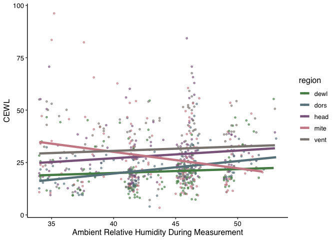<!-- -->

``` r
# glm
# CEWL ~ region + aquaflux measurement RH
glm9 <- lm(TEWL_g_m2h ~ region*ambient_RH_percent,
           data = all_data_long)
summary(glm9)
```

    ## 
    ## Call:
    ## lm(formula = TEWL_g_m2h ~ region * ambient_RH_percent, data = all_data_long)
    ## 
    ## Residuals:
    ##     Min      1Q  Median      3Q     Max 
    ## -24.032  -8.246  -2.406   6.024  62.330 
    ## 
    ## Coefficients:
    ##                                Estimate Std. Error t value Pr(>|t|)    
    ## (Intercept)                    12.55817   10.16068   1.236 0.216895    
    ## regiondors                    -16.53785   14.23939  -1.161 0.245875    
    ## regionhead                     -0.11549   14.18339  -0.008 0.993505    
    ## regionmite                     48.83842   14.52470   3.362 0.000815 ***
    ## regionvent                      9.73228   14.18940   0.686 0.493017    
    ## ambient_RH_percent              0.18577    0.23210   0.800 0.423773    
    ## regiondors:ambient_RH_percent   0.40736    0.32492   1.254 0.210375    
    ## regionhead:ambient_RH_percent   0.17906    0.32408   0.553 0.580766    
    ## regionmite:ambient_RH_percent  -0.96891    0.33149  -2.923 0.003581 ** 
    ## regionvent:ambient_RH_percent   0.02057    0.32432   0.063 0.949446    
    ## ---
    ## Signif. codes:  0 '***' 0.001 '**' 0.01 '*' 0.05 '.' 0.1 ' ' 1
    ## 
    ## Residual standard error: 12.24 on 690 degrees of freedom
    ## Multiple R-squared:  0.1229, Adjusted R-squared:  0.1115 
    ## F-statistic: 10.75 on 9 and 690 DF,  p-value: 1.047e-15

### CEWL \~ Wind Speed

``` r
all_data_long %>% 
  ggplot(data = .) + 
  geom_point(aes(x = Wind_mph_interpol,
                 y = TEWL_g_m2h, 
                 color = region
                 ), 
             size = 1, 
             alpha = 0.6) + 
  scale_colour_manual(values = c("palegreen4", "lightblue4", 
                                 "plum4", "lightpink3", "seashell4")) +
  stat_smooth(aes(x = Wind_mph_interpol, 
                  y = TEWL_g_m2h, 
                  color = region
                  ), 
              formula = y ~ x, 
              method = "lm", 
              se = F, 
              size = 1.6, 
              alpha = 1 ) + 
  theme_classic() + 
  xlab("Average Windspeed During Measurement") + 
  ylab("CEWL") + 
  theme(text = element_text(color = "black", 
                            family = "sans", 
                            size = 12),
        axis.text = element_text(color = "black", 
                                 family = "sans", 
                                 size = 10),
        legend.text.align = 0,
)
```

    ## Warning: Removed 15 rows containing non-finite values (stat_smooth).

    ## Warning: Removed 15 rows containing missing values (geom_point).

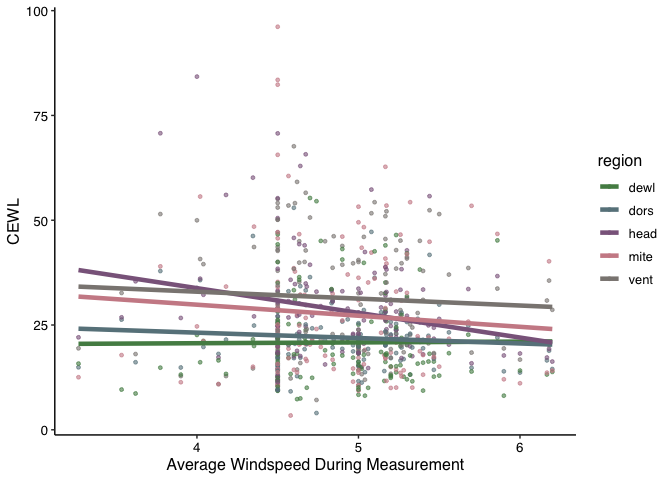<!-- -->

``` r
# glm
# CEWL ~ region + aquaflux measurement RH
glm10 <- lm(TEWL_g_m2h ~ region*Wind_mph_interpol,
           data = all_data_long)
summary(glm10)
```

    ## 
    ## Call:
    ## lm(formula = TEWL_g_m2h ~ region * Wind_mph_interpol, data = all_data_long)
    ## 
    ## Residuals:
    ##     Min      1Q  Median      3Q     Max 
    ## -24.906  -8.304  -2.305   5.826  67.633 
    ## 
    ## Coefficients:
    ##                              Estimate Std. Error t value Pr(>|t|)  
    ## (Intercept)                   19.8780    10.4987   1.893   0.0587 .
    ## regiondors                     8.4493    14.8113   0.570   0.5686  
    ## regionhead                    37.4807    14.7996   2.533   0.0115 *
    ## regionmite                    20.5102    15.0796   1.360   0.1742  
    ## regionvent                    19.6731    14.8055   1.329   0.1844  
    ## Wind_mph_interpol              0.1939     2.1350   0.091   0.9277  
    ## regiondors:Wind_mph_interpol  -1.4821     3.0136  -0.492   0.6230  
    ## regionhead:Wind_mph_interpol  -6.0860     3.0107  -2.021   0.0436 *
    ## regionmite:Wind_mph_interpol  -2.8298     3.0627  -0.924   0.3558  
    ## regionvent:Wind_mph_interpol  -1.8444     3.0125  -0.612   0.5406  
    ## ---
    ## Signif. codes:  0 '***' 0.001 '**' 0.01 '*' 0.05 '.' 0.1 ' ' 1
    ## 
    ## Residual standard error: 12.39 on 675 degrees of freedom
    ##   (15 observations deleted due to missingness)
    ## Multiple R-squared:  0.1093, Adjusted R-squared:  0.09742 
    ## F-statistic: 9.203 on 9 and 675 DF,  p-value: 3.169e-13

### CEWL \~ Solar Rad

  - Definitely could have an effect may be worth testing in the model

<!-- end list -->

``` r
all_data_long %>% 
  ggplot(data = .) + 
  geom_point(aes(x = Solar_rad_Wm2_interpol,
                 y = TEWL_g_m2h, 
                 color = region
                 ), 
             size = 1, 
             alpha = 0.6) + 
  scale_colour_manual(values = c("palegreen4", "lightblue4", 
                                 "plum4", "lightpink3", "seashell4")) +
  stat_smooth(aes(x = Solar_rad_Wm2_interpol, 
                  y = TEWL_g_m2h, 
                  color = region
                  ), 
              formula = y ~ x, 
              method = "lm", 
              se = F, 
              size = 1.6, 
              alpha = 1 ) + 
  theme_classic() + 
  xlab("Solar Radiation W/m^2") + 
  ylab("CEWL") + 
  theme(text = element_text(color = "black", 
                            family = "sans", 
                            size = 12),
        axis.text = element_text(color = "black", 
                                 family = "sans", 
                                 size = 10),
        legend.text.align = 0,
)
```

    ## Warning: Removed 15 rows containing non-finite values (stat_smooth).

    ## Warning: Removed 15 rows containing missing values (geom_point).

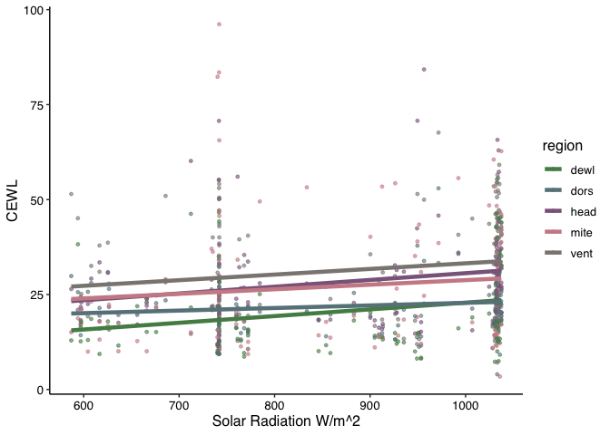<!-- -->

``` r
# glm
# CEWL ~ region + aquaflux measurement RH
glm11 <- lm(TEWL_g_m2h ~ region*Solar_rad_Wm2_interpol,
           data = all_data_long)
summary(glm11)
```

    ## 
    ## Call:
    ## lm(formula = TEWL_g_m2h ~ region * Solar_rad_Wm2_interpol, data = all_data_long)
    ## 
    ## Residuals:
    ##     Min      1Q  Median      3Q     Max 
    ## -26.602  -8.137  -2.099   5.589  70.471 
    ## 
    ## Coefficients:
    ##                                     Estimate Std. Error t value Pr(>|t|)  
    ## (Intercept)                        5.2015242  6.1727683   0.843   0.3997  
    ## regiondors                        10.8334201  8.7003785   1.245   0.2135  
    ## regionhead                         7.6135846  8.6829215   0.877   0.3809  
    ## regionmite                        11.5695460  8.7731279   1.319   0.1877  
    ## regionvent                        13.2084767  8.6924471   1.520   0.1291  
    ## Solar_rad_Wm2_interpol             0.0176571  0.0068733   2.569   0.0104 *
    ## regiondors:Solar_rad_Wm2_interpol -0.0108811  0.0096875  -1.123   0.2617  
    ## regionhead:Solar_rad_Wm2_interpol  0.0001491  0.0096738   0.015   0.9877  
    ## regionmite:Solar_rad_Wm2_interpol -0.0056362  0.0097462  -0.578   0.5633  
    ## regionvent:Solar_rad_Wm2_interpol -0.0028463  0.0096900  -0.294   0.7691  
    ## ---
    ## Signif. codes:  0 '***' 0.001 '**' 0.01 '*' 0.05 '.' 0.1 ' ' 1
    ## 
    ## Residual standard error: 12.28 on 675 degrees of freedom
    ##   (15 observations deleted due to missingness)
    ## Multiple R-squared:  0.1247, Adjusted R-squared:  0.113 
    ## F-statistic: 10.68 on 9 and 675 DF,  p-value: 1.393e-15

### CEWL \~ Individual

  - Same relationship with individual lizard…

<!-- end list -->

``` r
all_data_long %>% 
  ggplot(data = .) + 
  geom_point(aes(x = individual_ID,
                 y = TEWL_g_m2h, 
                 color = region
                 ), 
             size = 1, 
             alpha = 0.6) + 
  scale_colour_manual(values = c("palegreen4", "lightblue4", 
                                 "plum4", "lightpink3", "seashell4")) +
  stat_smooth(aes(x = individual_ID, 
                  y = TEWL_g_m2h, 
                  color = region
                  ), 
              formula = y ~ x, 
              method = "lm", 
              se = F, 
              size = 1.6, 
              alpha = 1 ) + 
  theme_classic() + 
  xlab("Individual Lizard") + 
  ylab("CEWL") + 
  
  # just to get a better look
  # ylim(5, 40) +
  
  theme(text = element_text(color = "black", 
                            family = "sans", 
                            size = 12),
        axis.text = element_text(color = "black", 
                                 family = "sans", 
                                 size = 10),
        legend.text.align = 0,
)
```

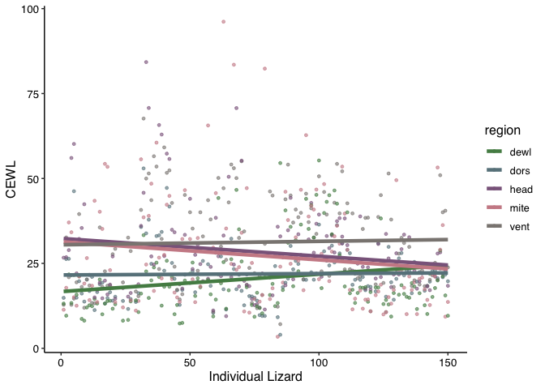<!-- -->

``` r
# glm
glm6 <- lm(TEWL_g_m2h ~ region*individual_ID,
           data = all_data_long)
summary(glm6)
```

    ## 
    ## Call:
    ## lm(formula = TEWL_g_m2h ~ region * individual_ID, data = all_data_long)
    ## 
    ## Residuals:
    ##     Min      1Q  Median      3Q     Max 
    ## -24.236  -8.315  -2.267   5.912  68.147 
    ## 
    ## Coefficients:
    ##                          Estimate Std. Error t value Pr(>|t|)    
    ## (Intercept)              16.69915    2.11148   7.909 1.03e-14 ***
    ## regiondors                4.88483    2.98130   1.638  0.10178    
    ## regionhead               15.64339    2.97849   5.252 2.01e-07 ***
    ## regionmite               14.66861    3.01026   4.873 1.37e-06 ***
    ## regionvent               13.78300    2.97900   4.627 4.44e-06 ***
    ## individual_ID             0.05126    0.02383   2.151  0.03182 *  
    ## regiondors:individual_ID -0.04712    0.03368  -1.399  0.16221    
    ## regionhead:individual_ID -0.10351    0.03365  -3.076  0.00218 ** 
    ## regionmite:individual_ID -0.10450    0.03386  -3.087  0.00210 ** 
    ## regionvent:individual_ID -0.04109    0.03367  -1.220  0.22278    
    ## ---
    ## Signif. codes:  0 '***' 0.001 '**' 0.01 '*' 0.05 '.' 0.1 ' ' 1
    ## 
    ## Residual standard error: 12.3 on 690 degrees of freedom
    ## Multiple R-squared:  0.1139, Adjusted R-squared:  0.1023 
    ## F-statistic: 9.855 on 9 and 690 DF,  p-value: 2.755e-14

``` r
# base visualization
visreg(glm6, "individual_ID", by="region", overlay=T, band=F)
```

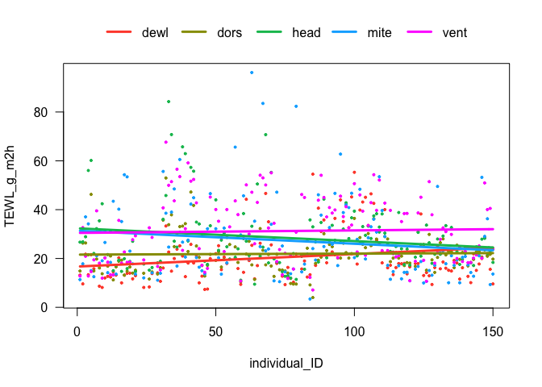<!-- -->

### CEWL \~ SVL

``` r
all_data_long %>% 
  ggplot(data = .) + 
  geom_point(aes(x = SVL_mm,
                 y = TEWL_g_m2h, 
                 color = region
                 ), 
             size = 1, 
             alpha = 0.6) + 
  scale_colour_manual(values = c("palegreen4", "lightblue4", 
                                 "plum4", "lightpink3", "seashell4")) +
  stat_smooth(aes(x = SVL_mm, 
                  y = TEWL_g_m2h, 
                  color = region
                  ), 
              formula = y ~ x, 
              method = "lm", 
              se = F, 
              size = 1.6, 
              alpha = 1 ) + 
  theme_classic() + 
  xlab("SVL") + 
  ylab("CEWL") + 
  theme(text = element_text(color = "black", 
                            family = "sans", 
                            size = 12),
        axis.text = element_text(color = "black", 
                                 family = "sans", 
                                 size = 10),
        legend.text.align = 0,
)
```

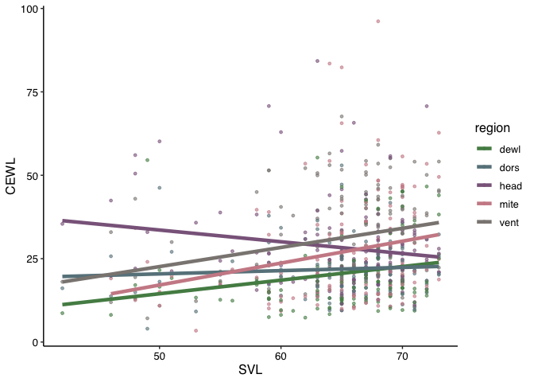<!-- -->

``` r
# glm
glm10 <- lm(TEWL_g_m2h ~ region*SVL_mm,
           data = all_data_long)
summary(glm10)
```

    ## 
    ## Call:
    ## lm(formula = TEWL_g_m2h ~ region * SVL_mm, data = all_data_long)
    ## 
    ## Residuals:
    ##     Min      1Q  Median      3Q     Max 
    ## -23.910  -8.306  -2.088   5.853  67.235 
    ## 
    ## Coefficients:
    ##                   Estimate Std. Error t value Pr(>|t|)    
    ## (Intercept)        -5.8983    11.1000  -0.531 0.595329    
    ## regiondors         21.4807    15.6325   1.374 0.169855    
    ## regionhead         57.0462    15.4121   3.701 0.000232 ***
    ## regionmite         -9.8689    16.4778  -0.599 0.549422    
    ## regionvent         -0.1802    15.4523  -0.012 0.990697    
    ## SVL_mm              0.4075     0.1697   2.402 0.016575 *  
    ## regiondors:SVL_mm  -0.3105     0.2390  -1.299 0.194242    
    ## regionhead:SVL_mm  -0.7590     0.2359  -3.218 0.001353 ** 
    ## regionmite:SVL_mm   0.2497     0.2514   0.993 0.320953    
    ## regionvent:SVL_mm   0.1664     0.2363   0.704 0.481623    
    ## ---
    ## Signif. codes:  0 '***' 0.001 '**' 0.01 '*' 0.05 '.' 0.1 ' ' 1
    ## 
    ## Residual standard error: 12.12 on 690 degrees of freedom
    ## Multiple R-squared:  0.1394, Adjusted R-squared:  0.1282 
    ## F-statistic: 12.42 on 9 and 690 DF,  p-value: < 2.2e-16

### CEWL \~ Mass

  - head significant, but sig interaction. Opposite trend from all other
    body parts.

<!-- end list -->

``` r
all_data_long %>% 
  ggplot(data = .) + 
  geom_point(aes(x = mass_g,
                 y = TEWL_g_m2h, 
                 color = region
                 ), 
             size = 1, 
             alpha = 0.4) + 
  #scale_colour_manual(values = c("palegreen4", "lightblue4", 
   #                              "plum4", "lightpink3", "seashell4")) +
  stat_smooth(aes(x = mass_g, 
                  y = TEWL_g_m2h, 
                  color = region
                  ), 
              formula = y ~ x, 
              method = "lm", 
              se = F, 
              size = 1.6, 
              alpha = 1 ) + 
  theme_classic() + 
  xlab("Mass (g)") + 
  ylab(bquote('CEWL (g / '*m^2~h*')')) + 
  #annotate("text", x = 1, y = 65, label = "a", size = 6) +
  scale_color_brewer(palette = "Set2",
                     labels = c("Dewlap", "Dorsum",
                              "Head", "Mite Patch", "Ventrum"),
                     name = "") +
  ylim(1, 100) +
  xlim(2, 16) +
  scale_x_continuous(breaks = c(seq(2, 16, by = 2))) +
  theme(text = element_text(color = "black", 
                            family = "sans", 
                            size = 18),
        axis.text = element_text(color = "black", 
                                 family = "sans", 
                                 size = 14),
        legend.text = element_text(color = "black", 
                                 family = "sans", 
                                 size = 12),
        legend.text.align = 0,
        legend.position = c(0.15, 0.85)
         ) -> CEWL_mass_fig
```

    ## Scale for 'x' is already present. Adding another scale for 'x', which will
    ## replace the existing scale.

``` r
CEWL_mass_fig
```

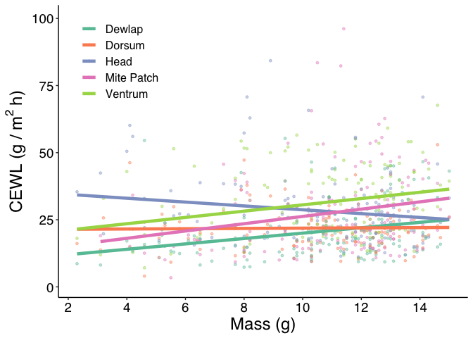<!-- -->

``` r
# export figure
#ggsave(filename = "CEWL_mass_fig.tiff",
 #      plot = CEWL_mass_fig,
  #     path = "./final_figures",
   #    device = "tiff",
    #   dpi = 1200,
     #  width = 6, height = 4)


# glm
glm11 <- lm(TEWL_g_m2h ~ region*mass_g,
           data = all_data_long)
summary(glm11)
```

    ## 
    ## Call:
    ## lm(formula = TEWL_g_m2h ~ region * mass_g, data = all_data_long)
    ## 
    ## Residuals:
    ##     Min      1Q  Median      3Q     Max 
    ## -22.017  -8.250  -2.314   5.917  68.023 
    ## 
    ## Coefficients:
    ##                   Estimate Std. Error t value Pr(>|t|)    
    ## (Intercept)         9.9843     4.0331   2.476 0.013540 *  
    ## regiondors         11.3575     5.6826   1.999 0.046038 *  
    ## regionhead         25.8966     5.6187   4.609 4.82e-06 ***
    ## regionmite          2.6756     5.8818   0.455 0.649321    
    ## regionvent          8.8424     5.6517   1.565 0.118142    
    ## mass_g              1.0033     0.3669   2.735 0.006407 ** 
    ## regiondors:mass_g  -0.9505     0.5171  -1.838 0.066456 .  
    ## regionhead:mass_g  -1.7198     0.5125  -3.355 0.000836 ***
    ## regionmite:mass_g   0.3543     0.5334   0.664 0.506781    
    ## regionvent:mass_g   0.1690     0.5144   0.328 0.742646    
    ## ---
    ## Signif. codes:  0 '***' 0.001 '**' 0.01 '*' 0.05 '.' 0.1 ' ' 1
    ## 
    ## Residual standard error: 12.13 on 690 degrees of freedom
    ## Multiple R-squared:  0.1381, Adjusted R-squared:  0.1269 
    ## F-statistic: 12.29 on 9 and 690 DF,  p-value: < 2.2e-16

### CEWL \~ Sex

  - Head sig higher in males. Vent sig higher in females.

<!-- end list -->

``` r
all_data_long %>% 
  ggplot(data = .) + 
  geom_boxplot(aes(x = sex_M_F, 
                   y = TEWL_g_m2h, 
                   color = sex_M_F
                   ), 
               size = 1,
               alpha = 0.6) + 
  facet_wrap(~region) +
  scale_color_manual(values = c("royalblue1", "mediumorchid")) +
  scale_x_discrete(breaks = c(1,2,3)) +
  theme_classic() + 
  xlab("Sex") + 
  ylab("CEWL") + 
  theme(text = element_text(color = "black", family = "sans", size = 12),
        axis.text = element_text(color = "black", family = "sans", size = 10),
        legend.text.align = 0,
        legend.position = "none"
)
```

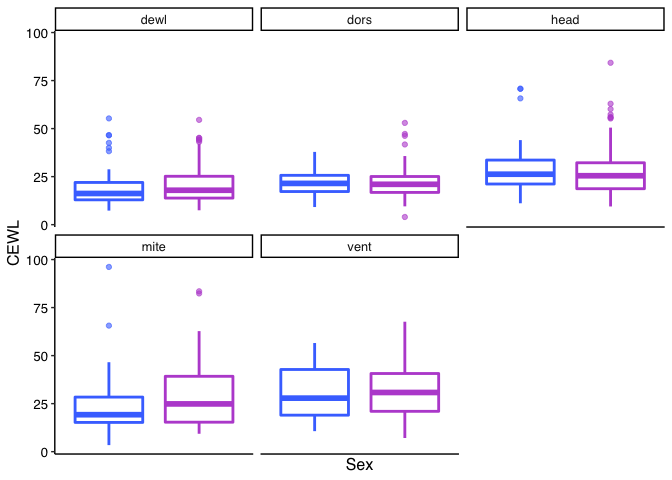<!-- -->

``` r
# glm
glm5 <- lm(TEWL_g_m2h ~ sex_M_F + region*sex_M_F, 
           data = all_data_long)
summary(glm5)
```

    ## 
    ## Call:
    ## lm(formula = TEWL_g_m2h ~ sex_M_F + region * sex_M_F, data = all_data_long)
    ## 
    ## Residuals:
    ##     Min      1Q  Median      3Q     Max 
    ## -24.597  -8.431  -2.417   5.598  72.592 
    ## 
    ## Coefficients:
    ##                     Estimate Std. Error t value Pr(>|t|)    
    ## (Intercept)          20.0807     1.8433  10.894  < 2e-16 ***
    ## sex_M_FM              0.8388     2.2415   0.374 0.708355    
    ## regiondors            1.6240     2.5789   0.630 0.529077    
    ## regionhead            9.4893     2.5926   3.660 0.000271 ***
    ## regionmite            3.4869     2.5926   1.345 0.179074    
    ## regionvent           10.2951     2.5789   3.992 7.25e-05 ***
    ## sex_M_FM:regiondors  -0.5417     3.1470  -0.172 0.863391    
    ## sex_M_FM:regionhead  -2.6895     3.1529  -0.853 0.393931    
    ## sex_M_FM:regionmite   4.6693     3.1667   1.474 0.140804    
    ## sex_M_FM:regionvent   0.4927     3.1470   0.157 0.875640    
    ## ---
    ## Signif. codes:  0 '***' 0.001 '**' 0.01 '*' 0.05 '.' 0.1 ' ' 1
    ## 
    ## Residual standard error: 12.37 on 690 degrees of freedom
    ## Multiple R-squared:  0.1046, Adjusted R-squared:  0.09295 
    ## F-statistic: 8.959 on 9 and 690 DF,  p-value: 7.491e-13

``` r
# base visualization
visreg(glm5, "sex_M_F", by="region", overlay=T, band=F)
```

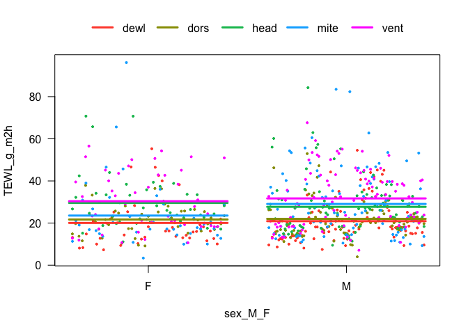<!-- -->

### CEWL \~ Gravidity

  - Sig: Head higher in gravid females. Vent higher in nongravid
    females.

<!-- end list -->

``` r
all_data_long %>% 
  dplyr::filter(sex_M_F == "F") %>%
  ggplot(data = .) + 
  geom_boxplot(aes(x = gravid_Y_N, 
                   y = TEWL_g_m2h, 
                   color = gravid_Y_N
                   ), 
               size = 1,
               alpha = 0.6) + 
  facet_wrap(~region) +
  scale_color_manual(values = c("royalblue1", "mediumorchid")) +
  scale_x_discrete(breaks = c(1,2,3)) +
  theme_classic() + 
  xlab("Female Gravid or Not") + 
  ylab("CEWL") + 
  theme(text = element_text(color = "black", family = "sans", size = 12),
        axis.text = element_text(color = "black", family = "sans", size = 10),
        legend.text.align = 0,
        legend.position = "none"
)
```

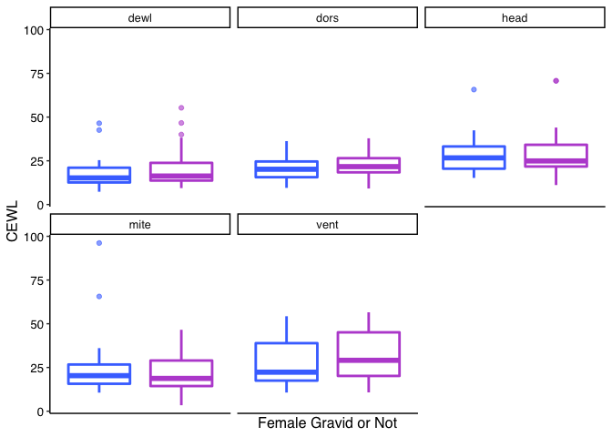<!-- -->

``` r
# glm
glm5 <- lm(TEWL_g_m2h ~ gravid_Y_N + region*gravid_Y_N, 
           data = all_data_long)
summary(glm5)
```

    ## 
    ## Call:
    ## lm(formula = TEWL_g_m2h ~ gravid_Y_N + region * gravid_Y_N, data = all_data_long)
    ## 
    ## Residuals:
    ##     Min      1Q  Median      3Q     Max 
    ## -21.443  -8.161  -3.103   5.211  70.168 
    ## 
    ## Coefficients:
    ##                        Estimate Std. Error t value Pr(>|t|)    
    ## (Intercept)             18.3320     2.7994   6.549 4.01e-10 ***
    ## gravid_Y_NY              3.1476     3.7558   0.838  0.40289    
    ## regiondors               2.4435     3.8679   0.632  0.52822    
    ## regionhead              10.5351     3.9115   2.693  0.00762 ** 
    ## regionmite               7.6604     3.9115   1.958  0.05144 .  
    ## regionvent               9.9671     3.8679   2.577  0.01062 *  
    ## gravid_Y_NY:regiondors  -1.4007     5.2439  -0.267  0.78964    
    ## gravid_Y_NY:regionhead  -1.8543     5.2762  -0.351  0.72558    
    ## gravid_Y_NY:regionmite  -7.6092     5.2762  -1.442  0.15067    
    ## gravid_Y_NY:regionvent   0.7565     5.2439   0.144  0.88542    
    ## ---
    ## Signif. codes:  0 '***' 0.001 '**' 0.01 '*' 0.05 '.' 0.1 ' ' 1
    ## 
    ## Residual standard error: 12.52 on 221 degrees of freedom
    ##   (469 observations deleted due to missingness)
    ## Multiple R-squared:  0.1168, Adjusted R-squared:  0.08085 
    ## F-statistic: 3.248 on 9 and 221 DF,  p-value: 0.0009986

``` r
# base visualization
visreg(glm5, "gravid_Y_N", by="region", overlay=T, band=F)
```

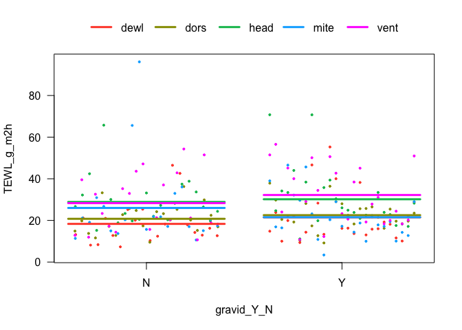<!-- -->

### CEWL \~ Week

``` r
CEWL %>% 
  ggplot(data = .) + 
  geom_boxplot(aes(x = as.factor(date), 
                   y = TEWL_g_m2h, 
                   color = as.factor(date)
                   ), 
               size = 1,
               alpha = 0.6) + 
  facet_wrap(~region) + # could not figure out how to change facet labels without changing underlying data
  scale_color_manual(values = c("royalblue1", "mediumorchid", "seagreen4",
                                "royalblue1", "mediumorchid", "seagreen4")) +
  scale_x_discrete(breaks = c(1,2,3)) +
  theme_classic() + 
  xlab("Date") + 
  ylab("CEWL") + 
  theme(text = element_text(color = "black", family = "sans", size = 12),
        axis.text = element_text(color = "black", family = "sans", size = 10),
        legend.text.align = 0,
        legend.position = "none"
)
```

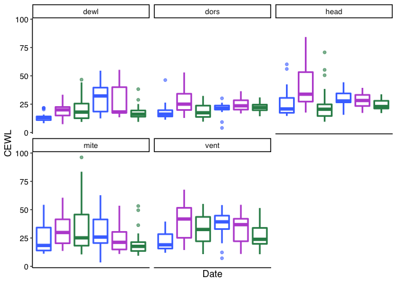<!-- -->

``` r
# glm
glm12 <- lm(TEWL_g_m2h ~ region*date,
           data = all_data_long)
summary(glm12)
```

    ## 
    ## Call:
    ## lm(formula = TEWL_g_m2h ~ region * date, data = all_data_long)
    ## 
    ## Residuals:
    ##     Min      1Q  Median      3Q     Max 
    ## -24.647  -8.373  -2.348   5.683  68.619 
    ## 
    ## Coefficients:
    ##                   Estimate Std. Error t value Pr(>|t|)   
    ## (Intercept)     -3.589e+03  1.346e+03  -2.666  0.00786 **
    ## regiondors       2.372e+03  1.903e+03   1.246  0.21319   
    ## regionhead       5.238e+03  1.901e+03   2.754  0.00603 **
    ## regionmite       5.924e+03  1.913e+03   3.097  0.00203 **
    ## regionvent       1.658e+03  1.904e+03   0.871  0.38409   
    ## date             1.926e-01  7.182e-02   2.681  0.00751 **
    ## regiondors:date -1.265e-01  1.015e-01  -1.245  0.21343   
    ## regionhead:date -2.790e-01  1.014e-01  -2.750  0.00611 **
    ## regionmite:date -3.157e-01  1.020e-01  -3.094  0.00206 **
    ## regionvent:date -8.788e-02  1.016e-01  -0.865  0.38714   
    ## ---
    ## Signif. codes:  0 '***' 0.001 '**' 0.01 '*' 0.05 '.' 0.1 ' ' 1
    ## 
    ## Residual standard error: 12.3 on 690 degrees of freedom
    ## Multiple R-squared:  0.1138, Adjusted R-squared:  0.1022 
    ## F-statistic: 9.846 on 9 and 690 DF,  p-value: 2.851e-14

### CEWL \~ holding time

``` r
all_data_long %>% 
  ggplot(data = .) + 
  geom_point(aes(x = hold_time,
                 y = TEWL_g_m2h, 
                 color = region
                 ), 
             size = 1, 
             alpha = 0.6) + 
  scale_colour_manual(values = c("palegreen4", "lightblue4", 
                                 "plum4", "lightpink3", "seashell4")) +
  stat_smooth(aes(x = hold_time, 
                  y = TEWL_g_m2h, 
                  color = region
                  ), 
              formula = y ~ x, 
              method = "lm", 
              se = F, 
              size = 1.6, 
              alpha = 1 ) + 
  theme_classic() + 
  xlab("Holding Time (minutes)") + 
  ylab("CEWL (g/m^2/hr)") + 
  theme(text = element_text(color = "black", 
                            family = "sans", 
                            size = 12),
        axis.text = element_text(color = "black", 
                                 family = "sans", 
                                 size = 10),
        legend.text.align = 0,
)
```

    ## Warning: Removed 228 rows containing non-finite values (stat_smooth).

    ## Warning: Removed 228 rows containing missing values (geom_point).

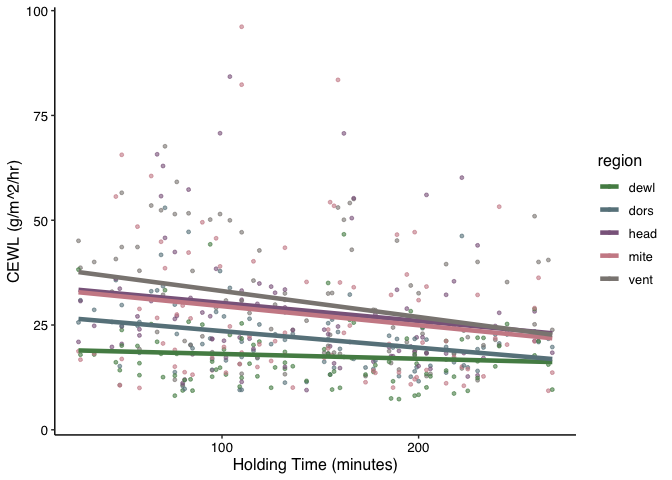<!-- -->

``` r
htime_CEWL_glm <- glm(data = all_data_long, TEWL_g_m2h ~ hold_time + region)
summary(htime_CEWL_glm)
```

    ## 
    ## Call:
    ## glm(formula = TEWL_g_m2h ~ hold_time + region, data = all_data_long)
    ## 
    ## Deviance Residuals: 
    ##     Min       1Q   Median       3Q      Max  
    ## -23.575   -8.051   -2.491    5.025   67.298  
    ## 
    ## Coefficients:
    ##              Estimate Std. Error t value Pr(>|t|)    
    ## (Intercept) 23.434620   1.836545  12.760  < 2e-16 ***
    ## hold_time   -0.040394   0.008931  -4.523 7.75e-06 ***
    ## regiondors   4.188392   1.836307   2.281    0.023 *  
    ## regionhead  10.746229   1.831534   5.867 8.41e-09 ***
    ## regionmite   9.871041   1.856277   5.318 1.63e-07 ***
    ## regionvent  12.758938   1.831534   6.966 1.11e-11 ***
    ## ---
    ## Signif. codes:  0 '***' 0.001 '**' 0.01 '*' 0.05 '.' 0.1 ' ' 1
    ## 
    ## (Dispersion parameter for gaussian family taken to be 159.3182)
    ## 
    ##     Null deviance: 88065  on 471  degrees of freedom
    ## Residual deviance: 74242  on 466  degrees of freedom
    ##   (228 observations deleted due to missingness)
    ## AIC: 3740.9
    ## 
    ## Number of Fisher Scoring iterations: 2

Holding time is still significant, even after regional differences are
accounted for.

## Conclusion

visually, CEWL seems to be affected by: - body region - significant\! -
osmolality (hydration) - only significant for dewlap - hematocrit
(health) - not significant for any region - cloacal temperature at
measurement\!\! - sig overall and for each region individually except
mite patch - capture temp - sig overall and for ventrum, dewlap, and
mitepatch regions individually - capture RH - sig overall and for
dorsum, dewlap, and mitepatch regions individually (not head or ventrum)
- measurement temperature - sig overall, didn’t test individually -
individual ID - significant - mass & SVL - both significant overall -
week/date - significant - hold time - significant

*not* affected by sex, gravidity, or measurement RH (not visually or
statistically significant)

# PCA

``` r
## Subset location and explanatory data
locations <- all_data_wide[, 19:23]
explanatory <- all_data_wide[, c(4,5,10,11,15:18)]

## Remove NA
locations <- na.omit(locations)
explanatory <- na.omit(explanatory)

## Create PCAs
#### CEWL all locations PCA
data.pca <- prcomp(locations, center=T, scale. = T)
summary(data.pca)
```

    ## Importance of components:
    ##                           PC1    PC2    PC3    PC4     PC5
    ## Standard deviation     1.4508 1.2343 0.9307 0.7093 0.04949
    ## Proportion of Variance 0.4209 0.3047 0.1733 0.1006 0.00049
    ## Cumulative Proportion  0.4209 0.7256 0.8989 0.9995 1.00000

``` r
#### CEWL avg PCA
#data2.pca <- prcomp(explanatory, center=T, scale. = T)
#summary(data2.pca)

## Plots
### CEWL all locations, gender groups
ggbiplot(data.pca, labels=rownames(data.pca))
```

    ## ------------------------------------------------------------------------------

    ## You have loaded plyr after dplyr - this is likely to cause problems.
    ## If you need functions from both plyr and dplyr, please load plyr first, then dplyr:
    ## library(plyr); library(dplyr)

    ## ------------------------------------------------------------------------------

    ## 
    ## Attaching package: 'plyr'

    ## The following objects are masked from 'package:Hmisc':
    ## 
    ##     is.discrete, summarize

    ## The following objects are masked from 'package:dplyr':
    ## 
    ##     arrange, count, desc, failwith, id, mutate, rename, summarise,
    ##     summarize

    ## The following object is masked from 'package:purrr':
    ## 
    ##     compact

    ## 
    ## Attaching package: 'scales'

    ## The following object is masked from 'package:purrr':
    ## 
    ##     discard

    ## The following object is masked from 'package:readr':
    ## 
    ##     col_factor

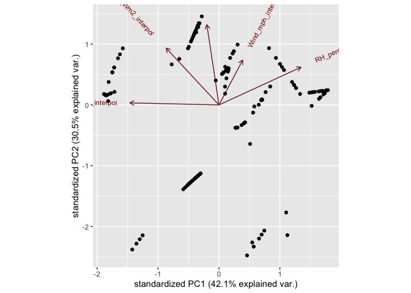<!-- -->

``` r
### CEWL avg, gender groups
#ggbiplot(data2.pca, labels=rownames(data.pca))
```

# GLMMs

## Hydration

Based on the simple linear models and figures above, osmolality should
be predicted by date/week, individual, capture temperature, and capture
RH.

### Multicollinearity

First, check for multicollinearity among independent variables:

``` r
all_data_wide %>% 
  # select variables of interest
  dplyr::select(date,
                individual_ID,
                temp_C_interpol,
                RH_percent_interpol
                ) %>% 
  # multicollinearity plot
  pairs(.)
```

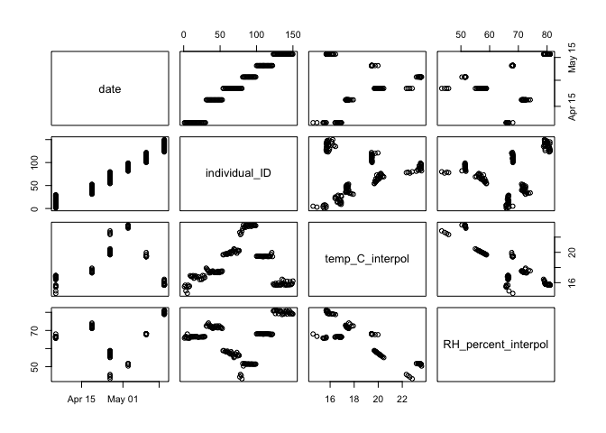<!-- -->

``` r
# also make another plot with r-sq values
# date variable doesn't work for this because not continuous numeric
all_data_wide %>% 
  # select variables of interest
  dplyr::select(individual_ID,
                temp_C_interpol,
                RH_percent_interpol
                ) %>% 
  # multicollinearity plot
  chart.Correlation(., histogram = F, pch = 19)
```

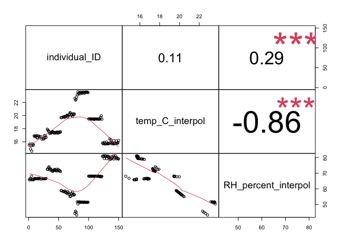<!-- -->

Date and individual\_ID are collinear, as are capture temperature and
RH. Individual\_ID is significantly correlated with capture RH, but the
r-squared is relatively low, so I think it’s okay to keep both.

In conclusion, individual\_ID *or* date and capture temperature *or* RH
should be used in the model.

Prep dataframe for computing models:

``` r
hydrat_mod_dat <- all_data_wide %>%
  dplyr::select(date, 
                individual_ID,
                osmolality_mmol_kg,
                temp_C_interpol,
                RH_percent_interpol,
                abs_humidity_g_m3_interpol
                ) %>%
  dplyr::filter(complete.cases(.))
```

### Models

``` r
# model 1: osml ~ date + temp
# AIC = 1319.6
hydrat_mod1 <- glm(data = hydrat_mod_dat,
                         osmolality_mmol_kg ~ date + temp_C_interpol) 
summary(hydrat_mod1)
```

    ## 
    ## Call:
    ## glm(formula = osmolality_mmol_kg ~ date + temp_C_interpol, data = hydrat_mod_dat)
    ## 
    ## Deviance Residuals: 
    ##     Min       1Q   Median       3Q      Max  
    ## -49.875  -16.745   -3.271   15.711   67.686  
    ## 
    ## Coefficients:
    ##                   Estimate Std. Error t value Pr(>|t|)    
    ## (Intercept)     -1.651e+04  2.514e+03  -6.567 9.01e-10 ***
    ## date             8.942e-01  1.342e-01   6.664 5.44e-10 ***
    ## temp_C_interpol  5.845e+00  7.300e-01   8.007 3.83e-13 ***
    ## ---
    ## Signif. codes:  0 '***' 0.001 '**' 0.01 '*' 0.05 '.' 0.1 ' ' 1
    ## 
    ## (Dispersion parameter for gaussian family taken to be 506.9519)
    ## 
    ##     Null deviance: 135024  on 144  degrees of freedom
    ## Residual deviance:  71987  on 142  degrees of freedom
    ## AIC: 1319.6
    ## 
    ## Number of Fisher Scoring iterations: 2

``` r
# model 2: osml ~ date + RH
# AIC = 1298.2
hydrat_mod2 <- glm(data = hydrat_mod_dat,
                         osmolality_mmol_kg ~ date + RH_percent_interpol) 
summary(hydrat_mod2)
```

    ## 
    ## Call:
    ## glm(formula = osmolality_mmol_kg ~ date + RH_percent_interpol, 
    ##     data = hydrat_mod_dat)
    ## 
    ## Deviance Residuals: 
    ##     Min       1Q   Median       3Q      Max  
    ## -47.465  -13.552   -3.333   12.556   67.662  
    ## 
    ## Coefficients:
    ##                       Estimate Std. Error t value Pr(>|t|)    
    ## (Intercept)         -2.566e+04  2.414e+03 -10.630   <2e-16 ***
    ## date                 1.395e+00  1.290e-01  10.816   <2e-16 ***
    ## RH_percent_interpol -1.803e+00  1.832e-01  -9.842   <2e-16 ***
    ## ---
    ## Signif. codes:  0 '***' 0.001 '**' 0.01 '*' 0.05 '.' 0.1 ' ' 1
    ## 
    ## (Dispersion parameter for gaussian family taken to be 437.4309)
    ## 
    ##     Null deviance: 135024  on 144  degrees of freedom
    ## Residual deviance:  62115  on 142  degrees of freedom
    ## AIC: 1298.2
    ## 
    ## Number of Fisher Scoring iterations: 2

``` r
# model 3: osml ~ individual (fixed) + temp
# AIC = 1321.3
hydrat_mod3 <- glm(data = hydrat_mod_dat,
                         osmolality_mmol_kg ~ individual_ID + temp_C_interpol) 
summary(hydrat_mod3)
```

    ## 
    ## Call:
    ## glm(formula = osmolality_mmol_kg ~ individual_ID + temp_C_interpol, 
    ##     data = hydrat_mod_dat)
    ## 
    ## Deviance Residuals: 
    ##     Min       1Q   Median       3Q      Max  
    ## -48.522  -15.041   -2.858   16.691   63.679  
    ## 
    ## Coefficients:
    ##                  Estimate Std. Error t value Pr(>|t|)    
    ## (Intercept)     231.72802   13.85306  16.728  < 2e-16 ***
    ## individual_ID     0.28852    0.04438   6.502 1.26e-09 ***
    ## temp_C_interpol   5.99964    0.73170   8.200 1.30e-13 ***
    ## ---
    ## Signif. codes:  0 '***' 0.001 '**' 0.01 '*' 0.05 '.' 0.1 ' ' 1
    ## 
    ## (Dispersion parameter for gaussian family taken to be 512.8425)
    ## 
    ##     Null deviance: 135024  on 144  degrees of freedom
    ## Residual deviance:  72824  on 142  degrees of freedom
    ## AIC: 1321.3
    ## 
    ## Number of Fisher Scoring iterations: 2

``` r
# model 4: osml ~ individual (fixed) + RH
# AIC = 1305.6
hydrat_mod4 <- glm(data = hydrat_mod_dat,
                         osmolality_mmol_kg ~ individual_ID + RH_percent_interpol) 
summary(hydrat_mod4)
```

    ## 
    ## Call:
    ## glm(formula = osmolality_mmol_kg ~ individual_ID + RH_percent_interpol, 
    ##     data = hydrat_mod_dat)
    ## 
    ## Deviance Residuals: 
    ##     Min       1Q   Median       3Q      Max  
    ## -49.565  -14.531   -1.652   14.385   61.035  
    ## 
    ## Coefficients:
    ##                      Estimate Std. Error t value Pr(>|t|)    
    ## (Intercept)         450.07742   12.05815  37.326   <2e-16 ***
    ## individual_ID         0.44605    0.04373  10.199   <2e-16 ***
    ## RH_percent_interpol  -1.79621    0.18827  -9.541   <2e-16 ***
    ## ---
    ## Signif. codes:  0 '***' 0.001 '**' 0.01 '*' 0.05 '.' 0.1 ' ' 1
    ## 
    ## (Dispersion parameter for gaussian family taken to be 460.4814)
    ## 
    ##     Null deviance: 135024  on 144  degrees of freedom
    ## Residual deviance:  65388  on 142  degrees of freedom
    ## AIC: 1305.6
    ## 
    ## Number of Fisher Scoring iterations: 2

``` r
# model 5: osml ~ individual (random) + temp
# AIC = 1217.8 ** tied for best model
hydrat_mod5 <- nlme::lme(data = hydrat_mod_dat,
                         osmolality_mmol_kg ~ temp_C_interpol, random = ~1|individual_ID) 
summary(hydrat_mod5)
```

    ## Linear mixed-effects model fit by REML
    ##   Data: hydrat_mod_dat 
    ##        AIC      BIC   logLik
    ##   1217.818 1229.669 -604.909
    ## 
    ## Random effects:
    ##  Formula: ~1 | individual_ID
    ##         (Intercept)     Residual
    ## StdDev:    25.82074 2.060355e-14
    ## 
    ## Fixed effects:  osmolality_mmol_kg ~ temp_C_interpol 
    ##                     Value Std.Error  DF   t-value p-value
    ## (Intercept)     245.21260 15.613180 141 15.705487       0
    ## temp_C_interpol   6.47045  0.831094 141  7.785457       0
    ##  Correlation: 
    ##                 (Intr)
    ## temp_C_interpol -0.99 
    ## 
    ## Standardized Within-Group Residuals:
    ##       Min        Q1       Med        Q3       Max 
    ## -2.758914  0.000000  0.000000  0.000000  0.000000 
    ## 
    ## Number of Observations: 145
    ## Number of Groups: 143

``` r
# model 6: osml ~ individual (random) + RH
# AIC = 1246.9
hydrat_mod6 <- nlme::lme(data = hydrat_mod_dat,
                         osmolality_mmol_kg ~ RH_percent_interpol, random = ~1|individual_ID) 
summary(hydrat_mod6)
```

    ## Linear mixed-effects model fit by REML
    ##   Data: hydrat_mod_dat 
    ##        AIC      BIC   logLik
    ##   1246.896 1258.747 -619.448
    ## 
    ## Random effects:
    ##  Formula: ~1 | individual_ID
    ##         (Intercept)     Residual
    ## StdDev:    28.27747 2.495918e-14
    ## 
    ## Fixed effects:  osmolality_mmol_kg ~ RH_percent_interpol 
    ##                        Value Std.Error  DF   t-value p-value
    ## (Intercept)         446.6343 15.959063 141 27.986245       0
    ## RH_percent_interpol  -1.2227  0.238218 141 -5.132782       0
    ##  Correlation: 
    ##                     (Intr)
    ## RH_percent_interpol -0.989
    ## 
    ## Standardized Within-Group Residuals:
    ##       Min        Q1       Med        Q3       Max 
    ## -2.277455  0.000000  0.000000  0.000000  0.000000 
    ## 
    ## Number of Observations: 145
    ## Number of Groups: 143

``` r
# model 7: osml ~ individual (random) + RH*temp interaction
# AIC = 1217.09 ** tied for best model
hydrat_mod7 <- nlme::lme(data = hydrat_mod_dat,
                         osmolality_mmol_kg ~ RH_percent_interpol * temp_C_interpol, random = ~1|individual_ID) 
summary(hydrat_mod7)
```

    ## Linear mixed-effects model fit by REML
    ##   Data: hydrat_mod_dat 
    ##       AIC      BIC    logLik
    ##   1217.09 1234.783 -602.5452
    ## 
    ## Random effects:
    ##  Formula: ~1 | individual_ID
    ##         (Intercept)     Residual
    ## StdDev:    25.01691 4.567227e-14
    ## 
    ## Fixed effects:  osmolality_mmol_kg ~ RH_percent_interpol * temp_C_interpol 
    ##                                         Value Std.Error  DF   t-value p-value
    ## (Intercept)                         -65.88273 105.13350 139 -0.626658  0.5319
    ## RH_percent_interpol                   4.16214   1.55626 139  2.674453  0.0084
    ## temp_C_interpol                      20.08143   5.15384 139  3.896399  0.0002
    ## RH_percent_interpol:temp_C_interpol  -0.17999   0.08376 139 -2.148729  0.0334
    ##  Correlation: 
    ##                                     (Intr) RH_pr_ tmp_C_
    ## RH_percent_interpol                 -0.953              
    ## temp_C_interpol                     -0.965  0.988       
    ## RH_percent_interpol:temp_C_interpol  0.846 -0.963 -0.950
    ## 
    ## Standardized Within-Group Residuals:
    ##       Min        Q1       Med        Q3       Max 
    ## -2.489187  0.000000  0.000000  1.244594  2.489187 
    ## 
    ## Number of Observations: 145
    ## Number of Groups: 143

The best model to predict hydration is based on ambient temperature at
capture as a fixed effect and individual\_ID as a random effect
(hydrat\_mod5). Using the interaction between RH \* temperature gives
just as good a model (hydrat\_mod7). Both have AIC of 1217.

### Selection

I should try to drop terms and see if that improves the models at all.
Model 7 includes the variables from model 5, so I’ll drop terms from
model 7.

``` r
# without temperature
hydrat_mod7_step1 <- nlme::lme(data = hydrat_mod_dat,
                         osmolality_mmol_kg ~ RH_percent_interpol * temp_C_interpol - temp_C_interpol, random = ~1|individual_ID) 
summary(hydrat_mod7_step1)
```

    ## Linear mixed-effects model fit by REML
    ##   Data: hydrat_mod_dat 
    ##        AIC      BIC    logLik
    ##   1232.177 1246.956 -611.0886
    ## 
    ## Random effects:
    ##  Formula: ~1 | individual_ID
    ##         (Intercept)     Residual
    ## StdDev:    26.38884 1.616947e-14
    ## 
    ## Fixed effects:  osmolality_mmol_kg ~ RH_percent_interpol * temp_C_interpol -      temp_C_interpol 
    ##                                        Value Std.Error  DF   t-value p-value
    ## (Intercept)                         332.8636 27.277328 140 12.202938       0
    ## RH_percent_interpol                  -1.8079  0.251827 140 -7.179109       0
    ## RH_percent_interpol:temp_C_interpol   0.1260  0.025379 140  4.966539       0
    ##  Correlation: 
    ##                                     (Intr) RH_pr_
    ## RH_percent_interpol                 -0.083       
    ## RH_percent_interpol:temp_C_interpol -0.838 -0.470
    ## 
    ## Standardized Within-Group Residuals:
    ##       Min        Q1       Med        Q3       Max 
    ## -3.515478  0.000000  0.000000  0.000000  3.515478 
    ## 
    ## Number of Observations: 145
    ## Number of Groups: 143

``` r
# compare to with
anova(hydrat_mod7, hydrat_mod7_step1)
```

    ## Warning in anova.lme(hydrat_mod7, hydrat_mod7_step1): fitted objects with
    ## different fixed effects. REML comparisons are not meaningful.

    ##                   Model df      AIC      BIC    logLik   Test  L.Ratio p-value
    ## hydrat_mod7           1  6 1217.090 1234.783 -602.5452                        
    ## hydrat_mod7_step1     2  5 1232.177 1246.956 -611.0886 1 vs 2 17.08699  <.0001

Deleting temperature is not an improvement, AIC is much higher and the
model is significantly worse.

``` r
# without RH
hydrat_mod7_step2 <- nlme::lme(data = hydrat_mod_dat,
                         osmolality_mmol_kg ~ RH_percent_interpol * temp_C_interpol - RH_percent_interpol, random = ~1|individual_ID) 
summary(hydrat_mod7_step2)
```

    ## Linear mixed-effects model fit by REML
    ##   Data: hydrat_mod_dat 
    ##        AIC      BIC    logLik
    ##   1222.269 1237.048 -606.1346
    ## 
    ## Random effects:
    ##  Formula: ~1 | individual_ID
    ##         (Intercept)     Residual
    ## StdDev:    25.71087 1.539439e-14
    ## 
    ## Fixed effects:  osmolality_mmol_kg ~ RH_percent_interpol * temp_C_interpol -      RH_percent_interpol 
    ##                                         Value Std.Error  DF  t-value p-value
    ## (Intercept)                         193.12755 30.669484 140 6.297059  0.0000
    ## temp_C_interpol                       6.51436  0.827239 140 7.874825  0.0000
    ## RH_percent_interpol:temp_C_interpol   0.04233  0.021756 140 1.945712  0.0537
    ##  Correlation: 
    ##                                     (Intr) tmp_C_
    ## temp_C_interpol                     -0.509       
    ## RH_percent_interpol:temp_C_interpol -0.862  0.009
    ## 
    ## Standardized Within-Group Residuals:
    ##       Min        Q1       Med        Q3       Max 
    ## -3.692476  0.000000  0.000000  0.000000  3.692476 
    ## 
    ## Number of Observations: 145
    ## Number of Groups: 143

``` r
# compare to with
anova(hydrat_mod7, hydrat_mod7_step2)
```

    ## Warning in anova.lme(hydrat_mod7, hydrat_mod7_step2): fitted objects with
    ## different fixed effects. REML comparisons are not meaningful.

    ##                   Model df      AIC      BIC    logLik   Test  L.Ratio p-value
    ## hydrat_mod7           1  6 1217.090 1234.783 -602.5452                        
    ## hydrat_mod7_step2     2  5 1222.269 1237.048 -606.1346 1 vs 2 7.178908  0.0074

Deleting RH is also not an improvement, AIC is much higher and the model
is significantly worse without it.

I would conclude that the two best models are best in their fullest
version.

However, we realized that absolute humidity would be better to use since
it’s decoupled from temperature, unlike relative humidity.

This does not affect hydration model 5m but we can try replacing
absolute humidity for relative humidity in model 7:

``` r
hydrat_mod7_step3 <- nlme::lme(data = hydrat_mod_dat,
                         osmolality_mmol_kg ~ abs_humidity_g_m3_interpol * temp_C_interpol, random = ~1|individual_ID) 
summary(hydrat_mod7_step3)
```

    ## Linear mixed-effects model fit by REML
    ##   Data: hydrat_mod_dat 
    ##        AIC      BIC    logLik
    ##   1199.253 1216.945 -593.6264
    ## 
    ## Random effects:
    ##  Formula: ~1 | individual_ID
    ##         (Intercept)     Residual
    ## StdDev:    23.80983 1.447095e-13
    ## 
    ## Fixed effects:  osmolality_mmol_kg ~ abs_humidity_g_m3_interpol * temp_C_interpol 
    ##                                                Value Std.Error  DF   t-value
    ## (Intercept)                                -646.0600 182.72042 139 -3.535785
    ## abs_humidity_g_m3_interpol                   86.1193  17.53352 139  4.911692
    ## temp_C_interpol                              53.3780  10.00855 139  5.333241
    ## abs_humidity_g_m3_interpol:temp_C_interpol   -4.5231   0.95619 139 -4.730354
    ##                                            p-value
    ## (Intercept)                                  6e-04
    ## abs_humidity_g_m3_interpol                   0e+00
    ## temp_C_interpol                              0e+00
    ## abs_humidity_g_m3_interpol:temp_C_interpol   0e+00
    ##  Correlation: 
    ##                                            (Intr) ab___3_ tmp_C_
    ## abs_humidity_g_m3_interpol                 -0.997               
    ## temp_C_interpol                            -0.989  0.984        
    ## abs_humidity_g_m3_interpol:temp_C_interpol  0.988 -0.989  -0.997
    ## 
    ## Standardized Within-Group Residuals:
    ##        Min         Q1        Med         Q3        Max 
    ## -1.5712423  0.0000000  0.0000000  0.0000000  0.7856211 
    ## 
    ## Number of Observations: 145
    ## Number of Groups: 143

This greatly improved the model\! Absolute humidity is much better than
relative humidity to incorporate into the model.

### Conclusion

Now save both of the best two models.

``` r
# save step 6 summary object
osml_best_mod1 <- summary(hydrat_mod5)
# extract stats table from summary object
osml_best_mod1_vals <- data.frame(osml_best_mod1$tTable)
# export 
write.csv(osml_best_mod1_vals, "osml_best_mod1_vals.csv")

# save step 9 summary object
osml_best_mod2 <- summary(hydrat_mod7_step3)
# extract stats table from summary object
osml_best_mod2_vals <- data.frame(osml_best_mod2$tTable)
# export 
write.csv(osml_best_mod2_vals, "osml_best_mod2_vals.csv")
```

## CEWL

Based on the simple linear models and figures above, CEWL should be
predicted by: - body region - hydration (osmolality) - cloacal
temperature at measurement - capture temperature and RH - ambient
temperature at measurement - individual - mass & SVL - date/week

Prep dataframe for models:

``` r
CEWL_mod_dat <- all_data_long %>% 
  # select variables of interest
  dplyr::select(date,
                #hold_time,
                individual_ID,
                mass_g,
                SVL_mm,
                osmolality_mmol_kg,
                TEWL_g_m2h,
                region,
                cloacal_temp_C,
                temp_C_interpol,
                RH_percent_interpol,
                abs_humidity_g_m3_interpol,
                Wind_mph_interpol,
                Solar_rad_Wm2_interpol,
                ambient_temp_C,
                ambient_RH_percent,
                abs_humidity_g_m3
                ) %>%
  dplyr::filter(complete.cases(.))
```

### Multicollinearity

Check for multicollinearity among independent variables:

``` r
CEWL_mod_dat %>% 
  # get rid of dependent variable
  dplyr::select(-TEWL_g_m2h) %>%
  # multicollinearity plot
  pairs(.)
```

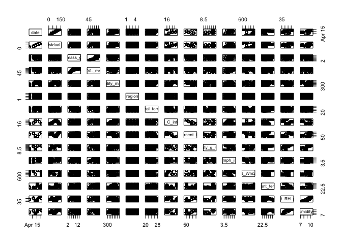<!-- -->

``` r
# also make another plot with r-sq values
# non-numeric variables don't work for this
CEWL_mod_dat %>% 
  # select variables of interest
  dplyr::select(-TEWL_g_m2h, -date, -region) %>% 
  # multicollinearity plot
  chart.Correlation(., histogram = F, pch = 19)
```

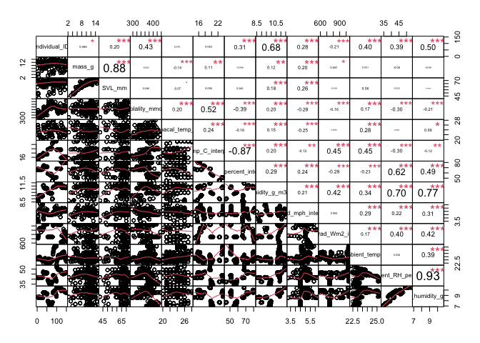<!-- -->

collinear variables that should not be used in combination: - mass and
SVL - temperature and RH at capture (same from hydration
multicollinearity) - date and individual\_ID - the various measures of
humidity

### Models

``` r
# model 1
# AIC = 5175.665
CEWL_mod1 <- nlme::lme(data = CEWL_mod_dat,
                         TEWL_g_m2h ~ region + osmolality_mmol_kg +
                          cloacal_temp_C + ambient_temp_C +
                          RH_percent_interpol + SVL_mm, 
                          random = ~1|individual_ID) 
summary(CEWL_mod1)
```

    ## Linear mixed-effects model fit by REML
    ##   Data: CEWL_mod_dat 
    ##        AIC      BIC    logLik
    ##   5175.665 5229.572 -2575.833
    ## 
    ## Random effects:
    ##  Formula: ~1 | individual_ID
    ##         (Intercept) Residual
    ## StdDev:    5.600664 10.40019
    ## 
    ## Fixed effects:  TEWL_g_m2h ~ region + osmolality_mmol_kg + cloacal_temp_C + ambient_temp_C +      RH_percent_interpol + SVL_mm 
    ##                         Value Std.Error  DF   t-value p-value
    ## (Intercept)         -2.695136 24.419932 529 -0.110366  0.9122
    ## regiondors           1.120349  1.272849 529  0.880190  0.3792
    ## regionhead           7.313841  1.270086 529  5.758537  0.0000
    ## regionmite           6.541597  1.283585 529  5.096349  0.0000
    ## regionvent          10.603668  1.272741 529  8.331362  0.0000
    ## osmolality_mmol_kg  -0.018426  0.022788 131 -0.808591  0.4202
    ## cloacal_temp_C       2.231757  0.356512 131  6.259969  0.0000
    ## ambient_temp_C      -1.579434  0.933584 529 -1.691797  0.0913
    ## RH_percent_interpol -0.091006  0.069784 131 -1.304112  0.1945
    ## SVL_mm               0.322937  0.105201 131  3.069726  0.0026
    ##  Correlation: 
    ##                     (Intr) rgndrs regnhd regnmt rgnvnt osml__ clc__C amb__C
    ## regiondors          -0.039                                                 
    ## regionhead          -0.041  0.505                                          
    ## regionmite          -0.014  0.501  0.501                                   
    ## regionvent          -0.037  0.505  0.505  0.500                            
    ## osmolality_mmol_kg  -0.297 -0.001 -0.003 -0.002 -0.002                     
    ## cloacal_temp_C      -0.108 -0.007 -0.007  0.003 -0.005 -0.148              
    ## ambient_temp_C      -0.803  0.017  0.018 -0.010  0.014 -0.044 -0.246       
    ## RH_percent_interpol -0.458  0.006  0.004 -0.002  0.004  0.357  0.037  0.175
    ## SVL_mm              -0.186 -0.002  0.005 -0.011  0.002 -0.080  0.107 -0.099
    ##                     RH_pr_
    ## regiondors                
    ## regionhead                
    ## regionmite                
    ## regionvent                
    ## osmolality_mmol_kg        
    ## cloacal_temp_C            
    ## ambient_temp_C            
    ## RH_percent_interpol       
    ## SVL_mm              -0.083
    ## 
    ## Standardized Within-Group Residuals:
    ##        Min         Q1        Med         Q3        Max 
    ## -2.0696622 -0.5719580 -0.1403006  0.4220436  5.3838278 
    ## 
    ## Number of Observations: 670
    ## Number of Groups: 136

``` r
# model 2
# AIC = 5171.271
CEWL_mod2 <- nlme::lme(data = CEWL_mod_dat,
                         TEWL_g_m2h ~ region + osmolality_mmol_kg +
                          cloacal_temp_C + ambient_temp_C +
                          RH_percent_interpol + mass_g, 
                          random = ~1|individual_ID) 
summary(CEWL_mod2)
```

    ## Linear mixed-effects model fit by REML
    ##   Data: CEWL_mod_dat 
    ##        AIC      BIC    logLik
    ##   5171.271 5225.178 -2573.636
    ## 
    ## Random effects:
    ##  Formula: ~1 | individual_ID
    ##         (Intercept) Residual
    ## StdDev:    5.498685 10.39969
    ## 
    ## Fixed effects:  TEWL_g_m2h ~ region + osmolality_mmol_kg + cloacal_temp_C + ambient_temp_C +      RH_percent_interpol + mass_g 
    ##                         Value Std.Error  DF   t-value p-value
    ## (Intercept)          1.960700 23.888780 529  0.082076  0.9346
    ## regiondors           1.122285  1.272746 529  0.881782  0.3783
    ## regionhead           7.316472  1.269996 529  5.761019  0.0000
    ## regionmite           6.544406  1.283447 529  5.099086  0.0000
    ## regionvent          10.600442  1.272643 529  8.329469  0.0000
    ## osmolality_mmol_kg  -0.011251  0.022476 131 -0.500586  0.6175
    ## cloacal_temp_C       2.317983  0.355375 131  6.522637  0.0000
    ## ambient_temp_C      -1.526514  0.921819 529 -1.655981  0.0983
    ## RH_percent_interpol -0.060574  0.068895 131 -0.879226  0.3809
    ## mass_g               0.799892  0.226255 131  3.535351  0.0006
    ##  Correlation: 
    ##                     (Intr) rgndrs regnhd regnmt rgnvnt osml__ clc__C amb__C
    ## regiondors          -0.040                                                 
    ## regionhead          -0.041  0.505                                          
    ## regionmite          -0.015  0.501  0.501                                   
    ## regionvent          -0.038  0.505  0.505  0.500                            
    ## osmolality_mmol_kg  -0.318 -0.001 -0.003 -0.003 -0.002                     
    ## cloacal_temp_C      -0.106 -0.007 -0.007  0.002 -0.005 -0.136              
    ## ambient_temp_C      -0.825  0.016  0.018 -0.011  0.014 -0.053 -0.246       
    ## RH_percent_interpol -0.485  0.006  0.005 -0.004  0.005  0.353  0.054  0.164
    ## mass_g              -0.109 -0.001  0.005 -0.009  0.001  0.020  0.161 -0.071
    ##                     RH_pr_
    ## regiondors                
    ## regionhead                
    ## regionmite                
    ## regionvent                
    ## osmolality_mmol_kg        
    ## cloacal_temp_C            
    ## ambient_temp_C            
    ## RH_percent_interpol       
    ## mass_g               0.052
    ## 
    ## Standardized Within-Group Residuals:
    ##        Min         Q1        Med         Q3        Max 
    ## -2.0738419 -0.5805604 -0.1370607  0.3972666  5.4013157 
    ## 
    ## Number of Observations: 670
    ## Number of Groups: 136

``` r
# model 3
# AIC = 5166.725
CEWL_mod3 <- nlme::lme(data = CEWL_mod_dat,
                         TEWL_g_m2h ~ region + osmolality_mmol_kg +
                          cloacal_temp_C + ambient_temp_C +
                          temp_C_interpol + SVL_mm, 
                          random = ~1|individual_ID) 
summary(CEWL_mod3)
```

    ## Linear mixed-effects model fit by REML
    ##   Data: CEWL_mod_dat 
    ##        AIC      BIC    logLik
    ##   5166.725 5220.632 -2571.363
    ## 
    ## Random effects:
    ##  Formula: ~1 | individual_ID
    ##         (Intercept) Residual
    ## StdDev:    5.377985 10.40154
    ## 
    ## Fixed effects:  TEWL_g_m2h ~ region + osmolality_mmol_kg + cloacal_temp_C + ambient_temp_C +      temp_C_interpol + SVL_mm 
    ##                        Value Std.Error  DF   t-value p-value
    ## (Intercept)         6.479913 22.862924 529  0.283425  0.7770
    ## regiondors          1.093291  1.272967 529  0.858852  0.3908
    ## regionhead          7.296919  1.270220 529  5.744611  0.0000
    ## regionmite          6.543525  1.283633 529  5.097660  0.0000
    ## regionvent         10.590673  1.272840 529  8.320509  0.0000
    ## osmolality_mmol_kg -0.040868  0.023897 131 -1.710181  0.0896
    ## cloacal_temp_C      2.178171  0.348962 131  6.241864  0.0000
    ## ambient_temp_C     -2.455899  0.979672 529 -2.506860  0.0125
    ## temp_C_interpol     0.856588  0.305375 131  2.805035  0.0058
    ## SVL_mm              0.305784  0.102497 131  2.983359  0.0034
    ##  Correlation: 
    ##                    (Intr) rgndrs regnhd regnmt rgnvnt osml__ clc__C amb__C
    ## regiondors         -0.042                                                 
    ## regionhead         -0.044  0.505                                          
    ## regionmite         -0.015  0.501  0.501                                   
    ## regionvent         -0.040  0.505  0.505  0.500                            
    ## osmolality_mmol_kg -0.313  0.002 -0.001 -0.002 -0.001                     
    ## cloacal_temp_C     -0.122 -0.006 -0.007  0.003 -0.005 -0.114              
    ## ambient_temp_C     -0.852  0.018  0.019 -0.010  0.014  0.104 -0.207       
    ## temp_C_interpol     0.372 -0.010 -0.008  0.002 -0.006 -0.493 -0.072 -0.398
    ## SVL_mm             -0.242 -0.001  0.006 -0.011  0.003 -0.037  0.111 -0.070
    ##                    tmp_C_
    ## regiondors               
    ## regionhead               
    ## regionmite               
    ## regionvent               
    ## osmolality_mmol_kg       
    ## cloacal_temp_C           
    ## ambient_temp_C           
    ## temp_C_interpol          
    ## SVL_mm             -0.021
    ## 
    ## Standardized Within-Group Residuals:
    ##        Min         Q1        Med         Q3        Max 
    ## -2.1257113 -0.5899983 -0.1176445  0.4081498  5.4131906 
    ## 
    ## Number of Observations: 670
    ## Number of Groups: 136

``` r
# model 4
# AIC = 5163.566 ** best model ** 
CEWL_mod4 <- nlme::lme(data = CEWL_mod_dat,
                         TEWL_g_m2h ~ region + osmolality_mmol_kg +
                          cloacal_temp_C + ambient_temp_C +
                          temp_C_interpol + mass_g, 
                          random = ~1|individual_ID) 
summary(CEWL_mod4)
```

    ## Linear mixed-effects model fit by REML
    ##   Data: CEWL_mod_dat 
    ##        AIC      BIC    logLik
    ##   5163.566 5217.473 -2569.783
    ## 
    ## Random effects:
    ##  Formula: ~1 | individual_ID
    ##         (Intercept) Residual
    ## StdDev:    5.323737 10.40074
    ## 
    ## Fixed effects:  TEWL_g_m2h ~ region + osmolality_mmol_kg + cloacal_temp_C + ambient_temp_C +      temp_C_interpol + mass_g 
    ##                        Value Std.Error  DF   t-value p-value
    ## (Intercept)        12.332564 22.300804 529  0.553010  0.5805
    ## regiondors          1.097892  1.272846 529  0.862549  0.3888
    ## regionhead          7.299710  1.270107 529  5.747318  0.0000
    ## regionmite          6.548658  1.283478 529  5.102277  0.0000
    ## regionvent         10.587966  1.272719 529  8.319168  0.0000
    ## osmolality_mmol_kg -0.032301  0.023812 131 -1.356475  0.1773
    ## cloacal_temp_C      2.257000  0.349947 131  6.449551  0.0000
    ## ambient_temp_C     -2.293881  0.971954 529 -2.360071  0.0186
    ## temp_C_interpol     0.724788  0.307077 131  2.360281  0.0197
    ## mass_g              0.730498  0.224455 131  3.254542  0.0014
    ##  Correlation: 
    ##                    (Intr) rgndrs regnhd regnmt rgnvnt osml__ clc__C amb__C
    ## regiondors         -0.043                                                 
    ## regionhead         -0.045  0.505                                          
    ## regionmite         -0.017  0.501  0.501                                   
    ## regionvent         -0.040  0.505  0.505  0.500                            
    ## osmolality_mmol_kg -0.338  0.002  0.000 -0.003  0.000                     
    ## cloacal_temp_C     -0.121 -0.006 -0.006  0.002 -0.005 -0.096              
    ## ambient_temp_C     -0.886  0.018  0.019 -0.011  0.014  0.100 -0.200       
    ## temp_C_interpol     0.392 -0.010 -0.008  0.003 -0.006 -0.498 -0.094 -0.394
    ## mass_g             -0.147  0.000  0.006 -0.009  0.002  0.076  0.170 -0.014
    ##                    tmp_C_
    ## regiondors               
    ## regionhead               
    ## regionmite               
    ## regionvent               
    ## osmolality_mmol_kg       
    ## cloacal_temp_C           
    ## ambient_temp_C           
    ## temp_C_interpol          
    ## mass_g             -0.151
    ## 
    ## Standardized Within-Group Residuals:
    ##        Min         Q1        Med         Q3        Max 
    ## -2.1372589 -0.5857342 -0.1205773  0.4079026  5.4233501 
    ## 
    ## Number of Observations: 670
    ## Number of Groups: 136

``` r
# model 5
# AIC = 5208
CEWL_mod5 <- glm(data = CEWL_mod_dat,
                         TEWL_g_m2h ~ region + osmolality_mmol_kg +
                          cloacal_temp_C + ambient_temp_C +
                          temp_C_interpol + SVL_mm + date) 
summary(CEWL_mod5)
```

    ## 
    ## Call:
    ## glm(formula = TEWL_g_m2h ~ region + osmolality_mmol_kg + cloacal_temp_C + 
    ##     ambient_temp_C + temp_C_interpol + SVL_mm + date, data = CEWL_mod_dat)
    ## 
    ## Deviance Residuals: 
    ##     Min       1Q   Median       3Q      Max  
    ## -30.351   -7.303   -1.600    5.115   63.977  
    ## 
    ## Coefficients:
    ##                      Estimate Std. Error t value Pr(>|t|)    
    ## (Intercept)        -241.14172  794.73019  -0.303 0.761661    
    ## regiondors            1.07351    1.42732   0.752 0.452250    
    ## regionhead            7.40352    1.42488   5.196 2.72e-07 ***
    ## regionmite            6.56435    1.43820   4.564 5.98e-06 ***
    ## regionvent           10.63581    1.42731   7.452 2.91e-13 ***
    ## osmolality_mmol_kg   -0.04505    0.02114  -2.131 0.033435 *  
    ## cloacal_temp_C        2.16898    0.25769   8.417 2.41e-16 ***
    ## ambient_temp_C       -2.50745    0.83192  -3.014 0.002677 ** 
    ## temp_C_interpol       0.89607    0.24663   3.633 0.000302 ***
    ## SVL_mm                0.30301    0.07854   3.858 0.000126 ***
    ## date                  0.01334    0.04307   0.310 0.756948    
    ## ---
    ## Signif. codes:  0 '***' 0.001 '**' 0.01 '*' 0.05 '.' 0.1 ' ' 1
    ## 
    ## (Dispersion parameter for gaussian family taken to be 136.4568)
    ## 
    ##     Null deviance: 114815  on 669  degrees of freedom
    ## Residual deviance:  89925  on 659  degrees of freedom
    ## AIC: 5208
    ## 
    ## Number of Fisher Scoring iterations: 2

``` r
# model 6
# AIC = 5205.1
CEWL_mod6 <- glm(data = CEWL_mod_dat,
                         TEWL_g_m2h ~ region + osmolality_mmol_kg +
                          cloacal_temp_C + ambient_temp_C +
                          temp_C_interpol + mass_g + date) 
summary(CEWL_mod6)
```

    ## 
    ## Call:
    ## glm(formula = TEWL_g_m2h ~ region + osmolality_mmol_kg + cloacal_temp_C + 
    ##     ambient_temp_C + temp_C_interpol + mass_g + date, data = CEWL_mod_dat)
    ## 
    ## Deviance Residuals: 
    ##     Min       1Q   Median       3Q      Max  
    ## -30.549   -7.071   -1.684    4.614   64.095  
    ## 
    ## Coefficients:
    ##                      Estimate Std. Error t value Pr(>|t|)    
    ## (Intercept)        -369.95174  784.63142  -0.471  0.63744    
    ## regiondors            1.07813    1.42420   0.757  0.44932    
    ## regionhead            7.40252    1.42174   5.207 2.57e-07 ***
    ## regionmite            6.57544    1.43499   4.582 5.50e-06 ***
    ## regionvent           10.62711    1.42417   7.462 2.70e-13 ***
    ## osmolality_mmol_kg   -0.03866    0.02126  -1.818  0.06945 .  
    ## cloacal_temp_C        2.24688    0.25927   8.666  < 2e-16 ***
    ## ambient_temp_C       -2.41690    0.83122  -2.908  0.00376 ** 
    ## temp_C_interpol       0.78308    0.25000   3.132  0.00181 ** 
    ## mass_g                0.71745    0.16983   4.224 2.73e-05 ***
    ## date                  0.02063    0.04250   0.485  0.62749    
    ## ---
    ## Signif. codes:  0 '***' 0.001 '**' 0.01 '*' 0.05 '.' 0.1 ' ' 1
    ## 
    ## (Dispersion parameter for gaussian family taken to be 135.8599)
    ## 
    ##     Null deviance: 114815  on 669  degrees of freedom
    ## Residual deviance:  89532  on 659  degrees of freedom
    ## AIC: 5205.1
    ## 
    ## Number of Fisher Scoring iterations: 2

``` r
# model 7
# AIC = 5219.7
CEWL_mod7 <- glm(data = CEWL_mod_dat,
                         TEWL_g_m2h ~ region + osmolality_mmol_kg +
                          cloacal_temp_C + ambient_temp_C +
                          RH_percent_interpol + SVL_mm + date) 
summary(CEWL_mod7)
```

    ## 
    ## Call:
    ## glm(formula = TEWL_g_m2h ~ region + osmolality_mmol_kg + cloacal_temp_C + 
    ##     ambient_temp_C + RH_percent_interpol + SVL_mm + date, data = CEWL_mod_dat)
    ## 
    ## Deviance Residuals: 
    ##     Min       1Q   Median       3Q      Max  
    ## -29.253   -7.520   -1.970    5.103   63.651  
    ## 
    ## Coefficients:
    ##                       Estimate Std. Error t value Pr(>|t|)    
    ## (Intercept)          1.770e+00  1.029e+03   0.002   0.9986    
    ## regiondors           1.107e+00  1.440e+00   0.769   0.4424    
    ## regionhead           7.434e+00  1.437e+00   5.172 3.07e-07 ***
    ## regionmite           6.563e+00  1.451e+00   4.524 7.20e-06 ***
    ## regionvent           1.065e+01  1.440e+00   7.399 4.18e-13 ***
    ## osmolality_mmol_kg  -1.871e-02  2.306e-02  -0.811   0.4174    
    ## cloacal_temp_C       2.221e+00  2.595e-01   8.558  < 2e-16 ***
    ## ambient_temp_C      -1.477e+00  8.298e-01  -1.780   0.0756 .  
    ## RH_percent_interpol -9.069e-02  7.153e-02  -1.268   0.2053    
    ## SVL_mm               3.263e-01  7.902e-02   4.129 4.11e-05 ***
    ## date                -3.614e-04  5.603e-02  -0.006   0.9949    
    ## ---
    ## Signif. codes:  0 '***' 0.001 '**' 0.01 '*' 0.05 '.' 0.1 ' ' 1
    ## 
    ## (Dispersion parameter for gaussian family taken to be 138.8514)
    ## 
    ##     Null deviance: 114815  on 669  degrees of freedom
    ## Residual deviance:  91503  on 659  degrees of freedom
    ## AIC: 5219.7
    ## 
    ## Number of Fisher Scoring iterations: 2

``` r
# model 8
# AIC = 5214.3
CEWL_mod8 <- glm(data = CEWL_mod_dat,
                         TEWL_g_m2h ~ region + osmolality_mmol_kg +
                          cloacal_temp_C + ambient_temp_C +
                          RH_percent_interpol + mass_g + date) 
summary(CEWL_mod8)
```

    ## 
    ## Call:
    ## glm(formula = TEWL_g_m2h ~ region + osmolality_mmol_kg + cloacal_temp_C + 
    ##     ambient_temp_C + RH_percent_interpol + mass_g + date, data = CEWL_mod_dat)
    ## 
    ## Deviance Residuals: 
    ##     Min       1Q   Median       3Q      Max  
    ## -29.380   -7.309   -1.914    5.002   63.800  
    ## 
    ## Coefficients:
    ##                       Estimate Std. Error t value Pr(>|t|)    
    ## (Intercept)          5.171e+01  1.023e+03   0.051   0.9597    
    ## regiondors           1.111e+00  1.434e+00   0.775   0.4388    
    ## regionhead           7.435e+00  1.432e+00   5.194 2.75e-07 ***
    ## regionmite           6.569e+00  1.445e+00   4.546 6.50e-06 ***
    ## regionvent           1.065e+01  1.434e+00   7.423 3.54e-13 ***
    ## osmolality_mmol_kg  -1.080e-02  2.313e-02  -0.467   0.6407    
    ## cloacal_temp_C       2.308e+00  2.604e-01   8.864  < 2e-16 ***
    ## ambient_temp_C      -1.406e+00  8.270e-01  -1.700   0.0897 .  
    ## RH_percent_interpol -5.774e-02  7.204e-02  -0.801   0.4232    
    ## mass_g               8.046e-01  1.698e-01   4.739 2.63e-06 ***
    ## date                -2.816e-03  5.565e-02  -0.051   0.9597    
    ## ---
    ## Signif. codes:  0 '***' 0.001 '**' 0.01 '*' 0.05 '.' 0.1 ' ' 1
    ## 
    ## (Dispersion parameter for gaussian family taken to be 137.7484)
    ## 
    ##     Null deviance: 114815  on 669  degrees of freedom
    ## Residual deviance:  90776  on 659  degrees of freedom
    ## AIC: 5214.3
    ## 
    ## Number of Fisher Scoring iterations: 2

``` r
# model 9 = model 4, but with RH*temp interaction
# AIC = 5164.786 ** nearly as good as best model ** 
CEWL_mod9 <- nlme::lme(data = CEWL_mod_dat,
                         TEWL_g_m2h ~ region + osmolality_mmol_kg +
                          cloacal_temp_C + ambient_temp_C +
                          temp_C_interpol*RH_percent_interpol + mass_g, 
                          random = ~1|individual_ID) 
summary(CEWL_mod9)
```

    ## Linear mixed-effects model fit by REML
    ##   Data: CEWL_mod_dat 
    ##        AIC      BIC    logLik
    ##   5164.786 5227.635 -2568.393
    ## 
    ## Random effects:
    ##  Formula: ~1 | individual_ID
    ##         (Intercept) Residual
    ## StdDev:    5.031862 10.40315
    ## 
    ## Fixed effects:  TEWL_g_m2h ~ region + osmolality_mmol_kg + cloacal_temp_C + ambient_temp_C +      temp_C_interpol * RH_percent_interpol + mass_g 
    ##                                        Value Std.Error  DF   t-value p-value
    ## (Intercept)                         36.71383  31.87460 529  1.151821  0.2499
    ## regiondors                           1.11706   1.27319 529  0.877368  0.3807
    ## regionhead                           7.30770   1.27038 529  5.752386  0.0000
    ## regionmite                           6.53595   1.28362 529  5.091828  0.0000
    ## regionvent                          10.60116   1.27293 529  8.328137  0.0000
    ## osmolality_mmol_kg                  -0.02669   0.02554 129 -1.045103  0.2979
    ## cloacal_temp_C                       2.27562   0.34178 129  6.658232  0.0000
    ## ambient_temp_C                      -1.57642   1.32363 529 -1.190981  0.2342
    ## temp_C_interpol                     -2.59763   2.47827 129 -1.048163  0.2965
    ## RH_percent_interpol                 -0.98144   0.69215 129 -1.417947  0.1586
    ## mass_g                               0.66791   0.22115 129  3.020218  0.0030
    ## temp_C_interpol:RH_percent_interpol  0.06919   0.03557 129  1.945108  0.0539
    ##  Correlation: 
    ##                                     (Intr) rgndrs regnhd regnmt rgnvnt osml__
    ## regiondors                          -0.017                                   
    ## regionhead                          -0.024  0.505                            
    ## regionmite                          -0.012  0.500  0.501                     
    ## regionvent                          -0.023  0.505  0.505  0.500              
    ## osmolality_mmol_kg                   0.102  0.009  0.004 -0.003  0.002       
    ## cloacal_temp_C                       0.005 -0.004 -0.005  0.002 -0.004 -0.035
    ## ambient_temp_C                       0.084  0.024  0.020 -0.008  0.015  0.363
    ## temp_C_interpol                     -0.693 -0.017 -0.010  0.001 -0.008 -0.462
    ## RH_percent_interpol                 -0.728 -0.016 -0.009  0.001 -0.007 -0.408
    ## mass_g                              -0.016  0.002  0.008 -0.009  0.002  0.125
    ## temp_C_interpol:RH_percent_interpol  0.696  0.016  0.008 -0.001  0.007  0.376
    ##                                     clc__C amb__C tmp_C_ RH_pr_ mass_g
    ## regiondors                                                            
    ## regionhead                                                            
    ## regionmite                                                            
    ## regionvent                                                            
    ## osmolality_mmol_kg                                                    
    ## cloacal_temp_C                                                        
    ## ambient_temp_C                      -0.059                            
    ## temp_C_interpol                     -0.125 -0.717                     
    ## RH_percent_interpol                 -0.113 -0.685  0.992              
    ## mass_g                               0.182  0.078 -0.115 -0.094       
    ## temp_C_interpol:RH_percent_interpol  0.104  0.641 -0.969 -0.981  0.063
    ## 
    ## Standardized Within-Group Residuals:
    ##        Min         Q1        Med         Q3        Max 
    ## -2.1125241 -0.5872876 -0.1196561  0.4080383  5.4811420 
    ## 
    ## Number of Observations: 670
    ## Number of Groups: 136

Now that I know which of the collinear variables are better to use, I
can use model 9 and drop terms to simplify them as much as possible to
find the simplest, best model.

### Selection

It’s hard to automate model selection for a mixed-effects model, so I’ll
do it manually.

Extract significance values from model 9:

``` r
# save summary object
CEWL_mod9_sum <- summary(CEWL_mod9)
# extract stats table from summary object
CEWL_mod9_important_vals <- data.frame(CEWL_mod9_sum$tTable) %>%
  # arrange rows by most->least significant p-value
  dplyr::arrange(., p.value)
```

Osmolality, ambient temp at measurement, and capture RH and temperature
can be dropped to see if the model improves. Some of the regions aren’t
significant, but others are, so I’ll keep that variable because it’s
also our main variable of interest.

I can also check dropterm, but I have to use on a glm with only fixed
effects:

``` r
CEWL_mod_simple <- glm(data = CEWL_mod_dat,
                         TEWL_g_m2h ~ region + osmolality_mmol_kg +
                          cloacal_temp_C + ambient_temp_C +
                          temp_C_interpol*RH_percent_interpol + mass_g
                          + individual_ID) 
dropterm(CEWL_mod_simple)
```

    ## Single term deletions
    ## 
    ## Model:
    ## TEWL_g_m2h ~ region + osmolality_mmol_kg + cloacal_temp_C + ambient_temp_C + 
    ##     temp_C_interpol * RH_percent_interpol + mass_g + individual_ID
    ##                                     Df Deviance    AIC
    ## <none>                                    85774 5180.3
    ## region                               4    96547 5251.6
    ## osmolality_mmol_kg                   1    85817 5178.7
    ## cloacal_temp_C                       1    92652 5230.0
    ## ambient_temp_C                       1    85878 5179.2
    ## mass_g                               1    88016 5195.6
    ## individual_ID                        1    87159 5189.1
    ## temp_C_interpol:RH_percent_interpol  1    86080 5180.7

It seems like no deletions would result in a delta-AIC \>2, but I’ll
still try dropping some terms from the mixed-effect model.

``` r
# without osmolality
CEWL_mod9_step1 <- nlme::lme(data = CEWL_mod_dat,
                         TEWL_g_m2h ~ region +
                          cloacal_temp_C + ambient_temp_C +
                          temp_C_interpol*RH_percent_interpol + mass_g, 
                          random = ~1|individual_ID) 
summary(CEWL_mod9_step1)
```

    ## Linear mixed-effects model fit by REML
    ##   Data: CEWL_mod_dat 
    ##        AIC     BIC   logLik
    ##   5158.381 5216.76 -2566.19
    ## 
    ## Random effects:
    ##  Formula: ~1 | individual_ID
    ##         (Intercept) Residual
    ## StdDev:    5.036733 10.40279
    ## 
    ## Fixed effects:  TEWL_g_m2h ~ region + cloacal_temp_C + ambient_temp_C + temp_C_interpol *      RH_percent_interpol + mass_g 
    ##                                        Value Std.Error  DF   t-value p-value
    ## (Intercept)                         40.09680  31.72584 529  1.263853  0.2068
    ## regiondors                           1.12850   1.27310 529  0.886419  0.3758
    ## regionhead                           7.31298   1.27032 529  5.756787  0.0000
    ## regionmite                           6.53233   1.28357 529  5.089189  0.0000
    ## regionvent                          10.60427   1.27289 529  8.330879  0.0000
    ## cloacal_temp_C                       2.26304   0.34173 130  6.622215  0.0000
    ## ambient_temp_C                      -1.07410   1.23382 529 -0.870551  0.3844
    ## temp_C_interpol                     -3.79487   2.19865 130 -1.726000  0.0867
    ## RH_percent_interpol                 -1.27673   0.63216 130 -2.019643  0.0455
    ## mass_g                               0.69686   0.21951 130  3.174569  0.0019
    ## temp_C_interpol:RH_percent_interpol  0.08315   0.03298 130  2.521029  0.0129
    ##  Correlation: 
    ##                                     (Intr) rgndrs regnhd regnmt rgnvnt clc__C
    ## regiondors                          -0.018                                   
    ## regionhead                          -0.024  0.505                            
    ## regionmite                          -0.012  0.501  0.501                     
    ## regionvent                          -0.023  0.505  0.505  0.500              
    ## cloacal_temp_C                       0.009 -0.004 -0.005  0.002 -0.004       
    ## ambient_temp_C                       0.051  0.022  0.020 -0.007  0.015 -0.049
    ## temp_C_interpol                     -0.732 -0.015 -0.009  0.000 -0.007 -0.159
    ## RH_percent_interpol                 -0.756 -0.014 -0.008  0.000 -0.006 -0.140
    ## mass_g                              -0.029  0.001  0.007 -0.009  0.002  0.188
    ## temp_C_interpol:RH_percent_interpol  0.713  0.013  0.007  0.000  0.006  0.126
    ##                                     amb__C tmp_C_ RH_pr_ mass_g
    ## regiondors                                                     
    ## regionhead                                                     
    ## regionmite                                                     
    ## regionvent                                                     
    ## cloacal_temp_C                                                 
    ## ambient_temp_C                                                 
    ## temp_C_interpol                     -0.664                     
    ## RH_percent_interpol                 -0.630  0.993              
    ## mass_g                               0.035 -0.065 -0.047       
    ## temp_C_interpol:RH_percent_interpol  0.585 -0.967 -0.978  0.018
    ## 
    ## Standardized Within-Group Residuals:
    ##        Min         Q1        Med         Q3        Max 
    ## -2.0867219 -0.5787531 -0.1248686  0.4073198  5.4430484 
    ## 
    ## Number of Observations: 670
    ## Number of Groups: 136

``` r
# compare to with
anova(CEWL_mod9, CEWL_mod9_step1)
```

    ## Warning in anova.lme(CEWL_mod9, CEWL_mod9_step1): fitted objects with different
    ## fixed effects. REML comparisons are not meaningful.

    ##                 Model df      AIC      BIC    logLik   Test  L.Ratio p-value
    ## CEWL_mod9           1 14 5164.786 5227.635 -2568.393                        
    ## CEWL_mod9_step1     2 13 5158.381 5216.760 -2566.190 1 vs 2 4.405261  0.0358

The model is significantly better *without* osmolality as a predictor,
so leave out and try next deletion:

``` r
# without capture temperature
CEWL_mod9_step2 <- nlme::lme(data = CEWL_mod_dat,
                         TEWL_g_m2h ~ region +
                          cloacal_temp_C + ambient_temp_C +
                          temp_C_interpol*RH_percent_interpol + mass_g -
                          temp_C_interpol, 
                          random = ~1|individual_ID) 
summary(CEWL_mod9_step2)
```

    ## Linear mixed-effects model fit by REML
    ##   Data: CEWL_mod_dat 
    ##        AIC      BIC    logLik
    ##   5162.757 5216.664 -2569.379
    ## 
    ## Random effects:
    ##  Formula: ~1 | individual_ID
    ##         (Intercept) Residual
    ## StdDev:    5.110724 10.40208
    ## 
    ## Fixed effects:  TEWL_g_m2h ~ region + cloacal_temp_C + ambient_temp_C + temp_C_interpol *      RH_percent_interpol + mass_g - temp_C_interpol 
    ##                                         Value Std.Error  DF   t-value p-value
    ## (Intercept)                          0.024362 21.773687 529  0.001119  0.9991
    ## regiondors                           1.095479  1.272898 529  0.860618  0.3898
    ## regionhead                           7.291709  1.270205 529  5.740576  0.0000
    ## regionmite                           6.531817  1.283525 529  5.088968  0.0000
    ## regionvent                          10.587795  1.272795 529  8.318540  0.0000
    ## cloacal_temp_C                       2.169386  0.340039 131  6.379817  0.0000
    ## ambient_temp_C                      -2.489420  0.929253 529 -2.678947  0.0076
    ## RH_percent_interpol                 -0.193310  0.075617 131 -2.556450  0.0117
    ## mass_g                               0.672324  0.220752 131  3.045610  0.0028
    ## temp_C_interpol:RH_percent_interpol  0.028073  0.008419 131  3.334436  0.0011
    ##  Correlation: 
    ##                                     (Intr) rgndrs regnhd regnmt rgnvnt clc__C
    ## regiondors                          -0.043                                   
    ## regionhead                          -0.046  0.505                            
    ## regionmite                          -0.018  0.501  0.501                     
    ## regionvent                          -0.042  0.505  0.505  0.500              
    ## cloacal_temp_C                      -0.160 -0.006 -0.007  0.002 -0.005       
    ## ambient_temp_C                      -0.856  0.017  0.019 -0.010  0.014 -0.210
    ## RH_percent_interpol                 -0.360  0.009  0.009 -0.001  0.007  0.151
    ## mass_g                              -0.112  0.000  0.006 -0.009  0.002  0.181
    ## temp_C_interpol:RH_percent_interpol  0.028 -0.006 -0.007 -0.003 -0.003 -0.109
    ##                                     amb__C RH_pr_ mass_g
    ## regiondors                                              
    ## regionhead                                              
    ## regionmite                                              
    ## regionvent                                              
    ## cloacal_temp_C                                          
    ## ambient_temp_C                                          
    ## RH_percent_interpol                  0.328              
    ## mass_g                              -0.011  0.141       
    ## temp_C_interpol:RH_percent_interpol -0.305 -0.575 -0.177
    ## 
    ## Standardized Within-Group Residuals:
    ##        Min         Q1        Med         Q3        Max 
    ## -2.1197182 -0.5869255 -0.1380483  0.4147459  5.4462002 
    ## 
    ## Number of Observations: 670
    ## Number of Groups: 136

``` r
# compare to with
anova(CEWL_mod9_step1, CEWL_mod9_step2)
```

    ## Warning in anova.lme(CEWL_mod9_step1, CEWL_mod9_step2): fitted objects with
    ## different fixed effects. REML comparisons are not meaningful.

    ##                 Model df      AIC      BIC    logLik   Test  L.Ratio p-value
    ## CEWL_mod9_step1     1 13 5158.381 5216.760 -2566.190                        
    ## CEWL_mod9_step2     2 12 5162.757 5216.664 -2569.379 1 vs 2 6.376629  0.0116

Model is significantly better *with* temperature predictor… try omitting
RH instead:

``` r
# without capture RH
CEWL_mod9_step3 <- nlme::lme(data = CEWL_mod_dat,
                         TEWL_g_m2h ~ region +
                          cloacal_temp_C + ambient_temp_C +
                          temp_C_interpol*RH_percent_interpol + mass_g -
                          RH_percent_interpol, 
                          random = ~1|individual_ID) 
summary(CEWL_mod9_step3)
```

    ## Linear mixed-effects model fit by REML
    ##   Data: CEWL_mod_dat 
    ##        AIC      BIC    logLik
    ##   5161.342 5215.249 -2568.671
    ## 
    ## Random effects:
    ##  Formula: ~1 | individual_ID
    ##         (Intercept) Residual
    ## StdDev:    5.150144 10.40199
    ## 
    ## Fixed effects:  TEWL_g_m2h ~ region + cloacal_temp_C + ambient_temp_C + temp_C_interpol *      RH_percent_interpol + mass_g - RH_percent_interpol 
    ##                                         Value Std.Error  DF   t-value p-value
    ## (Intercept)                         -8.319215 21.006070 529 -0.396039  0.6922
    ## regiondors                           1.092999  1.272926 529  0.858650  0.3909
    ## regionhead                           7.290547  1.270219 529  5.739600  0.0000
    ## regionmite                           6.531532  1.283537 529  5.088699  0.0000
    ## regionvent                          10.586945  1.272807 529  8.317794  0.0000
    ## cloacal_temp_C                       2.166510  0.342449 131  6.326515  0.0000
    ## ambient_temp_C                      -2.646130  0.968790 529 -2.731375  0.0065
    ## temp_C_interpol                      0.614051  0.264085 131  2.325204  0.0216
    ## mass_g                               0.675730  0.221878 131  3.045507  0.0028
    ## temp_C_interpol:RH_percent_interpol  0.018007  0.006989 131  2.576607  0.0111
    ##  Correlation: 
    ##                                     (Intr) rgndrs regnhd regnmt rgnvnt clc__C
    ## regiondors                          -0.044                                   
    ## regionhead                          -0.046  0.505                            
    ## regionmite                          -0.019  0.501  0.501                     
    ## regionvent                          -0.042  0.505  0.505  0.500              
    ## cloacal_temp_C                      -0.150 -0.006 -0.006  0.002 -0.005       
    ## ambient_temp_C                      -0.839  0.018  0.020 -0.009  0.014 -0.179
    ## temp_C_interpol                      0.239 -0.011 -0.010  0.001 -0.007 -0.169
    ## mass_g                              -0.099  0.000  0.007 -0.009  0.002  0.184
    ## temp_C_interpol:RH_percent_interpol -0.191 -0.002 -0.004 -0.004  0.000 -0.051
    ##                                     amb__C tmp_C_ mass_g
    ## regiondors                                              
    ## regionhead                                              
    ## regionmite                                              
    ## regionvent                                              
    ## cloacal_temp_C                                          
    ## ambient_temp_C                                          
    ## temp_C_interpol                     -0.415              
    ## mass_g                               0.006 -0.148       
    ## temp_C_interpol:RH_percent_interpol -0.195  0.142 -0.137
    ## 
    ## Standardized Within-Group Residuals:
    ##        Min         Q1        Med         Q3        Max 
    ## -2.1167083 -0.5854190 -0.1379310  0.4087036  5.4477345 
    ## 
    ## Number of Observations: 670
    ## Number of Groups: 136

``` r
# compare to with
anova(CEWL_mod9_step1, CEWL_mod9_step3)
```

    ## Warning in anova.lme(CEWL_mod9_step1, CEWL_mod9_step3): fitted objects with
    ## different fixed effects. REML comparisons are not meaningful.

    ##                 Model df      AIC      BIC    logLik   Test  L.Ratio p-value
    ## CEWL_mod9_step1     1 13 5158.381 5216.760 -2566.190                        
    ## CEWL_mod9_step3     2 12 5161.342 5215.249 -2568.671 1 vs 2 4.961817  0.0259

Model is significantly better *with* capture RH predictor… try omitting
ambient measurement temperature instead:

``` r
# without measurement temperature
CEWL_mod9_step4 <- nlme::lme(data = CEWL_mod_dat,
                         TEWL_g_m2h ~ region + cloacal_temp_C + mass_g +
                          temp_C_interpol*RH_percent_interpol, 
                          random = ~1|individual_ID) 
summary(CEWL_mod9_step4)
```

    ## Linear mixed-effects model fit by REML
    ##   Data: CEWL_mod_dat 
    ##        AIC      BIC    logLik
    ##   5159.396 5213.303 -2567.698
    ## 
    ## Random effects:
    ##  Formula: ~1 | individual_ID
    ##         (Intercept) Residual
    ## StdDev:     5.02181 10.40428
    ## 
    ## Fixed effects:  TEWL_g_m2h ~ region + cloacal_temp_C + mass_g + temp_C_interpol *      RH_percent_interpol 
    ##                                        Value Std.Error  DF   t-value p-value
    ## (Intercept)                         41.48965  31.63712 530  1.311423  0.1903
    ## regiondors                           1.15331   1.27296 530  0.906007  0.3653
    ## regionhead                           7.33554   1.27024 530  5.774917  0.0000
    ## regionmite                           6.52440   1.28371 530  5.082444  0.0000
    ## regionvent                          10.62108   1.27292 530  8.343877  0.0000
    ## cloacal_temp_C                       2.24831   0.34080 130  6.597185  0.0000
    ## mass_g                               0.70349   0.21905 130  3.211515  0.0017
    ## temp_C_interpol                     -5.06601   1.64101 130 -3.087129  0.0025
    ## RH_percent_interpol                 -1.62363   0.48994 130 -3.313957  0.0012
    ## temp_C_interpol:RH_percent_interpol  0.09994   0.02671 130  3.741202  0.0003
    ##  Correlation: 
    ##                                     (Intr) rgndrs regnhd regnmt rgnvnt clc__C
    ## regiondors                          -0.020                                   
    ## regionhead                          -0.025  0.505                            
    ## regionmite                          -0.012  0.501  0.501                     
    ## regionvent                          -0.024  0.505  0.505  0.500              
    ## cloacal_temp_C                       0.011 -0.003 -0.004  0.002 -0.003       
    ## mass_g                              -0.031  0.000  0.006 -0.008  0.001  0.190
    ## temp_C_interpol                     -0.936  0.000  0.006 -0.007  0.004 -0.257
    ## RH_percent_interpol                 -0.934  0.000  0.006 -0.006  0.004 -0.221
    ## temp_C_interpol:RH_percent_interpol  0.844  0.000 -0.006  0.005 -0.003  0.192
    ##                                     mass_g tmp_C_ RH_pr_
    ## regiondors                                              
    ## regionhead                                              
    ## regionmite                                              
    ## regionvent                                              
    ## cloacal_temp_C                                          
    ## mass_g                                                  
    ## temp_C_interpol                     -0.056              
    ## RH_percent_interpol                 -0.033  0.990       
    ## temp_C_interpol:RH_percent_interpol -0.003 -0.955 -0.967
    ## 
    ## Standardized Within-Group Residuals:
    ##        Min         Q1        Med         Q3        Max 
    ## -2.0981304 -0.5771828 -0.1296891  0.4068070  5.4607469 
    ## 
    ## Number of Observations: 670
    ## Number of Groups: 136

``` r
# compare to with
anova(CEWL_mod9_step1, CEWL_mod9_step4)
```

    ## Warning in anova.lme(CEWL_mod9_step1, CEWL_mod9_step4): fitted objects with
    ## different fixed effects. REML comparisons are not meaningful.

    ##                 Model df      AIC      BIC    logLik   Test  L.Ratio p-value
    ## CEWL_mod9_step1     1 13 5158.381 5216.760 -2566.190                        
    ## CEWL_mod9_step4     2 12 5159.396 5213.303 -2567.698 1 vs 2 3.015343  0.0825

``` r
# compare to omitting capture temperature
anova(CEWL_mod9_step2, CEWL_mod9_step4)
```

    ## Warning in anova.lme(CEWL_mod9_step2, CEWL_mod9_step4): fitted objects with
    ## different fixed effects. REML comparisons are not meaningful.

    ##                 Model df      AIC      BIC    logLik
    ## CEWL_mod9_step2     1 12 5162.757 5216.664 -2569.379
    ## CEWL_mod9_step4     2 12 5159.396 5213.303 -2567.698

The delta-AIC is \<2 and the difference between having measurement
temperature or not is non-significant. Omitting measurement temperature
is also better than omitting capture temperature, so we will drop it.

Now, look at the difference between having cloacal temperature versus
capture temperature in the model:

``` r
# without cloacal temperature
CEWL_mod9_step5 <- nlme::lme(data = CEWL_mod_dat,
                         TEWL_g_m2h ~ region + mass_g +
                          temp_C_interpol*RH_percent_interpol, 
                          random = ~1|individual_ID) 
summary(CEWL_mod9_step5)
```

    ## Linear mixed-effects model fit by REML
    ##   Data: CEWL_mod_dat 
    ##        AIC      BIC    logLik
    ##   5194.933 5244.365 -2586.467
    ## 
    ## Random effects:
    ##  Formula: ~1 | individual_ID
    ##         (Intercept) Residual
    ## StdDev:    6.368851 10.40455
    ## 
    ## Fixed effects:  TEWL_g_m2h ~ region + mass_g + temp_C_interpol * RH_percent_interpol 
    ##                                        Value Std.Error  DF   t-value p-value
    ## (Intercept)                         39.80234  36.40226 530  1.093403  0.2747
    ## regiondors                           1.17880   1.27346 530  0.925671  0.3550
    ## regionhead                           7.34591   1.27058 530  5.781523  0.0000
    ## regionmite                           6.51176   1.28442 530  5.069789  0.0000
    ## regionvent                          10.63603   1.27339 530  8.352502  0.0000
    ## mass_g                               0.42458   0.24698 131  1.719058  0.0880
    ## temp_C_interpol                     -2.31405   1.82574 131 -1.267455  0.2072
    ## RH_percent_interpol                 -0.91790   0.55014 131 -1.668484  0.0976
    ## temp_C_interpol:RH_percent_interpol  0.06650   0.03019 131  2.202436  0.0294
    ##  Correlation: 
    ##                                     (Intr) rgndrs regnhd regnmt rgnvnt mass_g
    ## regiondors                          -0.017                                   
    ## regionhead                          -0.022  0.505                            
    ## regionmite                          -0.010  0.501  0.501                     
    ## regionvent                          -0.021  0.505  0.505  0.500              
    ## mass_g                              -0.032  0.000  0.007 -0.008  0.002       
    ## temp_C_interpol                     -0.965 -0.001  0.004 -0.006  0.003 -0.009
    ## RH_percent_interpol                 -0.955  0.000  0.005 -0.005  0.003  0.008
    ## temp_C_interpol:RH_percent_interpol  0.858  0.001 -0.005  0.004 -0.002 -0.040
    ##                                     tmp_C_ RH_pr_
    ## regiondors                                       
    ## regionhead                                       
    ## regionmite                                       
    ## regionvent                                       
    ## mass_g                                           
    ## temp_C_interpol                                  
    ## RH_percent_interpol                  0.990       
    ## temp_C_interpol:RH_percent_interpol -0.955 -0.966
    ## 
    ## Standardized Within-Group Residuals:
    ##        Min         Q1        Med         Q3        Max 
    ## -2.2380131 -0.5878190 -0.1601169  0.4104264  5.4545677 
    ## 
    ## Number of Observations: 670
    ## Number of Groups: 136

``` r
# compare to with
anova(CEWL_mod9_step4, CEWL_mod9_step5)
```

    ## Warning in anova.lme(CEWL_mod9_step4, CEWL_mod9_step5): fitted objects with
    ## different fixed effects. REML comparisons are not meaningful.

    ##                 Model df      AIC      BIC    logLik   Test  L.Ratio p-value
    ## CEWL_mod9_step4     1 12 5159.396 5213.303 -2567.698                        
    ## CEWL_mod9_step5     2 11 5194.933 5244.365 -2586.467 1 vs 2 37.53751  <.0001

``` r
# compare to omitting capture temperature instead
CEWL_mod9_step6 <- nlme::lme(data = CEWL_mod_dat,
                         TEWL_g_m2h ~ region + mass_g + cloacal_temp_C +
                          temp_C_interpol*RH_percent_interpol -
                           temp_C_interpol, 
                          random = ~1|individual_ID) 
summary(CEWL_mod9_step6)
```

    ## Linear mixed-effects model fit by REML
    ##   Data: CEWL_mod_dat 
    ##        AIC      BIC    logLik
    ##   5169.505 5218.936 -2573.752
    ## 
    ## Random effects:
    ##  Formula: ~1 | individual_ID
    ##         (Intercept) Residual
    ## StdDev:    5.310114 10.40671
    ## 
    ## Fixed effects:  TEWL_g_m2h ~ region + mass_g + cloacal_temp_C + temp_C_interpol *      RH_percent_interpol - temp_C_interpol 
    ##                                         Value Std.Error  DF   t-value p-value
    ## (Intercept)                         -49.87382 11.509112 530 -4.333421  0.0000
    ## regiondors                            1.15342  1.273363 530  0.905807  0.3654
    ## regionhead                            7.35254  1.270595 530  5.786689  0.0000
    ## regionmite                            6.49922  1.284146 530  5.061126  0.0000
    ## regionvent                           10.63304  1.273313 530  8.350689  0.0000
    ## mass_g                                0.66533  0.225430 131  2.951376  0.0037
    ## cloacal_temp_C                        1.97838  0.339641 131  5.824901  0.0000
    ## RH_percent_interpol                  -0.12678  0.072982 131 -1.737199  0.0847
    ## temp_C_interpol:RH_percent_interpol   0.02117  0.008192 131  2.584487  0.0108
    ##  Correlation: 
    ##                                     (Intr) rgndrs regnhd regnmt rgnvnt mass_g
    ## regiondors                          -0.055                                   
    ## regionhead                          -0.056  0.505                            
    ## regionmite                          -0.050  0.501  0.501                     
    ## regionvent                          -0.056  0.505  0.505  0.500              
    ## mass_g                              -0.235  0.000  0.007 -0.009  0.002       
    ## cloacal_temp_C                      -0.672 -0.003 -0.003  0.000 -0.002  0.183
    ## RH_percent_interpol                 -0.163  0.004  0.003  0.002  0.002  0.153
    ## temp_C_interpol:RH_percent_interpol -0.473 -0.001 -0.001 -0.006  0.001 -0.190
    ##                                     clc__C RH_pr_
    ## regiondors                                       
    ## regionhead                                       
    ## regionmite                                       
    ## regionvent                                       
    ## mass_g                                           
    ## cloacal_temp_C                                   
    ## RH_percent_interpol                  0.239       
    ## temp_C_interpol:RH_percent_interpol -0.186 -0.528
    ## 
    ## Standardized Within-Group Residuals:
    ##        Min         Q1        Med         Q3        Max 
    ## -2.2105806 -0.5770971 -0.1322034  0.4106714  5.5019977 
    ## 
    ## Number of Observations: 670
    ## Number of Groups: 136

``` r
anova(CEWL_mod9_step6, CEWL_mod9_step5)
```

    ## Warning in anova.lme(CEWL_mod9_step6, CEWL_mod9_step5): fitted objects with
    ## different fixed effects. REML comparisons are not meaningful.

    ##                 Model df      AIC      BIC    logLik
    ## CEWL_mod9_step6     1 11 5169.505 5218.936 -2573.752
    ## CEWL_mod9_step5     2 11 5194.933 5244.365 -2586.467

``` r
# what if cloacal temperature interacts with capture RH
CEWL_mod9_step7 <- nlme::lme(data = CEWL_mod_dat,
                         TEWL_g_m2h ~ region + mass_g +
                          cloacal_temp_C*RH_percent_interpol, 
                          random = ~1|individual_ID) 
summary(CEWL_mod9_step7)
```

    ## Linear mixed-effects model fit by REML
    ##   Data: CEWL_mod_dat 
    ##        AIC     BIC    logLik
    ##   5171.529 5220.96 -2574.765
    ## 
    ## Random effects:
    ##  Formula: ~1 | individual_ID
    ##         (Intercept) Residual
    ## StdDev:    5.501401 10.40311
    ## 
    ## Fixed effects:  TEWL_g_m2h ~ region + mass_g + cloacal_temp_C * RH_percent_interpol 
    ##                                       Value Std.Error  DF   t-value p-value
    ## (Intercept)                        33.23624  55.05468 530  0.603695  0.5463
    ## regiondors                          1.15884   1.27299 530  0.910329  0.3631
    ## regionhead                          7.35441   1.27020 530  5.789949  0.0000
    ## regionmite                          6.52287   1.28379 530  5.080950  0.0000
    ## regionvent                         10.62690   1.27294 530  8.348307  0.0000
    ## mass_g                              0.72376   0.22934 131  3.155808  0.0020
    ## cloacal_temp_C                     -0.72113   2.26818 131 -0.317931  0.7510
    ## RH_percent_interpol                -1.08748   0.83292 131 -1.305620  0.1940
    ## cloacal_temp_C:RH_percent_interpol  0.04443   0.03480 131  1.276661  0.2040
    ##  Correlation: 
    ##                                    (Intr) rgndrs regnhd regnmt rgnvnt mass_g
    ## regiondors                         -0.010                                   
    ## regionhead                         -0.011  0.505                            
    ## regionmite                         -0.008  0.501  0.501                     
    ## regionvent                         -0.013  0.505  0.505  0.500              
    ## mass_g                             -0.243  0.000  0.006 -0.010  0.002       
    ## cloacal_temp_C                     -0.996 -0.002 -0.001 -0.003  0.001  0.197
    ## RH_percent_interpol                -0.987 -0.001 -0.001 -0.003  0.001  0.181
    ## cloacal_temp_C:RH_percent_interpol  0.982  0.001  0.001  0.003 -0.001 -0.176
    ##                                    clc__C RH_pr_
    ## regiondors                                      
    ## regionhead                                      
    ## regionmite                                      
    ## regionvent                                      
    ## mass_g                                          
    ## cloacal_temp_C                                  
    ## RH_percent_interpol                 0.988       
    ## cloacal_temp_C:RH_percent_interpol -0.989 -0.997
    ## 
    ## Standardized Within-Group Residuals:
    ##        Min         Q1        Med         Q3        Max 
    ## -2.1532628 -0.5762321 -0.1376281  0.3997621  5.4527492 
    ## 
    ## Number of Observations: 670
    ## Number of Groups: 136

``` r
anova(CEWL_mod9_step6, CEWL_mod9_step7)
```

    ## Warning in anova.lme(CEWL_mod9_step6, CEWL_mod9_step7): fitted objects with
    ## different fixed effects. REML comparisons are not meaningful.

    ##                 Model df      AIC      BIC    logLik
    ## CEWL_mod9_step6     1 11 5169.505 5218.936 -2573.752
    ## CEWL_mod9_step7     2 11 5171.529 5220.960 -2574.765

``` r
anova(CEWL_mod9_step5, CEWL_mod9_step7)
```

    ## Warning in anova.lme(CEWL_mod9_step5, CEWL_mod9_step7): fitted objects with
    ## different fixed effects. REML comparisons are not meaningful.

    ##                 Model df      AIC      BIC    logLik
    ## CEWL_mod9_step5     1 11 5194.933 5244.365 -2586.467
    ## CEWL_mod9_step7     2 11 5171.529 5220.960 -2574.765

Comparing steps 4 and 5, the model is significantly better *with*
cloacal temperature. Comparing steps 5 and 6, omitting capture
temperature is significantly better than omitting cloacal temperature.
Finally, if we replace capture temperature with cloacal temperature in
an interaction with capture RH (step 7), there’s only an AIC difference
of 2, so either could be fine. Steps 6 and 7 are equally good. But,
looking more closely, 6 has more significant coefficients, so it would
be a better choice.

Finally, see if step 6 improves if we remove RH and only keep its
interaction:

``` r
# without capture RH, interaction only
CEWL_mod9_step8 <- nlme::lme(data = CEWL_mod_dat,
                         TEWL_g_m2h ~ region + mass_g + cloacal_temp_C +
                          temp_C_interpol*RH_percent_interpol -
                           temp_C_interpol - RH_percent_interpol, 
                          random = ~1|individual_ID) 
summary(CEWL_mod9_step8)
```

    ## Linear mixed-effects model fit by REML
    ##   Data: CEWL_mod_dat 
    ##        AIC     BIC    logLik
    ##   5167.108 5212.06 -2573.554
    ## 
    ## Random effects:
    ##  Formula: ~1 | individual_ID
    ##         (Intercept) Residual
    ## StdDev:    5.388723 10.40502
    ## 
    ## Fixed effects:  TEWL_g_m2h ~ region + mass_g + cloacal_temp_C + temp_C_interpol *      RH_percent_interpol - temp_C_interpol - RH_percent_interpol 
    ##                                         Value Std.Error  DF   t-value p-value
    ## (Intercept)                         -53.11970 11.449322 530 -4.639550  0.0000
    ## regiondors                            1.16193  1.273177 530  0.912622  0.3619
    ## regionhead                            7.35751  1.270403 530  5.791474  0.0000
    ## regionmite                            6.50491  1.283977 530  5.066223  0.0000
    ## regionvent                           10.63718  1.273132 530  8.355131  0.0000
    ## mass_g                                0.72512  0.224586 132  3.228690  0.0016
    ## cloacal_temp_C                        2.11922  0.332557 132  6.372509  0.0000
    ## temp_C_interpol:RH_percent_interpol   0.01365  0.007015 132  1.946376  0.0537
    ##  Correlation: 
    ##                                     (Intr) rgndrs regnhd regnmt rgnvnt mass_g
    ## regiondors                          -0.055                                   
    ## regionhead                          -0.055  0.505                            
    ## regionmite                          -0.050  0.501  0.501                     
    ## regionvent                          -0.056  0.505  0.505  0.500              
    ## mass_g                              -0.216 -0.001  0.006 -0.009  0.001       
    ## cloacal_temp_C                      -0.660 -0.004 -0.004  0.000 -0.003  0.152
    ## temp_C_interpol:RH_percent_interpol -0.667  0.002  0.000 -0.005  0.003 -0.130
    ##                                     clc__C
    ## regiondors                                
    ## regionhead                                
    ## regionmite                                
    ## regionvent                                
    ## mass_g                                    
    ## cloacal_temp_C                            
    ## temp_C_interpol:RH_percent_interpol -0.073
    ## 
    ## Standardized Within-Group Residuals:
    ##        Min         Q1        Med         Q3        Max 
    ## -2.1254189 -0.5929913 -0.1358805  0.4000851  5.5079541 
    ## 
    ## Number of Observations: 670
    ## Number of Groups: 136

``` r
# compare to with
anova(CEWL_mod9_step6, CEWL_mod9_step8)
```

    ## Warning in anova.lme(CEWL_mod9_step6, CEWL_mod9_step8): fitted objects with
    ## different fixed effects. REML comparisons are not meaningful.

    ##                 Model df      AIC      BIC    logLik   Test   L.Ratio p-value
    ## CEWL_mod9_step6     1 11 5169.505 5218.936 -2573.752                         
    ## CEWL_mod9_step8     2 10 5167.108 5212.060 -2573.554 1 vs 2 0.3972691  0.5285

Without RH is better, but not significantly. Now the interaction between
capture temperature and RH is not a significant predictor, though, so
test whether it should be removed:

``` r
# without interaction at all
CEWL_mod9_step9 <- nlme::lme(data = CEWL_mod_dat,
                         TEWL_g_m2h ~ region + mass_g + cloacal_temp_C, 
                          random = ~1|individual_ID) 
summary(CEWL_mod9_step9)
```

    ## Linear mixed-effects model fit by REML
    ##   Data: CEWL_mod_dat 
    ##        AIC      BIC    logLik
    ##   5160.782 5201.252 -2571.391
    ## 
    ## Random effects:
    ##  Formula: ~1 | individual_ID
    ##         (Intercept) Residual
    ## StdDev:    5.494668 10.40313
    ## 
    ## Fixed effects:  TEWL_g_m2h ~ region + mass_g + cloacal_temp_C 
    ##                    Value Std.Error  DF   t-value p-value
    ## (Intercept)    -38.25037  8.623192 530 -4.435755  0.0000
    ## regiondors       1.15860  1.272984 530  0.910147  0.3632
    ## regionhead       7.35470  1.270200 530  5.790196  0.0000
    ## regionmite       6.51814  1.283784 530  5.077286  0.0000
    ## regionvent      10.63006  1.272934 530  8.350834  0.0000
    ## mass_g           0.78155  0.225136 133  3.471471  0.0007
    ## cloacal_temp_C   2.16641  0.335372 133  6.459739  0.0000
    ##  Correlation: 
    ##                (Intr) rgndrs regnhd regnmt rgnvnt mass_g
    ## regiondors     -0.071                                   
    ## regionhead     -0.073  0.505                            
    ## regionmite     -0.071  0.501  0.501                     
    ## regionvent     -0.072  0.505  0.505  0.500              
    ## mass_g         -0.409  0.000  0.006 -0.010  0.002       
    ## cloacal_temp_C -0.954 -0.004 -0.003 -0.001 -0.003  0.145
    ## 
    ## Standardized Within-Group Residuals:
    ##        Min         Q1        Med         Q3        Max 
    ## -2.1204350 -0.5775544 -0.1420690  0.4019520  5.4529227 
    ## 
    ## Number of Observations: 670
    ## Number of Groups: 136

``` r
# compare to with
anova(CEWL_mod9_step6, CEWL_mod9_step9)
```

    ## Warning in anova.lme(CEWL_mod9_step6, CEWL_mod9_step9): fitted objects with
    ## different fixed effects. REML comparisons are not meaningful.

    ##                 Model df      AIC      BIC    logLik   Test  L.Ratio p-value
    ## CEWL_mod9_step6     1 11 5169.505 5218.936 -2573.752                        
    ## CEWL_mod9_step9     2  9 5160.782 5201.252 -2571.391 1 vs 2 4.723277  0.0943

``` r
anova(CEWL_mod9_step8, CEWL_mod9_step9)
```

    ## Warning in anova.lme(CEWL_mod9_step8, CEWL_mod9_step9): fitted objects with
    ## different fixed effects. REML comparisons are not meaningful.

    ##                 Model df      AIC      BIC    logLik   Test  L.Ratio p-value
    ## CEWL_mod9_step8     1 10 5167.108 5212.060 -2573.554                        
    ## CEWL_mod9_step9     2  9 5160.782 5201.252 -2571.391 1 vs 2 4.326008  0.0375

Step 9 is significantly better than step 8, and also better than step 6
based on AIC, but not significantly, so I could choose either step 6 or
step 9. Since humidity was one thing we predicted to be important, I
think I would choose to keep it, even though delta-AIC was \>2.

Try adding a body region \* mass interaction term based on new figure
interpretation:

``` r
# try adding region*mass interaction to step 6
CEWL_mod9_step10 <- nlme::lme(data = CEWL_mod_dat,
                         TEWL_g_m2h ~ region*mass_g + cloacal_temp_C +
                          temp_C_interpol*RH_percent_interpol -
                           temp_C_interpol, 
                          random = ~1|individual_ID) 
summary(CEWL_mod9_step10)
```

    ## Linear mixed-effects model fit by REML
    ##   Data: CEWL_mod_dat 
    ##       AIC      BIC    logLik
    ##   5148.85 5216.166 -2559.425
    ## 
    ## Random effects:
    ##  Formula: ~1 | individual_ID
    ##         (Intercept) Residual
    ## StdDev:    5.415423 10.16331
    ## 
    ## Fixed effects:  TEWL_g_m2h ~ region * mass_g + cloacal_temp_C + temp_C_interpol *      RH_percent_interpol - temp_C_interpol 
    ##                                         Value Std.Error  DF   t-value p-value
    ## (Intercept)                         -54.72203 11.904947 526 -4.596579  0.0000
    ## regiondors                           12.08431  4.956116 526  2.438262  0.0151
    ## regionhead                           24.47393  4.887134 526  5.007830  0.0000
    ## regionmite                            2.20538  5.146681 526  0.428506  0.6685
    ## regionvent                            8.90184  4.921800 526  1.808656  0.0711
    ## mass_g                                1.11390  0.364323 131  3.057453  0.0027
    ## cloacal_temp_C                        1.96679  0.340042 131  5.783955  0.0000
    ## RH_percent_interpol                  -0.12477  0.073066 131 -1.707624  0.0901
    ## regiondors:mass_g                    -1.02687  0.450895 526 -2.277391  0.0232
    ## regionhead:mass_g                    -1.61763  0.445816 526 -3.628470  0.0003
    ## regionmite:mass_g                     0.39505  0.466600 526  0.846664  0.3976
    ## regionvent:mass_g                     0.16475  0.447950 526  0.367791  0.7132
    ## temp_C_interpol:RH_percent_interpol   0.02134  0.008202 131  2.601650  0.0103
    ##  Correlation: 
    ##                                     (Intr) rgndrs regnhd regnmt rgnvnt mass_g
    ## regiondors                          -0.207                                   
    ## regionhead                          -0.210  0.512                            
    ## regionmite                          -0.193  0.485  0.488                     
    ## regionvent                          -0.211  0.508  0.515  0.484              
    ## mass_g                              -0.339  0.604  0.612  0.578  0.607       
    ## cloacal_temp_C                      -0.649 -0.005 -0.006  0.001 -0.005  0.110
    ## RH_percent_interpol                 -0.157 -0.001  0.004  0.000 -0.003  0.094
    ## regiondors:mass_g                    0.200 -0.968 -0.495 -0.469 -0.492 -0.624
    ## regionhead:mass_g                    0.203 -0.494 -0.967 -0.471 -0.497 -0.630
    ## regionmite:mass_g                    0.188 -0.471 -0.474 -0.970 -0.471 -0.599
    ## regionvent:mass_g                    0.204 -0.492 -0.498 -0.469 -0.968 -0.627
    ## temp_C_interpol:RH_percent_interpol -0.458  0.002  0.000 -0.010  0.005 -0.118
    ##                                     clc__C RH_pr_ rgnd:_ rgnh:_ rgnm:_ rgnv:_
    ## regiondors                                                                   
    ## regionhead                                                                   
    ## regionmite                                                                   
    ## regionvent                                                                   
    ## mass_g                                                                       
    ## cloacal_temp_C                                                               
    ## RH_percent_interpol                  0.239                                   
    ## regiondors:mass_g                    0.005  0.002                            
    ## regionhead:mass_g                    0.006 -0.004  0.510                     
    ## regionmite:mass_g                   -0.001  0.001  0.487  0.489              
    ## regionvent:mass_g                    0.004  0.004  0.508  0.513  0.486       
    ## temp_C_interpol:RH_percent_interpol -0.186 -0.528 -0.002  0.000  0.009 -0.004
    ## 
    ## Standardized Within-Group Residuals:
    ##        Min         Q1        Med         Q3        Max 
    ## -1.9915092 -0.5615907 -0.1132451  0.3821512  5.5511872 
    ## 
    ## Number of Observations: 670
    ## Number of Groups: 136

``` r
# compare
anova(CEWL_mod9_step6, CEWL_mod9_step10)
```

    ## Warning in anova.lme(CEWL_mod9_step6, CEWL_mod9_step10): fitted objects with
    ## different fixed effects. REML comparisons are not meaningful.

    ##                  Model df      AIC      BIC    logLik   Test  L.Ratio p-value
    ## CEWL_mod9_step6      1 11 5169.505 5218.936 -2573.752                        
    ## CEWL_mod9_step10     2 15 5148.850 5216.166 -2559.425 1 vs 2 28.65453  <.0001

``` r
anova(CEWL_mod9_step9, CEWL_mod9_step10)
```

    ## Warning in anova.lme(CEWL_mod9_step9, CEWL_mod9_step10): fitted objects with
    ## different fixed effects. REML comparisons are not meaningful.

    ##                  Model df      AIC      BIC    logLik   Test  L.Ratio p-value
    ## CEWL_mod9_step9      1  9 5160.782 5201.252 -2571.391                        
    ## CEWL_mod9_step10     2 15 5148.850 5216.166 -2559.425 1 vs 2 23.93125   5e-04

Adding the interaction term to what was step 6 made it way better than
both step 6 and step 9.

Also test if adding interaction to step 9 keeps the interaction versions
of steps 6 and 9 equally good again.

``` r
# try adding region*mass interaction to step 9
CEWL_mod9_step11 <- nlme::lme(data = CEWL_mod_dat,
                         TEWL_g_m2h ~ region*mass_g + cloacal_temp_C, 
                          random = ~1|individual_ID) 
summary(CEWL_mod9_step11)
```

    ## Linear mixed-effects model fit by REML
    ##   Data: CEWL_mod_dat 
    ##        AIC      BIC    logLik
    ##   5140.182 5198.561 -2557.091
    ## 
    ## Random effects:
    ##  Formula: ~1 | individual_ID
    ##         (Intercept) Residual
    ## StdDev:    5.598352 10.15986
    ## 
    ## Fixed effects:  TEWL_g_m2h ~ region * mass_g + cloacal_temp_C 
    ##                       Value Std.Error  DF   t-value p-value
    ## (Intercept)       -42.74683  9.141859 526 -4.675945  0.0000
    ## regiondors         12.08231  4.955218 526  2.438300  0.0151
    ## regionhead         24.49108  4.885840 526  5.012665  0.0000
    ## regionmite          2.34499  5.145379 526  0.455747  0.6488
    ## regionvent          8.84174  4.920646 526  1.796865  0.0729
    ## mass_g              1.23163  0.364106 133  3.382603  0.0009
    ## cloacal_temp_C      2.15359  0.335808 133  6.413148  0.0000
    ## regiondors:mass_g  -1.02619  0.450805 526 -2.276339  0.0232
    ## regionhead:mass_g  -1.61904  0.445693 526 -3.632624  0.0003
    ## regionmite:mass_g   0.38375  0.466481 526  0.822657  0.4111
    ## regionvent:mass_g   0.17016  0.447839 526  0.379952  0.7041
    ##  Correlation: 
    ##                   (Intr) rgndrs regnhd regnmt rgnvnt mass_g clc__C rgnd:_
    ## regiondors        -0.269                                                 
    ## regionhead        -0.271  0.512                                          
    ## regionmite        -0.261  0.485  0.488                                   
    ## regionvent        -0.272  0.508  0.515  0.484                            
    ## mass_g            -0.498  0.604  0.612  0.577  0.608                     
    ## cloacal_temp_C    -0.900 -0.005 -0.007  0.000 -0.004  0.086              
    ## regiondors:mass_g  0.261 -0.968 -0.495 -0.469 -0.492 -0.624  0.004       
    ## regionhead:mass_g  0.262 -0.494 -0.967 -0.471 -0.497 -0.630  0.007  0.510
    ## regionmite:mass_g  0.254 -0.471 -0.474 -0.970 -0.471 -0.599  0.000  0.487
    ## regionvent:mass_g  0.263 -0.492 -0.498 -0.469 -0.968 -0.628  0.003  0.508
    ##                   rgnh:_ rgnm:_
    ## regiondors                     
    ## regionhead                     
    ## regionmite                     
    ## regionvent                     
    ## mass_g                         
    ## cloacal_temp_C                 
    ## regiondors:mass_g              
    ## regionhead:mass_g              
    ## regionmite:mass_g  0.489       
    ## regionvent:mass_g  0.513  0.486
    ## 
    ## Standardized Within-Group Residuals:
    ##        Min         Q1        Med         Q3        Max 
    ## -1.9048249 -0.5578147 -0.1235631  0.4071953  5.5027324 
    ## 
    ## Number of Observations: 670
    ## Number of Groups: 136

``` r
# compare
anova(CEWL_mod9_step6, CEWL_mod9_step11)
```

    ## Warning in anova.lme(CEWL_mod9_step6, CEWL_mod9_step11): fitted objects with
    ## different fixed effects. REML comparisons are not meaningful.

    ##                  Model df      AIC      BIC    logLik   Test  L.Ratio p-value
    ## CEWL_mod9_step6      1 11 5169.505 5218.936 -2573.752                        
    ## CEWL_mod9_step11     2 13 5140.182 5198.561 -2557.091 1 vs 2 33.32314  <.0001

``` r
anova(CEWL_mod9_step9, CEWL_mod9_step11)
```

    ## Warning in anova.lme(CEWL_mod9_step9, CEWL_mod9_step11): fitted objects with
    ## different fixed effects. REML comparisons are not meaningful.

    ##                  Model df      AIC      BIC    logLik   Test  L.Ratio p-value
    ## CEWL_mod9_step9      1  9 5160.782 5201.252 -2571.391                        
    ## CEWL_mod9_step11     2 13 5140.182 5198.561 -2557.091 1 vs 2 28.59986  <.0001

``` r
anova(CEWL_mod9_step10, CEWL_mod9_step11)
```

    ## Warning in anova.lme(CEWL_mod9_step10, CEWL_mod9_step11): fitted objects with
    ## different fixed effects. REML comparisons are not meaningful.

    ##                  Model df      AIC      BIC    logLik   Test  L.Ratio p-value
    ## CEWL_mod9_step10     1 15 5148.850 5216.166 -2559.425                        
    ## CEWL_mod9_step11     2 13 5140.182 5198.561 -2557.091 1 vs 2 4.668607  0.0969

Step 11 is non-significantly better than step 10, and both are
significantly better than steps 6 and 9. Thus, the two best models now
both include a region\*mass interaction term.

Double check that dropping the individual terms outside the interactions
does not improve the model:

``` r
# remove individual region term from step 11
CEWL_mod9_step12 <- nlme::lme(data = CEWL_mod_dat,
                         TEWL_g_m2h ~ region*mass_g + cloacal_temp_C - region, 
                          random = ~1|individual_ID) 
summary(CEWL_mod9_step12)
```

    ## Linear mixed-effects model fit by REML
    ##   Data: CEWL_mod_dat 
    ##        AIC      BIC    logLik
    ##   5181.395 5221.866 -2581.698
    ## 
    ## Random effects:
    ##  Formula: ~1 | individual_ID
    ##         (Intercept) Residual
    ## StdDev:    5.506794 10.41288
    ## 
    ## Fixed effects:  TEWL_g_m2h ~ region * mass_g + cloacal_temp_C - region 
    ##                       Value Std.Error  DF   t-value p-value
    ## (Intercept)       -33.13264  8.602057 530 -3.851711  0.0001
    ## mass_g              0.35259  0.237223 133  1.486331  0.1396
    ## cloacal_temp_C      2.16946  0.335930 133  6.458071  0.0000
    ## regiondors:mass_g   0.03754  0.115922 530  0.323841  0.7462
    ## regionhead:mass_g   0.54323  0.115984 530  4.683682  0.0000
    ## regionmite:mass_g   0.59210  0.116515 530  5.081763  0.0000
    ## regionvent:mass_g   0.94838  0.115964 530  8.178233  0.0000
    ##  Correlation: 
    ##                   (Intr) mass_g clc__C rgnd:_ rgnh:_ rgnm:_
    ## mass_g            -0.391                                   
    ## cloacal_temp_C    -0.959  0.138                            
    ## regiondors:mass_g  0.002 -0.247 -0.003                     
    ## regionhead:mass_g  0.001 -0.243 -0.002  0.504              
    ## regionmite:mass_g  0.001 -0.248 -0.001  0.502  0.501       
    ## regionvent:mass_g  0.002 -0.246 -0.002  0.504  0.503  0.502
    ## 
    ## Standardized Within-Group Residuals:
    ##        Min         Q1        Med         Q3        Max 
    ## -1.8661501 -0.5500919 -0.1423320  0.3980535  5.3960096 
    ## 
    ## Number of Observations: 670
    ## Number of Groups: 136

``` r
# compare
anova(CEWL_mod9_step11, CEWL_mod9_step12)
```

    ## Warning in anova.lme(CEWL_mod9_step11, CEWL_mod9_step12): fitted objects with
    ## different fixed effects. REML comparisons are not meaningful.

    ##                  Model df      AIC      BIC    logLik   Test  L.Ratio p-value
    ## CEWL_mod9_step11     1 13 5140.182 5198.561 -2557.091                        
    ## CEWL_mod9_step12     2  9 5181.395 5221.866 -2581.698 1 vs 2 49.21367  <.0001

That did not improve AIC, so nect try removing mass term:

``` r
# remove individual mass term from step 11
CEWL_mod9_step13 <- nlme::lme(data = CEWL_mod_dat,
                         TEWL_g_m2h ~ region*mass_g + cloacal_temp_C - mass_g, 
                          random = ~1|individual_ID) 
summary(CEWL_mod9_step13)
```

    ## Linear mixed-effects model fit by REML
    ##   Data: CEWL_mod_dat 
    ##        AIC      BIC    logLik
    ##   5140.182 5198.561 -2557.091
    ## 
    ## Random effects:
    ##  Formula: ~1 | individual_ID
    ##         (Intercept) Residual
    ## StdDev:    5.598352 10.15986
    ## 
    ## Fixed effects:  TEWL_g_m2h ~ region * mass_g + cloacal_temp_C - mass_g 
    ##                       Value Std.Error  DF   t-value p-value
    ## (Intercept)       -42.74683  9.141859 525 -4.675944  0.0000
    ## regiondors         12.08231  4.955218 525  2.438300  0.0151
    ## regionhead         24.49108  4.885840 525  5.012665  0.0000
    ## regionmite          2.34499  5.145379 525  0.455747  0.6488
    ## regionvent          8.84174  4.920645 525  1.796865  0.0729
    ## cloacal_temp_C      2.15359  0.335808 134  6.413148  0.0000
    ## regiondewl:mass_g   1.23163  0.364106 525  3.382602  0.0008
    ## regiondors:mass_g   0.20544  0.361834 525  0.567776  0.5704
    ## regionhead:mass_g  -0.38741  0.355843 525 -1.088709  0.2768
    ## regionmite:mass_g   1.61538  0.383232 525  4.215156  0.0000
    ## regionvent:mass_g   1.40178  0.358170 525  3.913744  0.0001
    ##  Correlation: 
    ##                   (Intr) rgndrs regnhd regnmt rgnvnt clc__C rgndw:_ rgndr:_
    ## regiondors        -0.269                                                   
    ## regionhead        -0.271  0.512                                            
    ## regionmite        -0.261  0.485  0.488                                     
    ## regionvent        -0.272  0.508  0.515  0.484                              
    ## cloacal_temp_C    -0.900 -0.005 -0.007  0.000 -0.004                       
    ## regiondewl:mass_g -0.498  0.604  0.612  0.577  0.608  0.086                
    ## regiondors:mass_g -0.176 -0.598 -0.001 -0.004 -0.001  0.092  0.229         
    ## regionhead:mass_g -0.182  0.000 -0.585  0.000  0.000  0.096  0.234   0.235 
    ## regionmite:mass_g -0.164  0.001  0.004 -0.632  0.005  0.081  0.222   0.222 
    ## regionvent:mass_g -0.177  0.000 -0.001  0.000 -0.591  0.092  0.231   0.233 
    ##                   rgnh:_ rgnm:_
    ## regiondors                     
    ## regionhead                     
    ## regionmite                     
    ## regionvent                     
    ## cloacal_temp_C                 
    ## regiondewl:mass_g              
    ## regiondors:mass_g              
    ## regionhead:mass_g              
    ## regionmite:mass_g  0.222       
    ## regionvent:mass_g  0.237  0.219
    ## 
    ## Standardized Within-Group Residuals:
    ##        Min         Q1        Med         Q3        Max 
    ## -1.9048250 -0.5578147 -0.1235631  0.4071953  5.5027324 
    ## 
    ## Number of Observations: 670
    ## Number of Groups: 136

``` r
# compare
anova(CEWL_mod9_step12, CEWL_mod9_step13)
```

    ## Warning in anova.lme(CEWL_mod9_step12, CEWL_mod9_step13): fitted objects with
    ## different fixed effects. REML comparisons are not meaningful.

    ##                  Model df      AIC      BIC    logLik   Test  L.Ratio p-value
    ## CEWL_mod9_step12     1  9 5181.395 5221.866 -2581.698                        
    ## CEWL_mod9_step13     2 13 5140.182 5198.561 -2557.091 1 vs 2 49.21367  <.0001

That resulted in a significantly better model with much lower AIC, so we
will leave out the individual mass term.

Finally, also check these removals for step 10:

``` r
# remove individual region term from step 10
CEWL_mod9_step14 <- nlme::lme(data = CEWL_mod_dat,
                         TEWL_g_m2h ~ region*mass_g + cloacal_temp_C +
                          temp_C_interpol*RH_percent_interpol -
                           temp_C_interpol - region, 
                          random = ~1|individual_ID) 
summary(CEWL_mod9_step14)
```

    ## Linear mixed-effects model fit by REML
    ##   Data: CEWL_mod_dat 
    ##        AIC      BIC    logLik
    ##   5190.146 5239.578 -2584.073
    ## 
    ## Random effects:
    ##  Formula: ~1 | individual_ID
    ##         (Intercept) Residual
    ## StdDev:    5.323065 10.41651
    ## 
    ## Fixed effects:  TEWL_g_m2h ~ region * mass_g + cloacal_temp_C + temp_C_interpol *      RH_percent_interpol - temp_C_interpol - region 
    ##                                         Value Std.Error  DF   t-value p-value
    ## (Intercept)                         -44.73315 11.502453 530 -3.889009  0.0001
    ## mass_g                                0.23679  0.237497 131  0.997039  0.3206
    ## cloacal_temp_C                        1.98144  0.340245 131  5.823573  0.0000
    ## RH_percent_interpol                  -0.12682  0.073113 131 -1.734539  0.0852
    ## regiondors:mass_g                     0.03702  0.115959 530  0.319244  0.7497
    ## regionhead:mass_g                     0.54313  0.116022 530  4.681285  0.0000
    ## regionmite:mass_g                     0.59111  0.116549 530  5.071767  0.0000
    ## regionvent:mass_g                     0.94827  0.116001 530  8.174671  0.0000
    ## temp_C_interpol:RH_percent_interpol   0.02115  0.008206 131  2.577242  0.0111
    ##  Correlation: 
    ##                                     (Intr) mass_g clc__C RH_pr_ rgnd:_ rgnh:_
    ## mass_g                              -0.224                                   
    ## cloacal_temp_C                      -0.673  0.174                            
    ## RH_percent_interpol                 -0.163  0.144  0.239                     
    ## regiondors:mass_g                    0.000 -0.246 -0.002  0.004              
    ## regionhead:mass_g                    0.000 -0.242 -0.001  0.002  0.504       
    ## regionmite:mass_g                    0.002 -0.247  0.000  0.002  0.502  0.501
    ## regionvent:mass_g                    0.000 -0.246 -0.001  0.003  0.504  0.503
    ## temp_C_interpol:RH_percent_interpol -0.474 -0.180 -0.186 -0.528 -0.001 -0.001
    ##                                     rgnm:_ rgnv:_
    ## mass_g                                           
    ## cloacal_temp_C                                   
    ## RH_percent_interpol                              
    ## regiondors:mass_g                                
    ## regionhead:mass_g                                
    ## regionmite:mass_g                                
    ## regionvent:mass_g                    0.502       
    ## temp_C_interpol:RH_percent_interpol -0.003  0.000
    ## 
    ## Standardized Within-Group Residuals:
    ##        Min         Q1        Med         Q3        Max 
    ## -1.9559596 -0.5786938 -0.1265099  0.3726436  5.4440752 
    ## 
    ## Number of Observations: 670
    ## Number of Groups: 136

``` r
# compare
anova(CEWL_mod9_step10, CEWL_mod9_step14)
```

    ## Warning in anova.lme(CEWL_mod9_step10, CEWL_mod9_step14): fitted objects with
    ## different fixed effects. REML comparisons are not meaningful.

    ##                  Model df      AIC      BIC    logLik   Test  L.Ratio p-value
    ## CEWL_mod9_step10     1 15 5148.850 5216.166 -2559.425                        
    ## CEWL_mod9_step14     2 11 5190.146 5239.578 -2584.073 1 vs 2 49.29624  <.0001

And, just like the other dropterm test, removing the individual region
predictor makes the model significantly worse.

Try mass:

``` r
# remove individual mass term from step 10
CEWL_mod9_step15 <- nlme::lme(data = CEWL_mod_dat,
                         TEWL_g_m2h ~ region*mass_g + cloacal_temp_C +
                          temp_C_interpol*RH_percent_interpol -
                           temp_C_interpol - mass_g, 
                          random = ~1|individual_ID) 
summary(CEWL_mod9_step15)
```

    ## Linear mixed-effects model fit by REML
    ##   Data: CEWL_mod_dat 
    ##       AIC      BIC    logLik
    ##   5148.85 5216.166 -2559.425
    ## 
    ## Random effects:
    ##  Formula: ~1 | individual_ID
    ##         (Intercept) Residual
    ## StdDev:    5.415423 10.16331
    ## 
    ## Fixed effects:  TEWL_g_m2h ~ region * mass_g + cloacal_temp_C + temp_C_interpol *      RH_percent_interpol - temp_C_interpol - mass_g 
    ##                                         Value Std.Error  DF   t-value p-value
    ## (Intercept)                         -54.72203 11.904947 525 -4.596579  0.0000
    ## regiondors                           12.08431  4.956116 525  2.438262  0.0151
    ## regionhead                           24.47393  4.887134 525  5.007830  0.0000
    ## regionmite                            2.20538  5.146681 525  0.428506  0.6685
    ## regionvent                            8.90184  4.921800 525  1.808656  0.0711
    ## cloacal_temp_C                        1.96679  0.340042 132  5.783955  0.0000
    ## RH_percent_interpol                  -0.12477  0.073066 132 -1.707624  0.0901
    ## regiondewl:mass_g                     1.11390  0.364323 525  3.057453  0.0023
    ## regiondors:mass_g                     0.08703  0.362187 525  0.240302  0.8102
    ## regionhead:mass_g                    -0.50373  0.356028 525 -1.414858  0.1577
    ## regionmite:mass_g                     1.50895  0.383032 525  3.939495  0.0001
    ## regionvent:mass_g                     1.27865  0.358685 525  3.564834  0.0004
    ## temp_C_interpol:RH_percent_interpol   0.02134  0.008202 132  2.601650  0.0103
    ##  Correlation: 
    ##                                     (Intr) rgndrs regnhd regnmt rgnvnt clc__C
    ## regiondors                          -0.207                                   
    ## regionhead                          -0.210  0.512                            
    ## regionmite                          -0.193  0.485  0.488                     
    ## regionvent                          -0.211  0.508  0.515  0.484              
    ## cloacal_temp_C                      -0.649 -0.005 -0.006  0.001 -0.005       
    ## RH_percent_interpol                 -0.157 -0.001  0.004  0.000 -0.003  0.239
    ## regiondewl:mass_g                   -0.339  0.604  0.612  0.578  0.607  0.110
    ## regiondors:mass_g                   -0.091 -0.598 -0.001 -0.003 -0.001  0.116
    ## regionhead:mass_g                   -0.093  0.000 -0.585  0.001 -0.001  0.120
    ## regionmite:mass_g                   -0.093  0.000  0.004 -0.632  0.004  0.103
    ## regionvent:mass_g                   -0.090 -0.001 -0.001  0.001 -0.591  0.117
    ## temp_C_interpol:RH_percent_interpol -0.458  0.002  0.000 -0.010  0.005 -0.186
    ##                                     RH_pr_ rgndw:_ rgndr:_ rgnh:_ rgnm:_ rgnv:_
    ## regiondors                                                                     
    ## regionhead                                                                     
    ## regionmite                                                                     
    ## regionvent                                                                     
    ## cloacal_temp_C                                                                 
    ## RH_percent_interpol                                                            
    ## regiondewl:mass_g                    0.094                                     
    ## regiondors:mass_g                    0.098  0.230                              
    ## regionhead:mass_g                    0.092  0.234   0.236                      
    ## regionmite:mass_g                    0.090  0.221   0.222   0.221              
    ## regionvent:mass_g                    0.100  0.232   0.235   0.238  0.220       
    ## temp_C_interpol:RH_percent_interpol -0.528 -0.118  -0.121  -0.121 -0.101 -0.125
    ## 
    ## Standardized Within-Group Residuals:
    ##        Min         Q1        Med         Q3        Max 
    ## -1.9915092 -0.5615907 -0.1132451  0.3821512  5.5511872 
    ## 
    ## Number of Observations: 670
    ## Number of Groups: 136

``` r
# compare
anova(CEWL_mod9_step10, CEWL_mod9_step15)
```

    ## Warning in anova.lme(CEWL_mod9_step10, CEWL_mod9_step15): fitted objects with
    ## different fixed effects. REML comparisons are not meaningful.

    ##                  Model df     AIC      BIC    logLik
    ## CEWL_mod9_step10     1 15 5148.85 5216.166 -2559.425
    ## CEWL_mod9_step15     2 15 5148.85 5216.166 -2559.425

In this case, steps 10 and 15 are equally as good as each other, with
exactly the same AIC values. Since the singular mass term was a
significant predictor in step 10, I think it should be kept in this
version of the model.

### Updates

We decided that cloacal temperature should be a random effect. Step
13-\>16 and step 10-\>17 with cloacal temperature as a random effect in
each now.

``` r
# cloacal temperature as a random instead of fixed effect in step 13->16
CEWL_mod9_step16 <- nlme::lme(data = CEWL_mod_dat,
                         TEWL_g_m2h ~ region*mass_g - mass_g, 
                          random = c(~1|individual_ID, ~1|cloacal_temp_C)) 
summary(CEWL_mod9_step16)
```

    ## Linear mixed-effects model fit by REML
    ##   Data: CEWL_mod_dat 
    ##        AIC      BIC    logLik
    ##   5175.915 5234.314 -2574.957
    ## 
    ## Random effects:
    ##  Formula: ~1 | individual_ID
    ##         (Intercept)
    ## StdDev:    4.852443
    ## 
    ##  Formula: ~1 | cloacal_temp_C %in% individual_ID
    ##         (Intercept) Residual
    ## StdDev:    4.852443 10.15855
    ## 
    ## Fixed effects:  TEWL_g_m2h ~ region * mass_g - mass_g 
    ##                       Value Std.Error  DF   t-value p-value
    ## (Intercept)       10.032495  4.201485 525  2.387845  0.0173
    ## regiondors        12.332648  4.959327 525  2.486758  0.0132
    ## regionhead        24.698918  4.887644 525  5.053339  0.0000
    ## regionmite         2.415212  5.149645 525  0.469005  0.6393
    ## regionvent         8.940364  4.923396 525  1.815894  0.0700
    ## regiondewl:mass_g  1.029765  0.382617 525  2.691374  0.0073
    ## regiondors:mass_g -0.016948  0.380223 525 -0.044573  0.9645
    ## regionhead:mass_g -0.608404  0.374271 525 -1.625570  0.1046
    ## regionmite:mass_g  1.407399  0.401291 525  3.507176  0.0005
    ## regionvent:mass_g  1.191829  0.376653 525  3.164264  0.0016
    ##  Correlation: 
    ##                   (Intr) rgndrs regnhd regnmt rgnvnt rgndw:_ rgndr:_ rgnh:_
    ## regiondors        -0.596                                                   
    ## regionhead        -0.604  0.512                                            
    ## regionmite        -0.567  0.485  0.487                                     
    ## regionvent        -0.600  0.508  0.515  0.484                              
    ## regiondewl:mass_g -0.968  0.576  0.584  0.549  0.580                       
    ## regiondors:mass_g -0.290 -0.569  0.000 -0.005  0.000  0.301                
    ## regionhead:mass_g -0.295  0.000 -0.555  0.000  0.000  0.306   0.308        
    ## regionmite:mass_g -0.282  0.001  0.006 -0.605  0.006  0.291   0.292   0.292
    ## regionvent:mass_g -0.293  0.000  0.000  0.000 -0.562  0.304   0.306   0.311
    ##                   rgnm:_
    ## regiondors              
    ## regionhead              
    ## regionmite              
    ## regionvent              
    ## regiondewl:mass_g       
    ## regiondors:mass_g       
    ## regionhead:mass_g       
    ## regionmite:mass_g       
    ## regionvent:mass_g  0.289
    ## 
    ## Standardized Within-Group Residuals:
    ##        Min         Q1        Med         Q3        Max 
    ## -1.9410808 -0.5742128 -0.1318602  0.3882832  5.4776825 
    ## 
    ## Number of Observations: 670
    ## Number of Groups: 
    ##                     individual_ID cloacal_temp_C %in% individual_ID 
    ##                               136                               136

``` r
# compare
anova(CEWL_mod9_step13, CEWL_mod9_step16)
```

    ## Warning in anova.lme(CEWL_mod9_step13, CEWL_mod9_step16): fitted objects with
    ## different fixed effects. REML comparisons are not meaningful.

    ##                  Model df      AIC      BIC    logLik
    ## CEWL_mod9_step13     1 13 5140.182 5198.561 -2557.091
    ## CEWL_mod9_step16     2 13 5175.915 5234.314 -2574.957

``` r
# no cloacal temperature at all
CEWL_mod9_step17 <- nlme::lme(data = CEWL_mod_dat,
                         TEWL_g_m2h ~ region*mass_g - mass_g, 
                          random = c(~1|individual_ID)) 
summary(CEWL_mod9_step17)
```

    ## Linear mixed-effects model fit by REML
    ##   Data: CEWL_mod_dat 
    ##        AIC      BIC    logLik
    ##   5173.915 5227.822 -2574.957
    ## 
    ## Random effects:
    ##  Formula: ~1 | individual_ID
    ##         (Intercept) Residual
    ## StdDev:    6.862466 10.15854
    ## 
    ## Fixed effects:  TEWL_g_m2h ~ region * mass_g - mass_g 
    ##                       Value Std.Error  DF   t-value p-value
    ## (Intercept)       10.032496  4.201494 525  2.387840  0.0173
    ## regiondors        12.332653  4.959319 525  2.486764  0.0132
    ## regionhead        24.698917  4.887635 525  5.053347  0.0000
    ## regionmite         2.415217  5.149636 525  0.469007  0.6393
    ## regionvent         8.940362  4.923387 525  1.815897  0.0700
    ## regiondewl:mass_g  1.029765  0.382618 525  2.691368  0.0073
    ## regiondors:mass_g -0.016948  0.380224 525 -0.044574  0.9645
    ## regionhead:mass_g -0.608404  0.374272 525 -1.625566  0.1046
    ## regionmite:mass_g  1.407399  0.401292 525  3.507169  0.0005
    ## regionvent:mass_g  1.191829  0.376654 525  3.164258  0.0016
    ##  Correlation: 
    ##                   (Intr) rgndrs regnhd regnmt rgnvnt rgndw:_ rgndr:_ rgnh:_
    ## regiondors        -0.596                                                   
    ## regionhead        -0.604  0.512                                            
    ## regionmite        -0.567  0.485  0.487                                     
    ## regionvent        -0.600  0.508  0.515  0.484                              
    ## regiondewl:mass_g -0.968  0.576  0.584  0.548  0.580                       
    ## regiondors:mass_g -0.290 -0.569  0.000 -0.005  0.000  0.301                
    ## regionhead:mass_g -0.295  0.000 -0.555  0.000  0.000  0.306   0.308        
    ## regionmite:mass_g -0.282  0.001  0.006 -0.605  0.006  0.291   0.292   0.292
    ## regionvent:mass_g -0.293  0.000  0.000  0.000 -0.562  0.304   0.306   0.311
    ##                   rgnm:_
    ## regiondors              
    ## regionhead              
    ## regionmite              
    ## regionvent              
    ## regiondewl:mass_g       
    ## regiondors:mass_g       
    ## regionhead:mass_g       
    ## regionmite:mass_g       
    ## regionvent:mass_g  0.289
    ## 
    ## Standardized Within-Group Residuals:
    ##        Min         Q1        Med         Q3        Max 
    ## -1.9410857 -0.5742159 -0.1318568  0.3882857  5.4776831 
    ## 
    ## Number of Observations: 670
    ## Number of Groups: 136

``` r
# compare
anova(CEWL_mod9_step17, CEWL_mod9_step16)
```

    ##                  Model df      AIC      BIC    logLik   Test      L.Ratio
    ## CEWL_mod9_step17     1 12 5173.915 5227.822 -2574.957                    
    ## CEWL_mod9_step16     2 13 5175.915 5234.314 -2574.957 1 vs 2 1.031549e-08
    ##                  p-value
    ## CEWL_mod9_step17        
    ## CEWL_mod9_step16  0.9999

``` r
# cloacal temperature as a random instead of fixed effect in step 10->18
CEWL_mod9_step18 <- nlme::lme(data = CEWL_mod_dat,
                         TEWL_g_m2h ~ region*mass_g +
                          temp_C_interpol*RH_percent_interpol -
                           temp_C_interpol, 
                          random = c(~1|individual_ID, ~1|cloacal_temp_C)) 
summary(CEWL_mod9_step18)
```

    ## Linear mixed-effects model fit by REML
    ##   Data: CEWL_mod_dat 
    ##        AIC      BIC    logLik
    ##   5178.529 5245.867 -2574.264
    ## 
    ## Random effects:
    ##  Formula: ~1 | individual_ID
    ##         (Intercept)
    ## StdDev:    4.571815
    ## 
    ##  Formula: ~1 | cloacal_temp_C %in% individual_ID
    ##         (Intercept) Residual
    ## StdDev:    4.571815 10.16149
    ## 
    ## Fixed effects:  TEWL_g_m2h ~ region * mass_g + temp_C_interpol * RH_percent_interpol -      temp_C_interpol 
    ##                                         Value Std.Error  DF   t-value p-value
    ## (Intercept)                         -9.974280  9.997268 526 -0.997701  0.3189
    ## regiondors                          12.314095  4.959363 526  2.482999  0.0133
    ## regionhead                          24.646017  4.888393 526  5.041742  0.0000
    ## regionmite                           2.269874  5.150036 526  0.440749  0.6596
    ## regionvent                           9.002273  4.923858 526  1.828297  0.0681
    ## mass_g                               0.882668  0.378419 132  2.332514  0.0212
    ## RH_percent_interpol                 -0.225236  0.079241 132 -2.842418  0.0052
    ## regiondors:mass_g                   -1.046125  0.451151 526 -2.318791  0.0208
    ## regionhead:mass_g                   -1.633642  0.445903 526 -3.663667  0.0003
    ## regionmite:mass_g                    0.389191  0.466872 526  0.833615  0.4049
    ## regionvent:mass_g                    0.156146  0.448106 526  0.348456  0.7276
    ## temp_C_interpol:RH_percent_interpol  0.030090  0.009005 132  3.341450  0.0011
    ##  Correlation: 
    ##                                     (Intr) rgndrs regnhd regnmt rgnvnt mass_g
    ## regiondors                          -0.251                                   
    ## regionhead                          -0.255  0.512                            
    ## regionmite                          -0.228  0.485  0.488                     
    ## regionvent                          -0.255  0.508  0.515  0.484              
    ## mass_g                              -0.325  0.582  0.590  0.556  0.586       
    ## RH_percent_interpol                 -0.003  0.000  0.005  0.000 -0.002  0.075
    ## regiondors:mass_g                    0.243 -0.968 -0.495 -0.469 -0.492 -0.601
    ## regionhead:mass_g                    0.246 -0.494 -0.967 -0.471 -0.497 -0.608
    ## regionmite:mass_g                    0.222 -0.471 -0.474 -0.970 -0.470 -0.576
    ## regionvent:mass_g                    0.246 -0.492 -0.498 -0.468 -0.968 -0.605
    ## temp_C_interpol:RH_percent_interpol -0.784  0.001 -0.001 -0.009  0.003 -0.107
    ##                                     RH_pr_ rgnd:_ rgnh:_ rgnm:_ rgnv:_
    ## regiondors                                                            
    ## regionhead                                                            
    ## regionmite                                                            
    ## regionvent                                                            
    ## mass_g                                                                
    ## RH_percent_interpol                                                   
    ## regiondors:mass_g                    0.001                            
    ## regionhead:mass_g                   -0.005  0.510                     
    ## regionmite:mass_g                    0.001  0.487  0.488              
    ## regionvent:mass_g                    0.002  0.508  0.513  0.486       
    ## temp_C_interpol:RH_percent_interpol -0.507 -0.001  0.001  0.008 -0.003
    ## 
    ## Standardized Within-Group Residuals:
    ##        Min         Q1        Med         Q3        Max 
    ## -2.0611768 -0.5534566 -0.1292170  0.3818225  5.5245002 
    ## 
    ## Number of Observations: 670
    ## Number of Groups: 
    ##                     individual_ID cloacal_temp_C %in% individual_ID 
    ##                               136                               136

``` r
# compare
anova(CEWL_mod9_step10, CEWL_mod9_step18)
```

    ## Warning in anova.lme(CEWL_mod9_step10, CEWL_mod9_step18): fitted objects with
    ## different fixed effects. REML comparisons are not meaningful.

    ##                  Model df      AIC      BIC    logLik
    ## CEWL_mod9_step10     1 15 5148.850 5216.166 -2559.425
    ## CEWL_mod9_step18     2 15 5178.529 5245.867 -2574.264

``` r
# no cloacal temperature at all
CEWL_mod9_step19 <- nlme::lme(data = CEWL_mod_dat,
                         TEWL_g_m2h ~ region*mass_g +
                          temp_C_interpol*RH_percent_interpol -
                           temp_C_interpol, 
                          random = ~1|individual_ID) 
summary(CEWL_mod9_step19)
```

    ## Linear mixed-effects model fit by REML
    ##   Data: CEWL_mod_dat 
    ##        AIC      BIC    logLik
    ##   5176.529 5239.378 -2574.264
    ## 
    ## Random effects:
    ##  Formula: ~1 | individual_ID
    ##         (Intercept) Residual
    ## StdDev:    6.465602 10.16147
    ## 
    ## Fixed effects:  TEWL_g_m2h ~ region * mass_g + temp_C_interpol * RH_percent_interpol -      temp_C_interpol 
    ##                                         Value Std.Error  DF   t-value p-value
    ## (Intercept)                         -9.974275  9.997334 526 -0.997693  0.3189
    ## regiondors                          12.314101  4.959354 526  2.483005  0.0133
    ## regionhead                          24.646016  4.888383 526  5.041752  0.0000
    ## regionmite                           2.269881  5.150026 526  0.440751  0.6596
    ## regionvent                           9.002270  4.923849 526  1.828300  0.0681
    ## mass_g                               0.882668  0.378420 132  2.332509  0.0212
    ## RH_percent_interpol                 -0.225236  0.079242 132 -2.842396  0.0052
    ## regiondors:mass_g                   -1.046125  0.451150 526 -2.318796  0.0208
    ## regionhead:mass_g                   -1.633642  0.445903 526 -3.663674  0.0003
    ## regionmite:mass_g                    0.389191  0.466871 526  0.833615  0.4049
    ## regionvent:mass_g                    0.156146  0.448106 526  0.348457  0.7276
    ## temp_C_interpol:RH_percent_interpol  0.030090  0.009005 132  3.341424  0.0011
    ##  Correlation: 
    ##                                     (Intr) rgndrs regnhd regnmt rgnvnt mass_g
    ## regiondors                          -0.251                                   
    ## regionhead                          -0.255  0.512                            
    ## regionmite                          -0.228  0.485  0.488                     
    ## regionvent                          -0.255  0.508  0.515  0.484              
    ## mass_g                              -0.325  0.582  0.590  0.556  0.586       
    ## RH_percent_interpol                 -0.003  0.000  0.005  0.000 -0.002  0.075
    ## regiondors:mass_g                    0.243 -0.968 -0.495 -0.469 -0.492 -0.601
    ## regionhead:mass_g                    0.246 -0.494 -0.967 -0.471 -0.497 -0.608
    ## regionmite:mass_g                    0.222 -0.471 -0.474 -0.970 -0.470 -0.576
    ## regionvent:mass_g                    0.246 -0.492 -0.498 -0.468 -0.968 -0.605
    ## temp_C_interpol:RH_percent_interpol -0.784  0.001 -0.001 -0.009  0.003 -0.107
    ##                                     RH_pr_ rgnd:_ rgnh:_ rgnm:_ rgnv:_
    ## regiondors                                                            
    ## regionhead                                                            
    ## regionmite                                                            
    ## regionvent                                                            
    ## mass_g                                                                
    ## RH_percent_interpol                                                   
    ## regiondors:mass_g                    0.001                            
    ## regionhead:mass_g                   -0.005  0.510                     
    ## regionmite:mass_g                    0.001  0.487  0.488              
    ## regionvent:mass_g                    0.002  0.508  0.513  0.486       
    ## temp_C_interpol:RH_percent_interpol -0.507 -0.001  0.001  0.008 -0.003
    ## 
    ## Standardized Within-Group Residuals:
    ##        Min         Q1        Med         Q3        Max 
    ## -2.0611799 -0.5534512 -0.1292174  0.3818201  5.5244998 
    ## 
    ## Number of Observations: 670
    ## Number of Groups: 136

``` r
# compare
anova(CEWL_mod9_step18, CEWL_mod9_step19)
```

    ##                  Model df      AIC      BIC    logLik   Test      L.Ratio
    ## CEWL_mod9_step18     1 15 5178.529 5245.867 -2574.264                    
    ## CEWL_mod9_step19     2 14 5176.529 5239.378 -2574.264 1 vs 2 1.945045e-08
    ##                  p-value
    ## CEWL_mod9_step18        
    ## CEWL_mod9_step19  0.9999

Cloacal temperature is better as a fixed effect in both cases. It’s
better to omit cloacal temperature than it is to change it to a random
effect.

Steps 10 and 13 are still the best models, but we decided absolute
humidity would be better than relative humidity, so we need to try that
substitution for each of the best-models.

Step 10 with absolute humidity instead of RH:

``` r
# replace RH with abs humidity
CEWL_mod9_step20 <- nlme::lme(data = CEWL_mod_dat,
                         TEWL_g_m2h ~ region*mass_g + cloacal_temp_C +
                          temp_C_interpol*abs_humidity_g_m3_interpol -
                           temp_C_interpol, 
                          random = ~1|individual_ID) 
summary(CEWL_mod9_step20)
```

    ## Linear mixed-effects model fit by REML
    ##   Data: CEWL_mod_dat 
    ##        AIC      BIC    logLik
    ##   5143.927 5211.242 -2556.963
    ## 
    ## Random effects:
    ##  Formula: ~1 | individual_ID
    ##         (Intercept) Residual
    ## StdDev:    5.500363 10.16298
    ## 
    ## Fixed effects:  TEWL_g_m2h ~ region * mass_g + cloacal_temp_C + temp_C_interpol *      abs_humidity_g_m3_interpol - temp_C_interpol 
    ##                                                Value Std.Error  DF   t-value
    ## (Intercept)                                -53.30825 11.996897 526 -4.443503
    ## regiondors                                  12.09966  4.956335 526  2.441251
    ## regionhead                                  24.50429  4.887156 526  5.014019
    ## regionmite                                   2.22308  5.146922 526  0.431924
    ## regionvent                                   8.92059  4.921997 526  1.812392
    ## mass_g                                       1.14258  0.365299 131  3.127806
    ## cloacal_temp_C                               1.97172  0.348336 131  5.660383
    ## abs_humidity_g_m3_interpol                   1.13501  1.000772 131  1.134137
    ## regiondors:mass_g                           -1.02811  0.450912 526 -2.280075
    ## regionhead:mass_g                           -1.62017  0.445816 526 -3.634164
    ## regionmite:mass_g                            0.39341  0.466618 526  0.843113
    ## regionvent:mass_g                            0.16318  0.447965 526  0.364280
    ## temp_C_interpol:abs_humidity_g_m3_interpol   0.01998  0.023755 131  0.841242
    ##                                            p-value
    ## (Intercept)                                 0.0000
    ## regiondors                                  0.0150
    ## regionhead                                  0.0000
    ## regionmite                                  0.6660
    ## regionvent                                  0.0705
    ## mass_g                                      0.0022
    ## cloacal_temp_C                              0.0000
    ## abs_humidity_g_m3_interpol                  0.2588
    ## regiondors:mass_g                           0.0230
    ## regionhead:mass_g                           0.0003
    ## regionmite:mass_g                           0.3995
    ## regionvent:mass_g                           0.7158
    ## temp_C_interpol:abs_humidity_g_m3_interpol  0.4017
    ##  Correlation: 
    ##                                            (Intr) rgndrs regnhd regnmt rgnvnt
    ## regiondors                                 -0.206                            
    ## regionhead                                 -0.209  0.512                     
    ## regionmite                                 -0.191  0.485  0.488              
    ## regionvent                                 -0.210  0.508  0.515  0.484       
    ## mass_g                                     -0.340  0.602  0.610  0.576  0.606
    ## cloacal_temp_C                             -0.630 -0.006 -0.007  0.002 -0.006
    ## abs_humidity_g_m3_interpol                 -0.651  0.001  0.004 -0.011  0.003
    ## regiondors:mass_g                           0.199 -0.968 -0.495 -0.469 -0.492
    ## regionhead:mass_g                           0.202 -0.494 -0.967 -0.471 -0.497
    ## regionmite:mass_g                           0.186 -0.471 -0.474 -0.970 -0.471
    ## regionvent:mass_g                           0.203 -0.492 -0.498 -0.469 -0.968
    ## temp_C_interpol:abs_humidity_g_m3_interpol  0.298  0.002 -0.003  0.002  0.004
    ##                                            mass_g clc__C a___3_ rgnd:_ rgnh:_
    ## regiondors                                                                   
    ## regionhead                                                                   
    ## regionmite                                                                   
    ## regionvent                                                                   
    ## mass_g                                                                       
    ## cloacal_temp_C                              0.114                            
    ## abs_humidity_g_m3_interpol                 -0.040  0.010                     
    ## regiondors:mass_g                          -0.622  0.005  0.000              
    ## regionhead:mass_g                          -0.628  0.006 -0.004  0.510       
    ## regionmite:mass_g                          -0.598 -0.002  0.011  0.487  0.489
    ## regionvent:mass_g                          -0.625  0.005 -0.002  0.508  0.513
    ## temp_C_interpol:abs_humidity_g_m3_interpol -0.070 -0.254 -0.560 -0.003  0.003
    ##                                            rgnm:_ rgnv:_
    ## regiondors                                              
    ## regionhead                                              
    ## regionmite                                              
    ## regionvent                                              
    ## mass_g                                                  
    ## cloacal_temp_C                                          
    ## abs_humidity_g_m3_interpol                              
    ## regiondors:mass_g                                       
    ## regionhead:mass_g                                       
    ## regionmite:mass_g                                       
    ## regionvent:mass_g                           0.486       
    ## temp_C_interpol:abs_humidity_g_m3_interpol -0.003 -0.005
    ## 
    ## Standardized Within-Group Residuals:
    ##        Min         Q1        Med         Q3        Max 
    ## -1.9805584 -0.5595483 -0.1208081  0.3815662  5.5506234 
    ## 
    ## Number of Observations: 670
    ## Number of Groups: 136

``` r
# compare
anova(CEWL_mod9_step10, CEWL_mod9_step20)
```

    ## Warning in anova.lme(CEWL_mod9_step10, CEWL_mod9_step20): fitted objects with
    ## different fixed effects. REML comparisons are not meaningful.

    ##                  Model df      AIC      BIC    logLik
    ## CEWL_mod9_step10     1 15 5148.850 5216.166 -2559.425
    ## CEWL_mod9_step20     2 15 5143.927 5211.242 -2556.963

Switching from relative to absolute humidity does improve the model AIC
slightly\!

Step 13 had no temperature or humidity variable, so it’s unaffected.

We also observed a potential interaction between region\*absolute
humidity, so I’ll try adding that to step20:

``` r
# try a region * abs humidity interaction
CEWL_mod9_step21 <- nlme::lme(data = CEWL_mod_dat,
                         TEWL_g_m2h ~ region*mass_g + cloacal_temp_C +
                           region*abs_humidity_g_m3_interpol +
                          temp_C_interpol*abs_humidity_g_m3_interpol -
                           temp_C_interpol, 
                          random = ~1|individual_ID) 
summary(CEWL_mod9_step21)
```

    ## Linear mixed-effects model fit by REML
    ##   Data: CEWL_mod_dat 
    ##       AIC      BIC    logLik
    ##   5121.73 5206.879 -2541.865
    ## 
    ## Random effects:
    ##  Formula: ~1 | individual_ID
    ##         (Intercept) Residual
    ## StdDev:    5.555985 10.00896
    ## 
    ## Fixed effects:  TEWL_g_m2h ~ region * mass_g + cloacal_temp_C + region * abs_humidity_g_m3_interpol +      temp_C_interpol * abs_humidity_g_m3_interpol - temp_C_interpol 
    ##                                                Value Std.Error  DF   t-value
    ## (Intercept)                                -71.05514 15.843373 522 -4.484849
    ## regiondors                                  22.93233 17.101228 522  1.340975
    ## regionhead                                  42.94431 17.038900 522  2.520369
    ## regionmite                                  66.46230 17.512113 522  3.795218
    ## regionvent                                   7.18666 17.061726 522  0.421216
    ## mass_g                                       1.08248  0.363553 131  2.977507
    ## cloacal_temp_C                               1.97262  0.348285 131  5.663801
    ## abs_humidity_g_m3_interpol                   2.88285  1.433756 131  2.010696
    ## regiondors:mass_g                           -0.99455  0.447627 522 -2.221839
    ## regionhead:mass_g                           -1.55765  0.442668 522 -3.518775
    ## regionmite:mass_g                            0.53721  0.461708 522  1.163534
    ## regionvent:mass_g                            0.14570  0.445291 522  0.327196
    ## regiondors:abs_humidity_g_m3_interpol       -1.06809  1.622052 522 -0.658481
    ## regionhead:abs_humidity_g_m3_interpol       -1.82445  1.618013 522 -1.127588
    ## regionmite:abs_humidity_g_m3_interpol       -6.26972  1.642407 522 -3.817400
    ## regionvent:abs_humidity_g_m3_interpol        0.18506  1.623871 522  0.113962
    ## abs_humidity_g_m3_interpol:temp_C_interpol   0.02030  0.023751 131  0.854507
    ##                                            p-value
    ## (Intercept)                                 0.0000
    ## regiondors                                  0.1805
    ## regionhead                                  0.0120
    ## regionmite                                  0.0002
    ## regionvent                                  0.6738
    ## mass_g                                      0.0035
    ## cloacal_temp_C                              0.0000
    ## abs_humidity_g_m3_interpol                  0.0464
    ## regiondors:mass_g                           0.0267
    ## regionhead:mass_g                           0.0005
    ## regionmite:mass_g                           0.2451
    ## regionvent:mass_g                           0.7437
    ## regiondors:abs_humidity_g_m3_interpol       0.5105
    ## regionhead:abs_humidity_g_m3_interpol       0.2600
    ## regionmite:abs_humidity_g_m3_interpol       0.0002
    ## regionvent:abs_humidity_g_m3_interpol       0.9093
    ## abs_humidity_g_m3_interpol:temp_C_interpol  0.3944
    ##  Correlation: 
    ##                                            (Intr) rgndrs regnhd regnmt rgnvnt
    ## regiondors                                 -0.541                            
    ## regionhead                                 -0.542  0.504                     
    ## regionmite                                 -0.529  0.491  0.492              
    ## regionvent                                 -0.542  0.504  0.505  0.492       
    ## mass_g                                     -0.191  0.098  0.098  0.093  0.098
    ## cloacal_temp_C                             -0.475 -0.003 -0.005  0.000 -0.004
    ## abs_humidity_g_m3_interpol                 -0.812  0.544  0.547  0.531  0.546
    ## regiondors:mass_g                           0.084 -0.155 -0.080 -0.078 -0.080
    ## regionhead:mass_g                           0.084 -0.080 -0.149 -0.077 -0.080
    ## regionmite:mass_g                           0.082 -0.077 -0.076 -0.190 -0.076
    ## regionvent:mass_g                           0.084 -0.080 -0.080 -0.076 -0.143
    ## regiondors:abs_humidity_g_m3_interpol       0.518 -0.958 -0.483 -0.470 -0.482
    ## regionhead:abs_humidity_g_m3_interpol       0.519 -0.482 -0.959 -0.471 -0.483
    ## regionmite:abs_humidity_g_m3_interpol       0.512 -0.476 -0.477 -0.957 -0.476
    ## regionvent:abs_humidity_g_m3_interpol       0.518 -0.481 -0.482 -0.470 -0.959
    ## abs_humidity_g_m3_interpol:temp_C_interpol  0.225  0.002 -0.001  0.003  0.000
    ##                                            mass_g clc__C ab___3_ rgnd:_ rgnh:_
    ## regiondors                                                                    
    ## regionhead                                                                    
    ## regionmite                                                                    
    ## regionvent                                                                    
    ## mass_g                                                                        
    ## cloacal_temp_C                              0.115                             
    ## abs_humidity_g_m3_interpol                 -0.096  0.005                      
    ## regiondors:mass_g                          -0.620  0.005  0.070               
    ## regionhead:mass_g                          -0.626  0.006  0.069   0.509       
    ## regionmite:mass_g                          -0.597 -0.002  0.069   0.488  0.490
    ## regionvent:mass_g                          -0.623  0.005  0.071   0.507  0.512
    ## regiondors:abs_humidity_g_m3_interpol       0.076  0.002 -0.567  -0.125 -0.062
    ## regionhead:abs_humidity_g_m3_interpol       0.076  0.003 -0.569  -0.061 -0.127
    ## regionmite:abs_humidity_g_m3_interpol       0.075  0.001 -0.560  -0.060 -0.062
    ## regionvent:abs_humidity_g_m3_interpol       0.076  0.003 -0.567  -0.061 -0.062
    ## abs_humidity_g_m3_interpol:temp_C_interpol -0.070 -0.254 -0.390  -0.003  0.002
    ##                                            rgnm:_ rgnv:_ rgnd:___3_ rgnh:___3_
    ## regiondors                                                                    
    ## regionhead                                                                    
    ## regionmite                                                                    
    ## regionvent                                                                    
    ## mass_g                                                                        
    ## cloacal_temp_C                                                                
    ## abs_humidity_g_m3_interpol                                                    
    ## regiondors:mass_g                                                             
    ## regionhead:mass_g                                                             
    ## regionmite:mass_g                                                             
    ## regionvent:mass_g                           0.487                             
    ## regiondors:abs_humidity_g_m3_interpol      -0.059 -0.061                      
    ## regionhead:abs_humidity_g_m3_interpol      -0.060 -0.062  0.503               
    ## regionmite:abs_humidity_g_m3_interpol      -0.093 -0.061  0.496      0.497    
    ## regionvent:abs_humidity_g_m3_interpol      -0.060 -0.135  0.501      0.502    
    ## abs_humidity_g_m3_interpol:temp_C_interpol -0.002 -0.005 -0.002      0.000    
    ##                                            rgnm:___3_ rgnv:___3_
    ## regiondors                                                      
    ## regionhead                                                      
    ## regionmite                                                      
    ## regionvent                                                      
    ## mass_g                                                          
    ## cloacal_temp_C                                                  
    ## abs_humidity_g_m3_interpol                                      
    ## regiondors:mass_g                                               
    ## regionhead:mass_g                                               
    ## regionmite:mass_g                                               
    ## regionvent:mass_g                                               
    ## regiondors:abs_humidity_g_m3_interpol                           
    ## regionhead:abs_humidity_g_m3_interpol                           
    ## regionmite:abs_humidity_g_m3_interpol                           
    ## regionvent:abs_humidity_g_m3_interpol       0.495               
    ## abs_humidity_g_m3_interpol:temp_C_interpol -0.002      0.001    
    ## 
    ## Standardized Within-Group Residuals:
    ##        Min         Q1        Med         Q3        Max 
    ## -2.0439150 -0.5730912 -0.1019378  0.4266634  5.3495407 
    ## 
    ## Number of Observations: 670
    ## Number of Groups: 136

``` r
# compare
anova(CEWL_mod9_step20, CEWL_mod9_step21)
```

    ## Warning in anova.lme(CEWL_mod9_step20, CEWL_mod9_step21): fitted objects with
    ## different fixed effects. REML comparisons are not meaningful.

    ##                  Model df      AIC      BIC    logLik   Test  L.Ratio p-value
    ## CEWL_mod9_step20     1 15 5143.927 5211.242 -2556.963                        
    ## CEWL_mod9_step21     2 19 5121.730 5206.879 -2541.865 1 vs 2 30.19727  <.0001

*Unsure whether or not to add it…* The region\*humidity interaction is
significant, and with it, the model has a lower AIC, but it also makes
the model much more complicated…

Try adding solar radiation:

``` r
# try adding to step 20
CEWL_mod9_step22 <- nlme::lme(data = CEWL_mod_dat,
                         TEWL_g_m2h ~ region*mass_g + 
                           cloacal_temp_C +
                           Solar_rad_Wm2_interpol +
                           temp_C_interpol*abs_humidity_g_m3_interpol -
                           temp_C_interpol, 
                          random = ~1|individual_ID) 
summary(CEWL_mod9_step22)
```

    ## Linear mixed-effects model fit by REML
    ##   Data: CEWL_mod_dat 
    ##        AIC      BIC    logLik
    ##   5148.409 5220.188 -2558.205
    ## 
    ## Random effects:
    ##  Formula: ~1 | individual_ID
    ##         (Intercept) Residual
    ## StdDev:     5.29979 10.16585
    ## 
    ## Fixed effects:  TEWL_g_m2h ~ region * mass_g + cloacal_temp_C + Solar_rad_Wm2_interpol +      temp_C_interpol * abs_humidity_g_m3_interpol - temp_C_interpol 
    ##                                                Value Std.Error  DF   t-value
    ## (Intercept)                                -58.91124 11.963825 526 -4.924115
    ## regiondors                                  12.09295  4.956855 526  2.439642
    ## regionhead                                  24.57167  4.888147 526  5.026785
    ## regionmite                                   2.19069  5.147464 526  0.425586
    ## regionvent                                   9.00592  4.922860 526  1.829407
    ## mass_g                                       1.16249  0.362475 130  3.207096
    ## cloacal_temp_C                               2.14268  0.347538 130  6.165304
    ## Solar_rad_Wm2_interpol                       0.01240  0.004884 130  2.538570
    ## abs_humidity_g_m3_interpol                   0.79877  0.988430 130  0.808122
    ## regiondors:mass_g                           -1.02718  0.450968 526 -2.277726
    ## regionhead:mass_g                           -1.62538  0.445911 526 -3.645070
    ## regionmite:mass_g                            0.39559  0.466674 526  0.847682
    ## regionvent:mass_g                            0.15636  0.448049 526  0.348984
    ## temp_C_interpol:abs_humidity_g_m3_interpol  -0.01109  0.026286 130 -0.422071
    ##                                            p-value
    ## (Intercept)                                 0.0000
    ## regiondors                                  0.0150
    ## regionhead                                  0.0000
    ## regionmite                                  0.6706
    ## regionvent                                  0.0679
    ## mass_g                                      0.0017
    ## cloacal_temp_C                              0.0000
    ## Solar_rad_Wm2_interpol                      0.0123
    ## abs_humidity_g_m3_interpol                  0.4205
    ## regiondors:mass_g                           0.0231
    ## regionhead:mass_g                           0.0003
    ## regionmite:mass_g                           0.3970
    ## regionvent:mass_g                           0.7272
    ## temp_C_interpol:abs_humidity_g_m3_interpol  0.6737
    ##  Correlation: 
    ##                                            (Intr) rgndrs regnhd regnmt rgnvnt
    ## regiondors                                 -0.207                            
    ## regionhead                                 -0.211  0.512                     
    ## regionmite                                 -0.192  0.485  0.488              
    ## regionvent                                 -0.211  0.508  0.515  0.485       
    ## mass_g                                     -0.342  0.607  0.615  0.581  0.610
    ## cloacal_temp_C                             -0.642 -0.005 -0.005  0.002 -0.005
    ## Solar_rad_Wm2_interpol                     -0.184  0.001  0.006 -0.001  0.006
    ## abs_humidity_g_m3_interpol                 -0.608  0.001  0.003 -0.011  0.002
    ## regiondors:mass_g                           0.200 -0.968 -0.495 -0.469 -0.492
    ## regionhead:mass_g                           0.203 -0.494 -0.967 -0.471 -0.497
    ## regionmite:mass_g                           0.187 -0.471 -0.474 -0.970 -0.471
    ## regionvent:mass_g                           0.204 -0.492 -0.498 -0.469 -0.968
    ## temp_C_interpol:abs_humidity_g_m3_interpol  0.345  0.001 -0.005  0.002  0.001
    ##                                            mass_g clc__C S__W2_ a___3_ rgnd:_
    ## regiondors                                                                   
    ## regionhead                                                                   
    ## regionmite                                                                   
    ## regionvent                                                                   
    ## mass_g                                                                       
    ## cloacal_temp_C                              0.114                            
    ## Solar_rad_Wm2_interpol                      0.022  0.194                     
    ## abs_humidity_g_m3_interpol                 -0.042 -0.016 -0.134              
    ## regiondors:mass_g                          -0.627  0.005 -0.001  0.000       
    ## regionhead:mass_g                          -0.633  0.005 -0.005 -0.003  0.510
    ## regionmite:mass_g                          -0.602 -0.001  0.000  0.011  0.487
    ## regionvent:mass_g                          -0.630  0.004 -0.006 -0.001  0.508
    ## temp_C_interpol:abs_humidity_g_m3_interpol -0.071 -0.310 -0.466 -0.428 -0.002
    ##                                            rgnh:_ rgnm:_ rgnv:_
    ## regiondors                                                     
    ## regionhead                                                     
    ## regionmite                                                     
    ## regionvent                                                     
    ## mass_g                                                         
    ## cloacal_temp_C                                                 
    ## Solar_rad_Wm2_interpol                                         
    ## abs_humidity_g_m3_interpol                                     
    ## regiondors:mass_g                                              
    ## regionhead:mass_g                                              
    ## regionmite:mass_g                           0.489              
    ## regionvent:mass_g                           0.513  0.486       
    ## temp_C_interpol:abs_humidity_g_m3_interpol  0.005 -0.003 -0.002
    ## 
    ## Standardized Within-Group Residuals:
    ##        Min         Q1        Med         Q3        Max 
    ## -1.9767109 -0.5630887 -0.1199149  0.3854883  5.6341406 
    ## 
    ## Number of Observations: 670
    ## Number of Groups: 136

``` r
# compare to without
anova(CEWL_mod9_step20, CEWL_mod9_step22)
```

    ## Warning in anova.lme(CEWL_mod9_step20, CEWL_mod9_step22): fitted objects with
    ## different fixed effects. REML comparisons are not meaningful.

    ##                  Model df      AIC      BIC    logLik   Test  L.Ratio p-value
    ## CEWL_mod9_step20     1 15 5143.927 5211.242 -2556.963                        
    ## CEWL_mod9_step22     2 16 5148.409 5220.188 -2558.205 1 vs 2 2.482684  0.1151

``` r
# try adding to step 13
CEWL_mod9_step23 <- nlme::lme(data = CEWL_mod_dat,
                         TEWL_g_m2h ~ region*mass_g + 
                           cloacal_temp_C +
                           Solar_rad_Wm2_interpol, 
                          random = ~1|individual_ID) 
summary(CEWL_mod9_step23)
```

    ## Linear mixed-effects model fit by REML
    ##   Data: CEWL_mod_dat 
    ##        AIC      BIC    logLik
    ##   5141.235 5204.084 -2556.618
    ## 
    ## Random effects:
    ##  Formula: ~1 | individual_ID
    ##         (Intercept) Residual
    ## StdDev:    5.253185 10.16568
    ## 
    ## Fixed effects:  TEWL_g_m2h ~ region * mass_g + cloacal_temp_C + Solar_rad_Wm2_interpol 
    ##                            Value Std.Error  DF   t-value p-value
    ## (Intercept)            -52.94032  9.389495 526 -5.638250  0.0000
    ## regiondors              12.08629  4.956562 526  2.438442  0.0151
    ## regionhead              24.55666  4.887886 526  5.023984  0.0000
    ## regionmite               2.23249  5.146810 526  0.433761  0.6646
    ## regionvent               9.00053  4.922615 526  1.828405  0.0681
    ## mass_g                   1.17161  0.359721 132  3.256996  0.0014
    ## cloacal_temp_C           2.13702  0.323691 132  6.602036  0.0000
    ## Solar_rad_Wm2_interpol   0.01269  0.003905 132  3.251000  0.0015
    ## regiondors:mass_g       -1.02686  0.450943 526 -2.277147  0.0232
    ## regionhead:mass_g       -1.62402  0.445890 526 -3.642200  0.0003
    ## regionmite:mass_g        0.39202  0.466620 526  0.840118  0.4012
    ## regionvent:mass_g        0.15661  0.448028 526  0.349554  0.7268
    ##  Correlation: 
    ##                        (Intr) rgndrs regnhd regnmt rgnvnt mass_g clc__C S__W2_
    ## regiondors             -0.263                                                 
    ## regionhead             -0.265  0.512                                          
    ## regionmite             -0.253  0.485  0.488                                   
    ## regionvent             -0.268  0.508  0.515  0.485                            
    ## mass_g                 -0.457  0.612  0.619  0.585  0.615                     
    ## cloacal_temp_C         -0.839 -0.005 -0.007  0.000 -0.004  0.084              
    ## Solar_rad_Wm2_interpol -0.334  0.003  0.005 -0.005  0.010 -0.051 -0.016       
    ## regiondors:mass_g       0.255 -0.968 -0.495 -0.469 -0.492 -0.632  0.004 -0.003
    ## regionhead:mass_g       0.256 -0.494 -0.967 -0.471 -0.497 -0.638  0.007 -0.004
    ## regionmite:mass_g       0.246 -0.471 -0.474 -0.970 -0.471 -0.606 -0.001  0.004
    ## regionvent:mass_g       0.260 -0.492 -0.498 -0.469 -0.968 -0.635  0.004 -0.009
    ##                        rgnd:_ rgnh:_ rgnm:_
    ## regiondors                                 
    ## regionhead                                 
    ## regionmite                                 
    ## regionvent                                 
    ## mass_g                                     
    ## cloacal_temp_C                             
    ## Solar_rad_Wm2_interpol                     
    ## regiondors:mass_g                          
    ## regionhead:mass_g       0.510              
    ## regionmite:mass_g       0.487  0.489       
    ## regionvent:mass_g       0.508  0.513  0.486
    ## 
    ## Standardized Within-Group Residuals:
    ##        Min         Q1        Med         Q3        Max 
    ## -1.9907607 -0.5673079 -0.1248913  0.3972136  5.6228497 
    ## 
    ## Number of Observations: 670
    ## Number of Groups: 136

``` r
# compare to without
anova(CEWL_mod9_step13, CEWL_mod9_step23)
```

    ## Warning in anova.lme(CEWL_mod9_step13, CEWL_mod9_step23): fitted objects with
    ## different fixed effects. REML comparisons are not meaningful.

    ##                  Model df      AIC      BIC    logLik   Test  L.Ratio p-value
    ## CEWL_mod9_step13     1 13 5140.182 5198.561 -2557.091                        
    ## CEWL_mod9_step23     2 14 5141.235 5204.084 -2556.618 1 vs 2 0.946179  0.3307

Solar radiation does not improve either model, go without.

Try adding wind speed:

``` r
# try adding wind speed to step 20
CEWL_mod9_step24 <- nlme::lme(data = CEWL_mod_dat,
                         TEWL_g_m2h ~ region*mass_g + 
                           cloacal_temp_C +
                           Wind_mph_interpol +
                           temp_C_interpol*abs_humidity_g_m3_interpol -
                           temp_C_interpol, 
                          random = ~1|individual_ID) 
summary(CEWL_mod9_step24)
```

    ## Linear mixed-effects model fit by REML
    ##   Data: CEWL_mod_dat 
    ##        AIC     BIC    logLik
    ##   5141.701 5213.48 -2554.851
    ## 
    ## Random effects:
    ##  Formula: ~1 | individual_ID
    ##         (Intercept) Residual
    ## StdDev:    5.471517 10.16317
    ## 
    ## Fixed effects:  TEWL_g_m2h ~ region * mass_g + cloacal_temp_C + Wind_mph_interpol +      temp_C_interpol * abs_humidity_g_m3_interpol - temp_C_interpol 
    ##                                                Value Std.Error  DF   t-value
    ## (Intercept)                                -45.57047 13.286579 526 -3.429812
    ## regiondors                                  12.10482  4.956307 526  2.442307
    ## regionhead                                  24.50915  4.887183 526  5.014985
    ## regionmite                                   2.29361  5.147181 526  0.445605
    ## regionvent                                   8.92843  4.922004 526  1.813983
    ## mass_g                                       1.19257  0.366781 130  3.251453
    ## cloacal_temp_C                               1.86217  0.356770 130  5.219542
    ## Wind_mph_interpol                           -1.80572  1.349215 130 -1.338353
    ## abs_humidity_g_m3_interpol                   1.51162  1.036576 130  1.458283
    ## regiondors:mass_g                           -1.02885  0.450911 526 -2.281705
    ## regionhead:mass_g                           -1.62054  0.445819 526 -3.634971
    ## regionmite:mass_g                            0.38729  0.466640 526  0.829952
    ## regionvent:mass_g                            0.16223  0.447967 526  0.362146
    ## temp_C_interpol:abs_humidity_g_m3_interpol   0.01590  0.023878 130  0.665740
    ##                                            p-value
    ## (Intercept)                                 0.0007
    ## regiondors                                  0.0149
    ## regionhead                                  0.0000
    ## regionmite                                  0.6561
    ## regionvent                                  0.0702
    ## mass_g                                      0.0015
    ## cloacal_temp_C                              0.0000
    ## Wind_mph_interpol                           0.1831
    ## abs_humidity_g_m3_interpol                  0.1472
    ## regiondors:mass_g                           0.0229
    ## regionhead:mass_g                           0.0003
    ## regionmite:mass_g                           0.4069
    ## regionvent:mass_g                           0.7174
    ## temp_C_interpol:abs_humidity_g_m3_interpol  0.5068
    ##  Correlation: 
    ##                                            (Intr) rgndrs regnhd regnmt rgnvnt
    ## regiondors                                 -0.185                            
    ## regionhead                                 -0.188  0.512                     
    ## regionmite                                 -0.168  0.485  0.488              
    ## regionvent                                 -0.189  0.508  0.515  0.484       
    ## mass_g                                     -0.260  0.600  0.608  0.575  0.603
    ## cloacal_temp_C                             -0.652 -0.006 -0.007 -0.001 -0.006
    ## Wind_mph_interpol                          -0.435 -0.001 -0.001 -0.011 -0.001
    ## abs_humidity_g_m3_interpol                 -0.446  0.001  0.004 -0.008  0.003
    ## regiondors:mass_g                           0.179 -0.968 -0.495 -0.469 -0.492
    ## regionhead:mass_g                           0.182 -0.494 -0.967 -0.471 -0.497
    ## regionmite:mass_g                           0.164 -0.471 -0.474 -0.970 -0.471
    ## regionvent:mass_g                           0.182 -0.492 -0.498 -0.469 -0.968
    ## temp_C_interpol:abs_humidity_g_m3_interpol  0.210  0.002 -0.003  0.001  0.004
    ##                                            mass_g clc__C Wnd_m_ a___3_ rgnd:_
    ## regiondors                                                                   
    ## regionhead                                                                   
    ## regionmite                                                                   
    ## regionvent                                                                   
    ## mass_g                                                                       
    ## cloacal_temp_C                              0.087                            
    ## Wind_mph_interpol                          -0.102  0.229                     
    ## abs_humidity_g_m3_interpol                 -0.010 -0.053 -0.271              
    ## regiondors:mass_g                          -0.619  0.005  0.002 -0.001       
    ## regionhead:mass_g                          -0.626  0.006  0.001 -0.004  0.510
    ## regionmite:mass_g                          -0.596  0.001  0.010  0.008  0.487
    ## regionvent:mass_g                          -0.623  0.006  0.002 -0.002  0.508
    ## temp_C_interpol:abs_humidity_g_m3_interpol -0.082 -0.215  0.128 -0.569 -0.003
    ##                                            rgnh:_ rgnm:_ rgnv:_
    ## regiondors                                                     
    ## regionhead                                                     
    ## regionmite                                                     
    ## regionvent                                                     
    ## mass_g                                                         
    ## cloacal_temp_C                                                 
    ## Wind_mph_interpol                                              
    ## abs_humidity_g_m3_interpol                                     
    ## regiondors:mass_g                                              
    ## regionhead:mass_g                                              
    ## regionmite:mass_g                           0.489              
    ## regionvent:mass_g                           0.513  0.486       
    ## temp_C_interpol:abs_humidity_g_m3_interpol  0.003 -0.001 -0.005
    ## 
    ## Standardized Within-Group Residuals:
    ##        Min         Q1        Med         Q3        Max 
    ## -1.9726487 -0.5611346 -0.1187243  0.3848616  5.5393431 
    ## 
    ## Number of Observations: 670
    ## Number of Groups: 136

``` r
# compare to without
anova(CEWL_mod9_step20, CEWL_mod9_step24)
```

    ## Warning in anova.lme(CEWL_mod9_step20, CEWL_mod9_step24): fitted objects with
    ## different fixed effects. REML comparisons are not meaningful.

    ##                  Model df      AIC      BIC    logLik   Test  L.Ratio p-value
    ## CEWL_mod9_step20     1 15 5143.927 5211.242 -2556.963                        
    ## CEWL_mod9_step24     2 16 5141.701 5213.480 -2554.851 1 vs 2 4.225627  0.0398

``` r
# try adding to step 13
CEWL_mod9_step25 <- nlme::lme(data = CEWL_mod_dat,
                         TEWL_g_m2h ~ region*mass_g + 
                           cloacal_temp_C +
                           Wind_mph_interpol, 
                          random = ~1|individual_ID) 
summary(CEWL_mod9_step25)
```

    ## Linear mixed-effects model fit by REML
    ##   Data: CEWL_mod_dat 
    ##        AIC      BIC    logLik
    ##   5138.973 5201.822 -2555.486
    ## 
    ## Random effects:
    ##  Formula: ~1 | individual_ID
    ##         (Intercept) Residual
    ## StdDev:    5.604716 10.15984
    ## 
    ## Fixed effects:  TEWL_g_m2h ~ region * mass_g + cloacal_temp_C + Wind_mph_interpol 
    ##                       Value Std.Error  DF   t-value p-value
    ## (Intercept)       -35.66513 12.031048 526 -2.964424  0.0032
    ## regiondors         12.08695  4.955238 526  2.439226  0.0150
    ## regionhead         24.49004  4.885846 526  5.012445  0.0000
    ## regionmite          2.40769  5.145857 526  0.467889  0.6401
    ## regionvent          8.84197  4.920656 526  1.796908  0.0729
    ## mass_g              1.26956  0.366596 132  3.463101  0.0007
    ## cloacal_temp_C      2.08357  0.344803 132  6.042783  0.0000
    ## Wind_mph_interpol  -1.19291  1.316383 132 -0.906202  0.3665
    ## regiondors:mass_g  -1.02683  0.450807 526 -2.277763  0.0231
    ## regionhead:mass_g  -1.61896  0.445694 526 -3.632450  0.0003
    ## regionmite:mass_g   0.37835  0.466520 526  0.810995  0.4177
    ## regionvent:mass_g   0.16989  0.447840 526  0.379348  0.7046
    ##  Correlation: 
    ##                   (Intr) rgndrs regnhd regnmt rgnvnt mass_g clc__C Wnd_m_
    ## regiondors        -0.204                                                 
    ## regionhead        -0.206  0.512                                          
    ## regionmite        -0.190  0.485  0.488                                   
    ## regionvent        -0.206  0.508  0.515  0.484                            
    ## mass_g            -0.302  0.600  0.608  0.574  0.604                     
    ## cloacal_temp_C    -0.813 -0.005 -0.007 -0.003 -0.004  0.058              
    ## Wind_mph_interpol -0.650 -0.001  0.000 -0.013  0.000 -0.114  0.224       
    ## regiondors:mass_g  0.197 -0.968 -0.495 -0.469 -0.492 -0.620  0.004  0.001
    ## regionhead:mass_g  0.199 -0.494 -0.967 -0.471 -0.497 -0.626  0.006  0.000
    ## regionmite:mass_g  0.185 -0.471 -0.474 -0.970 -0.471 -0.596  0.002  0.013
    ## regionvent:mass_g  0.200 -0.492 -0.498 -0.469 -0.968 -0.624  0.003  0.001
    ##                   rgnd:_ rgnh:_ rgnm:_
    ## regiondors                            
    ## regionhead                            
    ## regionmite                            
    ## regionvent                            
    ## mass_g                                
    ## cloacal_temp_C                        
    ## Wind_mph_interpol                     
    ## regiondors:mass_g                     
    ## regionhead:mass_g  0.510              
    ## regionmite:mass_g  0.487  0.489       
    ## regionvent:mass_g  0.508  0.513  0.486
    ## 
    ## Standardized Within-Group Residuals:
    ##        Min         Q1        Med         Q3        Max 
    ## -1.9016008 -0.5588116 -0.1179558  0.3964990  5.4863922 
    ## 
    ## Number of Observations: 670
    ## Number of Groups: 136

``` r
# compare to without
anova(CEWL_mod9_step13, CEWL_mod9_step25)
```

    ## Warning in anova.lme(CEWL_mod9_step13, CEWL_mod9_step25): fitted objects with
    ## different fixed effects. REML comparisons are not meaningful.

    ##                  Model df      AIC      BIC    logLik   Test  L.Ratio p-value
    ## CEWL_mod9_step13     1 13 5140.182 5198.561 -2557.091                        
    ## CEWL_mod9_step25     2 14 5138.973 5201.822 -2555.486 1 vs 2 3.208732  0.0732

Wind speed *does* seem to significantly improve step 20…

Lastly, we need to see if adding the holding time affects CEWL measures
when the other important variables are already accounted for.

``` r
# add hold time to step 20
#CEWL_mod9_step21 <- nlme::lme(data = CEWL_mod_dat,
 #                        TEWL_g_m2h ~ region*mass_g + cloacal_temp_C +
  #                         hold_time +
   #                       temp_C_interpol*abs_humidity_g_m3_interpol -
    #                       temp_C_interpol, 
     #                     random = ~1|individual_ID) 
#summary(CEWL_mod9_step21)

# compare
#anova(CEWL_mod9_step20, CEWL_mod9_step21)
```

It does *not* improve the model.

Check for step 13:

``` r
# remove individual mass term from step 11
#CEWL_mod9_step22 <- nlme::lme(data = CEWL_mod_dat,
 #                        TEWL_g_m2h ~ region*mass_g + cloacal_temp_C -
  #                         mass_g + hold_time, 
   #                       random = ~1|individual_ID) 
#summary(CEWL_mod9_step22)

# compare
#anova(CEWL_mod9_step13, CEWL_mod9_step22)
```

It does *not* improve the model.

I commented-out the hold\_time things because including it decreased the
number of observations due to NA removals.

### Conclusion

``` r
# save step 24 summary object
CEWL_best_mod1 <- summary(CEWL_mod9_step24)
# extract stats table from summary object
CEWL_best_mod1_vals <- data.frame(CEWL_best_mod1$tTable)
# export 
write.csv(CEWL_best_mod1_vals, "CEWL_best_mod1_vals.csv")

# save step 13 summary object
CEWL_best_mod2 <- summary(CEWL_mod9_step13)
# extract stats table from summary object
CEWL_best_mod2_vals <- data.frame(CEWL_best_mod2$tTable)
# export 
write.csv(CEWL_best_mod2_vals, "CEWL_best_mod2_vals.csv")
```

# to-do:

look at how model stats are presented in tables and model it after that

maybe: Calculate estimates of TEWL based on equations presented in (6).
 How much do the estimates vary depending on which CEWL we use? Can
we figure out how to use all of our different CEWL measurements to
calculate what we think would be an accurate TEWL?

# What to Present in the Paper

  - SLR for hct
  - top 2 GLMM for osmolality (including random effects)
  - top 2 GLMM for CEWL (including random effects)
