Cal Poly Herpetology CURE - Capture Data Analyses
================
June 2021

  - [Packages](#packages)
  - [Background and Goals](#background-and-goals)
  - [Data](#data)
      - [Morphometrics and Blood Data](#morphometrics-and-blood-data)
      - [CEWL Data](#cewl-data)
      - [Weather Data](#weather-data)
      - [Rain & Humidity](#rain-humidity)
      - [Join Data](#join-data)
      - [Export Data](#export-data)
  - [Check Data Distributions](#check-data-distributions)
      - [Histograms & Q-Q Plots](#histograms-q-q-plots)
          - [SVL](#svl)
          - [Mass](#mass)
          - [Hematocrit](#hematocrit)
          - [Osmolality](#osmolality)
          - [Cloacal Temperature](#cloacal-temperature)
          - [CEWL](#cewl)
          - [Dewlap CEWL](#dewlap-cewl)
          - [Dorsum CEWL](#dorsum-cewl)
          - [Head CEWL](#head-cewl)
          - [Mite Patch CEWL](#mite-patch-cewl)
          - [Ventrum CEWL](#ventrum-cewl)
          - [Temperature](#temperature)
          - [Humidity](#humidity)
          - [Wind](#wind)
          - [Solar Radiation](#solar-radiation)
      - [Conclusion](#conclusion)
      - [Transformations](#transformations)
          - [SVL](#svl-1)
          - [mass](#mass-1)
          - [hematocrit](#hematocrit-1)
          - [cloacal temperature](#cloacal-temperature-1)
          - [dewlap CEWL](#dewlap-cewl-1)
          - [dorsum CEWL](#dorsum-cewl-1)
          - [head CEWL](#head-cewl-1)
          - [mite patch CEWL](#mite-patch-cewl-1)
          - [ventrum CEWL](#ventrum-cewl-1)
  - [Basic Figs & GLMs](#basic-figs-glms)
      - [What affects hydration &
        health?](#what-affects-hydration-health)
          - [Hct \~ SVL](#hct-svl)
          - [Osml \~ SVL](#osml-svl)
          - [Hct \~ Mass](#hct-mass)
          - [Osml \~ Mass](#osml-mass)
          - [Hct \~ Sex](#hct-sex)
          - [Osml \~ Sex](#osml-sex)
          - [Hct \~ Gravidity](#hct-gravidity)
          - [Osml \~ Gravidity](#osml-gravidity)
          - [Hct \~ Sample Eye](#hct-sample-eye)
          - [Osml \~ Sample Eye](#osml-sample-eye)
          - [Hct \~ Hemolyzed/Not](#hct-hemolyzednot)
          - [Osml \~ Hemolyzed/Not](#osml-hemolyzednot)
          - [Hct \~ Week](#hct-week)
          - [Osml \~ Week](#osml-week)
          - [Humidity \~ Week](#humidity-week)
          - [Osml, Humidity, Week](#osml-humidity-week)
          - [Osml \~ R. Humidity](#osml-r.-humidity)
          - [Osml \~ Abs. Humidity](#osml-abs.-humidity)
          - [Osml \~ Avg. Abs. Humidity](#osml-avg.-abs.-humidity)
          - [Osml \~ Rain](#osml-rain)
          - [Hct \~ Humidity](#hct-humidity)
          - [Hct \~ Temperature](#hct-temperature)
          - [Osml \~ Temperature](#osml-temperature)
          - [Hct \~ Individual](#hct-individual)
          - [Osml \~ Individual](#osml-individual)
      - [Conclusion](#conclusion-1)
      - [What affects evaporative water
        loss?](#what-affects-evaporative-water-loss)
          - [CEWL \~ Body Region](#cewl-body-region)
          - [CEWL \~ Osmolality](#cewl-osmolality)
          - [CEWL \~ Hematocrit](#cewl-hematocrit)
          - [CEWL \~ Cloacal Temperature](#cewl-cloacal-temperature)
          - [CEWL \~ Capture Temperature](#cewl-capture-temperature)
          - [CEWL \~ Capture Humidity](#cewl-capture-humidity)
          - [CEWL \~ Abs Humidity](#cewl-abs-humidity)
          - [CEWL \~ Measurement
            Temperature](#cewl-measurement-temperature)
          - [CEWL \~ Measurement Humidity](#cewl-measurement-humidity)
          - [CEWL \~ Wind Speed](#cewl-wind-speed)
          - [CEWL \~ Solar Rad](#cewl-solar-rad)
          - [CEWL \~ Individual](#cewl-individual)
          - [CEWL \~ SVL](#cewl-svl)
          - [CEWL \~ Mass](#cewl-mass)
          - [CEWL \~ Sex](#cewl-sex)
          - [CEWL \~ Gravidity](#cewl-gravidity)
          - [CEWL \~ Week](#cewl-week)
          - [CEWL \~ holding time](#cewl-holding-time)
      - [Conclusion](#conclusion-2)
  - [LMMs](#lmms)
      - [Hydration](#hydration)
          - [Multicollinearity](#multicollinearity)
          - [Models & Selection](#models-selection)
          - [Best Models](#best-models)
          - [Check LM Assumptions (Hydration Model
            )](#check-lm-assumptions-hydration-model)
          - [Transformations](#transformations-1)
          - [Conclusion](#conclusion-3)
      - [CEWL](#cewl-1)
          - [Multicollinearity](#multicollinearity-1)
          - [Models & Selection](#models-selection-1)
          - [Best Model](#best-model)
          - [Check LM Assumptions (CEWL Model
            4)](#check-lm-assumptions-cewl-model-4)
          - [Test Transformations](#test-transformations)
          - [Transform & Re-Model](#transform-re-model)
          - [Re-Check Assumptions (transformed model
            4)](#re-check-assumptions-transformed-model-4)
          - [Conclusion](#conclusion-4)
  - [What to Present in the Paper](#what-to-present-in-the-paper)

# Packages

# Background and Goals

This data was collected April - May 2021 during a course-based
undergraduate research experience (CURE) in Herpetology, taught by Emily
Taylor at Cal Poly, San Luis Obispo. This part of the study was
conducted to describe the variation in hydrophysiology in *Sceloporus
occidentalis* and to investigate that drives that variation. Please
refer to **doi:** for full details.

In this document, we investigate differences in cutaneous evaporative
water loss (CEWL) across body regions and dependent on environment, body
size, health, and hydration.

# Data

### Morphometrics and Blood Data

This data was collected upon capture of each lizard.

Variables in this dataframe: - date - collection/capture time for each
lizard - individual ID for each lizard - sock ID used to capture each
lizard (removed, not relevant to analyses) - SVL = snout-vent length -
mass in grams - sex - if female, whether or not gravid (with eggs) -
which eye the blood sample was taken from - percent hematocrit = percent
of blood that’s red blood cells - osmolality = a proxy of hydration,
should be inversely related to water content of a lizard (this is the
average of 1-3 replicates) - cloacal temperature at the time of CEWL
measurement - processing time for each lizard, when all measurements
were finished - hemolyzed = whether or not red blood cells burst and
contaminated plasma

Before loading in this data, some incorrectly-measured hematocrit and
osmolality were omitted: - hematocrit for individuals 1-16, due to
observer error - osmolality for individual 19, due to instrumental error

``` r
# load and format data
morpho_blood_dat <- read.csv("./data/Herpetology_Data.csv", # filename
                             na.strings=c("","NA") # fix empty cells
                             ) %>%
  dplyr::mutate(# put date and time together
                collect_date_time = (paste(date, collect_time)), 
                # replace some date-time values that have missing times
                collect_date_time = replace(collect_date_time, 
                                            collect_date_time == "4/5/21 NA", NA),
                # correctly format date-time variable
                collect_date_time = as.POSIXct(collect_date_time, 
                                               format = "%m/%d/%y %H:%M"),
                # correctly format date-only variable
                date = as.Date(date, format = "%m/%d/%y"),
                # correctly format collection time variable
                # format extracts just time after posix adds arbitrary date
                collect_time = (as.POSIXct(collect_time, format = "%H:%M")),
                # correctly format processing time variable
                processing_time = (as.POSIXct(processing_time, format = "%H:%M")),
                # set individual_ID variable as a factor, not numeric
                individual_ID = as.factor(individual_ID),
                # set sex variable as a factor, not character
                sex_M_F = as.factor(sex_M_F),
                # set gravidity variable as a factor, not character
                gravid_Y_N = as.factor(gravid_Y_N),
                # set blood sample eye variable as a factor, not character
                blood_sample_eye = as.factor(blood_sample_eye),
                # set hemolyzed variable as a factor, not character
                hemolyzed = as.factor(hemolyzed),
                # compute holding time as capture time - cloacal measurement time:
                hold_time = as.numeric(processing_time - collect_time)
                ) %>%
  # remove two columns not relevant for statistics
  dplyr::select(-sock_ID, -notes)
summary(morpho_blood_dat)
```

    ##       date             collect_time                 individual_ID
    ##  Min.   :2021-04-05   Min.   :2021-06-28 10:17:00   1      :  1  
    ##  1st Qu.:2021-04-19   1st Qu.:2021-06-28 12:36:00   2      :  1  
    ##  Median :2021-04-26   Median :2021-06-28 12:48:00   3      :  1  
    ##  Mean   :2021-04-27   Mean   :2021-06-28 12:51:12   4      :  1  
    ##  3rd Qu.:2021-05-10   3rd Qu.:2021-06-28 13:03:00   5      :  1  
    ##  Max.   :2021-05-17   Max.   :2021-06-28 15:57:00   6      :  1  
    ##                       NA's   :3                     (Other):142  
    ##      SVL_mm          mass_g       sex_M_F gravid_Y_N blood_sample_eye
    ##  Min.   :42.00   Min.   : 2.300   F: 48   N   : 22   both:  2        
    ##  1st Qu.:63.00   1st Qu.: 9.125   M:100   Y   : 26   L   :  4        
    ##  Median :67.00   Median :11.200           NA's:100   R   :142        
    ##  Mean   :64.97   Mean   :10.586                                      
    ##  3rd Qu.:69.00   3rd Qu.:12.725                                      
    ##  Max.   :73.00   Max.   :15.000                                      
    ##                                                                      
    ##  hematocrit_percent osmolality_mmol_kg cloacal_temp_C 
    ##  Min.   :16.00      Min.   :293        Min.   :20.00  
    ##  1st Qu.:33.00      1st Qu.:341        1st Qu.:22.00  
    ##  Median :35.00      Median :366        Median :23.00  
    ##  Mean   :35.36      Mean   :365        Mean   :23.48  
    ##  3rd Qu.:38.00      3rd Qu.:387        3rd Qu.:25.00  
    ##  Max.   :54.00      Max.   :436        Max.   :28.00  
    ##  NA's   :27         NA's   :3          NA's   :7      
    ##  processing_time               hemolyzed collect_date_time            
    ##  Min.   :2021-06-28 12:44:00   N   :85   Min.   :2021-04-05 10:17:00  
    ##  1st Qu.:2021-06-28 14:09:00   Y   :39   1st Qu.:2021-04-19 12:49:00  
    ##  Median :2021-06-28 15:17:30   NA's:24   Median :2021-04-26 15:34:00  
    ##  Mean   :2021-06-28 15:12:09             Mean   :2021-04-28 20:28:01  
    ##  3rd Qu.:2021-06-28 16:15:15             3rd Qu.:2021-05-10 12:44:00  
    ##  Max.   :2021-06-28 17:38:00             Max.   :2021-05-17 13:01:00  
    ##  NA's   :8                               NA's   :3                    
    ##    hold_time    
    ##  Min.   : 21.0  
    ##  1st Qu.: 95.0  
    ##  Median :141.5  
    ##  Mean   :143.8  
    ##  3rd Qu.:197.5  
    ##  Max.   :268.0  
    ##  NA's   :10

``` r
# export
write.csv(morpho_blood_dat, "exported_data/capture_hydration.csv")
```

I want to test if any IDs are missing, and which ones if so.

``` r
test <- c(seq(1, 150, by = 1))
lost <- test[test %nin% morpho_blood_dat$individual_ID]
lost
```

    ## [1] 23 56

Individuals 23 and 56 actually both do not exist because those numbers
were skipped when assigning IDs, so we have all the individuals measured
in the dataframe.

### CEWL Data

First, load it all in and merge.

Variables in this dataframe are: - date - time - date\_time combined
variable - individual\_ID for each lizard measured - region = where on
the body CEWL was measured - TEWL\_g\_m2h = CEWL measurement value in
grams/sq-meter/hour - ambient\_temp\_C = temperature when and where
measurement was taken - ambient\_RH\_percent = relative humidity when
and where measurement was taken - abs\_humidity = computed from RH using
formula on this website:
<https://carnotcycle.wordpress.com/2012/08/04/how-to-convert-relative-humidity-to-absolute-humidity/>

``` r
# week 1
CEWL_April_05 <- read.csv("./data/capture_CEWL/4-5-21-CEWL.csv", # filename
                          na.strings=c("","NA")) %>% # fix empty cells
  # rename and select the pertinent variables/cols
  # I have to do this for each one 
  # so they all have the same number of columns for joining
  dplyr::select(date = Date, 
                Time, Status,
                ID = Comments,
                TEWL_g_m2h = TEWL..g..m2h.., # rename
                ambient_temp_C = AmbT..C., # rename
                ambient_RH_percent = AmbRH....
                )

# week 2
CEWL_April_19 <- read.csv("./data/capture_CEWL/4-19-21-CEWL.csv",
                          na.strings=c("","NA")) %>%
  dplyr::select(date = Date, 
                Time, Status,
                ID = Comments,
                TEWL_g_m2h = TEWL..g..m2h.., # rename
                ambient_temp_C = AmbT..C., # rename
                ambient_RH_percent = AmbRH....
                )

# week 3
CEWL_April_26 <- read.csv("./data/capture_CEWL/4-26-21-CEWL.csv",
                          na.strings=c("","NA")) %>%
  dplyr::select(date = Date, 
                Time, Status,
                ID = Comments,
                TEWL_g_m2h = TEWL..g..m2h.., # rename
                ambient_temp_C = AmbT..C., # rename
                ambient_RH_percent = AmbRH....
                )

# week 4
CEWL_May_3 <- read.csv("./data/capture_CEWL/5-3-21-CEWL.csv",
                          na.strings=c("","NA")) %>%
  dplyr::select(date = Date, 
                Time, Status,
                ID = Comments,
                TEWL_g_m2h = TEWL..g..m2h.., # rename
                ambient_temp_C = AmbT..C., # rename
                ambient_RH_percent = AmbRH....
                )

# week 5
CEWL_May_10 <- read.csv("./data/capture_CEWL/5-10-21-CEWL.csv",
                          na.strings=c("","NA")) %>%
  dplyr::select(date = Date, 
                Time, Status,
                ID = Comments,
                TEWL_g_m2h = TEWL..g..m2h.., # rename
                ambient_temp_C = AmbT..C., # rename
                ambient_RH_percent = AmbRH....
                )

# week 6
CEWL_May_17 <- read.csv("./data/capture_CEWL/5-17-21-CEWL.csv",
                          na.strings=c("","NA")) %>%
  dplyr::select(date = Date, 
                Time, Status,
                ID = Comments,
                TEWL_g_m2h = TEWL..g..m2h.., # rename
                ambient_temp_C = AmbT..C., # rename
                ambient_RH_percent = AmbRH....
                )

# merge all CEWL datafiles & reformat
CEWL <- CEWL_April_05 %>% # week 1
  # join with weeks 2-6
  rbind(., CEWL_April_19, 
        CEWL_April_26,
        CEWL_May_3,
        CEWL_May_10,
        CEWL_May_17
        ) %>%
  # remove any unsuccessful measurements
  dplyr::filter(Status == "Normal") %>%
  # extract individual_ID and region separately from the "ID" variable
  separate(ID, c("individual_ID", "region")) %>%
  # reformat data
  dplyr::mutate(# paste and format date-time variable
                CEWL_date_time = as.POSIXct(paste(date, Time), 
                                            format = "%m/%d/%y %I:%M:%S %p"),
                # reformat date only
                date = as.Date(date, format = "%m/%d/%y"),
                # reformat time 
                # format extracts just time after posix adds arbitrary date
                # but then it's a character again... 
                Time = format(as.POSIXct(Time, format = "%I:%M:%S %p"), 
                              format = "%H:%M:%S"),
                # format individual ID as a factor
                individual_ID = as.factor(individual_ID),
                # set body region as a factor variable after getting only the consistent characters due to typos
                region = as.factor(substring(region, 1, 4)),
                # convert RH to absolute humidity
                abs_humidity_g_m3 = ((6.112 * exp((17.67*ambient_temp_C)/(ambient_temp_C + 243.5)) * ambient_RH_percent * 2.1674) / (273.15 + ambient_temp_C))
                ) %>%
  # remove cols not relecant to stats
  dplyr::select(-Status) %>%
  # remove any rows with missing values
  dplyr::filter(complete.cases(.))
summary(CEWL)
```

    ##       date                Time           individual_ID  region   
    ##  Min.   :2021-04-05   Length:700         109    :  6   dewl:139  
    ##  1st Qu.:2021-04-19   Class :character   01     :  5   dors:141  
    ##  Median :2021-04-26   Mode  :character   02     :  5   head:142  
    ##  Mean   :2021-04-28                      03     :  5   mite:137  
    ##  3rd Qu.:2021-05-10                      04     :  5   vent:141  
    ##  Max.   :2021-05-17                      05     :  5             
    ##                                          (Other):669             
    ##    TEWL_g_m2h    ambient_temp_C  ambient_RH_percent
    ##  Min.   : 3.41   Min.   :22.30   Min.   :34.00     
    ##  1st Qu.:17.09   1st Qu.:23.00   1st Qu.:41.30     
    ##  Median :22.00   Median :23.20   Median :45.20     
    ##  Mean   :25.88   Mean   :23.44   Mean   :43.56     
    ##  3rd Qu.:32.61   3rd Qu.:23.80   3rd Qu.:46.30     
    ##  Max.   :96.16   Max.   :25.30   Max.   :53.10     
    ##                                                    
    ##  CEWL_date_time                abs_humidity_g_m3
    ##  Min.   :2021-04-05 13:24:15   Min.   : 6.989   
    ##  1st Qu.:2021-04-19 14:07:45   1st Qu.: 8.613   
    ##  Median :2021-04-26 17:11:20   Median : 9.483   
    ##  Mean   :2021-04-29 00:03:41   Mean   : 9.190   
    ##  3rd Qu.:2021-05-10 16:02:25   3rd Qu.: 9.901   
    ##  Max.   :2021-05-17 17:22:31   Max.   :10.632   
    ## 

Write CEWL dataframe as a csv for use in other analyses:

``` r
write.csv(CEWL, "exported_data/capture_CEWL.csv")
```

Next, split CEWL data by region and compute the average among them.

``` r
# select each CEWL region separately 
CEWL_dorsum <- CEWL %>%
  dplyr::filter(region == "dors") %>%
  dplyr::select(date, individual_ID, 
                dorsum_TEWL_g_m2h = TEWL_g_m2h)
CEWL_ventrum <- CEWL %>%
  dplyr::filter(region == "vent") %>%
  dplyr::select(date, individual_ID, 
                ventrum_TEWL_g_m2h = TEWL_g_m2h)
CEWL_dewlap <- CEWL %>%
  dplyr::filter(region == "dewl") %>%
  dplyr::select(date, individual_ID, 
                dewlap_TEWL_g_m2h = TEWL_g_m2h)
CEWL_head <- CEWL %>%
  dplyr::filter(region == "head") %>%
  dplyr::select(date, individual_ID, 
                head_TEWL_g_m2h = TEWL_g_m2h)
CEWL_mitepatch <- CEWL %>%
  dplyr::filter(region == "mite") %>%
  dplyr::select(date, individual_ID, 
                mitepatch_TEWL_g_m2h = TEWL_g_m2h)

# also get average across body regions
CEWL_avg <- CEWL %>%
  group_by(individual_ID) %>%
  summarise(avg_CEWL = mean(TEWL_g_m2h)) %>%
  dplyr::select(individual_ID, avg_CEWL)
```

    ## `summarise()` ungrouping output (override with `.groups` argument)

Finally, rearrange and re-join CEWL data.

``` r
# join all CEWL regions to morpho and blood data
data_full <- morpho_blood_dat %>%
  left_join(CEWL_dorsum, by = c("date", "individual_ID")) %>%
  left_join(CEWL_ventrum, by = c("date", "individual_ID")) %>%
  left_join(CEWL_dewlap, by = c("date", "individual_ID")) %>%
  left_join(CEWL_head, by = c("date", "individual_ID")) %>%
  left_join(CEWL_mitepatch, by = c("date", "individual_ID")) %>%
  left_join(CEWL_avg, by = "individual_ID")
```

### Weather Data

This data was obtained from <http://www.itrc.org/databases/precip/>
(Adcon Server Data) to test the effect of ambient conditions on CEWL.
This is different from the ambient conditions already measured with
CEWL, which are the temperature and humidity around the measurement
device at the time of measurement. We think that the temperature,
humidity, wind speed, and solar radiation the lizard was exposed to
prior to capture may also affect CEWL.

tbd = daylight savings

``` r
# load in csvs and put all in one dataframe
weather <- read.csv("./data/weather/4_5Weather.csv", sep = ';') %>%
  rbind(read.csv("./data/weather/4_19Weather.csv", sep = ';')) %>%
  rbind(read.csv("./data/weather/5_3Weather.csv", sep = ';')) %>%
  rbind(read.csv("./data/weather/5_10Weather.csv", sep = ';')) %>%
  rbind(read.csv("./data/weather/5_17Weather.csv", sep = ';')) %>%
  # add a variable for combined date-time
  mutate(collect_date_time = as.POSIXct(paste(Date, Time),
                                format = "%m/%d/%y %I:%M:%S %p")) %>%
  # remove lonely date and time
  dplyr::select(-Date, -Time)
```

The weather data is only every 15 minutes, but I want to match it to any
minute measurement, so I need to interpolate the values for each minute.

First, make a separate dataframe with every minute for each of those
days.

``` r
all_times <- data.frame(collect_date_time = c(# April 5
                           seq(from = as.POSIXct("2021-04-05 10:00"),
                               to = as.POSIXct("2021-04-05 16:00"),
                               by="min"),
                           # April 19
                           seq(from = as.POSIXct("2021-04-19 10:00"),
                               to = as.POSIXct("2021-04-19 16:00"),
                               by="min"),
                           # April 26
                           seq(from = as.POSIXct("2021-04-26 10:00"),
                               to = as.POSIXct("2021-04-26 16:00"),
                               by="min"),
                           # May 3
                           seq(from = as.POSIXct("2021-05-03 10:00"),
                               to = as.POSIXct("2021-05-03 16:00"),
                               by="min"),
                           # May 10
                           seq(from = as.POSIXct("2021-05-10 10:00"),
                               to = as.POSIXct("2021-05-10 16:00"),
                               by="min"),
                           # May 17
                           seq(from = as.POSIXct("2021-05-17 10:00"),
                               to = as.POSIXct("2021-05-17 16:00"),
                               by="min")
                           ))
```

Next, merge the weather data into the times dataframe and interpolate
the temperature and humidity between measurements.

``` r
all_times_weather <- all_times %>% # time only dataframe
  # add weather measurements based on matching date-time
  left_join(weather, by = 'collect_date_time') %>%
  # convert temperature units, thanks America
  mutate(temp_C = fahrenheit.to.celsius(Temperature_F, round = 2),
         # interpolate temperatures
         temp_C_interpol = na.approx(temp_C),
         # interpolate humidities
         RH_percent_interpol = na.approx(RH_percent),
         # interpolate Wind Speeds
         Wind_mph_interpol = na.approx(Wind_Speed_mph),
         # interpolate solar radiation
         Solar_rad_Wm2_interpol = na.approx(Pyranometer_W_m),
         # compute absolute humidity
         abs_humidity_g_m3_interpol = ((6.112 * exp((17.67*temp_C_interpol)/(temp_C_interpol + 243.5)) * RH_percent_interpol * 2.1674) / (273.15 + temp_C_interpol))
         ) %>%
  # keep only the relevant variables
  dplyr::select(collect_date_time, 
                temp_C_interpol, 
                RH_percent_interpol, 
                abs_humidity_g_m3_interpol,
                Wind_mph_interpol, 
                Solar_rad_Wm2_interpol)
summary(all_times_weather)
```

    ##  collect_date_time             temp_C_interpol RH_percent_interpol
    ##  Min.   :2021-04-05 10:00:00   Min.   :13.28   Min.   :38.20      
    ##  1st Qu.:2021-04-19 13:00:15   1st Qu.:16.54   1st Qu.:56.77      
    ##  Median :2021-04-30 01:00:00   Median :17.78   Median :67.65      
    ##  Mean   :2021-04-28 21:00:00   Mean   :18.78   Mean   :65.52      
    ##  3rd Qu.:2021-05-10 12:59:45   3rd Qu.:20.48   3rd Qu.:72.30      
    ##  Max.   :2021-05-17 16:00:00   Max.   :25.78   Max.   :92.10      
    ##  abs_humidity_g_m3_interpol Wind_mph_interpol Solar_rad_Wm2_interpol
    ##  Min.   : 8.497             Min.   :0.100     Min.   : 356.9        
    ##  1st Qu.: 9.634             1st Qu.:4.340     1st Qu.: 743.2        
    ##  Median :10.616             Median :4.567     Median : 882.6        
    ##  Mean   :10.361             Mean   :4.574     Mean   : 860.2        
    ##  3rd Qu.:10.912             3rd Qu.:5.020     3rd Qu.: 979.5        
    ##  Max.   :11.790             Max.   :7.100     Max.   :1037.5

### Rain & Humidity

Load data:

``` r
rain_humd <- read.csv("./data/weather/rain_humidity.csv", sep = ';') %>%
  # add a variable for combined date-time
  mutate(date_time = as.POSIXct(paste(Date, Time),
                                format = "%m/%d/%y %I:%M:%S %p"),
         # fix date only variable format
         Date = as.POSIXct(Date, format = "%m/%d/%y"),
         # convert temperature units, thanks America
         temp_C = fahrenheit.to.celsius(Temp_F, round = 2),
         # compute absolute humidity
         abs_humidity_g_m3 = ((6.112 * exp((17.67*temp_C)/(temp_C + 243.5)) * RH_percent * 2.1674) / (273.15 + temp_C))
         )
summary(rain_humd)
```

    ##       Date                         Time               Temp_F     
    ##  Min.   :2021-03-27 00:00:00   Length:5706        Min.   :38.20  
    ##  1st Qu.:2021-04-10 00:00:00   Class :character   1st Qu.:49.80  
    ##  Median :2021-04-25 00:00:00   Mode  :character   Median :53.30  
    ##  Mean   :2021-04-25 05:17:58                      Mean   :56.07  
    ##  3rd Qu.:2021-05-10 00:00:00                      3rd Qu.:61.50  
    ##  Max.   :2021-05-25 00:00:00                      Max.   :87.20  
    ##  Precip_inches         RH_percent       date_time                  
    ##  Min.   :0.000e+00   Min.   : 13.70   Min.   :2021-03-27 00:00:00  
    ##  1st Qu.:0.000e+00   1st Qu.: 67.30   1st Qu.:2021-04-10 20:33:45  
    ##  Median :0.000e+00   Median : 86.75   Median :2021-04-25 17:07:30  
    ##  Mean   :5.608e-06   Mean   : 80.69   Mean   :2021-04-25 17:07:30  
    ##  3rd Qu.:0.000e+00   3rd Qu.:100.00   3rd Qu.:2021-05-10 13:41:15  
    ##  Max.   :8.000e-03   Max.   :100.00   Max.   :2021-05-25 10:15:00  
    ##      temp_C      abs_humidity_g_m3
    ##  Min.   : 3.44   Min.   : 4.023   
    ##  1st Qu.: 9.89   1st Qu.: 8.357   
    ##  Median :11.83   Median : 9.132   
    ##  Mean   :13.37   Mean   : 9.023   
    ##  3rd Qu.:16.39   3rd Qu.: 9.831   
    ##  Max.   :30.67   Max.   :12.641

Compute cumulative values in the days leading up to lizard capture days:

``` r
# for April 5
cumul_water_4_05 <- rain_humd %>%
  dplyr::filter(Date < '2021-04-05' & Date > '2021-03-28') %>%
  summarise(total_precip = sum(Precip_inches),
            avg_abs_humd = mean(abs_humidity_g_m3)
            ) %>%
  mutate(sample_date = as.Date("2021-04-05", format = "%Y-%m-%d"))

# for April 19
cumul_water_4_19 <- rain_humd %>%
  dplyr::filter(Date < '2021-04-19' & Date > '2021-04-11') %>%
  summarise(total_precip = sum(Precip_inches),
            avg_abs_humd = mean(abs_humidity_g_m3)
            ) %>%
  mutate(sample_date = as.Date("2021-04-19", format = "%Y-%m-%d"))

# for April 26
cumul_water_4_26 <- rain_humd %>%
  dplyr::filter(Date < '2021-04-26' & Date > '2021-03-18') %>%
  summarise(total_precip = sum(Precip_inches),
            avg_abs_humd = mean(abs_humidity_g_m3)
            ) %>%
  mutate(sample_date = as.Date("2021-04-26", format = "%Y-%m-%d"))

# for May 3
cumul_water_5_03 <- rain_humd %>%
  dplyr::filter(Date < '2021-05-03' & Date > '2021-04-25') %>%
  summarise(total_precip = sum(Precip_inches),
            avg_abs_humd = mean(abs_humidity_g_m3)
            ) %>%
  mutate(sample_date = as.Date("2021-05-03", format = "%Y-%m-%d"))

# for May 10
cumul_water_5_10 <- rain_humd %>%
  dplyr::filter(Date < '2021-05-10' & Date > '2021-05-02') %>%
  summarise(total_precip = sum(Precip_inches),
            avg_abs_humd = mean(abs_humidity_g_m3)
            ) %>%
  mutate(sample_date = as.Date("2021-05-10", format = "%Y-%m-%d"))

# for May 17
cumul_water_5_17 <- rain_humd %>%
  dplyr::filter(Date < '2021-05-17' & Date > '2021-05-09') %>%
  summarise(total_precip = sum(Precip_inches),
            avg_abs_humd = mean(abs_humidity_g_m3)
            ) %>%
  mutate(sample_date = as.Date("2021-05-17", format = "%Y-%m-%d"))

# join them
cumul_water <- cumul_water_4_05 %>%
  rbind(cumul_water_4_19) %>%
  rbind(cumul_water_4_26) %>%
  rbind(cumul_water_5_03) %>%
  rbind(cumul_water_5_10) %>%
  rbind(cumul_water_5_17) %>%
  mutate(prior_rain_Y_N = c("N", "N", "N", "Y", "N", "Y"))
```

### Join Data

There are several CEWL measurements for each of the other measures, so
I’m going to join two ways. Each way allows slightly different
analyses.

First, with CEWL as the primary dataframe. This means each of the other
variables will be duplicated for each lizards CEWL measurements.

``` r
all_data_long <- CEWL %>%
  left_join(morpho_blood_dat, 
            by = c("date", "individual_ID")
            ) %>%
  left_join(all_times_weather, 
            by = c("collect_date_time")
            )
```

Second, with morpho\_blood\_dat as the primary dataframe, and each
region’s CEWL measurement as an individual column.

``` r
all_data_wide <- morpho_blood_dat %>%
  left_join(cumul_water, 
            by = c("date" = "sample_date")
            ) %>%
  left_join(all_times_weather, 
            by = c("collect_date_time")
            ) %>%
  left_join(CEWL_dewlap,
            by = c("date", "individual_ID")
            ) %>%
  left_join(CEWL_dorsum,
            by = c("date", "individual_ID")
            ) %>%
  left_join(CEWL_head,
            by = c("date", "individual_ID")
            ) %>%
  left_join(CEWL_mitepatch,
            by = c("date", "individual_ID")
            ) %>%
  left_join(CEWL_ventrum,
            by = c("date", "individual_ID")
            )
```

### Export Data

I want to save the data as csvs for loading into other analyses.

``` r
write.csv(all_data_long, "exported_data/capture_data_long.csv")
write.csv(all_data_wide, "exported_data/capture_data_wide.csv")
```

# Check Data Distributions

## Histograms & Q-Q Plots

### SVL

not normally distributed, skewed left

``` r
all_data_wide %>%
  ggplot(., aes(x = SVL_mm)) +
  geom_histogram(color = "black", fill="steelblue", bins=50) + 
  theme_classic() +
  xlab("SVL (mm)") + 
  ylab("Count")
```

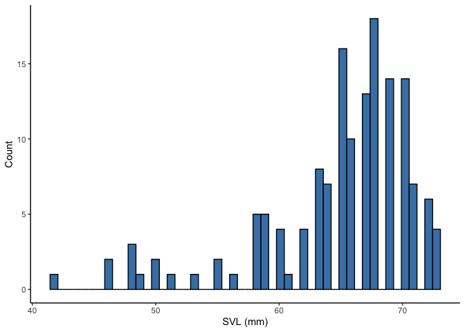<!-- -->

``` r
simple.eda(all_data_wide$SVL_mm)
```

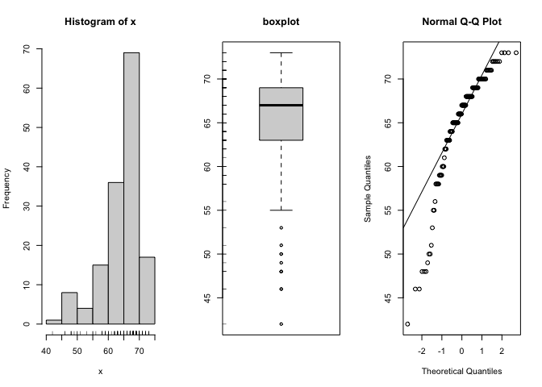<!-- -->

``` r
# Normality test if p > .05, data is normal. Data is not normal.
shapiro.test(all_data_wide$SVL_mm)
```

    ## 
    ##  Shapiro-Wilk normality test
    ## 
    ## data:  all_data_wide$SVL_mm
    ## W = 0.85594, p-value = 8.234e-11

### Mass

slightly skewed left, but nearly a bell curve

``` r
all_data_wide %>%
  ggplot(., aes(x = mass_g)) +
  geom_histogram(color = "black", fill="steelblue", bins=50) + 
  theme_classic() +
  xlab("Mass (g)") + 
  ylab("Count")
```

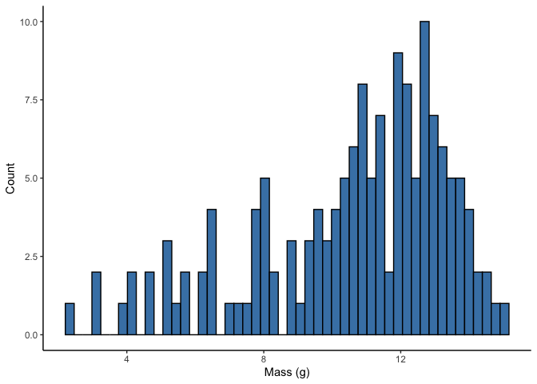<!-- -->

``` r
simple.eda(all_data_wide$mass_g)
```

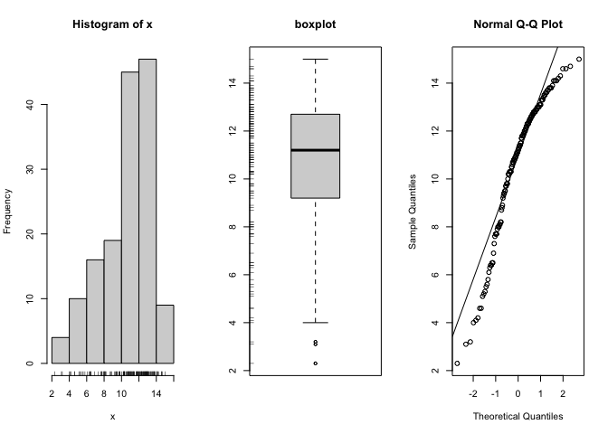<!-- -->

``` r
# Normality test if p > .05, data is normal. Data is not normal.
shapiro.test(all_data_wide$mass_g)
```

    ## 
    ##  Shapiro-Wilk normality test
    ## 
    ## data:  all_data_wide$mass_g
    ## W = 0.92647, p-value = 5.679e-07

### Hematocrit

looks pretty normally distributed around \~35%, but not statistically
normal

``` r
all_data_wide %>%
  ggplot(., aes(x = hematocrit_percent)) +
  geom_histogram(color = "black", fill="steelblue", bins=50) + 
  theme_classic() +
  xlab("Hematocrit (%)") + 
  ylab("Count")
```

    ## Warning: Removed 27 rows containing non-finite values (stat_bin).

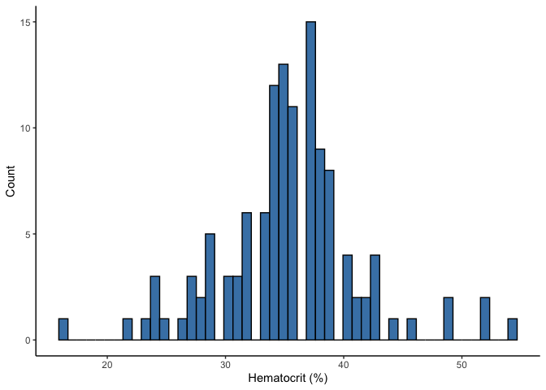<!-- -->

``` r
simple.eda(all_data_wide$hematocrit_percent)
```

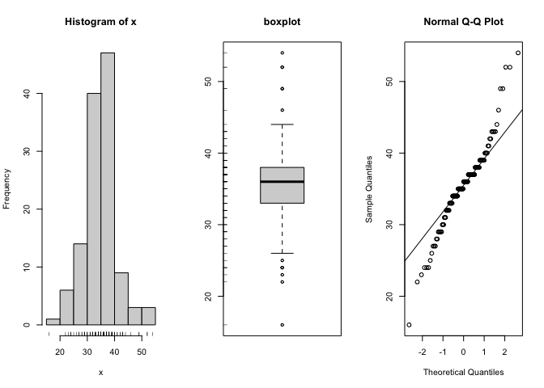<!-- -->

``` r
# Normality test if p > .05, data is normal. Data is not normal
shapiro.test(all_data_wide$hematocrit_percent)
```

    ## 
    ##  Shapiro-Wilk normality test
    ## 
    ## data:  all_data_wide$hematocrit_percent
    ## W = 0.95706, p-value = 0.0006198

### Osmolality

pretty normally distributed around \~370: only variable to pass
normality test (LOL)

``` r
all_data_wide %>%
  ggplot(., aes(x = osmolality_mmol_kg)) +
  geom_histogram(color = "black", fill="steelblue", bins=50) + 
  theme_classic() +
  xlab("Osmolality (mmol/kg)") + 
  ylab("Count")
```

    ## Warning: Removed 3 rows containing non-finite values (stat_bin).

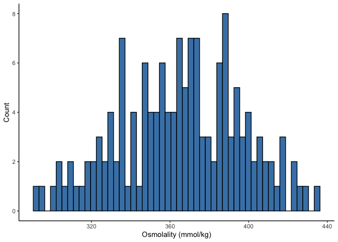<!-- -->

``` r
simple.eda(all_data_wide$osmolality_mmol_kg)
```

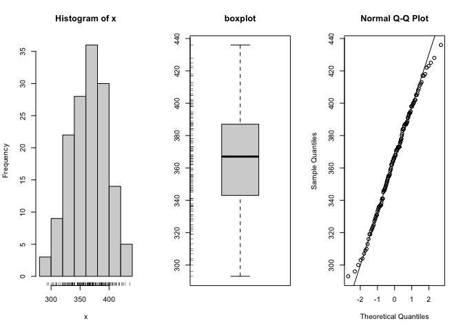<!-- -->

``` r
# Normality test if p > .05, data is normal. Data is normal
shapiro.test(all_data_wide$osmolality_mmol_kg)
```

    ## 
    ##  Shapiro-Wilk normality test
    ## 
    ## data:  all_data_wide$osmolality_mmol_kg
    ## W = 0.99173, p-value = 0.5498

### Cloacal Temperature

seems normally distributed, but not normal

``` r
all_data_wide %>%
  ggplot(., aes(x = cloacal_temp_C)) +
  geom_histogram(color = "black", fill="steelblue", bins=10) + 
  theme_classic() +
  xlab("cloacal temperature (C)") + 
  ylab("Count")
```

    ## Warning: Removed 7 rows containing non-finite values (stat_bin).

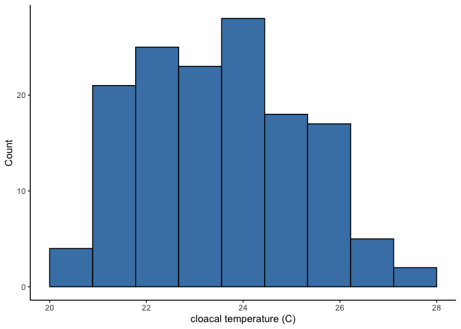<!-- -->

``` r
simple.eda(all_data_wide$cloacal_temp_C)
```

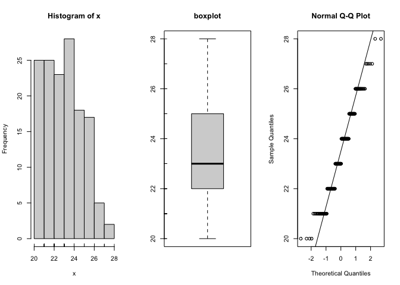<!-- -->

``` r
# Normality test if p > .05, data is normal. Data is not normal
shapiro.test(all_data_wide$cloacal_temp_C)
```

    ## 
    ##  Shapiro-Wilk normality test
    ## 
    ## data:  all_data_wide$cloacal_temp_C
    ## W = 0.95594, p-value = 0.0001569

### CEWL

``` r
all_data_long %>%
  ggplot(., aes(x = TEWL_g_m2h)) +
  geom_histogram(color = "black", fill="steelblue", bins=50) + 
  theme_classic() +
  xlab("TEWL_g_m2h") + 
  ylab("Count")
```

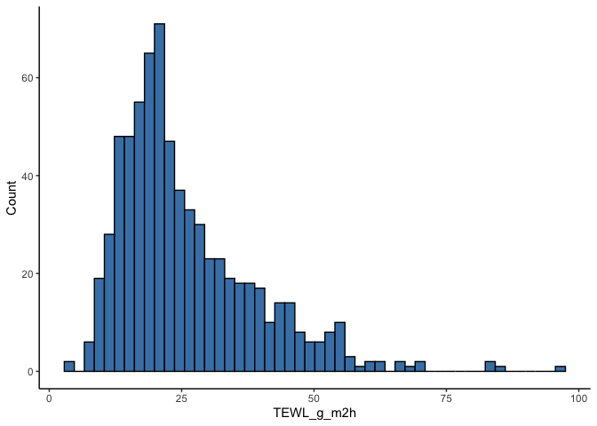<!-- -->

``` r
simple.eda(all_data_long$TEWL_g_m2h)
```

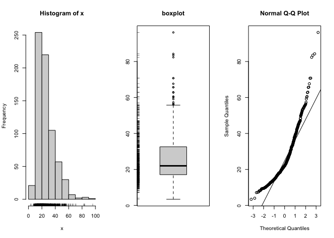<!-- -->

``` r
# Normality test if p > .05, data is normal. Data is not normal
shapiro.test(all_data_long$TEWL_g_m2h)
```

    ## 
    ##  Shapiro-Wilk normality test
    ## 
    ## data:  all_data_long$TEWL_g_m2h
    ## W = 0.89587, p-value < 2.2e-16

``` r
# Log transformation
shapiro.test(log(all_data_long$TEWL_g_m2h))
```

    ## 
    ##  Shapiro-Wilk normality test
    ## 
    ## data:  log(all_data_long$TEWL_g_m2h)
    ## W = 0.99378, p-value = 0.00548

``` r
# p-value improves to  0.00548, but is still significant
```

### Dewlap CEWL

very skewed to the right

``` r
all_data_wide %>%
  ggplot(., aes(x = dewlap_TEWL_g_m2h)) +
  geom_histogram(color = "black", fill="steelblue", bins=50) + 
  theme_classic() +
  xlab("Dewlap CEWL (g/m^2/h)") + 
  ylab("Count")
```

    ## Warning: Removed 19 rows containing non-finite values (stat_bin).

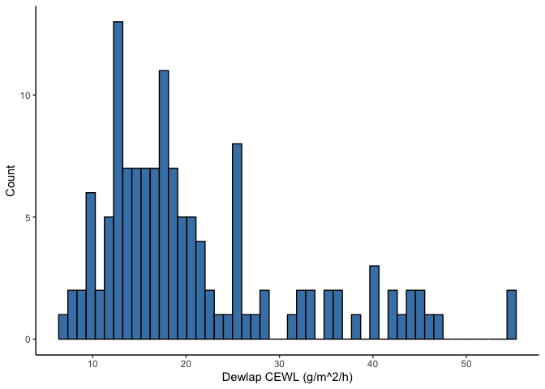<!-- -->

``` r
simple.eda(all_data_wide$dewlap_TEWL_g_m2h)
```

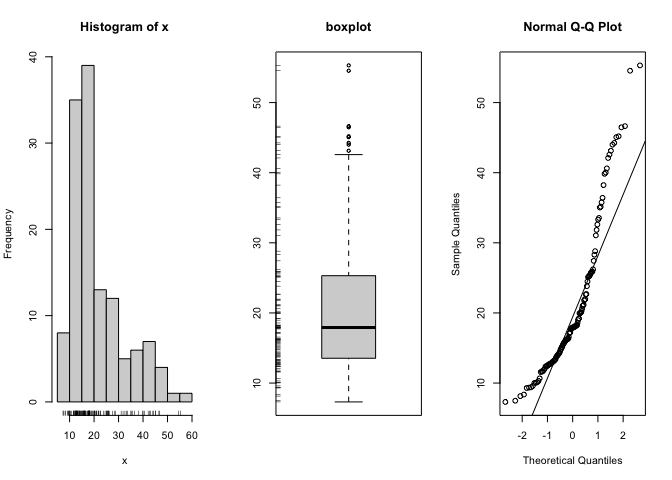<!-- -->

``` r
# Normality test if p > .05, data is normal. Data is not normal
shapiro.test(all_data_wide$dewlap_TEWL_g_m2h)
```

    ## 
    ##  Shapiro-Wilk normality test
    ## 
    ## data:  all_data_wide$dewlap_TEWL_g_m2h
    ## W = 0.86385, p-value = 1.274e-09

``` r
# Log transformation
shapiro.test(log(all_data_wide$dewlap_TEWL_g_m2h))
```

    ## 
    ##  Shapiro-Wilk normality test
    ## 
    ## data:  log(all_data_wide$dewlap_TEWL_g_m2h)
    ## W = 0.97085, p-value = 0.006401

``` r
# p-value improves to 0.007235, but is still significant
```

### Dorsum CEWL

slightly skewed to the right

``` r
all_data_wide %>%
  ggplot(., aes(x = dorsum_TEWL_g_m2h)) +
  geom_histogram(color = "black", fill="steelblue", bins=40) + 
  theme_classic() +
  xlab("Dorsum CEWL (g/m^2/h)") + 
  ylab("Count")
```

    ## Warning: Removed 16 rows containing non-finite values (stat_bin).

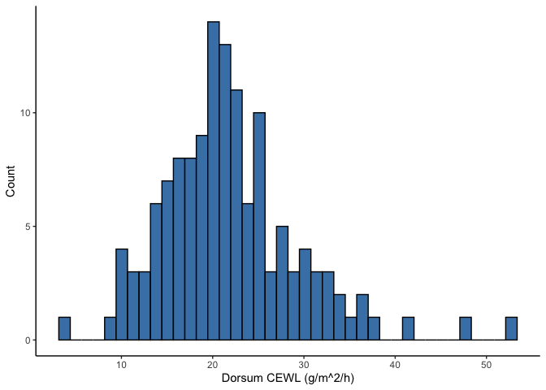<!-- -->

``` r
simple.eda(all_data_wide$dorsum_TEWL_g_m2h)
```

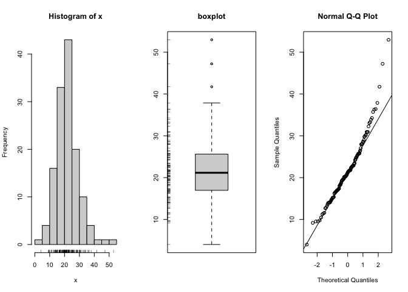<!-- -->

``` r
# Normality test if p > .05, data is normal. Data is not normal
shapiro.test(all_data_wide$dorsum_TEWL_g_m2h)
```

    ## 
    ##  Shapiro-Wilk normality test
    ## 
    ## data:  all_data_wide$dorsum_TEWL_g_m2h
    ## W = 0.95232, p-value = 0.0001341

``` r
# log transform
shapiro.test(log(all_data_wide$dorsum_TEWL_g_m2h))
```

    ## 
    ##  Shapiro-Wilk normality test
    ## 
    ## data:  log(all_data_wide$dorsum_TEWL_g_m2h)
    ## W = 0.96297, p-value = 0.001053

### Head CEWL

very skewed to the right

``` r
all_data_wide %>%
  ggplot(., aes(x = head_TEWL_g_m2h)) +
  geom_histogram(color = "black", fill="steelblue", bins=40) + 
  theme_classic() +
  xlab("Head CEWL (g/m^2/h)") + 
  ylab("Count")
```

    ## Warning: Removed 16 rows containing non-finite values (stat_bin).

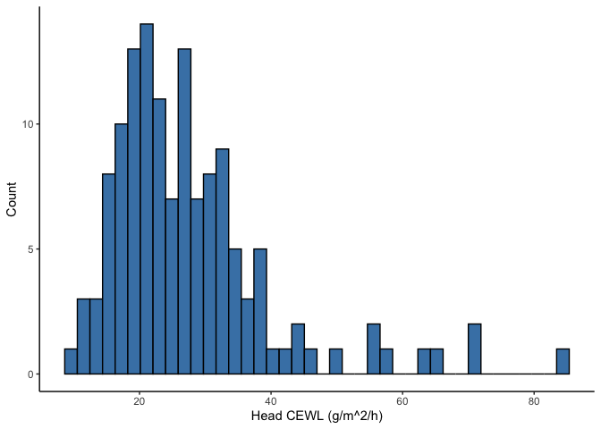<!-- -->

``` r
simple.eda(all_data_wide$head_TEWL_g_m2h)
```

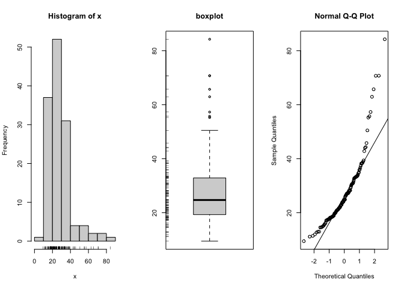<!-- -->

``` r
# Normality test if p > .05, data is normal. Data is not normal
shapiro.test(all_data_wide$head_TEWL_g_m2h)
```

    ## 
    ##  Shapiro-Wilk normality test
    ## 
    ## data:  all_data_wide$head_TEWL_g_m2h
    ## W = 0.84342, p-value = 1.274e-10

``` r
# Log transform made data normal
shapiro.test(log(all_data_wide$head_TEWL_g_m2h))
```

    ## 
    ##  Shapiro-Wilk normality test
    ## 
    ## data:  log(all_data_wide$head_TEWL_g_m2h)
    ## W = 0.98363, p-value = 0.1084

### Mite Patch CEWL

very skewed to the right

``` r
all_data_wide %>%
  ggplot(., aes(x = mitepatch_TEWL_g_m2h)) +
  geom_histogram(color = "black", fill="steelblue", bins=40) + 
  theme_classic() +
  xlab("Mite Patch CEWL (g/m^2/h)") + 
  ylab("Count")
```

    ## Warning: Removed 20 rows containing non-finite values (stat_bin).

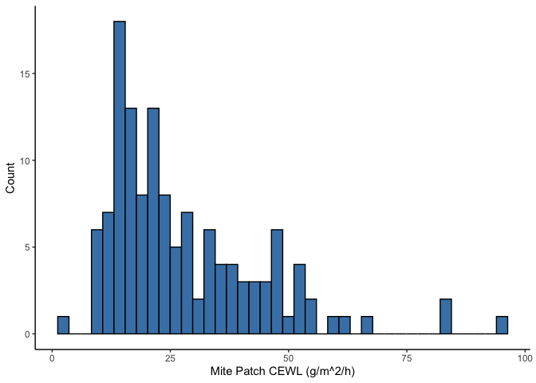<!-- -->

``` r
simple.eda(all_data_wide$mitepatch_TEWL_g_m2h)
```

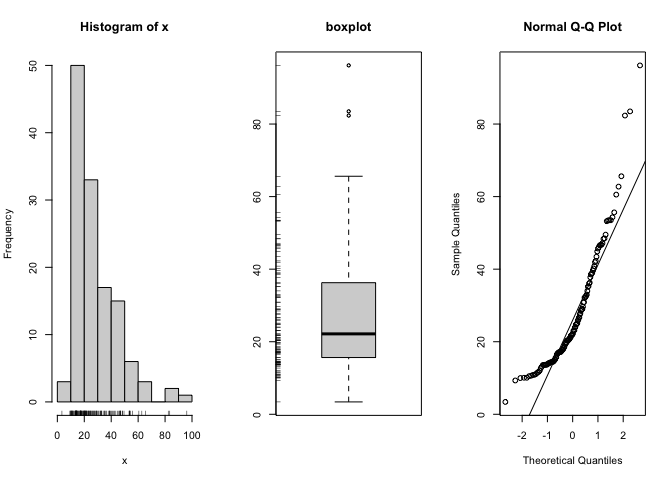<!-- -->

``` r
# Normality test if p > .05, data is normal. Data is not normal
shapiro.test(all_data_wide$mitepatch_TEWL_g_m2h)
```

    ## 
    ##  Shapiro-Wilk normality test
    ## 
    ## data:  all_data_wide$mitepatch_TEWL_g_m2h
    ## W = 0.87095, p-value = 2.931e-09

``` r
# Log transform p-0.04107, close to being normal
shapiro.test(log(all_data_wide$mitepatch_TEWL_g_m2h))
```

    ## 
    ##  Shapiro-Wilk normality test
    ## 
    ## data:  log(all_data_wide$mitepatch_TEWL_g_m2h)
    ## W = 0.9807, p-value = 0.06117

### Ventrum CEWL

slightly skewed to the right, somewhat evenly distributed, but not
statistically normal

``` r
all_data_wide %>%
  ggplot(., aes(x = ventrum_TEWL_g_m2h)) +
  geom_histogram(color = "black", fill="steelblue", bins=30) + 
  theme_classic() +
  xlab("Ventrum CEWL (g/m^2/h)") + 
  ylab("Count")
```

    ## Warning: Removed 16 rows containing non-finite values (stat_bin).

<!-- -->

``` r
simple.eda(all_data_wide$ventrum_TEWL_g_m2h)
```

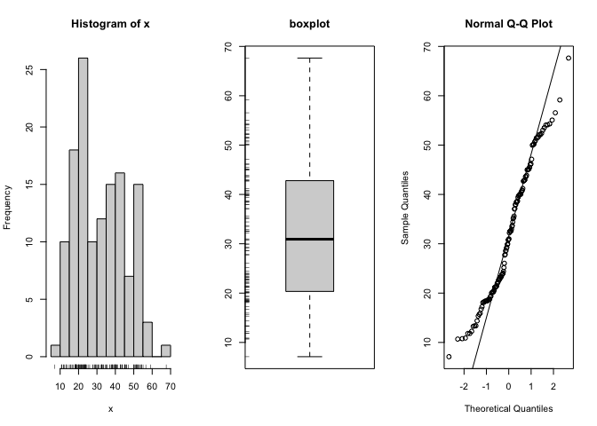<!-- -->

``` r
# Normality test if p > .05, data is normal. Data is not normal
shapiro.test(all_data_wide$ventrum_TEWL_g_m2h)
```

    ## 
    ##  Shapiro-Wilk normality test
    ## 
    ## data:  all_data_wide$ventrum_TEWL_g_m2h
    ## W = 0.96126, p-value = 0.0007451

``` r
# log transform didnt work 0.0006058
shapiro.test(log(all_data_wide$ventrum_TEWL_g_m2h))
```

    ## 
    ##  Shapiro-Wilk normality test
    ## 
    ## data:  log(all_data_wide$ventrum_TEWL_g_m2h)
    ## W = 0.96095, p-value = 0.0007015

### Temperature

not normal

``` r
all_data_wide %>%
  ggplot(., aes(x = temp_C_interpol)) +
  geom_histogram(color = "black", fill="steelblue", bins=30) + 
  theme_classic() +
  xlab("Temperature (C)") + 
  ylab("Count")
```

    ## Warning: Removed 3 rows containing non-finite values (stat_bin).

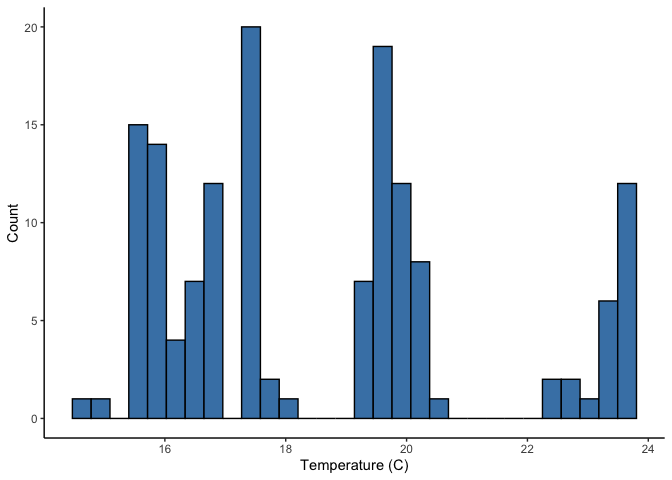<!-- -->

``` r
simple.eda(all_data_wide$temp_C_interpol)
```

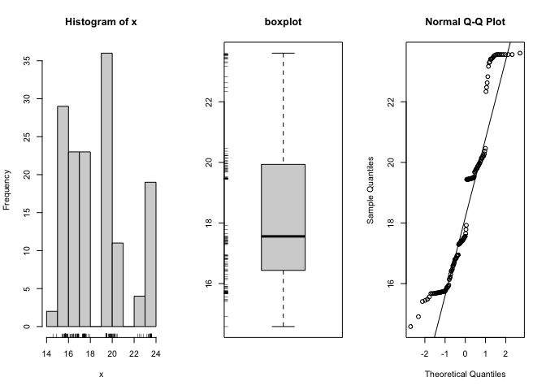<!-- -->

``` r
# Normality test if p > .05, data is normal. Data is not normal
shapiro.test(all_data_wide$temp_C_interpol)
```

    ## 
    ##  Shapiro-Wilk normality test
    ## 
    ## data:  all_data_wide$temp_C_interpol
    ## W = 0.89544, p-value = 9.576e-09

``` r
# log transform 
shapiro.test(log(all_data_wide$temp_C_interpol))
```

    ## 
    ##  Shapiro-Wilk normality test
    ## 
    ## data:  log(all_data_wide$temp_C_interpol)
    ## W = 0.91367, p-value = 1.077e-07

### Humidity

not normal

``` r
all_data_wide %>%
  ggplot(., aes(x = abs_humidity_g_m3_interpol)) +
  geom_histogram(color = "black", fill="steelblue", bins=30) + 
  theme_classic() +
  xlab("Absolute Humidity (g/m^3)") + 
  ylab("Count")
```

    ## Warning: Removed 3 rows containing non-finite values (stat_bin).

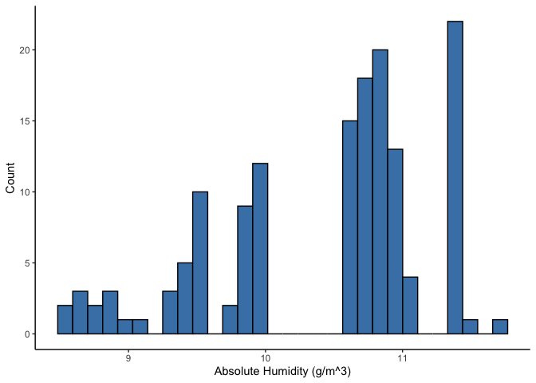<!-- -->

``` r
simple.eda(all_data_wide$abs_humidity_g_m3_interpol)
```

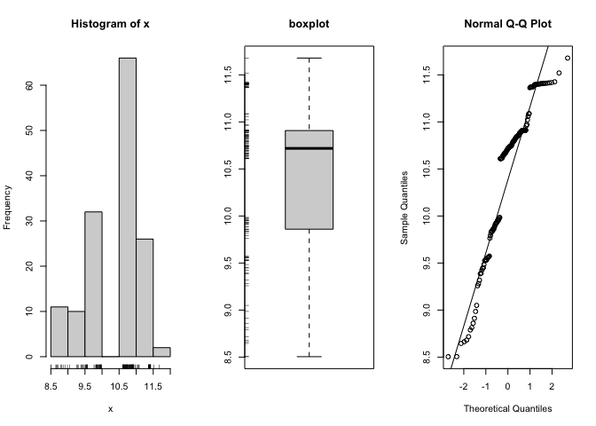<!-- -->

``` r
# Normality test if p > .05, data is normal. Data is not normal
shapiro.test(all_data_wide$abs_humidity_g_m3_interpol)
```

    ## 
    ##  Shapiro-Wilk normality test
    ## 
    ## data:  all_data_wide$abs_humidity_g_m3_interpol
    ## W = 0.91002, p-value = 6.486e-08

``` r
# Doesn't fix non normality
shapiro.test(log(all_data_wide$abs_humidity_g_m3_interpol))
```

    ## 
    ##  Shapiro-Wilk normality test
    ## 
    ## data:  log(all_data_wide$abs_humidity_g_m3_interpol)
    ## W = 0.89772, p-value = 1.277e-08

### Wind

not normal

``` r
all_data_wide %>%
  ggplot(., aes(x = Wind_mph_interpol)) +
  geom_histogram(color = "black", fill="steelblue", bins=30) + 
  theme_classic() +
  xlab("Wind Speed (mph)") + 
  ylab("Count")
```

    ## Warning: Removed 3 rows containing non-finite values (stat_bin).

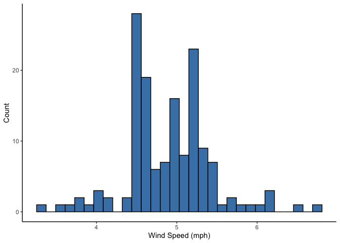<!-- -->

``` r
simple.eda(all_data_wide$Wind_mph_interpol)
```

<!-- -->

``` r
# Normality test if p > .05, data is normal. Data is not normal
shapiro.test(all_data_wide$Wind_mph_interpol)
```

    ## 
    ##  Shapiro-Wilk normality test
    ## 
    ## data:  all_data_wide$Wind_mph_interpol
    ## W = 0.96051, p-value = 0.0003199

``` r
# ln transformation doesn't fix non normality
shapiro.test(log(all_data_wide$Wind_mph_interpol))
```

    ## 
    ##  Shapiro-Wilk normality test
    ## 
    ## data:  log(all_data_wide$Wind_mph_interpol)
    ## W = 0.95738, p-value = 0.0001672

### Solar Radiation

not normal

``` r
all_data_wide %>%
  ggplot(., aes(x = Solar_rad_Wm2_interpol)) +
  geom_histogram(color = "black", fill="steelblue", bins=30) + 
  theme_classic() +
  xlab("Solar Radiation (W/m^2)") + 
  ylab("Count")
```

    ## Warning: Removed 3 rows containing non-finite values (stat_bin).

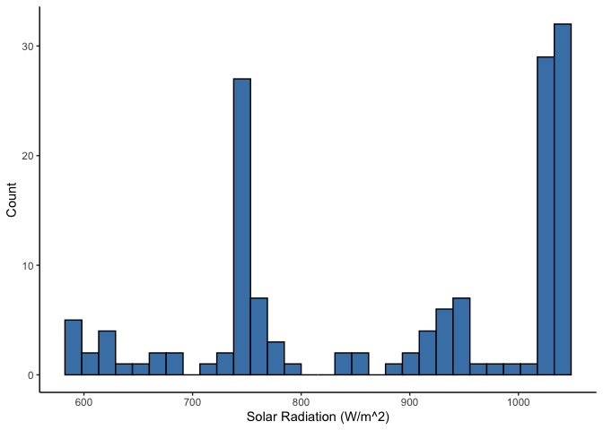<!-- -->

``` r
simple.eda(all_data_wide$Solar_rad_Wm2_interpol)
```

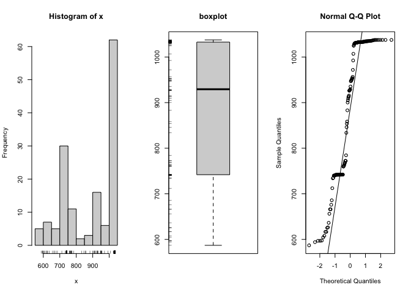<!-- -->

``` r
# Normality test if p > .05, data is normal. Data is not normal
shapiro.test(all_data_wide$Solar_rad_Wm2_interpol)
```

    ## 
    ##  Shapiro-Wilk normality test
    ## 
    ## data:  all_data_wide$Solar_rad_Wm2_interpol
    ## W = 0.82847, p-value = 7.895e-12

``` r
# Doesn't fix non normality
shapiro.test(log(all_data_wide$Solar_rad_Wm2_interpol))
```

    ## 
    ##  Shapiro-Wilk normality test
    ## 
    ## data:  log(all_data_wide$Solar_rad_Wm2_interpol)
    ## W = 0.8283, p-value = 7.779e-12

## Conclusion

Osmolality was the only normally distributed variable.

The following variables were each had non-normal distributions: - SVL
(skewed left) - mass (skewed left) - hct (skewed both ways??) - cloacal
temp (skewed right) - CEWL overall (skewed right) - CEWL for each region
individually (skewed right) - capture temp (multimodal) - capture
humidity (multimodal and skewed left) - wind speed (multimodal) - solar
radiation (multimodal)

This will be important to keep in mind going forward. Once we have our
model, we will need to very very carefully check assumptions.

## Transformations

Check whether simple log-transformations improve normality, then
investigate potential other transformations if log-transforming does not
work.

### SVL

Was very skewed left.

``` r
# log transform
SVL_transf <- morpho_blood_dat %>%
  dplyr::select(SVL_mm) %>%
  mutate(SVL_transf = log10(SVL_mm))

# check normality again
SVL_transf %>%
  ggplot(., aes(x = SVL_transf)) +
  geom_histogram(color = "black", fill="steelblue", bins=50) + 
  theme_classic() +
  xlab("Log-transformed SVL (mm)") + 
  ylab("Count")
```

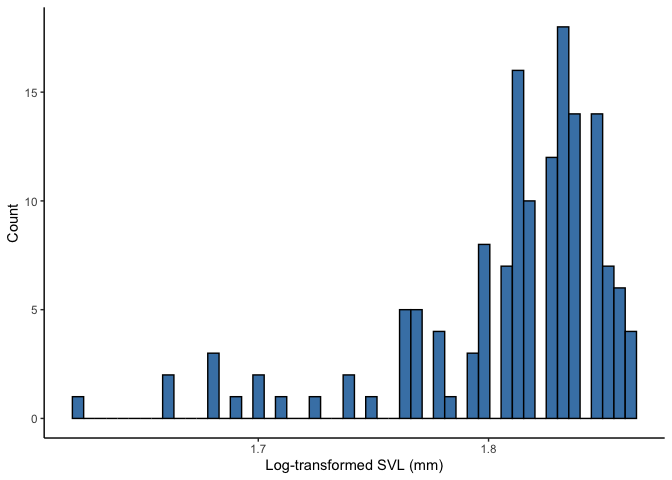<!-- -->

``` r
simple.eda(SVL_transf$SVL_transf)
```

<!-- -->

``` r
shapiro.test(SVL_transf$SVL_transf)
```

    ## 
    ##  Shapiro-Wilk normality test
    ## 
    ## data:  SVL_transf$SVL_transf
    ## W = 0.80953, p-value = 1.343e-12

It looks exactly the same as the original disribution using ln or log10.
Next, try 1/SVL:

``` r
# reciprocal transform
SVL_transf2 <- morpho_blood_dat %>%
  dplyr::select(SVL_mm) %>%
  mutate(SVL_transf = 1/(SVL_mm))

# check normality again
SVL_transf2 %>%
  ggplot(., aes(x = SVL_transf)) +
  geom_histogram(color = "black", fill="steelblue", bins=50) + 
  theme_classic() +
  xlab("1/ SVL (mm)") + 
  ylab("Count")
```

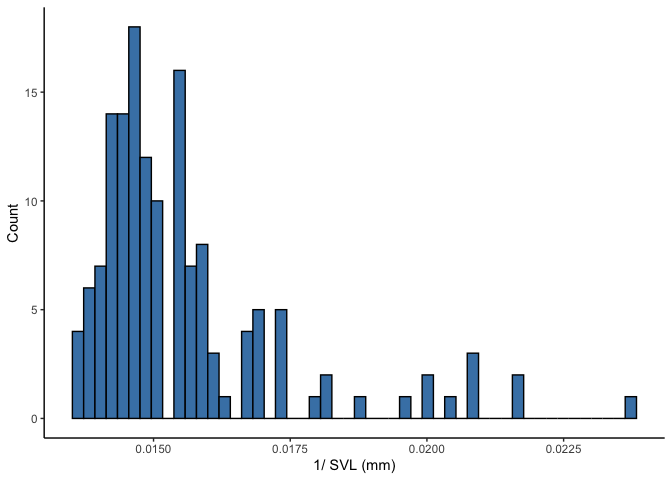<!-- -->

``` r
simple.eda(SVL_transf2$SVL_transf)
```

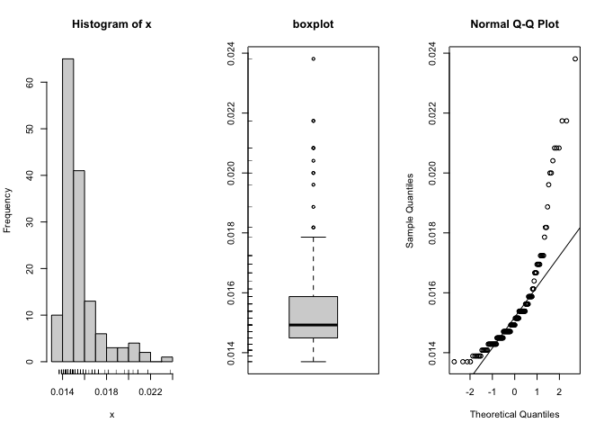<!-- -->

``` r
shapiro.test(SVL_transf2$SVL_transf)
```

    ## 
    ##  Shapiro-Wilk normality test
    ## 
    ## data:  SVL_transf2$SVL_transf
    ## W = 0.75819, p-value = 2.462e-14

Now the skew is just the other direction…

Try box-cox:

``` r
SVL_SLR <- lm(SVL_mm ~ 1, data = morpho_blood_dat)

MASS::boxcox(SVL_SLR, lambda = seq(6.5, 7, by = 0.1))
```

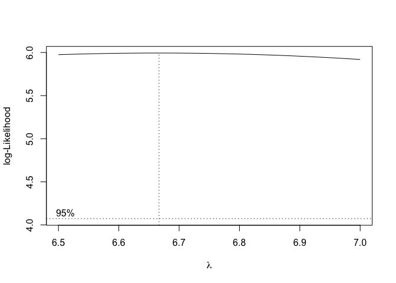<!-- -->

Try a transformation of SVL^6.7:

``` r
# boxcox lambda = 6.7 transform
SVL_transf3 <- morpho_blood_dat %>%
  dplyr::select(SVL_mm) %>%
  mutate(SVL_transf = (SVL_mm)^6.7)

# check normality again
SVL_transf3 %>%
  ggplot(., aes(x = SVL_transf)) +
  geom_histogram(color = "black", fill="steelblue", bins=50) + 
  theme_classic() +
  xlab("1/ SVL (mm)") + 
  ylab("Count")
```

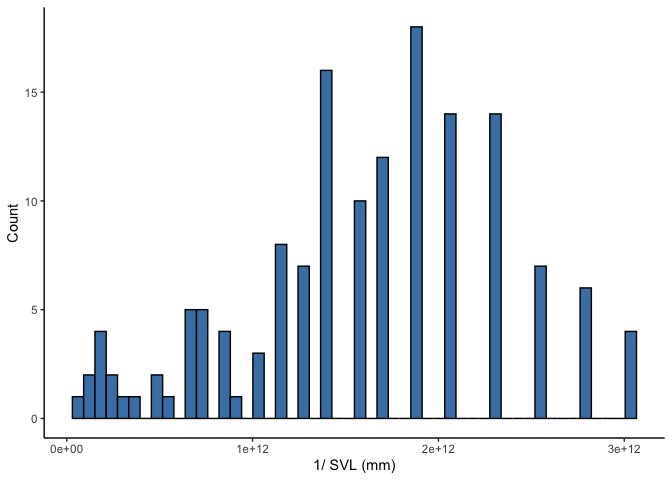<!-- -->

``` r
simple.eda(SVL_transf3$SVL_transf)
```

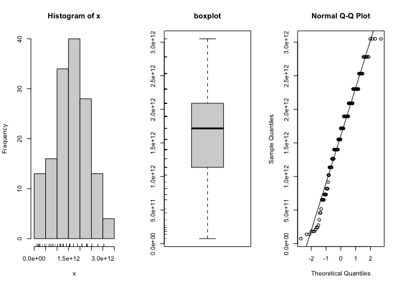<!-- -->

``` r
shapiro.test(SVL_transf3$SVL_transf)
```

    ## 
    ##  Shapiro-Wilk normality test
    ## 
    ## data:  SVL_transf3$SVL_transf
    ## W = 0.97731, p-value = 0.01489

### mass

### hematocrit

### cloacal temperature

### dewlap CEWL

### dorsum CEWL

### head CEWL

### mite patch CEWL

### ventrum CEWL

# Basic Figs & GLMs

## What affects hydration & health?

Potential relationships: - Hct or Osml \~ SVL, mass, sex, gravidity,
eye, hemolyzed, week

### Hct \~ SVL

  - No sig relationship

<!-- end list -->

``` r
# plot
all_data_wide %>% 
  ggplot(data = .) + 
  geom_point(aes(x = SVL_mm,
                 y = hematocrit_percent, 
                 ), 
             size = 1, 
             alpha = 0.6) + 
  stat_smooth(aes(x = SVL_mm, 
                  y = hematocrit_percent, 
                  ), 
              formula = y ~ x, 
              method = "lm", 
              color = "gray",
              se = F, 
              size = 1.6, 
              alpha = 1 ) + 
  theme_classic() + 
  xlab("SVL") + 
  ylab("Hct") + 
  theme(text = element_text(color = "black", 
                            family = "sans", 
                            size = 12),
        axis.text = element_text(color = "black", 
                                 family = "sans", 
                                 size = 10),
        legend.text.align = 0,
)
```

    ## Warning: Removed 27 rows containing non-finite values (stat_smooth).

    ## Warning: Removed 27 rows containing missing values (geom_point).

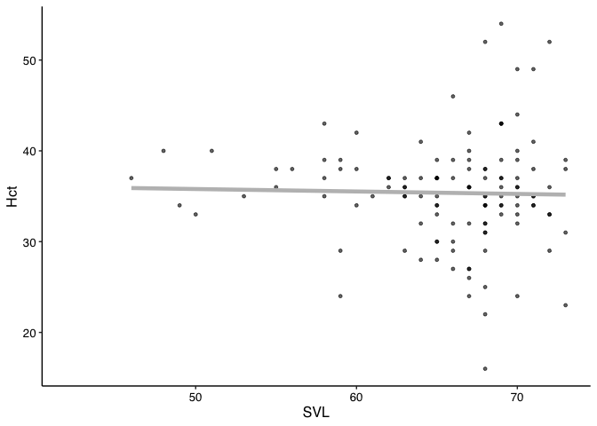<!-- -->

``` r
# glm
glm_hct_SVL <- lm(hematocrit_percent ~ SVL_mm,
           data = all_data_wide)
summary(glm_hct_SVL)
```

    ## 
    ## Call:
    ## lm(formula = hematocrit_percent ~ SVL_mm, data = all_data_wide)
    ## 
    ## Residuals:
    ##      Min       1Q   Median       3Q      Max 
    ## -19.3108  -2.5932   0.3395   2.6758  18.7161 
    ## 
    ## Coefficients:
    ##             Estimate Std. Error t value Pr(>|t|)    
    ## (Intercept) 37.14004    6.44832   5.760 6.53e-08 ***
    ## SVL_mm      -0.02690    0.09789  -0.275    0.784    
    ## ---
    ## Signif. codes:  0 '***' 0.001 '**' 0.01 '*' 0.05 '.' 0.1 ' ' 1
    ## 
    ## Residual standard error: 5.906 on 121 degrees of freedom
    ##   (27 observations deleted due to missingness)
    ## Multiple R-squared:  0.0006238,  Adjusted R-squared:  -0.007636 
    ## F-statistic: 0.07552 on 1 and 121 DF,  p-value: 0.7839

### Osml \~ SVL

  - no sig relationship

<!-- end list -->

``` r
all_data_wide %>% 
  ggplot(data = .) + 
  geom_point(aes(x = SVL_mm,
                 y = osmolality_mmol_kg, 
                 ), 
             size = 1, 
             alpha = 0.6) + 
  stat_smooth(aes(x = SVL_mm, 
                  y = osmolality_mmol_kg, 
                  ), 
              formula = y ~ x, 
              method = "lm", 
              color = "gray",
              se = F, 
              size = 1.6, 
              alpha = 1 ) + 
  theme_classic() + 
  xlab("SVL") + 
  ylab("Osmolality") + 
  theme(text = element_text(color = "black", 
                            family = "sans", 
                            size = 12),
        axis.text = element_text(color = "black", 
                                 family = "sans", 
                                 size = 10),
        legend.text.align = 0,
)
```

    ## Warning: Removed 3 rows containing non-finite values (stat_smooth).

    ## Warning: Removed 3 rows containing missing values (geom_point).

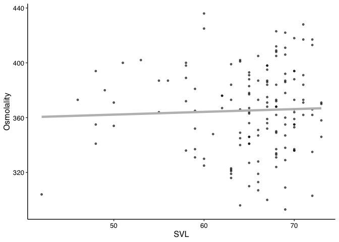<!-- -->

``` r
# glm
glm_osml_SVL <- lm(osmolality_mmol_kg ~ SVL_mm,
           data = all_data_wide)
summary(glm_osml_SVL)
```

    ## 
    ## Call:
    ## lm(formula = osmolality_mmol_kg ~ SVL_mm, data = all_data_wide)
    ## 
    ## Residuals:
    ##    Min     1Q Median     3Q    Max 
    ## -73.04 -20.82   1.77  22.27  71.78 
    ## 
    ## Coefficients:
    ##             Estimate Std. Error t value Pr(>|t|)    
    ## (Intercept) 352.1275    28.0395   12.56   <2e-16 ***
    ## SVL_mm        0.2016     0.4288    0.47    0.639    
    ## ---
    ## Signif. codes:  0 '***' 0.001 '**' 0.01 '*' 0.05 '.' 0.1 ' ' 1
    ## 
    ## Residual standard error: 31.19 on 145 degrees of freedom
    ##   (3 observations deleted due to missingness)
    ## Multiple R-squared:  0.001521,   Adjusted R-squared:  -0.005365 
    ## F-statistic: 0.2209 on 1 and 145 DF,  p-value: 0.639

### Hct \~ Mass

  - no sig relationship

<!-- end list -->

``` r
all_data_wide %>% 
  ggplot(data = .) + 
  geom_point(aes(x = mass_g,
                 y = hematocrit_percent, 
                 ), 
             size = 1, 
             alpha = 0.6) +
  stat_smooth(aes(x = mass_g, 
                  y = hematocrit_percent, 
                  ), 
              formula = y ~ x, 
              method = "lm", 
              color = "gray",
              se = F, 
              size = 1.6, 
              alpha = 1 ) + 
  theme_classic() + 
  xlab("Mass") + 
  ylab("Hematocrit") + 
  theme(text = element_text(color = "black", 
                            family = "sans", 
                            size = 12),
        axis.text = element_text(color = "black", 
                                 family = "sans", 
                                 size = 10),
        legend.text.align = 0,
)
```

    ## Warning: Removed 27 rows containing non-finite values (stat_smooth).

    ## Warning: Removed 27 rows containing missing values (geom_point).

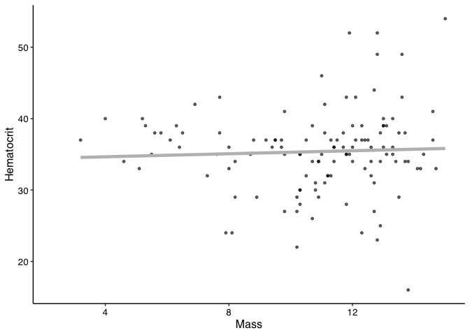<!-- -->

``` r
# glm
glm_hct_mass <- lm(hematocrit_percent ~ mass_g,
           data = all_data_wide)
summary(glm_hct_mass)
```

    ## 
    ## Call:
    ## lm(formula = hematocrit_percent ~ mass_g, data = all_data_wide)
    ## 
    ## Residuals:
    ##      Min       1Q   Median       3Q      Max 
    ## -19.6926  -2.7614   0.3604   2.7735  18.1803 
    ## 
    ## Coefficients:
    ##             Estimate Std. Error t value Pr(>|t|)    
    ## (Intercept)  34.2307     2.2835  14.991   <2e-16 ***
    ## mass_g        0.1059     0.2058   0.515    0.608    
    ## ---
    ## Signif. codes:  0 '***' 0.001 '**' 0.01 '*' 0.05 '.' 0.1 ' ' 1
    ## 
    ## Residual standard error: 5.901 on 121 degrees of freedom
    ##   (27 observations deleted due to missingness)
    ## Multiple R-squared:  0.002186,   Adjusted R-squared:  -0.00606 
    ## F-statistic: 0.2651 on 1 and 121 DF,  p-value: 0.6076

### Osml \~ Mass

  - no sig relationship

<!-- end list -->

``` r
all_data_wide %>% 
  ggplot(data = .) + 
  geom_point(aes(x = mass_g,
                 y = osmolality_mmol_kg, 
                 ), 
             size = 1, 
             alpha = 0.6) + 
  stat_smooth(aes(x = mass_g, 
                  y = osmolality_mmol_kg), 
              formula = y ~ x, 
              method = "lm", 
              se = F, 
              color = "gray",
              size = 1.6, 
              alpha = 1 ) + 
  theme_classic() + 
  xlab("Mass") + 
  ylab("Osmolality") + 
  theme(text = element_text(color = "black", 
                            family = "sans", 
                            size = 12),
        axis.text = element_text(color = "black", 
                                 family = "sans", 
                                 size = 10),
        legend.text.align = 0,
)
```

    ## Warning: Removed 3 rows containing non-finite values (stat_smooth).

    ## Warning: Removed 3 rows containing missing values (geom_point).

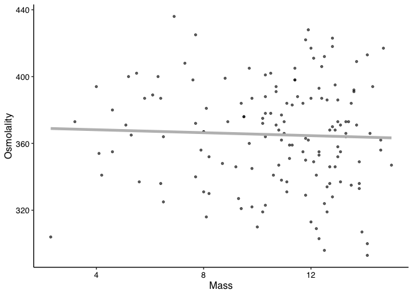<!-- -->

``` r
# glm
glm_osml_mass <- lm(osmolality_mmol_kg ~ mass_g,
           data = all_data_wide)
summary(glm_osml_mass)
```

    ## 
    ## Call:
    ## lm(formula = osmolality_mmol_kg ~ mass_g, data = all_data_wide)
    ## 
    ## Residuals:
    ##     Min      1Q  Median      3Q     Max 
    ## -70.719 -22.087   1.928  22.075  69.104 
    ## 
    ## Coefficients:
    ##             Estimate Std. Error t value Pr(>|t|)    
    ## (Intercept) 369.9414    10.1201  36.555   <2e-16 ***
    ## mass_g       -0.4413     0.9210  -0.479    0.633    
    ## ---
    ## Signif. codes:  0 '***' 0.001 '**' 0.01 '*' 0.05 '.' 0.1 ' ' 1
    ## 
    ## Residual standard error: 31.18 on 145 degrees of freedom
    ##   (3 observations deleted due to missingness)
    ## Multiple R-squared:  0.001581,   Adjusted R-squared:  -0.005305 
    ## F-statistic: 0.2296 on 1 and 145 DF,  p-value: 0.6326

### Hct \~ Sex

  - sig relationship, males have a higher hematocrit %

<!-- end list -->

``` r
all_data_wide %>% 
  ggplot(data = .) + 
  geom_boxplot(aes(x = sex_M_F, 
                   y = hematocrit_percent, 
                   color = sex_M_F
                   ), 
               size = 1,
               alpha = 1) + 
  theme_classic() + 
  xlab("Sex") + 
  ylab("Hematocrit (%)") + 
  annotate("text", x = 1.5, y = 45, 
           label = "paste(italic(p), \" = 0.0152\")", 
           parse = TRUE,
           size = 6) +
  ylim(10, 50) +
  scale_x_discrete(labels = c("F" = "Female",
                              "M" = "Male")) +
  scale_color_brewer(palette = "Set2") +
  theme(text = element_text(color = "black", 
                            family = "sans", 
                            size = 18),
        axis.text = element_text(color = "black", 
                                 family = "sans", 
                                 size = 14),
        legend.text.align = 0,
        legend.position = "none"
) -> hct_sex_fig
hct_sex_fig
```

    ## Warning: Removed 30 rows containing non-finite values (stat_boxplot).

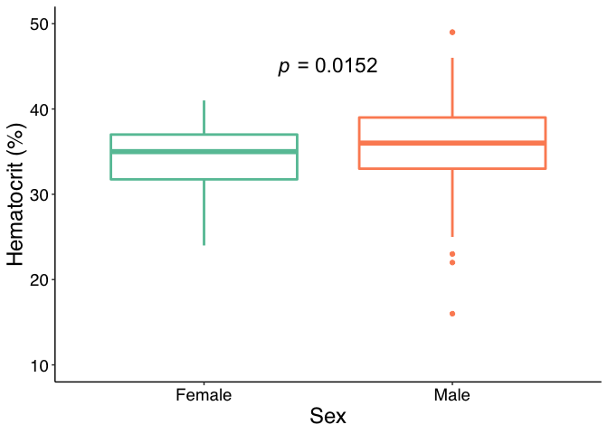<!-- -->

``` r
# export figure
#ggsave(filename = "hct_sex_fig.tiff",
 #      plot = hct_sex_fig,
  #     path = "./final_figures",
   #    device = "tiff",
    #   dpi = 1200,
     #  width = 6, height = 4)

# glms
aov_hct_sex <- aov(hematocrit_percent ~ sex_M_F,
           data = all_data_wide)
TukeyHSD(aov_hct_sex) # this is the stat to present
```

    ##   Tukey multiple comparisons of means
    ##     95% family-wise confidence level
    ## 
    ## Fit: aov(formula = hematocrit_percent ~ sex_M_F, data = all_data_wide)
    ## 
    ## $sex_M_F
    ##         diff       lwr      upr     p adj
    ## M-F 2.670023 0.5230915 4.816954 0.0152201

``` r
glm_hct_sex_mass <- glm(hematocrit_percent ~ sex_M_F*mass_g - mass_g,
           data = all_data_wide)
summary(glm_hct_sex_mass)
```

    ## 
    ## Call:
    ## glm(formula = hematocrit_percent ~ sex_M_F * mass_g - mass_g, 
    ##     data = all_data_wide)
    ## 
    ## Deviance Residuals: 
    ##      Min        1Q    Median        3Q       Max  
    ## -20.6295   -2.6209    0.6418    3.1033   17.2318  
    ## 
    ## Coefficients:
    ##                 Estimate Std. Error t value Pr(>|t|)    
    ## (Intercept)      35.9163     3.6925   9.727   <2e-16 ***
    ## sex_M_FM         -0.8820     4.7066  -0.187    0.852    
    ## sex_M_FF:mass_g  -0.2244     0.3567  -0.629    0.530    
    ## sex_M_FM:mass_g   0.1156     0.2539   0.455    0.650    
    ## ---
    ## Signif. codes:  0 '***' 0.001 '**' 0.01 '*' 0.05 '.' 0.1 ' ' 1
    ## 
    ## (Dispersion parameter for gaussian family taken to be 33.6223)
    ## 
    ##     Null deviance: 4222.8  on 122  degrees of freedom
    ## Residual deviance: 4001.1  on 119  degrees of freedom
    ##   (27 observations deleted due to missingness)
    ## AIC: 787.36
    ## 
    ## Number of Fisher Scoring iterations: 2

Hematocrit is significantly predicted by sex, but the interaction
between sex and mass is \~nonexistent.

### Osml \~ Sex

females have higher osmolarity (nonsig)

``` r
all_data_wide %>% 
  ggplot(data = .) + 
  geom_boxplot(aes(x = sex_M_F, 
                   y = osmolality_mmol_kg, 
                   color = sex_M_F
                   ), 
               size = 1,
               alpha = 0.6) + 
  scale_colour_manual(name = "Sex", 
                      values = c("green4", "salmon1") ) +
  theme_classic() + 
  xlab("Sex") + 
  ylab("Osmolality") + 
  theme(text = element_text(color = "black", family = "sans", size = 12),
        axis.text = element_text(color = "black", family = "sans", size = 10),
        legend.text.align = 0,
        legend.position = "none"
)
```

    ## Warning: Removed 3 rows containing non-finite values (stat_boxplot).

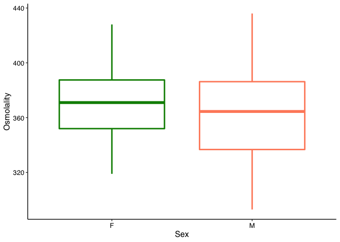<!-- -->

``` r
# glm
glm_osml_sex <- lm(osmolality_mmol_kg ~ sex_M_F,
           data = all_data_wide)
summary(glm_osml_sex)
```

    ## 
    ## Call:
    ## lm(formula = osmolality_mmol_kg ~ sex_M_F, data = all_data_wide)
    ## 
    ## Residuals:
    ##     Min      1Q  Median      3Q     Max 
    ## -69.120 -22.915   1.085  21.983  73.880 
    ## 
    ## Coefficients:
    ##             Estimate Std. Error t value Pr(>|t|)    
    ## (Intercept)  371.915      4.503  82.600   <2e-16 ***
    ## sex_M_FM      -9.795      5.459  -1.794   0.0749 .  
    ## ---
    ## Signif. codes:  0 '***' 0.001 '**' 0.01 '*' 0.05 '.' 0.1 ' ' 1
    ## 
    ## Residual standard error: 30.87 on 145 degrees of freedom
    ##   (3 observations deleted due to missingness)
    ## Multiple R-squared:  0.02172,    Adjusted R-squared:  0.01497 
    ## F-statistic: 3.219 on 1 and 145 DF,  p-value: 0.07486

### Hct \~ Gravidity

  - no sig diff

<!-- end list -->

``` r
all_data_wide %>% 
  dplyr::filter(sex_M_F == 'F') %>%
  ggplot(data = .) + 
  geom_boxplot(aes(x = gravid_Y_N, 
                   y = hematocrit_percent, 
                   color = gravid_Y_N
                   ), 
               size = 1,
               alpha = 0.6) + 
  scale_colour_manual(name = "Gravid", 
                      values = c("green4", "salmon1") ) +
  theme_classic() + 
  xlab("Gravid (Females Only)") + 
  ylab("Hematocrit") + 
  theme(text = element_text(color = "black", family = "sans", size = 12),
        axis.text = element_text(color = "black", family = "sans", size = 10),
        legend.text.align = 0,
        legend.position = "none"
)
```

    ## Warning: Removed 4 rows containing non-finite values (stat_boxplot).

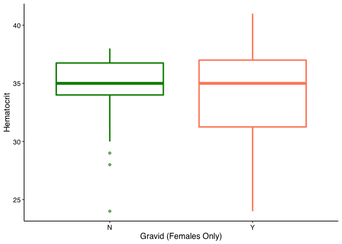<!-- -->

``` r
# glm
glm_hct_gravid <- lm(hematocrit_percent ~ gravid_Y_N,
           data = all_data_wide)
summary(glm_hct_gravid)
```

    ## 
    ## Call:
    ## lm(formula = hematocrit_percent ~ gravid_Y_N, data = all_data_wide)
    ## 
    ## Residuals:
    ##     Min      1Q  Median      3Q     Max 
    ## -10.111  -1.596   1.271   3.080   7.654 
    ## 
    ## Coefficients:
    ##             Estimate Std. Error t value Pr(>|t|)    
    ## (Intercept)   34.111      1.017  33.546   <2e-16 ***
    ## gravid_Y_NY   -0.765      1.323  -0.578    0.566    
    ## ---
    ## Signif. codes:  0 '***' 0.001 '**' 0.01 '*' 0.05 '.' 0.1 ' ' 1
    ## 
    ## Residual standard error: 4.314 on 42 degrees of freedom
    ##   (106 observations deleted due to missingness)
    ## Multiple R-squared:  0.0079, Adjusted R-squared:  -0.01572 
    ## F-statistic: 0.3344 on 1 and 42 DF,  p-value: 0.5662

### Osml \~ Gravidity

gravid F have higher osmolarity (nonsig)

``` r
all_data_wide %>% 
  dplyr::filter(sex_M_F == 'F') %>%
  ggplot(data = .) + 
  geom_boxplot(aes(x = gravid_Y_N, 
                   y = osmolality_mmol_kg, 
                   color = gravid_Y_N
                   ), 
               size = 1,
               alpha = 0.6) + 
  scale_colour_manual(name = "Gravid", 
                      values = c("green4", "salmon1") ) +
  theme_classic() + 
  xlab("Gravid (Females Only)") + 
  ylab("Osmolality") + 
  theme(text = element_text(color = "black", family = "sans", size = 12),
        axis.text = element_text(color = "black", family = "sans", size = 10),
        legend.text.align = 0,
        legend.position = "none"
)
```

    ## Warning: Removed 1 rows containing non-finite values (stat_boxplot).

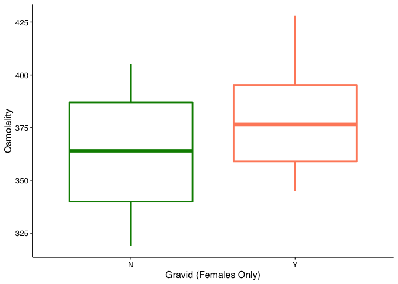<!-- -->

``` r
# glm
glm_osml_gravid <- lm(osmolality_mmol_kg ~ gravid_Y_N,
           data = all_data_wide)
summary(glm_osml_gravid)
```

    ## 
    ## Call:
    ## lm(formula = osmolality_mmol_kg ~ gravid_Y_N, data = all_data_wide)
    ## 
    ## Residuals:
    ##     Min      1Q  Median      3Q     Max 
    ## -45.333 -22.186  -0.333  22.667  49.962 
    ## 
    ## Coefficients:
    ##             Estimate Std. Error t value Pr(>|t|)    
    ## (Intercept)  364.333      5.604  65.011   <2e-16 ***
    ## gravid_Y_NY   13.705      7.535   1.819   0.0756 .  
    ## ---
    ## Signif. codes:  0 '***' 0.001 '**' 0.01 '*' 0.05 '.' 0.1 ' ' 1
    ## 
    ## Residual standard error: 25.68 on 45 degrees of freedom
    ##   (103 observations deleted due to missingness)
    ## Multiple R-squared:  0.06848,    Adjusted R-squared:  0.04778 
    ## F-statistic: 3.308 on 1 and 45 DF,  p-value: 0.07559

### Hct \~ Sample Eye

Actually, any blood samples not taken from the right eye ended up being
excluded or didn’t have hematocrit values, so we can’t test this
difference.

``` r
all_data_wide %>% 
  dplyr::filter(blood_sample_eye %in% c("R", "L")) %>%
  ggplot(data = .) + 
  geom_boxplot(aes(x = blood_sample_eye, 
                   y = hematocrit_percent, 
                   color = blood_sample_eye
                   ), 
               size = 1,
               alpha = 0.6) + 
  scale_colour_manual(name = "Blood Sample Eye", 
                      values = c("green4", "salmon1") ) +
  theme_classic() + 
  xlab("Blood Sample Eye") + 
  ylab("Hematocrit") + 
  theme(text = element_text(color = "black", family = "sans", size = 12),
        axis.text = element_text(color = "black", family = "sans", size = 10),
        legend.text.align = 0,
        legend.position = "none"
)
```

    ## Warning: Removed 27 rows containing non-finite values (stat_boxplot).

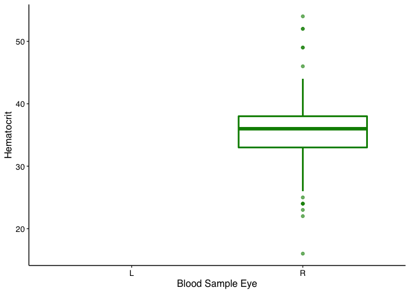<!-- -->

``` r
# can't do a glm
```

### Osml \~ Sample Eye

``` r
all_data_wide %>% 
  dplyr::filter(blood_sample_eye %in% c("R", "L")) %>%
  ggplot(data = .) + 
  geom_boxplot(aes(x = blood_sample_eye, 
                   y = osmolality_mmol_kg, 
                   color = blood_sample_eye
                   ), 
               size = 1,
               alpha = 0.6) + 
  scale_colour_manual(name = "Blood Sample Eye", 
                      values = c("green4", "salmon1") ) +
  theme_classic() + 
  xlab("Blood Sample Eye") + 
  ylab("Osmolality") + 
  theme(text = element_text(color = "black", family = "sans", size = 12),
        axis.text = element_text(color = "black", family = "sans", size = 10),
        legend.text.align = 0,
        legend.position = "none"
)
```

    ## Warning: Removed 3 rows containing non-finite values (stat_boxplot).

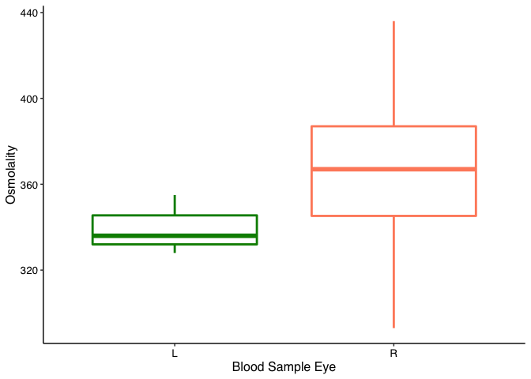<!-- -->

``` r
# glm
glm_osml_eye <- lm(osmolality_mmol_kg ~ blood_sample_eye,
           data = all_data_wide)
summary(glm_osml_eye)
```

    ## 
    ## Call:
    ## lm(formula = osmolality_mmol_kg ~ blood_sample_eye, data = all_data_wide)
    ## 
    ## Residuals:
    ##     Min      1Q  Median      3Q     Max 
    ## -72.296 -19.796   1.704  21.704  70.704 
    ## 
    ## Coefficients:
    ##                   Estimate Std. Error t value Pr(>|t|)    
    ## (Intercept)         400.50      21.79  18.377   <2e-16 ***
    ## blood_sample_eyeL   -60.83      28.13  -2.162   0.0323 *  
    ## blood_sample_eyeR   -35.20      21.95  -1.604   0.1109    
    ## ---
    ## Signif. codes:  0 '***' 0.001 '**' 0.01 '*' 0.05 '.' 0.1 ' ' 1
    ## 
    ## Residual standard error: 30.82 on 144 degrees of freedom
    ##   (3 observations deleted due to missingness)
    ## Multiple R-squared:  0.0315, Adjusted R-squared:  0.01805 
    ## F-statistic: 2.342 on 2 and 144 DF,  p-value: 0.0998

I wasn’t expecting this, and I’m not sure whether to actually include it
or not.

### Hct \~ Hemolyzed/Not

  - no sig diff

<!-- end list -->

``` r
all_data_wide %>% 
  dplyr::filter(hemolyzed %in% c("Y", "N")) %>%
  ggplot(data = .) + 
  geom_boxplot(aes(x = hemolyzed, 
                   y = hematocrit_percent, 
                   color = hemolyzed
                   ), 
               size = 1,
               alpha = 0.6) + 
  scale_colour_manual(name = "Blood Sample Eye", 
                      values = c("green4", "salmon1", "green4", "salmon1") ) +
  theme_classic() + 
  xlab("Whether or not Sample Hemolyzed") + 
  ylab("Hematocrit") + 
  theme(text = element_text(color = "black", family = "sans", size = 12),
        axis.text = element_text(color = "black", family = "sans", size = 10),
        legend.text.align = 0,
        legend.position = "none"
)
```

    ## Warning: Removed 25 rows containing non-finite values (stat_boxplot).

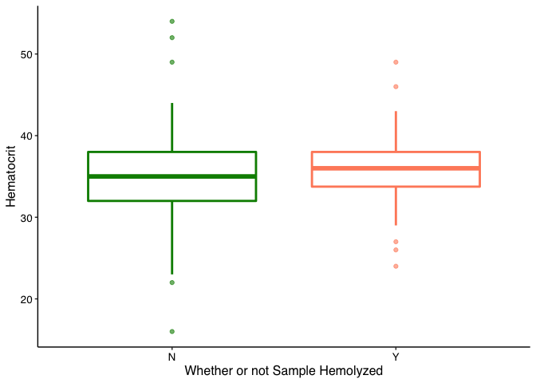<!-- -->

``` r
# glm
glm_hct_hem <- lm(hematocrit_percent ~ hemolyzed,
           data = all_data_wide)
summary(glm_hct_hem)
```

    ## 
    ## Call:
    ## lm(formula = hematocrit_percent ~ hemolyzed, data = all_data_wide)
    ## 
    ## Residuals:
    ##      Min       1Q   Median       3Q      Max 
    ## -19.1385  -2.7778  -0.1385   2.2222  18.8615 
    ## 
    ## Coefficients:
    ##             Estimate Std. Error t value Pr(>|t|)    
    ## (Intercept)  35.1385     0.7446  47.190   <2e-16 ***
    ## hemolyzedY    0.6393     1.2472   0.513    0.609    
    ## ---
    ## Signif. codes:  0 '***' 0.001 '**' 0.01 '*' 0.05 '.' 0.1 ' ' 1
    ## 
    ## Residual standard error: 6.003 on 99 degrees of freedom
    ##   (49 observations deleted due to missingness)
    ## Multiple R-squared:  0.002647,   Adjusted R-squared:  -0.007427 
    ## F-statistic: 0.2627 on 1 and 99 DF,  p-value: 0.6094

### Osml \~ Hemolyzed/Not

``` r
all_data_wide %>% 
  dplyr::filter(hemolyzed %in% c("Y", "N")) %>%
  ggplot(data = .) + 
  geom_boxplot(aes(x = hemolyzed, 
                   y = osmolality_mmol_kg, 
                   color = hemolyzed
                   ), 
               size = 1,
               alpha = 0.6) + 
  scale_colour_manual(name = "Blood Sample Eye", 
                      values = c("green4", "salmon1", "green4", "salmon1") ) +
  theme_classic() + 
  xlab("Whether or not Sample Hemolyzed") + 
  ylab("Osmolality") + 
  theme(text = element_text(color = "black", family = "sans", size = 12),
        axis.text = element_text(color = "black", family = "sans", size = 10),
        legend.text.align = 0,
        legend.position = "none"
)
```

    ## Warning: Removed 1 rows containing non-finite values (stat_boxplot).

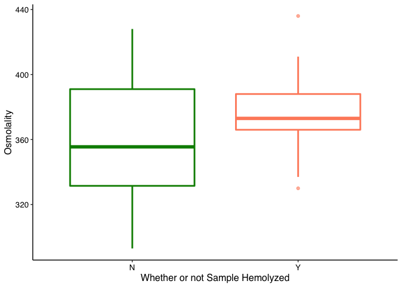<!-- -->

``` r
# glm
glm_osml_hem <- lm(osmolality_mmol_kg ~ hemolyzed,
           data = all_data_wide)
summary(glm_osml_hem)
```

    ## 
    ## Call:
    ## lm(formula = osmolality_mmol_kg ~ hemolyzed, data = all_data_wide)
    ## 
    ## Residuals:
    ##     Min      1Q  Median      3Q     Max 
    ## -67.326 -24.326  -2.026  23.674  67.674 
    ## 
    ## Coefficients:
    ##             Estimate Std. Error t value Pr(>|t|)    
    ## (Intercept)  360.326      3.476 103.656   <2e-16 ***
    ## hemolyzedY    14.700      6.223   2.362   0.0197 *  
    ## ---
    ## Signif. codes:  0 '***' 0.001 '**' 0.01 '*' 0.05 '.' 0.1 ' ' 1
    ## 
    ## Residual standard error: 32.24 on 123 degrees of freedom
    ##   (25 observations deleted due to missingness)
    ## Multiple R-squared:  0.04339,    Adjusted R-squared:  0.03562 
    ## F-statistic: 5.579 on 1 and 123 DF,  p-value: 0.01974

### Hct \~ Week

  - no sig diff

<!-- end list -->

``` r
all_data_wide %>% 
  ggplot(data = .) + 
  geom_boxplot(aes(x = as.factor(date), 
                   y = hematocrit_percent, 
                   color = as.factor(date)
                   ), 
               size = 1,
               alpha = 0.6) + 
  theme_classic() + 
  xlab("Sampling Date") + 
  ylab("Hematocrit") + 
  theme(text = element_text(color = "black", family = "sans", size = 12),
        axis.text = element_text(color = "black", family = "sans", size = 10),
        legend.text.align = 0,
        legend.position = "none"
)
```

    ## Warning: Removed 27 rows containing non-finite values (stat_boxplot).

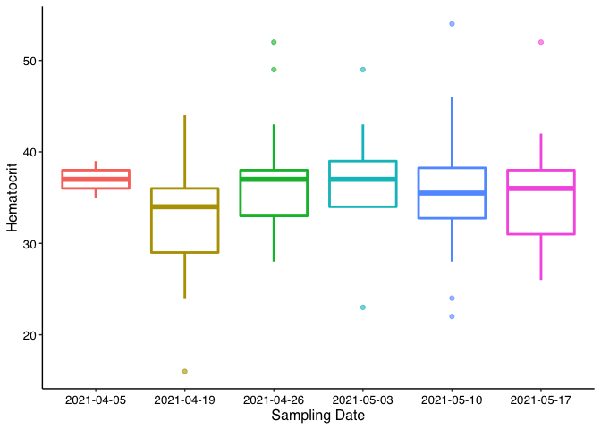<!-- -->

``` r
# glm
glm_hct_wk <- lm(hematocrit_percent ~ date,
           data = all_data_wide)
summary(glm_hct_wk)
```

    ## 
    ## Call:
    ## lm(formula = hematocrit_percent ~ date, data = all_data_wide)
    ## 
    ## Residuals:
    ##      Min       1Q   Median       3Q      Max 
    ## -18.8647  -2.7482   0.1353   2.6239  18.3683 
    ## 
    ## Coefficients:
    ##               Estimate Std. Error t value Pr(>|t|)
    ## (Intercept) -649.44284  931.98258  -0.697    0.487
    ## date           0.03652    0.04971   0.735    0.464
    ## 
    ## Residual standard error: 5.894 on 121 degrees of freedom
    ##   (27 observations deleted due to missingness)
    ## Multiple R-squared:  0.004442,   Adjusted R-squared:  -0.003785 
    ## F-statistic: 0.5399 on 1 and 121 DF,  p-value: 0.4639

### Osml \~ Week

  - Sig difference in osmolarity by week

<!-- end list -->

``` r
all_data_wide %>% 
  ggplot(data = .) + 
  geom_boxplot(aes(x = as.factor(date), 
                   y = osmolality_mmol_kg, 
                   color = as.factor(date)
                   ), 
               size = 1,
               alpha = 0.6) + 
  theme_classic() + 
  xlab("Date") + 
  ylab("Osmolality (mmol / kg)") + 
  annotate("text", x = 1, y = 365, label = "a", size = 6) +
  annotate("text", x = 2, y = 390, label = "b", size = 6) +
  annotate("text", x = 3, y = 437, label = "c", size = 6) +
  annotate("text", x = 4, y = 427, label = "c", size = 6) +
  annotate("text", x = 5, y = 417, label = "d", size = 6) +
  annotate("text", x = 6, y = 447, label = "d", size = 6) +
  scale_x_discrete(labels = c("2021-04-05" = "Apr 5", 
                              "2021-04-19" = "Apr 19",
                              "2021-04-26" = "Apr 26",
                              "2021-05-03" = "May 3", 
                              "2021-05-10" = "May 10",
                              "2021-05-17" = "May 17")) +
  scale_color_brewer(palette = "Set2") +
  ylim(300, 450) +
  theme(text = element_text(color = "black", 
                            family = "sans", 
                            size = 18),
        axis.text = element_text(color = "black", 
                                 family = "sans", 
                                 size = 14),
        legend.text.align = 0,
        legend.position = "none"
) -> osml_date_fig
osml_date_fig
```

    ## Warning: Removed 5 rows containing non-finite values (stat_boxplot).

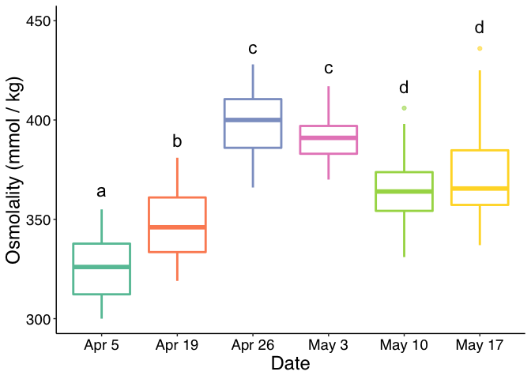<!-- -->

``` r
# export figure
#ggsave(filename = "osml_date_fig.tiff",
 #      plot = osml_date_fig,
  #     path = "./final_figures",
   #    device = "tiff",
    #   dpi = 1200,
     #  width = 6, height = 4)

# glm
glm_osml_wk <- glm(osmolality_mmol_kg ~ date,
           data = all_data_wide)
summary(glm_osml_wk)
```

    ## 
    ## Call:
    ## glm(formula = osmolality_mmol_kg ~ date, data = all_data_wide)
    ## 
    ## Deviance Residuals: 
    ##     Min       1Q   Median       3Q      Max  
    ## -48.402  -21.463   -2.099   20.249   65.325  
    ## 
    ## Coefficients:
    ##               Estimate Std. Error t value Pr(>|t|)    
    ## (Intercept) -1.992e+04  2.944e+03  -6.766 3.03e-10 ***
    ## date         1.082e+00  1.571e-01   6.890 1.58e-10 ***
    ## ---
    ## Signif. codes:  0 '***' 0.001 '**' 0.01 '*' 0.05 '.' 0.1 ' ' 1
    ## 
    ## (Dispersion parameter for gaussian family taken to be 733.761)
    ## 
    ##     Null deviance: 141232  on 146  degrees of freedom
    ## Residual deviance: 106395  on 145  degrees of freedom
    ##   (3 observations deleted due to missingness)
    ## AIC: 1391.1
    ## 
    ## Number of Fisher Scoring iterations: 2

There was a little rain on April 27…. could that be why there was a
slight drop in osmolality?\! Not sure if the May 3-\> 10 drop was
because of rain or fixing the osmometer, though… Need to look for better
daily rainfall records, maybe look in relation to humidity?.

distinguish pairwise differences using an ANOVA:

``` r
osml_date_aov <- aov(osmolality_mmol_kg ~ as.factor(date), 
                     data = all_data_wide)
TukeyHSD(osml_date_aov)
```

    ##   Tukey multiple comparisons of means
    ##     95% family-wise confidence level
    ## 
    ## Fit: aov(formula = osmolality_mmol_kg ~ as.factor(date), data = all_data_wide)
    ## 
    ## $`as.factor(date)`
    ##                             diff        lwr        upr     p adj
    ## 2021-04-19-2021-04-05  22.891304   8.069604  37.713005 0.0002351
    ## 2021-04-26-2021-04-05  75.055556  60.828339  89.282773 0.0000000
    ## 2021-05-03-2021-04-05  66.657895  51.030256  82.285533 0.0000000
    ## 2021-05-10-2021-04-05  42.000000  27.343061  56.656939 0.0000000
    ## 2021-05-17-2021-04-05  46.785714  32.683680  60.887749 0.0000000
    ## 2021-04-26-2021-04-19  52.164251  37.471952  66.856551 0.0000000
    ## 2021-05-03-2021-04-19  43.766590  27.714393  59.818788 0.0000000
    ## 2021-05-10-2021-04-19  19.108696   3.999896  34.217495 0.0047987
    ## 2021-05-17-2021-04-19  23.894410   9.323297  38.465523 0.0000755
    ## 2021-05-03-2021-04-26  -8.397661 -23.902627   7.107305 0.6229313
    ## 2021-05-10-2021-04-26 -33.055556 -47.581627 -18.529485 0.0000000
    ## 2021-05-17-2021-04-26 -28.269841 -42.235809 -14.303874 0.0000005
    ## 2021-05-10-2021-05-03 -24.657895 -40.558087  -8.757702 0.0002183
    ## 2021-05-17-2021-05-03 -19.872180 -35.262360  -4.482001 0.0036866
    ## 2021-05-17-2021-05-10   4.785714  -9.617772  19.189200 0.9296595

### Humidity \~ Week

  - Significant difference in humidity by week

<!-- end list -->

``` r
all_data_wide %>% 
  ggplot(data = .) + 
  geom_boxplot(aes(x = as.factor(date), 
                   y = RH_percent_interpol, 
                   color = as.factor(date)
                   ), 
               size = 1,
               alpha = 0.6) + 
  theme_classic() + 
  xlab("Sampling Date") + 
  ylab("Relative Humidity") + 
  theme(text = element_text(color = "black", family = "sans", size = 12),
        axis.text = element_text(color = "black", family = "sans", size = 10),
        legend.text.align = 0,
        legend.position = "none"
)
```

    ## Warning: Removed 3 rows containing non-finite values (stat_boxplot).

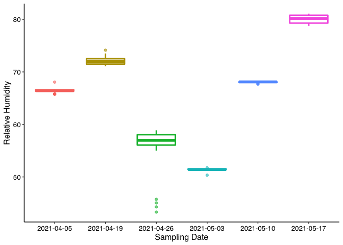<!-- -->

``` r
# glm
glm_hum_wk <- glm(RH_percent_interpol ~ date,
           data = all_data_wide)
summary(glm_hum_wk)
```

    ## 
    ## Call:
    ## glm(formula = RH_percent_interpol ~ date, data = all_data_wide)
    ## 
    ## Deviance Residuals: 
    ##     Min       1Q   Median       3Q      Max  
    ## -22.439   -7.929    4.105    7.839   11.303  
    ## 
    ## Coefficients:
    ##               Estimate Std. Error t value Pr(>|t|)    
    ## (Intercept) -3.553e+03  1.033e+03  -3.441 0.000758 ***
    ## date         1.931e-01  5.508e-02   3.505 0.000608 ***
    ## ---
    ## Signif. codes:  0 '***' 0.001 '**' 0.01 '*' 0.05 '.' 0.1 ' ' 1
    ## 
    ## (Dispersion parameter for gaussian family taken to be 90.24041)
    ## 
    ##     Null deviance: 14193  on 146  degrees of freedom
    ## Residual deviance: 13085  on 145  degrees of freedom
    ##   (3 observations deleted due to missingness)
    ## AIC: 1083
    ## 
    ## Number of Fisher Scoring iterations: 2

try for absolute humidity:

``` r
all_data_wide %>% 
  ggplot(data = .) + 
  geom_boxplot(aes(x = as.factor(date), 
                   y = abs_humidity_g_m3_interpol, 
                   color = as.factor(date)
                   ), 
               size = 1,
               alpha = 0.6) + 
  theme_classic() + 
  xlab("Sampling Date") + 
  ylab("Absolute Humidity") + 
  theme(text = element_text(color = "black", family = "sans", size = 12),
        axis.text = element_text(color = "black", family = "sans", size = 10),
        legend.text.align = 0,
        legend.position = "none"
)
```

    ## Warning: Removed 3 rows containing non-finite values (stat_boxplot).

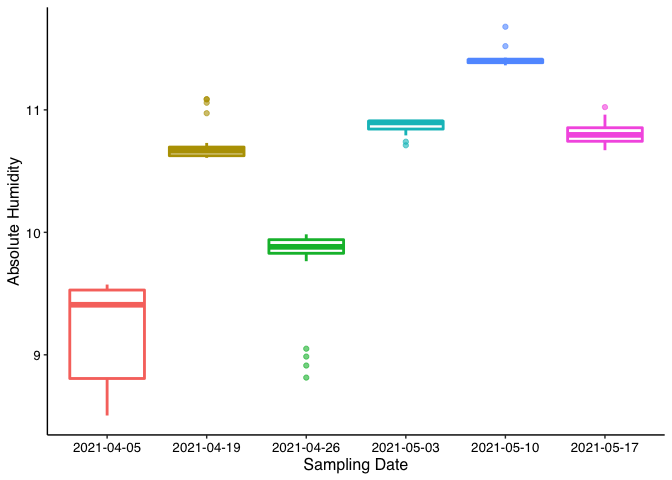<!-- -->

``` r
# glm
glm_abshum_wk <- glm(abs_humidity_g_m3_interpol ~ as.factor(date),
           data = all_data_wide)
summary(glm_abshum_wk)
```

    ## 
    ## Call:
    ## glm(formula = abs_humidity_g_m3_interpol ~ as.factor(date), data = all_data_wide)
    ## 
    ## Deviance Residuals: 
    ##      Min        1Q    Median        3Q       Max  
    ## -0.94037  -0.05647   0.00538   0.10640   0.36569  
    ## 
    ## Coefficients:
    ##                           Estimate Std. Error t value Pr(>|t|)    
    ## (Intercept)                9.22053    0.04642 198.641  < 2e-16 ***
    ## as.factor(date)2021-04-19  1.50164    0.06775  22.164  < 2e-16 ***
    ## as.factor(date)2021-04-26  0.53379    0.06503   8.208 1.28e-13 ***
    ## as.factor(date)2021-05-03  1.64334    0.07144  23.005  < 2e-16 ***
    ## as.factor(date)2021-05-10  2.19274    0.06700  32.728  < 2e-16 ***
    ## as.factor(date)2021-05-17  1.58637    0.06446  24.609  < 2e-16 ***
    ## ---
    ## Signif. codes:  0 '***' 0.001 '**' 0.01 '*' 0.05 '.' 0.1 ' ' 1
    ## 
    ## (Dispersion parameter for gaussian family taken to be 0.05602026)
    ## 
    ##     Null deviance: 90.9778  on 146  degrees of freedom
    ## Residual deviance:  7.8989  on 141  degrees of freedom
    ##   (3 observations deleted due to missingness)
    ## AIC: 1.3819
    ## 
    ## Number of Fisher Scoring iterations: 2

``` r
aov_abshum_wk <- aov(abs_humidity_g_m3_interpol ~ as.factor(date),
           data = all_data_wide)
TukeyHSD(aov_abshum_wk)
```

    ##   Tukey multiple comparisons of means
    ##     95% family-wise confidence level
    ## 
    ## Fit: aov(formula = abs_humidity_g_m3_interpol ~ as.factor(date), data = all_data_wide)
    ## 
    ## $`as.factor(date)`
    ##                              diff         lwr        upr     p adj
    ## 2021-04-19-2021-04-05  1.50164382  1.30588872  1.6973989 0.0000000
    ## 2021-04-26-2021-04-05  0.53379095  0.34588739  0.7216945 0.0000000
    ## 2021-05-03-2021-04-05  1.64334398  1.43694458  1.8497434 0.0000000
    ## 2021-05-10-2021-04-05  2.19273823  1.99915919  2.3863173 0.0000000
    ## 2021-05-17-2021-04-05  1.58637368  1.40012345  1.7726239 0.0000000
    ## 2021-04-26-2021-04-19 -0.96785287 -1.16189894 -0.7738068 0.0000000
    ## 2021-05-03-2021-04-19  0.14170016 -0.07030653  0.3537068 0.3876843
    ## 2021-05-10-2021-04-19  0.69109441  0.49154749  0.8906413 0.0000000
    ## 2021-05-17-2021-04-19  0.08472986 -0.10771565  0.2771754 0.7996834
    ## 2021-05-03-2021-04-26  1.10955303  0.90477382  1.3143322 0.0000000
    ## 2021-05-10-2021-04-26  1.65894728  1.46709666  1.8507979 0.0000000
    ## 2021-05-17-2021-04-26  1.05258273  0.86812958  1.2370359 0.0000000
    ## 2021-05-10-2021-05-03  0.54939425  0.33939515  0.7593934 0.0000000
    ## 2021-05-17-2021-05-03 -0.05697030 -0.26023349  0.1462929 0.9653251
    ## 2021-05-17-2021-05-10 -0.60636455 -0.79659616 -0.4161329 0.0000000

### Osml, Humidity, Week

``` r
all_data_wide %>% 
  ggplot(data = .) + 
  geom_boxplot(aes(x = as.factor(date), 
                   y = osmolality_mmol_kg, 
                   color = as.factor(date)
                   ), 
               size = 1,
               alpha = 0.6) + 
  geom_jitter(aes(x = as.factor(date), 
                   y = 35*abs_humidity_g_m3_interpol)) +
  theme_classic() + 
  xlab("Sampling Date") + 
  ylab("Osmolality (mmol/kg)") + 
  theme(text = element_text(color = "black", family = "sans", size = 12),
        axis.text = element_text(color = "black", family = "sans", size = 10),
        legend.text.align = 0,
        legend.position = "none"
)
```

    ## Warning: Removed 3 rows containing non-finite values (stat_boxplot).

    ## Warning: Removed 3 rows containing missing values (geom_point).

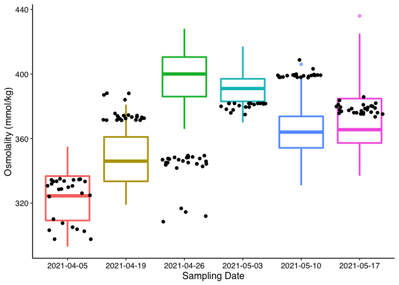<!-- -->

### Osml \~ R. Humidity

  - Sig difference, negative relationship. With every percent increase
    in relative humidity osmolarity drops 1.2.

<!-- end list -->

``` r
all_data_wide %>% 
  ggplot(data = .) + 
  geom_point(aes(x = RH_percent_interpol,
                 y = osmolality_mmol_kg, 
                 ), 
             size = 1, 
             alpha = 0.6) + 
  stat_smooth(aes(x = RH_percent_interpol, 
                  y = osmolality_mmol_kg), 
              formula = y ~ x, 
              method = "lm", 
              se = F, 
              color = "gray",
              size = 1.6, 
              alpha = 1 ) + 
  theme_classic() + 
  xlab("Relative Humidity") + 
  ylab("Osmolality") + 
  theme(text = element_text(color = "black", 
                            family = "sans", 
                            size = 12),
        axis.text = element_text(color = "black", 
                                 family = "sans", 
                                 size = 10),
        legend.text.align = 0,
)
```

    ## Warning: Removed 5 rows containing non-finite values (stat_smooth).

    ## Warning: Removed 5 rows containing missing values (geom_point).

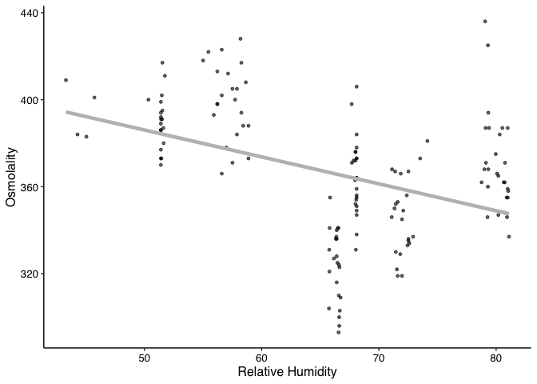<!-- -->

``` r
# glm
glm_osml_hum <- lm(osmolality_mmol_kg ~ RH_percent_interpol,
           data = all_data_wide)
summary(glm_osml_hum)
```

    ## 
    ## Call:
    ## lm(formula = osmolality_mmol_kg ~ RH_percent_interpol, data = all_data_wide)
    ## 
    ## Residuals:
    ##     Min      1Q  Median      3Q     Max 
    ## -72.568 -14.328   2.936  16.303  85.909 
    ## 
    ## Coefficients:
    ##                     Estimate Std. Error t value Pr(>|t|)    
    ## (Intercept)         447.9337    15.8137  28.326  < 2e-16 ***
    ## RH_percent_interpol  -1.2375     0.2363  -5.238  5.7e-07 ***
    ## ---
    ## Signif. codes:  0 '***' 0.001 '**' 0.01 '*' 0.05 '.' 0.1 ' ' 1
    ## 
    ## Residual standard error: 28.15 on 143 degrees of freedom
    ##   (5 observations deleted due to missingness)
    ## Multiple R-squared:  0.161,  Adjusted R-squared:  0.1551 
    ## F-statistic: 27.43 on 1 and 143 DF,  p-value: 5.699e-07

That’s a pretty good relationship…

### Osml \~ Abs. Humidity

``` r
all_data_wide %>% 
  ggplot(data = .) + 
  geom_point(aes(x = abs_humidity_g_m3_interpol,
                 y = osmolality_mmol_kg, 
                 ), 
             size = 1, 
             alpha = 0.4) + 
  stat_smooth(aes(x = abs_humidity_g_m3_interpol, 
                  y = osmolality_mmol_kg), 
              formula = y ~ x, 
              method = "lm", 
              se = F, 
              color = "royalblue",
              size = 1.6, 
              alpha = 1 ) + 
  theme_classic() + 
  xlab(bquote('Absolute Humidity at Capture (g / '*m^2*')')) + 
  ylab("Osmolality (mmol / kg)") + 
  xlim(8, 12) +
  ylim(300, 450) +
  annotate("text", x = 8.5, y = 440, 
           label = "paste(italic(R) ^ 2, \" = 0.036\")", 
           parse = TRUE,
           size = 6) +
  annotate("text", x = 8.5, y = 428, 
           label = "paste(italic(p), \" = 0.0126\")", 
           parse = TRUE,
           size = 6) +
  theme(text = element_text(color = "black", 
                            family = "sans", 
                            size = 18),
        axis.text = element_text(color = "black", 
                                 family = "sans", 
                                 size = 14),
        legend.text.align = 0,
) -> osml_abhum_fig
osml_abhum_fig
```

    ## Warning: Removed 7 rows containing non-finite values (stat_smooth).

    ## Warning: Removed 7 rows containing missing values (geom_point).

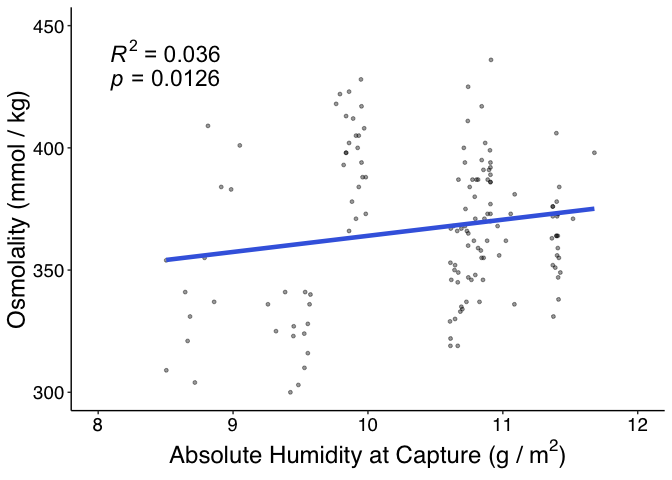<!-- -->

``` r
# export figure
#ggsave(filename = "osml_abhum_fig.tiff",
 #      plot = osml_abhum_fig,
  #     path = "./final_figures",
   #    device = "tiff",
    #   dpi = 1200,
     #  width = 6, height = 4)

# glm
glm_osml_abshum <- lm(osmolality_mmol_kg ~ abs_humidity_g_m3_interpol,
           data = all_data_wide)
summary(glm_osml_abshum)
```

    ## 
    ## Call:
    ## lm(formula = osmolality_mmol_kg ~ abs_humidity_g_m3_interpol, 
    ##     data = all_data_wide)
    ## 
    ## Residuals:
    ##     Min      1Q  Median      3Q     Max 
    ## -64.568 -21.448  -1.049  21.630  66.179 
    ## 
    ## Coefficients:
    ##                            Estimate Std. Error t value Pr(>|t|)    
    ## (Intercept)                 281.859     33.384   8.443 3.14e-14 ***
    ## abs_humidity_g_m3_interpol    8.061      3.189   2.528   0.0126 *  
    ## ---
    ## Signif. codes:  0 '***' 0.001 '**' 0.01 '*' 0.05 '.' 0.1 ' ' 1
    ## 
    ## Residual standard error: 30.06 on 143 degrees of freedom
    ##   (5 observations deleted due to missingness)
    ## Multiple R-squared:  0.04278,    Adjusted R-squared:  0.03608 
    ## F-statistic:  6.39 on 1 and 143 DF,  p-value: 0.01256

*positive* correlation…

### Osml \~ Avg. Abs. Humidity

``` r
all_data_wide %>% 
  ggplot(data = .) + 
  geom_point(aes(x = avg_abs_humd,
                 y = osmolality_mmol_kg, 
                 ), 
             size = 1, 
             alpha = 0.6) + 
  stat_smooth(aes(x = avg_abs_humd, 
                  y = osmolality_mmol_kg), 
              formula = y ~ x, 
              method = "lm", 
              se = F, 
              color = "gray",
              size = 1.6, 
              alpha = 1 ) + 
  theme_classic() + 
  xlab("Prior Week's Average Absolute Humidity") + 
  ylab("Osmolality (mmol/kg)") + 
  theme(text = element_text(color = "black", 
                            family = "sans", 
                            size = 12),
        axis.text = element_text(color = "black", 
                                 family = "sans", 
                                 size = 10),
        legend.text.align = 0,
)
```

    ## Warning: Removed 3 rows containing non-finite values (stat_smooth).

    ## Warning: Removed 3 rows containing missing values (geom_point).

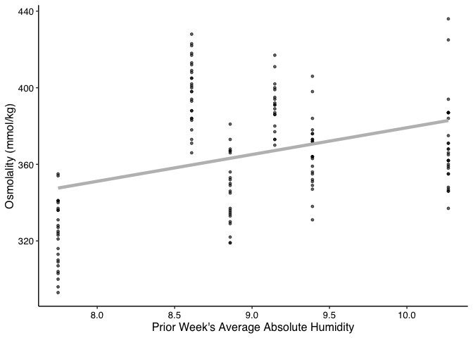<!-- -->

``` r
# glm
glm_osml_avgabshum <- lm(osmolality_mmol_kg ~ avg_abs_humd,
           data = all_data_wide)
summary(glm_osml_avgabshum)
```

    ## 
    ## Call:
    ## lm(formula = osmolality_mmol_kg ~ avg_abs_humd, data = all_data_wide)
    ## 
    ## Residuals:
    ##     Min      1Q  Median      3Q     Max 
    ## -54.602 -22.093  -6.584  22.573  68.328 
    ## 
    ## Coefficients:
    ##              Estimate Std. Error t value Pr(>|t|)    
    ## (Intercept)   239.207     27.083   8.832 3.08e-15 ***
    ## avg_abs_humd   13.991      2.994   4.672 6.74e-06 ***
    ## ---
    ## Signif. codes:  0 '***' 0.001 '**' 0.01 '*' 0.05 '.' 0.1 ' ' 1
    ## 
    ## Residual standard error: 29.1 on 145 degrees of freedom
    ##   (3 observations deleted due to missingness)
    ## Multiple R-squared:  0.1309, Adjusted R-squared:  0.1249 
    ## F-statistic: 21.83 on 1 and 145 DF,  p-value: 6.736e-06

*positive* correlation…

### Osml \~ Rain

``` r
all_data_wide %>% 
  ggplot(data = .) + 
  geom_point(aes(x = total_precip,
                 y = osmolality_mmol_kg, 
                 ), 
             size = 1, 
             alpha = 0.6) + 
  stat_smooth(aes(x = total_precip, 
                  y = osmolality_mmol_kg), 
              formula = y ~ x, 
              method = "lm", 
              se = F, 
              color = "gray",
              size = 1.6, 
              alpha = 1 ) + 
  theme_classic() + 
  xlab("Prior Week's Total Precipitation (inches)") + 
  ylab("Osmolality (mmol/kg)") + 
  theme(text = element_text(color = "black", 
                            family = "sans", 
                            size = 12),
        axis.text = element_text(color = "black", 
                                 family = "sans", 
                                 size = 10),
        legend.text.align = 0,
)
```

    ## Warning: Removed 3 rows containing non-finite values (stat_smooth).

    ## Warning: Removed 3 rows containing missing values (geom_point).

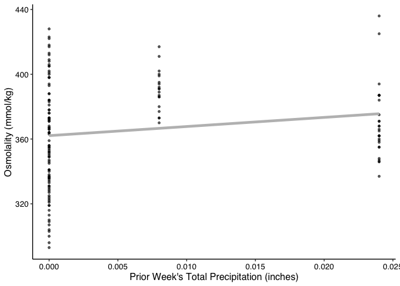<!-- -->

This isn’t really helpful considering how little variation in
precipitation there was.

Maybe try a binary predictor of whether or not there was rain in the
week prior to sampling:

``` r
# ANOVA
osml_rain_aov <- aov(data = all_data_wide, 
                     osmolality_mmol_kg ~ prior_rain_Y_N)
TukeyHSD(osml_rain_aov)
```

    ##   Tukey multiple comparisons of means
    ##     95% family-wise confidence level
    ## 
    ## Fit: aov(formula = osmolality_mmol_kg ~ prior_rain_Y_N, data = all_data_wide)
    ## 
    ## $prior_rain_Y_N
    ##         diff      lwr      upr     p adj
    ## Y-N 19.20915 8.765846 29.65245 0.0003847

``` r
# plot
all_data_wide %>% 
  ggplot(data = .) + 
  geom_boxplot(aes(x = prior_rain_Y_N, 
                   y = osmolality_mmol_kg, 
                   color = prior_rain_Y_N
                   ), 
               size = 1,
               alpha = 0.6) + 
  theme_classic() + 
  xlab("Whether it Rained in the Last Week") + 
  ylab("Osmolality (mmol/kg)") + 
  theme(text = element_text(color = "black", family = "sans", size = 12),
        axis.text = element_text(color = "black", family = "sans", size = 10),
        legend.text.align = 0,
        legend.position = "none"
)
```

    ## Warning: Removed 3 rows containing non-finite values (stat_boxplot).

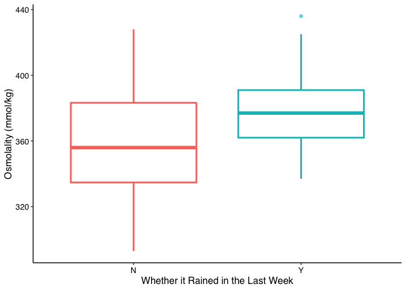<!-- -->

Wow, very counter to our predictions.

### Hct \~ Humidity

``` r
all_data_wide %>% 
  ggplot(data = .) + 
  geom_point(aes(x = RH_percent_interpol,
                 y = hematocrit_percent, 
                 ), 
             size = 1, 
             alpha = 0.6) + 
  stat_smooth(aes(x = RH_percent_interpol, 
                  y = hematocrit_percent), 
              formula = y ~ x, 
              method = "lm", 
              se = F, 
              color = "blue",
              size = 1.6, 
              alpha = 1 ) + 
  theme_classic() + 
  xlab("Ambient Relative Humidity at Capture (%)") + 
  ylab("Hematocrit (%)") + 
  theme(text = element_text(color = "black", 
                            family = "sans", 
                            size = 12),
        axis.text = element_text(color = "black", 
                                 family = "sans", 
                                 size = 10),
        legend.text.align = 0,
)
```

    ## Warning: Removed 28 rows containing non-finite values (stat_smooth).

    ## Warning: Removed 28 rows containing missing values (geom_point).

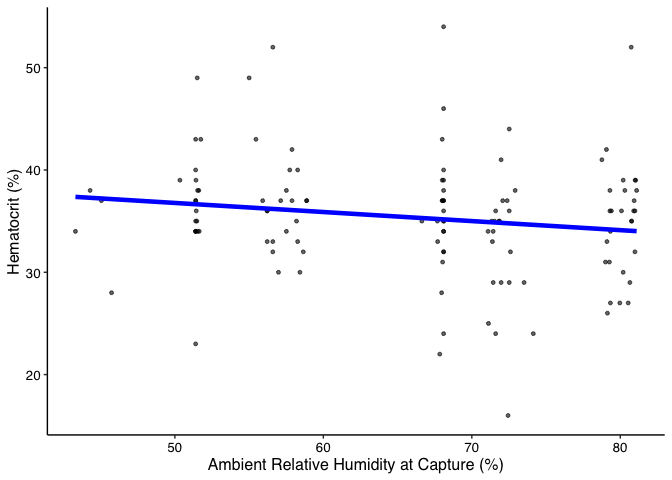<!-- -->

``` r
# glm
glm_hct_RH <- lm(hematocrit_percent ~ RH_percent_interpol,
           data = all_data_wide)
summary(glm_hct_RH)
```

    ## 
    ## Call:
    ## lm(formula = hematocrit_percent ~ RH_percent_interpol, data = all_data_wide)
    ## 
    ## Residuals:
    ##      Min       1Q   Median       3Q      Max 
    ## -18.7877  -3.1402   0.1449   2.3254  18.8276 
    ## 
    ## Coefficients:
    ##                     Estimate Std. Error t value Pr(>|t|)    
    ## (Intercept)         41.20780    3.28888  12.529   <2e-16 ***
    ## RH_percent_interpol -0.08863    0.04906  -1.806   0.0734 .  
    ## ---
    ## Signif. codes:  0 '***' 0.001 '**' 0.01 '*' 0.05 '.' 0.1 ' ' 1
    ## 
    ## Residual standard error: 5.844 on 120 degrees of freedom
    ##   (28 observations deleted due to missingness)
    ## Multiple R-squared:  0.02647,    Adjusted R-squared:  0.01836 
    ## F-statistic: 3.263 on 1 and 120 DF,  p-value: 0.07337

### Hct \~ Temperature

as hematocrit increases ambient temp increases (nonsig)

``` r
all_data_wide %>% 
  ggplot(data = .) + 
  geom_point(aes(x = temp_C_interpol,
                 y = hematocrit_percent, 
                 ), 
             size = 1, 
             alpha = 0.6) + 
  stat_smooth(aes(x = temp_C_interpol, 
                  y = hematocrit_percent), 
              formula = y ~ x, 
              method = "lm", 
              se = F, 
              color = "maroon",
              size = 1.6, 
              alpha = 1 ) + 
  theme_classic() + 
  xlab("Ambient Temperature at Capture (C)") + 
  ylab("Hematocrit (%)") + 
  theme(text = element_text(color = "black", 
                            family = "sans", 
                            size = 12),
        axis.text = element_text(color = "black", 
                                 family = "sans", 
                                 size = 10),
        legend.text.align = 0,
)
```

    ## Warning: Removed 28 rows containing non-finite values (stat_smooth).

    ## Warning: Removed 28 rows containing missing values (geom_point).

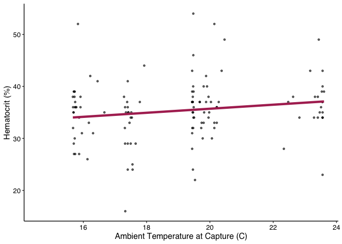<!-- -->

``` r
# glm
glm_hct_temp <- lm(hematocrit_percent ~ temp_C_interpol,
           data = all_data_wide)
summary(glm_hct_temp)
```

    ## 
    ## Call:
    ## lm(formula = hematocrit_percent ~ temp_C_interpol, data = all_data_wide)
    ## 
    ## Residuals:
    ##      Min       1Q   Median       3Q      Max 
    ## -18.6666  -3.0722   0.2958   2.3118  18.4989 
    ## 
    ## Coefficients:
    ##                 Estimate Std. Error t value Pr(>|t|)    
    ## (Intercept)      27.9395     3.9654   7.046 1.26e-10 ***
    ## temp_C_interpol   0.3883     0.2061   1.884    0.062 .  
    ## ---
    ## Signif. codes:  0 '***' 0.001 '**' 0.01 '*' 0.05 '.' 0.1 ' ' 1
    ## 
    ## Residual standard error: 5.837 on 120 degrees of freedom
    ##   (28 observations deleted due to missingness)
    ## Multiple R-squared:  0.02873,    Adjusted R-squared:  0.02064 
    ## F-statistic:  3.55 on 1 and 120 DF,  p-value: 0.06197

### Osml \~ Temperature

  - very strong positive relationship

<!-- end list -->

``` r
all_data_wide %>% 
  ggplot(data = .) + 
  geom_point(aes(x = temp_C_interpol,
                 y = osmolality_mmol_kg, 
                 ), 
             size = 1, 
             alpha = 0.4) + 
  stat_smooth(aes(x = temp_C_interpol, 
                  y = osmolality_mmol_kg), 
              formula = y ~ x, 
              method = "lm", 
              se = F, 
              color = "maroon",
              size = 1.6, 
              alpha = 1 ) + 
  theme_classic() + 
  xlab("Ambient Temperature at Capture (°C)") + 
  ylab("Osmolality (mmol / kg)") + 
  annotate("text", x = 22, y = 320, 
           label = "paste(italic(R) ^ 2, \" = 0.2952\")", 
           parse = TRUE,
           size = 6) +
  annotate("text", x = 22, y = 308, 
           label = "paste(italic(p), \" < 0.0001\")", 
           parse = TRUE,
           size = 6) +
  xlim(14, 24) +
  ylim(300,450) +
  theme(text = element_text(color = "black", 
                            family = "sans", 
                            size = 18),
        axis.text = element_text(color = "black", 
                                 family = "sans", 
                                 size = 14),
        legend.text.align = 0,
) -> osml_temp_fig
osml_temp_fig
```

    ## Warning: Removed 7 rows containing non-finite values (stat_smooth).

    ## Warning: Removed 7 rows containing missing values (geom_point).

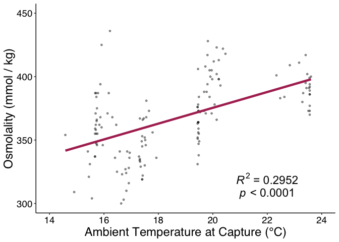<!-- -->

``` r
# export figure
#ggsave(filename = "osml_temp_fig.tiff",
 #      plot = osml_temp_fig,
  #     path = "./final_figures",
   #    device = "tiff",
    #   dpi = 1200,
     #  width = 6, height = 4)

# glm
glm_osml_temp <- lm(osmolality_mmol_kg ~ temp_C_interpol,
           data = all_data_wide)
summary(glm_osml_temp)
```

    ## 
    ## Call:
    ## lm(formula = osmolality_mmol_kg ~ temp_C_interpol, data = all_data_wide)
    ## 
    ## Residuals:
    ##     Min      1Q  Median      3Q     Max 
    ## -59.827 -16.201  -1.977  15.576  85.555 
    ## 
    ## Coefficients:
    ##                 Estimate Std. Error t value Pr(>|t|)    
    ## (Intercept)     245.4719    15.5415   15.79  < 2e-16 ***
    ## temp_C_interpol   6.4718     0.8265    7.83 9.96e-13 ***
    ## ---
    ## Signif. codes:  0 '***' 0.001 '**' 0.01 '*' 0.05 '.' 0.1 ' ' 1
    ## 
    ## Residual standard error: 25.71 on 143 degrees of freedom
    ##   (5 observations deleted due to missingness)
    ## Multiple R-squared:  0.3001, Adjusted R-squared:  0.2952 
    ## F-statistic: 61.31 on 1 and 143 DF,  p-value: 9.962e-13

### Hct \~ Individual

  - not sig

<!-- end list -->

``` r
all_data_wide %>% 
  ggplot(data = .) + 
  geom_point(aes(x = individual_ID,
                 y = hematocrit_percent, 
                 ), 
             size = 1, 
             alpha = 0.6) + 
  stat_smooth(aes(x = individual_ID, 
                  y = hematocrit_percent, 
                  ), 
              formula = y ~ x, 
              method = "lm", 
              color = "gray",
              se = F, 
              size = 1.6, 
              alpha = 1 ) + 
  theme_classic() + 
  xlab("Individual Lizard") + 
  ylab("Hematocrit (%)") + 
  theme(text = element_text(color = "black", 
                            family = "sans", 
                            size = 12),
        axis.text = element_text(color = "black", 
                                 family = "sans", 
                                 size = 10),
        legend.text.align = 0,
)
```

    ## Warning: Removed 27 rows containing non-finite values (stat_smooth).

    ## Warning: Removed 27 rows containing missing values (geom_point).

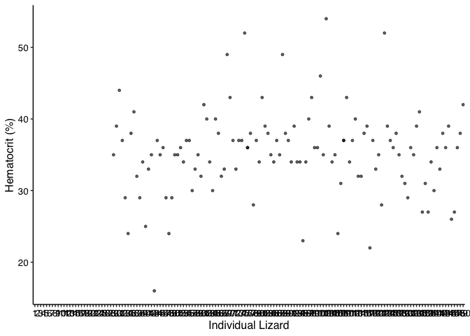<!-- -->

``` r
# glm
glm_hct_ID <- lm(hematocrit_percent ~ individual_ID,
           data = all_data_wide)
summary(glm_hct_ID)
```

    ## 
    ## Call:
    ## lm(formula = hematocrit_percent ~ individual_ID, data = all_data_wide)
    ## 
    ## Residuals:
    ##         28         29         30         31         32         33         34 
    ## -3.592e-27 -7.946e-32 -3.743e-32 -1.841e-31 -7.431e-32 -1.527e-31 -2.208e-31 
    ##         35         36         37         38         39         40         41 
    ## -2.784e-31 -3.249e-31 -3.107e-31 -3.836e-31 -3.453e-31 -5.412e-31 -4.764e-31 
    ##         42         43         44         45         46         47         48 
    ## -5.462e-31 -6.507e-31 -5.425e-31 -7.151e-31 -6.735e-31 -7.632e-31 -8.349e-31 
    ##         49         50         51         52         53         54         55 
    ## -8.386e-31 -9.217e-31 -9.351e-31 -1.026e-30 -1.046e-30 -1.141e-30 -1.163e-30 
    ##         56         57         58         59         60         61         62 
    ## -1.259e-30 -1.278e-30 -1.320e-30 -1.383e-30 -1.415e-30 -1.614e-30 -1.582e-30 
    ##         63         64         65         66         67         68         69 
    ## -1.714e-30 -1.760e-30 -1.916e-30 -1.984e-30 -2.059e-30 -2.041e-30 -2.176e-30 
    ##         70         71         72         73         74         75         76 
    ## -2.312e-30 -2.249e-30 -2.283e-30 -2.557e-30  8.309e-14 -8.309e-14  5.271e-28 
    ##         77         78         79         80         81         82         83 
    ##  9.223e-29  8.379e-28 -9.404e-28 -1.776e-28 -2.829e-28 -8.165e-28 -5.185e-28 
    ##         84         85         86         87         88         89         90 
    ## -2.121e-28 -3.119e-28 -4.320e-28 -5.824e-29  5.001e-28  2.681e-28  2.810e-28 
    ##         91         92         93         94         95         96         97 
    ##  3.070e-28 -4.144e-28  3.831e-28  7.549e-28 -3.438e-29  1.005e-27 -4.858e-29 
    ##         98         99        100        101        102        103        104 
    ##  1.019e-29  7.845e-28  8.515e-28 -6.095e-28  7.643e-28  4.334e-28  3.443e-28 
    ##        105        106        107        108        109        110        111 
    ##  4.843e-28  5.752e-29  2.831e-28 -3.179e-14  3.179e-14  2.192e-28  6.097e-28 
    ##        112        113        114        115        116        117        118 
    ## -1.448e-28 -2.430e-28  1.845e-28 -1.744e-28 -3.004e-29 -1.900e-29  1.151e-28 
    ##        119        120        121        122        123        124        125 
    ##  8.987e-29  1.798e-28 -3.322e-28  1.262e-28  1.388e-28  6.383e-29 -1.152e-28 
    ##        126        127        128        129        130        131        132 
    ## -1.190e-29 -9.631e-29 -1.190e-29  1.617e-28  4.806e-29 -1.918e-28  3.859e-29 
    ##        133        134        135        136        137        138        139 
    ## -9.709e-29  4.174e-29  5.752e-29 -1.348e-29 -7.501e-29 -2.431e-30  3.228e-29 
    ##        140        141        142        143        144        145        146 
    ##  5.437e-29  1.650e-29 -3.241e-29  1.492e-29  2.302e-30  3.386e-29  2.439e-29 
    ##        147        148        149        150 
    ## -1.663e-29 -2.294e-29  1.177e-29 -3.241e-29 
    ## 
    ## Coefficients:
    ##                    Estimate Std. Error    t value Pr(>|t|)    
    ## (Intercept)       3.500e+01  8.896e-14  3.934e+14   <2e-16 ***
    ## individual_ID30   4.000e+00  1.258e-13  3.179e+13   <2e-16 ***
    ## individual_ID31   9.000e+00  1.258e-13  7.153e+13   <2e-16 ***
    ## individual_ID32   2.000e+00  1.258e-13  1.590e+13   <2e-16 ***
    ## individual_ID33  -6.000e+00  1.258e-13 -4.769e+13   <2e-16 ***
    ## individual_ID34  -1.100e+01  1.258e-13 -8.743e+13   <2e-16 ***
    ## individual_ID35   3.000e+00  1.258e-13  2.384e+13   <2e-16 ***
    ## individual_ID36   6.000e+00  1.258e-13  4.769e+13   <2e-16 ***
    ## individual_ID37  -3.000e+00  1.258e-13 -2.384e+13   <2e-16 ***
    ## individual_ID38  -6.000e+00  1.258e-13 -4.769e+13   <2e-16 ***
    ## individual_ID39  -1.000e+00  1.258e-13 -7.948e+12   <2e-16 ***
    ## individual_ID40  -1.000e+01  1.258e-13 -7.948e+13   <2e-16 ***
    ## individual_ID41  -2.000e+00  1.258e-13 -1.590e+13   <2e-16 ***
    ## individual_ID42   3.852e-13  1.258e-13  3.062e+00   0.0922 .  
    ## individual_ID43  -1.900e+01  1.258e-13 -1.510e+14   <2e-16 ***
    ## individual_ID44   2.000e+00  1.258e-13  1.590e+13   <2e-16 ***
    ## individual_ID45   3.728e-13  1.258e-13  2.963e+00   0.0975 .  
    ## individual_ID46   1.000e+00  1.258e-13  7.948e+12   <2e-16 ***
    ## individual_ID47  -6.000e+00  1.258e-13 -4.769e+13   <2e-16 ***
    ## individual_ID48  -1.100e+01  1.258e-13 -8.743e+13   <2e-16 ***
    ## individual_ID49  -6.000e+00  1.258e-13 -4.769e+13   <2e-16 ***
    ## individual_ID50   3.806e-13  1.258e-13  3.025e+00   0.0941 .  
    ## individual_ID51   3.796e-13  1.258e-13  3.017e+00   0.0945 .  
    ## individual_ID52   1.000e+00  1.258e-13  7.948e+12   <2e-16 ***
    ## individual_ID53  -1.000e+00  1.258e-13 -7.948e+12   <2e-16 ***
    ## individual_ID54   2.000e+00  1.258e-13  1.590e+13   <2e-16 ***
    ## individual_ID55   2.000e+00  1.258e-13  1.590e+13   <2e-16 ***
    ## individual_ID57  -5.000e+00  1.258e-13 -3.974e+13   <2e-16 ***
    ## individual_ID58  -2.000e+00  1.258e-13 -1.590e+13   <2e-16 ***
    ## individual_ID59   3.891e-13  1.258e-13  3.093e+00   0.0906 .  
    ## individual_ID60  -3.000e+00  1.258e-13 -2.384e+13   <2e-16 ***
    ## individual_ID61   7.000e+00  1.258e-13  5.564e+13   <2e-16 ***
    ## individual_ID62   5.000e+00  1.258e-13  3.974e+13   <2e-16 ***
    ## individual_ID63  -1.000e+00  1.258e-13 -7.948e+12   <2e-16 ***
    ## individual_ID64  -5.000e+00  1.258e-13 -3.974e+13   <2e-16 ***
    ## individual_ID65   5.000e+00  1.258e-13  3.974e+13   <2e-16 ***
    ## individual_ID66   3.000e+00  1.258e-13  2.384e+13   <2e-16 ***
    ## individual_ID67  -3.000e+00  1.258e-13 -2.384e+13   <2e-16 ***
    ## individual_ID68  -2.000e+00  1.258e-13 -1.590e+13   <2e-16 ***
    ## individual_ID69   1.400e+01  1.258e-13  1.113e+14   <2e-16 ***
    ## individual_ID70   8.000e+00  1.258e-13  6.359e+13   <2e-16 ***
    ## individual_ID71   2.000e+00  1.258e-13  1.590e+13   <2e-16 ***
    ## individual_ID72  -2.000e+00  1.258e-13 -1.590e+13   <2e-16 ***
    ## individual_ID73   2.000e+00  1.258e-13  1.590e+13   <2e-16 ***
    ## individual_ID74   2.000e+00  1.258e-13  1.590e+13   <2e-16 ***
    ## individual_ID75   1.700e+01  1.258e-13  1.351e+14   <2e-16 ***
    ## individual_ID76   1.000e+00  1.090e-13  9.178e+12   <2e-16 ***
    ## individual_ID77   3.000e+00  1.258e-13  2.384e+13   <2e-16 ***
    ## individual_ID78  -7.000e+00  1.258e-13 -5.564e+13   <2e-16 ***
    ## individual_ID79   2.000e+00  1.258e-13  1.590e+13   <2e-16 ***
    ## individual_ID80  -1.000e+00  1.258e-13 -7.948e+12   <2e-16 ***
    ## individual_ID81   8.000e+00  1.258e-13  6.359e+13   <2e-16 ***
    ## individual_ID82   4.000e+00  1.258e-13  3.179e+13   <2e-16 ***
    ## individual_ID83   3.000e+00  1.258e-13  2.384e+13   <2e-16 ***
    ## individual_ID84   3.831e-13  1.258e-13  3.045e+00   0.0931 .  
    ## individual_ID85  -1.000e+00  1.258e-13 -7.948e+12   <2e-16 ***
    ## individual_ID86   2.000e+00  1.258e-13  1.590e+13   <2e-16 ***
    ## individual_ID87   3.842e-13  1.258e-13  3.054e+00   0.0926 .  
    ## individual_ID88   1.400e+01  1.258e-13  1.113e+14   <2e-16 ***
    ## individual_ID89   3.000e+00  1.258e-13  2.384e+13   <2e-16 ***
    ## individual_ID90   2.000e+00  1.258e-13  1.590e+13   <2e-16 ***
    ## individual_ID91  -1.000e+00  1.258e-13 -7.948e+12   <2e-16 ***
    ## individual_ID92   4.000e+00  1.258e-13  3.179e+13   <2e-16 ***
    ## individual_ID93  -1.000e+00  1.258e-13 -7.948e+12   <2e-16 ***
    ## individual_ID94  -1.000e+00  1.258e-13 -7.948e+12   <2e-16 ***
    ## individual_ID95  -1.200e+01  1.258e-13 -9.538e+13   <2e-16 ***
    ## individual_ID96  -1.000e+00  1.258e-13 -7.948e+12   <2e-16 ***
    ## individual_ID97   5.000e+00  1.258e-13  3.974e+13   <2e-16 ***
    ## individual_ID98   8.000e+00  1.258e-13  6.359e+13   <2e-16 ***
    ## individual_ID99   1.000e+00  1.258e-13  7.948e+12   <2e-16 ***
    ## individual_ID100  1.000e+00  1.258e-13  7.948e+12   <2e-16 ***
    ## individual_ID101  1.100e+01  1.258e-13  8.743e+13   <2e-16 ***
    ## individual_ID102  3.864e-13  1.258e-13  3.072e+00   0.0917 .  
    ## individual_ID103  1.900e+01  1.258e-13  1.510e+14   <2e-16 ***
    ## individual_ID104  4.000e+00  1.258e-13  3.179e+13   <2e-16 ***
    ## individual_ID105 -1.000e+00  1.258e-13 -7.948e+12   <2e-16 ***
    ## individual_ID106  3.887e-13  1.258e-13  3.090e+00   0.0907 .  
    ## individual_ID107 -1.100e+01  1.258e-13 -8.743e+13   <2e-16 ***
    ## individual_ID108 -4.000e+00  1.258e-13 -3.179e+13   <2e-16 ***
    ## individual_ID109  2.000e+00  1.090e-13  1.836e+13   <2e-16 ***
    ## individual_ID110  8.000e+00  1.258e-13  6.359e+13   <2e-16 ***
    ## individual_ID111 -1.000e+00  1.258e-13 -7.948e+12   <2e-16 ***
    ## individual_ID112  2.000e+00  1.258e-13  1.590e+13   <2e-16 ***
    ## individual_ID113  5.000e+00  1.258e-13  3.974e+13   <2e-16 ***
    ## individual_ID114 -3.000e+00  1.258e-13 -2.384e+13   <2e-16 ***
    ## individual_ID115 -3.000e+00  1.258e-13 -2.384e+13   <2e-16 ***
    ## individual_ID116  3.000e+00  1.258e-13  2.384e+13   <2e-16 ***
    ## individual_ID117  4.000e+00  1.258e-13  3.179e+13   <2e-16 ***
    ## individual_ID118 -1.300e+01  1.258e-13 -1.033e+14   <2e-16 ***
    ## individual_ID119  2.000e+00  1.258e-13  1.590e+13   <2e-16 ***
    ## individual_ID120 -2.000e+00  1.258e-13 -1.590e+13   <2e-16 ***
    ## individual_ID121  3.872e-13  1.258e-13  3.077e+00   0.0914 .  
    ## individual_ID122 -7.000e+00  1.258e-13 -5.564e+13   <2e-16 ***
    ## individual_ID123  1.700e+01  1.258e-13  1.351e+14   <2e-16 ***
    ## individual_ID124  4.000e+00  1.258e-13  3.179e+13   <2e-16 ***
    ## individual_ID125  2.000e+00  1.258e-13  1.590e+13   <2e-16 ***
    ## individual_ID126  1.000e+00  1.258e-13  7.948e+12   <2e-16 ***
    ## individual_ID127  3.000e+00  1.258e-13  2.384e+13   <2e-16 ***
    ## individual_ID128  3.867e-13  1.258e-13  3.074e+00   0.0915 .  
    ## individual_ID129 -3.000e+00  1.258e-13 -2.384e+13   <2e-16 ***
    ## individual_ID130 -4.000e+00  1.258e-13 -3.179e+13   <2e-16 ***
    ## individual_ID131 -6.000e+00  1.258e-13 -4.769e+13   <2e-16 ***
    ## individual_ID132  1.000e+00  1.258e-13  7.948e+12   <2e-16 ***
    ## individual_ID133  3.861e-13  1.258e-13  3.068e+00   0.0918 .  
    ## individual_ID134  4.000e+00  1.258e-13  3.179e+13   <2e-16 ***
    ## individual_ID135  6.000e+00  1.258e-13  4.769e+13   <2e-16 ***
    ## individual_ID136 -8.000e+00  1.258e-13 -6.359e+13   <2e-16 ***
    ## individual_ID137 -4.000e+00  1.258e-13 -3.179e+13   <2e-16 ***
    ## individual_ID138 -8.000e+00  1.258e-13 -6.359e+13   <2e-16 ***
    ## individual_ID139 -1.000e+00  1.258e-13 -7.948e+12   <2e-16 ***
    ## individual_ID140 -5.000e+00  1.258e-13 -3.974e+13   <2e-16 ***
    ## individual_ID141  1.000e+00  1.258e-13  7.948e+12   <2e-16 ***
    ## individual_ID142 -2.000e+00  1.258e-13 -1.590e+13   <2e-16 ***
    ## individual_ID143  3.000e+00  1.258e-13  2.384e+13   <2e-16 ***
    ## individual_ID144  1.000e+00  1.258e-13  7.948e+12   <2e-16 ***
    ## individual_ID145  4.000e+00  1.258e-13  3.179e+13   <2e-16 ***
    ## individual_ID146 -9.000e+00  1.258e-13 -7.153e+13   <2e-16 ***
    ## individual_ID147 -8.000e+00  1.258e-13 -6.359e+13   <2e-16 ***
    ## individual_ID148  1.000e+00  1.258e-13  7.948e+12   <2e-16 ***
    ## individual_ID149  3.000e+00  1.258e-13  2.384e+13   <2e-16 ***
    ## individual_ID150  7.000e+00  1.258e-13  5.564e+13   <2e-16 ***
    ## ---
    ## Signif. codes:  0 '***' 0.001 '**' 0.01 '*' 0.05 '.' 0.1 ' ' 1
    ## 
    ## Residual standard error: 8.896e-14 on 2 degrees of freedom
    ##   (27 observations deleted due to missingness)
    ## Multiple R-squared:      1,  Adjusted R-squared:      1 
    ## F-statistic: 4.446e+27 on 120 and 2 DF,  p-value: < 2.2e-16

### Osml \~ Individual

  - sig relationship when numeric variable…

<!-- end list -->

``` r
all_data_wide %>% 
  ggplot(data = .) + 
  geom_point(aes(x = individual_ID,
                 y = osmolality_mmol_kg, 
                 ), 
             size = 1, 
             alpha = 0.6) + 
  stat_smooth(aes(x = individual_ID, 
                  y = osmolality_mmol_kg, 
                  ), 
              formula = y ~ x, 
              method = "lm", 
              color = "gray",
              se = F, 
              size = 1.6, 
              alpha = 1 ) + 
  theme_classic() + 
  xlab("Individual Lizard") + 
  ylab("Osmolality") + 
  theme(text = element_text(color = "black", 
                            family = "sans", 
                            size = 12),
        axis.text = element_text(color = "black", 
                                 family = "sans", 
                                 size = 10),
        legend.text.align = 0,
)
```

    ## Warning: Removed 3 rows containing non-finite values (stat_smooth).

    ## Warning: Removed 3 rows containing missing values (geom_point).

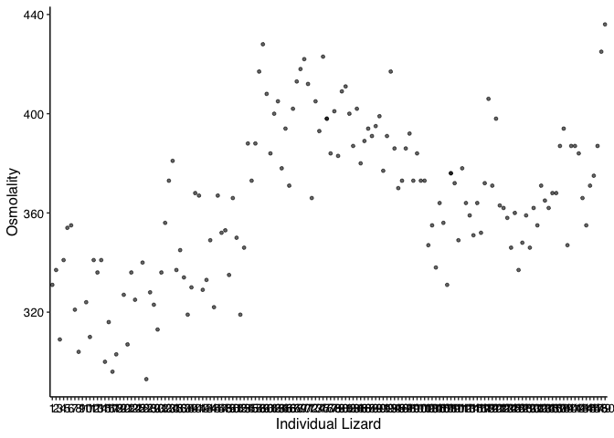<!-- -->

``` r
# glm
glm_osml_ID <- lm(osmolality_mmol_kg ~ individual_ID,
           data = all_data_wide)
summary(glm_osml_ID)
```

    ## 
    ## Call:
    ## lm(formula = osmolality_mmol_kg ~ individual_ID, data = all_data_wide)
    ## 
    ## Residuals:
    ##          1          2          3          4          5          6          7 
    ## -3.239e-26 -7.113e-31 -1.161e-31  1.129e-31 -1.601e-30 -1.305e-30 -5.808e-31 
    ##          8         10         11         12         13         14         15 
    ## -1.402e-30 -1.790e-30 -2.139e-30 -1.658e-30 -2.716e-30 -2.544e-30 -2.722e-30 
    ##         16         17         18         20         21         22         23 
    ## -2.458e-30 -4.121e-30 -3.756e-30 -3.338e-30 -3.657e-30 -3.918e-30 -4.120e-30 
    ##         25         26         27         28         29         30         31 
    ## -5.050e-30 -5.123e-30 -5.525e-30 -5.066e-30 -5.722e-30 -5.906e-30 -6.801e-30 
    ##         32         33         34         35         36         37         38 
    ## -7.218e-30 -7.154e-30 -7.398e-30 -7.944e-30 -7.998e-30 -8.743e-30 -9.383e-30 
    ##         39         40         41         42         43         44         45 
    ## -8.728e-30 -9.543e-30 -1.024e-29 -1.042e-29 -1.125e-29 -1.196e-29 -1.173e-29 
    ##         46         47         48         49         50         51         52 
    ## -1.097e-29 -1.204e-29 -1.333e-29 -1.368e-29 -1.503e-29 -1.384e-29 -1.562e-29 
    ##         53         54         55         56         57         58         59 
    ## -1.523e-29 -1.543e-29 -1.620e-29 -1.675e-29 -1.707e-29 -1.794e-29 -1.934e-29 
    ##         60         61         62         63         64         65         66 
    ## -1.969e-29 -1.976e-29 -2.032e-29 -2.058e-29 -2.211e-29 -2.251e-29 -2.334e-29 
    ##         67         68         69         70         71         72         73 
    ## -2.381e-29 -2.469e-29 -2.516e-29 -2.599e-29 -2.717e-29 -2.709e-29 -2.889e-29 
    ##         74         75         76         77         78         79         80 
    ##  5.564e-13 -5.564e-13  6.946e-27  2.352e-27  6.702e-27 -4.156e-27 -3.651e-27 
    ##         81         82         83         84         85         86         87 
    ## -1.725e-27 -4.121e-27 -4.445e-27  2.853e-28 -2.651e-27 -1.277e-27  1.705e-27 
    ##         88         89         90         91         92         93         94 
    ##  1.557e-27 -2.211e-28  2.344e-27  3.247e-27 -1.961e-27  1.678e-27  5.173e-27 
    ##         95         96         97         98         99        100        101 
    ## -1.196e-27  2.598e-27  2.336e-27  2.853e-28  4.350e-27  4.555e-27 -1.985e-27 
    ##        102        103        104        105        106        107        108 
    ##  3.409e-27  3.437e-28  3.895e-28  2.683e-27  8.817e-28 -7.528e-28  3.916e-13 
    ##        109        110        111        112        113        114        115 
    ## -3.916e-13  5.422e-27  5.504e-28 -5.459e-27 -2.274e-28  4.285e-27 -4.136e-28 
    ##        116        117        118        119        120        121        122 
    ## -3.064e-27  2.080e-28  2.333e-28  4.394e-29  2.177e-27 -2.337e-28  5.362e-28 
    ##        123        124        125        126        127        128        129 
    ##  2.017e-28  2.101e-27 -1.075e-28 -9.406e-28 -8.858e-29 -2.089e-27 -1.916e-29 
    ##        130        131        132        133        134        135        136 
    ## -3.536e-28  1.870e-29  2.901e-28 -5.072e-29 -9.469e-28 -1.916e-29 -1.591e-27 
    ##        137        138        139        140        141        142        143 
    ##  9.443e-29  6.687e-28  6.919e-29  8.391e-28  1.575e-28 -3.978e-28  2.333e-28 
    ##        144        145        146        147        148        149        150 
    ##  1.575e-28  4.394e-29  2.585e-28  6.079e-30 -4.441e-29  3.847e-28  2.838e-28 
    ## 
    ## Coefficients:
    ##                    Estimate Std. Error    t value Pr(>|t|)    
    ## (Intercept)       3.310e+02  6.804e-13  4.864e+14   <2e-16 ***
    ## individual_ID2    6.000e+00  9.623e-13  6.235e+12   <2e-16 ***
    ## individual_ID3   -2.200e+01  9.623e-13 -2.286e+13   <2e-16 ***
    ## individual_ID4    1.000e+01  9.623e-13  1.039e+13   <2e-16 ***
    ## individual_ID5    2.300e+01  9.623e-13  2.390e+13   <2e-16 ***
    ## individual_ID6    2.400e+01  9.623e-13  2.494e+13   <2e-16 ***
    ## individual_ID7   -1.000e+01  9.623e-13 -1.039e+13   <2e-16 ***
    ## individual_ID8   -2.700e+01  9.623e-13 -2.806e+13   <2e-16 ***
    ## individual_ID10  -7.000e+00  9.623e-13 -7.274e+12   <2e-16 ***
    ## individual_ID11  -2.100e+01  9.623e-13 -2.182e+13   <2e-16 ***
    ## individual_ID12   1.000e+01  9.623e-13  1.039e+13   <2e-16 ***
    ## individual_ID13   5.000e+00  9.623e-13  5.196e+12   <2e-16 ***
    ## individual_ID14   1.000e+01  9.623e-13  1.039e+13   <2e-16 ***
    ## individual_ID15  -3.100e+01  9.623e-13 -3.221e+13   <2e-16 ***
    ## individual_ID16  -1.500e+01  9.623e-13 -1.559e+13   <2e-16 ***
    ## individual_ID17  -3.500e+01  9.623e-13 -3.637e+13   <2e-16 ***
    ## individual_ID18  -2.800e+01  9.623e-13 -2.910e+13   <2e-16 ***
    ## individual_ID20  -4.000e+00  9.623e-13 -4.157e+12   <2e-16 ***
    ## individual_ID21  -2.400e+01  9.623e-13 -2.494e+13   <2e-16 ***
    ## individual_ID22   5.000e+00  9.623e-13  5.196e+12   <2e-16 ***
    ## individual_ID24  -6.000e+00  9.623e-13 -6.235e+12   <2e-16 ***
    ## individual_ID26   9.000e+00  9.623e-13  9.353e+12   <2e-16 ***
    ## individual_ID27  -3.800e+01  9.623e-13 -3.949e+13   <2e-16 ***
    ## individual_ID28  -3.000e+00  9.623e-13 -3.118e+12   <2e-16 ***
    ## individual_ID29  -8.000e+00  9.623e-13 -8.313e+12   <2e-16 ***
    ## individual_ID30  -1.800e+01  9.623e-13 -1.871e+13   <2e-16 ***
    ## individual_ID31   5.000e+00  9.623e-13  5.196e+12   <2e-16 ***
    ## individual_ID32   2.500e+01  9.623e-13  2.598e+13   <2e-16 ***
    ## individual_ID33   4.200e+01  9.623e-13  4.365e+13   <2e-16 ***
    ## individual_ID34   5.000e+01  9.623e-13  5.196e+13   <2e-16 ***
    ## individual_ID35   6.000e+00  9.623e-13  6.235e+12   <2e-16 ***
    ## individual_ID36   1.400e+01  9.623e-13  1.455e+13   <2e-16 ***
    ## individual_ID37   3.000e+00  9.623e-13  3.118e+12   <2e-16 ***
    ## individual_ID38  -1.200e+01  9.623e-13 -1.247e+13   <2e-16 ***
    ## individual_ID39  -1.000e+00  9.623e-13 -1.039e+12   <2e-16 ***
    ## individual_ID40   3.700e+01  9.623e-13  3.845e+13   <2e-16 ***
    ## individual_ID41   3.600e+01  9.623e-13  3.741e+13   <2e-16 ***
    ## individual_ID42  -2.000e+00  9.623e-13 -2.078e+12   <2e-16 ***
    ## individual_ID43   2.000e+00  9.623e-13  2.078e+12   <2e-16 ***
    ## individual_ID44   1.800e+01  9.623e-13  1.871e+13   <2e-16 ***
    ## individual_ID45  -9.000e+00  9.623e-13 -9.353e+12   <2e-16 ***
    ## individual_ID46   3.600e+01  9.623e-13  3.741e+13   <2e-16 ***
    ## individual_ID47   2.100e+01  9.623e-13  2.182e+13   <2e-16 ***
    ## individual_ID48   2.200e+01  9.623e-13  2.286e+13   <2e-16 ***
    ## individual_ID49   4.000e+00  9.623e-13  4.157e+12   <2e-16 ***
    ## individual_ID50   3.500e+01  9.623e-13  3.637e+13   <2e-16 ***
    ## individual_ID51   1.900e+01  9.623e-13  1.974e+13   <2e-16 ***
    ## individual_ID52  -1.200e+01  9.623e-13 -1.247e+13   <2e-16 ***
    ## individual_ID53   1.500e+01  9.623e-13  1.559e+13   <2e-16 ***
    ## individual_ID54   5.700e+01  9.623e-13  5.923e+13   <2e-16 ***
    ## individual_ID55   4.200e+01  9.623e-13  4.365e+13   <2e-16 ***
    ## individual_ID57   5.700e+01  9.623e-13  5.923e+13   <2e-16 ***
    ## individual_ID58   8.600e+01  9.623e-13  8.937e+13   <2e-16 ***
    ## individual_ID59   9.700e+01  9.623e-13  1.008e+14   <2e-16 ***
    ## individual_ID60   7.700e+01  9.623e-13  8.002e+13   <2e-16 ***
    ## individual_ID61   5.300e+01  9.623e-13  5.508e+13   <2e-16 ***
    ## individual_ID62   6.900e+01  9.623e-13  7.170e+13   <2e-16 ***
    ## individual_ID63   7.400e+01  9.623e-13  7.690e+13   <2e-16 ***
    ## individual_ID64   4.700e+01  9.623e-13  4.884e+13   <2e-16 ***
    ## individual_ID65   6.300e+01  9.623e-13  6.547e+13   <2e-16 ***
    ## individual_ID66   4.000e+01  9.623e-13  4.157e+13   <2e-16 ***
    ## individual_ID67   7.100e+01  9.623e-13  7.378e+13   <2e-16 ***
    ## individual_ID68   8.200e+01  9.623e-13  8.521e+13   <2e-16 ***
    ## individual_ID69   8.700e+01  9.623e-13  9.041e+13   <2e-16 ***
    ## individual_ID70   9.100e+01  9.623e-13  9.457e+13   <2e-16 ***
    ## individual_ID71   8.100e+01  9.623e-13  8.417e+13   <2e-16 ***
    ## individual_ID72   3.500e+01  9.623e-13  3.637e+13   <2e-16 ***
    ## individual_ID73   7.400e+01  9.623e-13  7.690e+13   <2e-16 ***
    ## individual_ID74   6.200e+01  9.623e-13  6.443e+13   <2e-16 ***
    ## individual_ID75   9.200e+01  9.623e-13  9.560e+13   <2e-16 ***
    ## individual_ID76   6.700e+01  8.334e-13  8.040e+13   <2e-16 ***
    ## individual_ID77   5.300e+01  9.623e-13  5.508e+13   <2e-16 ***
    ## individual_ID78   7.000e+01  9.623e-13  7.274e+13   <2e-16 ***
    ## individual_ID79   5.200e+01  9.623e-13  5.404e+13   <2e-16 ***
    ## individual_ID80   7.800e+01  9.623e-13  8.106e+13   <2e-16 ***
    ## individual_ID81   8.000e+01  9.623e-13  8.313e+13   <2e-16 ***
    ## individual_ID82   6.900e+01  9.623e-13  7.170e+13   <2e-16 ***
    ## individual_ID83   5.600e+01  9.623e-13  5.819e+13   <2e-16 ***
    ## individual_ID84   7.100e+01  9.623e-13  7.378e+13   <2e-16 ***
    ## individual_ID85   4.900e+01  9.623e-13  5.092e+13   <2e-16 ***
    ## individual_ID86   5.800e+01  9.623e-13  6.027e+13   <2e-16 ***
    ## individual_ID87   6.300e+01  9.623e-13  6.547e+13   <2e-16 ***
    ## individual_ID88   6.000e+01  9.623e-13  6.235e+13   <2e-16 ***
    ## individual_ID89   6.400e+01  9.623e-13  6.651e+13   <2e-16 ***
    ## individual_ID90   6.800e+01  9.623e-13  7.066e+13   <2e-16 ***
    ## individual_ID91   4.600e+01  9.623e-13  4.780e+13   <2e-16 ***
    ## individual_ID92   6.000e+01  9.623e-13  6.235e+13   <2e-16 ***
    ## individual_ID93   8.600e+01  9.623e-13  8.937e+13   <2e-16 ***
    ## individual_ID94   5.500e+01  9.623e-13  5.716e+13   <2e-16 ***
    ## individual_ID95   3.900e+01  9.623e-13  4.053e+13   <2e-16 ***
    ## individual_ID96   4.200e+01  9.623e-13  4.365e+13   <2e-16 ***
    ## individual_ID97   5.500e+01  9.623e-13  5.716e+13   <2e-16 ***
    ## individual_ID98   6.100e+01  9.623e-13  6.339e+13   <2e-16 ***
    ## individual_ID99   4.200e+01  9.623e-13  4.365e+13   <2e-16 ***
    ## individual_ID100  5.300e+01  9.623e-13  5.508e+13   <2e-16 ***
    ## individual_ID101  4.200e+01  9.623e-13  4.365e+13   <2e-16 ***
    ## individual_ID102  4.200e+01  9.623e-13  4.365e+13   <2e-16 ***
    ## individual_ID103  1.600e+01  9.623e-13  1.663e+13   <2e-16 ***
    ## individual_ID104  2.400e+01  9.623e-13  2.494e+13   <2e-16 ***
    ## individual_ID105  7.000e+00  9.623e-13  7.274e+12   <2e-16 ***
    ## individual_ID106  3.300e+01  9.623e-13  3.429e+13   <2e-16 ***
    ## individual_ID107  2.500e+01  9.623e-13  2.598e+13   <2e-16 ***
    ## individual_ID108  1.768e-12  9.623e-13  1.837e+00    0.208    
    ## individual_ID109  4.500e+01  8.334e-13  5.400e+13   <2e-16 ***
    ## individual_ID110  4.100e+01  9.623e-13  4.261e+13   <2e-16 ***
    ## individual_ID111  1.800e+01  9.623e-13  1.871e+13   <2e-16 ***
    ## individual_ID112  4.700e+01  9.623e-13  4.884e+13   <2e-16 ***
    ## individual_ID113  3.300e+01  9.623e-13  3.429e+13   <2e-16 ***
    ## individual_ID114  2.800e+01  9.623e-13  2.910e+13   <2e-16 ***
    ## individual_ID115  2.000e+01  9.623e-13  2.078e+13   <2e-16 ***
    ## individual_ID116  3.300e+01  9.623e-13  3.429e+13   <2e-16 ***
    ## individual_ID117  2.100e+01  9.623e-13  2.182e+13   <2e-16 ***
    ## individual_ID118  4.100e+01  9.623e-13  4.261e+13   <2e-16 ***
    ## individual_ID119  7.500e+01  9.623e-13  7.794e+13   <2e-16 ***
    ## individual_ID120  4.000e+01  9.623e-13  4.157e+13   <2e-16 ***
    ## individual_ID121  6.700e+01  9.623e-13  6.963e+13   <2e-16 ***
    ## individual_ID122  3.200e+01  9.623e-13  3.325e+13   <2e-16 ***
    ## individual_ID123  3.100e+01  9.623e-13  3.221e+13   <2e-16 ***
    ## individual_ID124  2.700e+01  9.623e-13  2.806e+13   <2e-16 ***
    ## individual_ID125  1.500e+01  9.623e-13  1.559e+13   <2e-16 ***
    ## individual_ID126  2.900e+01  9.623e-13  3.014e+13   <2e-16 ***
    ## individual_ID127  6.000e+00  9.623e-13  6.235e+12   <2e-16 ***
    ## individual_ID128  1.700e+01  9.623e-13  1.767e+13   <2e-16 ***
    ## individual_ID129  2.800e+01  9.623e-13  2.910e+13   <2e-16 ***
    ## individual_ID130  1.500e+01  9.623e-13  1.559e+13   <2e-16 ***
    ## individual_ID131  3.100e+01  9.623e-13  3.221e+13   <2e-16 ***
    ## individual_ID132  2.400e+01  9.623e-13  2.494e+13   <2e-16 ***
    ## individual_ID133  4.000e+01  9.623e-13  4.157e+13   <2e-16 ***
    ## individual_ID134  3.400e+01  9.623e-13  3.533e+13   <2e-16 ***
    ## individual_ID135  3.100e+01  9.623e-13  3.221e+13   <2e-16 ***
    ## individual_ID136  3.700e+01  9.623e-13  3.845e+13   <2e-16 ***
    ## individual_ID137  3.700e+01  9.623e-13  3.845e+13   <2e-16 ***
    ## individual_ID138  5.600e+01  9.623e-13  5.819e+13   <2e-16 ***
    ## individual_ID139  6.300e+01  9.623e-13  6.547e+13   <2e-16 ***
    ## individual_ID140  1.600e+01  9.623e-13  1.663e+13   <2e-16 ***
    ## individual_ID141  5.600e+01  9.623e-13  5.819e+13   <2e-16 ***
    ## individual_ID142  5.600e+01  9.623e-13  5.819e+13   <2e-16 ***
    ## individual_ID143  5.300e+01  9.623e-13  5.508e+13   <2e-16 ***
    ## individual_ID144  3.500e+01  9.623e-13  3.637e+13   <2e-16 ***
    ## individual_ID145  2.400e+01  9.623e-13  2.494e+13   <2e-16 ***
    ## individual_ID146  4.000e+01  9.623e-13  4.157e+13   <2e-16 ***
    ## individual_ID147  4.400e+01  9.623e-13  4.572e+13   <2e-16 ***
    ## individual_ID148  5.600e+01  9.623e-13  5.819e+13   <2e-16 ***
    ## individual_ID149  9.400e+01  9.623e-13  9.768e+13   <2e-16 ***
    ## individual_ID150  1.050e+02  9.623e-13  1.091e+14   <2e-16 ***
    ## ---
    ## Signif. codes:  0 '***' 0.001 '**' 0.01 '*' 0.05 '.' 0.1 ' ' 1
    ## 
    ## Residual standard error: 6.804e-13 on 2 degrees of freedom
    ##   (3 observations deleted due to missingness)
    ## Multiple R-squared:      1,  Adjusted R-squared:      1 
    ## F-statistic: 2.118e+27 on 144 and 2 DF,  p-value: < 2.2e-16

## Conclusion

Hydration seems to be affected by: - mass (NS) - sex (NS) - gravid/not
(NS) - sample eye (*) \! - whether or not the sample was hemolyzed (*)
\! - week/date of sampling\!\! (***) - individual (*** but likely
confounded with week/date…) - capture temp & RH (both \*\*\*)

So, for the LMM to predict osmolality, we will start with sample eye,
hemolyzed/not, week/date, individual, and capture temp and absolute
humidity as our predictor variables in the model.

Hematocrit seems to be affected by: - mass (NS) - sex (\*) - capture
temp & RH (NS)

So we will only include the model for hct \~ sex in the paper.

## What affects evaporative water loss?

Potential relationships: - CEWL \~ date/week, individual, SVL, mass,
gravidity, hct, osml, cloacal temp, ambient temp, ambient RH,
measurement temp, measurement RH, **body region**

### CEWL \~ Body Region

figure:

``` r
CEWL %>% 
  ggplot(data = .) + 
  geom_boxplot(aes(x = reorder(region, TEWL_g_m2h), 
                   y = TEWL_g_m2h, 
                   color = region
                   ), 
               size = 1,
               alpha = 1) +
  scale_x_discrete(labels = c("Dewlap", "Dorsum",
                              "Mite Patch", "Head", "Ventrum")) +
  theme_classic() + 
  xlab("Body Region") + 
  ylab(bquote('CEWL (g / '*m^2~h*')')) + 
  annotate("text", x = 1, y = 65, label = "a", size = 6) +
  annotate("text", x = 2, y = 62, label = "a", size = 6) +
  annotate("text", x = 3, y = 105, label = "b", size = 6) +
  annotate("text", x = 4, y = 92, label = "b", size = 6) +
  annotate("text", x = 5, y = 75, label = "b", size = 6) +
  scale_color_brewer(palette = "Set2") +
  ylim(1, 110) +
  theme(text = element_text(color = "black", 
                            family = "sans", 
                            size = 18),
        axis.text = element_text(color = "black", 
                                 family = "sans", 
                                 size = 14),
        legend.text.align = 0,
        legend.position = "none"
) -> CEWL_region_fig
CEWL_region_fig
```

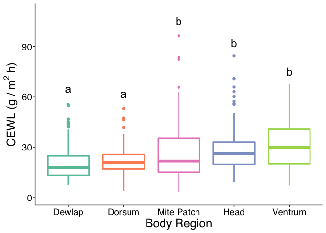<!-- -->

``` r
# export figure
#ggsave(filename = "CEWL_region_fig.tiff",
 #      plot = CEWL_region_fig,
  #     path = "./final_figures",
   #    device = "tiff",
    #   dpi = 1200,
     #  width = 6, height = 4)
```

stats:

``` r
# GLM
glm1 <- lm(TEWL_g_m2h ~ region, data = CEWL)
summary(glm1)
```

    ## 
    ## Call:
    ## lm(formula = TEWL_g_m2h ~ region, data = CEWL)
    ## 
    ## Residuals:
    ##     Min      1Q  Median      3Q     Max 
    ## -24.153  -8.365  -2.351   5.625  68.934 
    ## 
    ## Coefficients:
    ##             Estimate Std. Error t value Pr(>|t|)    
    ## (Intercept)   20.648      1.051  19.655  < 2e-16 ***
    ## regiondors     1.255      1.480   0.848    0.397    
    ## regionhead     7.671      1.478   5.191 2.75e-07 ***
    ## regionmite     6.578      1.491   4.412 1.19e-05 ***
    ## regionvent    10.615      1.480   7.171 1.91e-12 ***
    ## ---
    ## Signif. codes:  0 '***' 0.001 '**' 0.01 '*' 0.05 '.' 0.1 ' ' 1
    ## 
    ## Residual standard error: 12.39 on 695 degrees of freedom
    ## Multiple R-squared:  0.09518,    Adjusted R-squared:  0.08997 
    ## F-statistic: 18.28 on 4 and 695 DF,  p-value: 2.739e-14

I think that the way the GLM tests differences is not preferable. It
tests how different each category is from the one reference category,
rather than testing differences of each region against each other
region, in a pairwise test. So, I will try an ANOVA to see if I can get
those pairwise statistics.

``` r
# one-way ANOVA
CEWL_region_aov <- aov(data = all_data_long,
                       TEWL_g_m2h ~ region)
# post-hoc pairwise analysis
TukeyHSD(CEWL_region_aov)
```

    ##   Tukey multiple comparisons of means
    ##     95% family-wise confidence level
    ## 
    ## Fit: aov(formula = TEWL_g_m2h ~ region, data = all_data_long)
    ## 
    ## $region
    ##                diff         lwr       upr     p adj
    ## dors-dewl  1.254852 -2.79386697  5.303572 0.9155065
    ## head-dewl  7.670889  3.62925320 11.712525 0.0000027
    ## mite-dewl  6.578364  2.50040840 10.656319 0.0001157
    ## vent-dewl 10.615491  6.56677133 14.664210 0.0000000
    ## head-dors  6.416037  2.38891202 10.443162 0.0001472
    ## mite-dors  5.323511  1.25993752  9.387085 0.0033342
    ## vent-dors  9.360638  5.32640467 13.394872 0.0000000
    ## mite-head -1.092525 -5.14904197  2.963991 0.9478798
    ## vent-head  2.944601 -1.08252340  6.971726 0.2671247
    ## vent-mite  4.037127 -0.02644701  8.100701 0.0524730

Okay, the GLM coefficients and ANOVA differences are the same, so either
way should be fine, but helpful to have complete pairwise stats from
ANOVA for marking the figure.

### CEWL \~ Osmolality

``` r
all_data_long %>% 
  ggplot(data = .) + 
  geom_point(aes(x = osmolality_mmol_kg,
                 y = TEWL_g_m2h, 
                 color = region
                 ), 
             size = 1, 
             alpha = 0.6) + 
  scale_colour_manual(values = c("palegreen4", "lightblue4", 
                                 "plum4", "lightpink3", "seashell4")) +
  stat_smooth(aes(x = osmolality_mmol_kg, 
                  y = TEWL_g_m2h, 
                  color = region
                  ), 
              formula = y ~ x, 
              method = "lm", 
              se = F, 
              size = 1.6, 
              alpha = 1 ) + 
  theme_classic() + 
  xlab("Osmolality") + 
  ylab("CEWL") + 
  theme(text = element_text(color = "black", 
                            family = "sans", 
                            size = 12),
        axis.text = element_text(color = "black", 
                                 family = "sans", 
                                 size = 10),
        legend.text.align = 0,
)
```

    ## Warning: Removed 49 rows containing non-finite values (stat_smooth).

    ## Warning: Removed 49 rows containing missing values (geom_point).

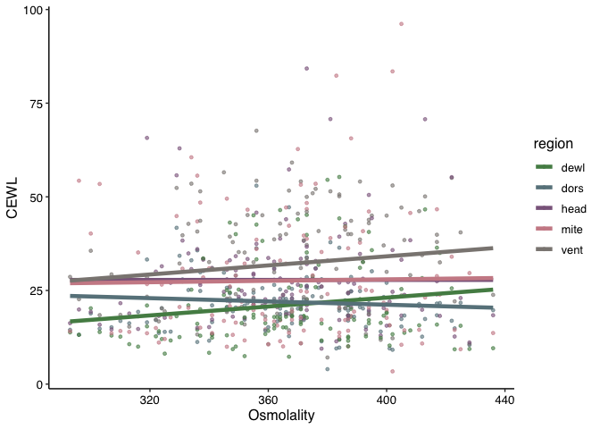<!-- -->

``` r
# glm
glm2 <- lm(TEWL_g_m2h ~ region + osmolality_mmol_kg,
           data = all_data_long)
summary(glm2)
```

    ## 
    ## Call:
    ## lm(formula = TEWL_g_m2h ~ region + osmolality_mmol_kg, data = all_data_long)
    ## 
    ## Residuals:
    ##     Min      1Q  Median      3Q     Max 
    ## -25.283  -8.574  -2.373   5.756  67.687 
    ## 
    ## Coefficients:
    ##                    Estimate Std. Error t value Pr(>|t|)    
    ## (Intercept)        13.23800    5.96535   2.219   0.0268 *  
    ## regiondors          0.80954    1.54100   0.525   0.5995    
    ## regionhead          6.69969    1.53811   4.356 1.54e-05 ***
    ## regionmite          6.54185    1.54992   4.221 2.78e-05 ***
    ## regionvent         10.99849    1.54100   7.137 2.57e-12 ***
    ## osmolality_mmol_kg  0.02147    0.01600   1.342   0.1801    
    ## ---
    ## Signif. codes:  0 '***' 0.001 '**' 0.01 '*' 0.05 '.' 0.1 ' ' 1
    ## 
    ## Residual standard error: 12.42 on 645 degrees of freedom
    ##   (49 observations deleted due to missingness)
    ## Multiple R-squared:  0.1012, Adjusted R-squared:  0.09424 
    ## F-statistic: 14.53 on 5 and 645 DF,  p-value: 1.669e-13

``` r
# Facet ggplot
ggplot(aes(osmolality_mmol_kg, TEWL_g_m2h), data = all_data_long) + 
  geom_point() + 
  stat_smooth(aes(x = osmolality_mmol_kg, 
                  y = TEWL_g_m2h, 
                  color = region
                  ), 
              formula = y ~ x, 
              method = "lm", 
              se = F, 
              size = 1.6, 
              alpha = 1 )+
    theme_classic() + 
  xlab("Osmolality") + 
  ylab("CEWL") + 
  theme(text = element_text(color = "black", 
                            family = "sans", 
                            size = 12),
        axis.text = element_text(color = "black", 
                                 family = "sans", 
                                 size = 10),
        legend.text.align = 0,
)+
  facet_wrap(~ region) # create a facet for each body region
```

    ## Warning: Removed 49 rows containing non-finite values (stat_smooth).
    
    ## Warning: Removed 49 rows containing missing values (geom_point).

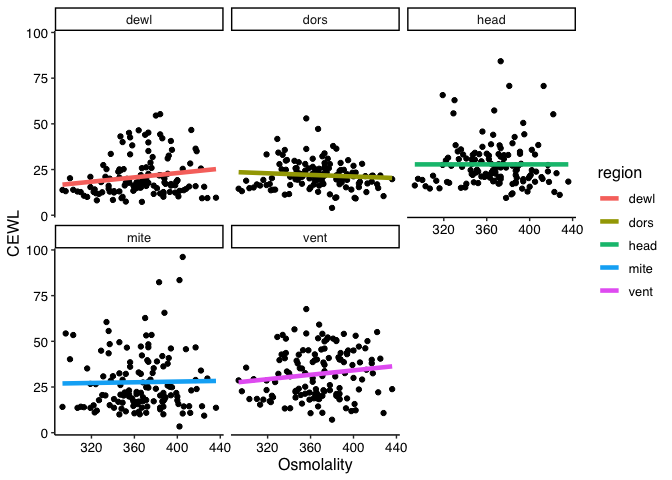<!-- -->

### CEWL \~ Hematocrit

``` r
all_data_long %>% 
  ggplot(data = .) + 
  geom_point(aes(x = hematocrit_percent,
                 y = TEWL_g_m2h, 
                 color = region
                 ), 
             size = 1, 
             alpha = 0.6) + 
  scale_colour_manual(values = c("palegreen4", "lightblue4", 
                                 "plum4", "lightpink3", "seashell4")) +
  stat_smooth(aes(x = hematocrit_percent, 
                  y = TEWL_g_m2h, 
                  color = region
                  ), 
              formula = y ~ x, 
              method = "lm", 
              se = F, 
              size = 1.6, 
              alpha = 1 ) + 
  theme_classic() + 
  xlab("Hematocrit") + 
  ylab("CEWL") + 
  theme(text = element_text(color = "black", 
                            family = "sans", 
                            size = 12),
        axis.text = element_text(color = "black", 
                                 family = "sans", 
                                 size = 10),
        legend.text.align = 0,
)
```

    ## Warning: Removed 119 rows containing non-finite values (stat_smooth).

    ## Warning: Removed 119 rows containing missing values (geom_point).

<!-- -->

``` r
# glms
# CEWL ~ region + hct
glm3 <- lm(TEWL_g_m2h ~ region + hematocrit_percent,
           data = all_data_long)
summary(glm3)
```

    ## 
    ## Call:
    ## lm(formula = TEWL_g_m2h ~ region + hematocrit_percent, data = all_data_long)
    ## 
    ## Residuals:
    ##     Min      1Q  Median      3Q     Max 
    ## -26.200  -8.821  -2.315   6.075  68.370 
    ## 
    ## Coefficients:
    ##                    Estimate Std. Error t value Pr(>|t|)    
    ## (Intercept)        26.21722    3.31335   7.913 1.30e-14 ***
    ## regiondors          0.51157    1.65432   0.309  0.75725    
    ## regionhead          6.63329    1.65083   4.018 6.65e-05 ***
    ## regionmite          5.48768    1.66511   3.296  0.00104 ** 
    ## regionvent         11.00718    1.65431   6.654 6.67e-11 ***
    ## hematocrit_percent -0.11513    0.08741  -1.317  0.18830    
    ## ---
    ## Signif. codes:  0 '***' 0.001 '**' 0.01 '*' 0.05 '.' 0.1 ' ' 1
    ## 
    ## Residual standard error: 12.6 on 575 degrees of freedom
    ##   (119 observations deleted due to missingness)
    ## Multiple R-squared:  0.09906,    Adjusted R-squared:  0.09122 
    ## F-statistic: 12.64 on 5 and 575 DF,  p-value: 1.139e-11

### CEWL \~ Cloacal Temperature

figure:

``` r
all_data_long %>% 
  ggplot(data = .) + 
  geom_point(aes(x = cloacal_temp_C,
                 y = TEWL_g_m2h, 
                 color = region
                 ), 
             size = 1, 
             alpha = 0.4) + 
  stat_smooth(aes(x = cloacal_temp_C, 
                  y = TEWL_g_m2h, 
                  color = region
                  ), 
              formula = y ~ x, 
              method = "lm", 
              se = F, 
              size = 1.6, 
              alpha = 1) + 
  theme_classic() + 
  xlab("Cloacal Temperature (°C)") + 
  ylab(bquote('CEWL (g / '*m^2~h*')')) + 
  #annotate("text", x = 1, y = 65, label = "a", size = 6) +
  scale_color_brewer(palette = "Set2",
                     labels = c("Dewlap", "Dorsum", "Head",
                              "Mite Patch", "Ventrum"),
                     name = "") +
  ylim(1, 100) +
  xlim(20, 28) +
  theme(text = element_text(color = "black", 
                            family = "sans", 
                            size = 18),
        axis.text = element_text(color = "black", 
                                 family = "sans", 
                                 size = 14),
        legend.text = element_text(color = "black", 
                                 family = "sans", 
                                 size = 12),
        legend.text.align = 0,
        legend.position = c(0.9, 0.85)
  #) +
  #guides(color = guide_legend(nrow = 2, byrow = TRUE)
         ) -> CEWL_ctemp_fig
CEWL_ctemp_fig
```

    ## Warning: Removed 49 rows containing non-finite values (stat_smooth).

    ## Warning: Removed 49 rows containing missing values (geom_point).

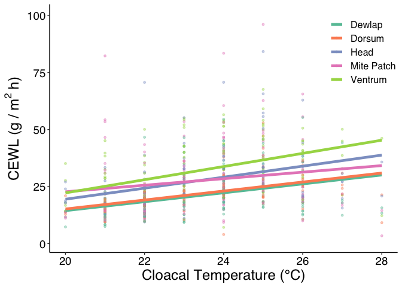<!-- -->

``` r
# export figure
#ggsave(filename = "CEWL_ctemp_fig.tiff",
 #      plot = CEWL_ctemp_fig,
  #     path = "./final_figures",
   #    device = "tiff",
    #   dpi = 1200,
     #  width = 6, height = 4)
```

stats:

``` r
# glms
# CEWL ~ region + ctemp
glm4 <- lm(TEWL_g_m2h ~ region + cloacal_temp_C,
           data = all_data_long)
summary(glm4)
```

    ## 
    ## Call:
    ## lm(formula = TEWL_g_m2h ~ region + cloacal_temp_C, data = all_data_long)
    ## 
    ## Residuals:
    ##     Min      1Q  Median      3Q     Max 
    ## -34.074  -7.568  -1.917   5.261  65.105 
    ## 
    ## Coefficients:
    ##                Estimate Std. Error t value Pr(>|t|)    
    ## (Intercept)    -29.0474     5.8667  -4.951 9.43e-07 ***
    ## regiondors       0.7741     1.4621   0.529    0.597    
    ## regionhead       6.5922     1.4593   4.517 7.45e-06 ***
    ## regionmite       6.5271     1.4705   4.439 1.06e-05 ***
    ## regionvent      10.9709     1.4621   7.504 2.07e-13 ***
    ## cloacal_temp_C   2.1430     0.2470   8.677  < 2e-16 ***
    ## ---
    ## Signif. codes:  0 '***' 0.001 '**' 0.01 '*' 0.05 '.' 0.1 ' ' 1
    ## 
    ## Residual standard error: 11.79 on 645 degrees of freedom
    ##   (49 observations deleted due to missingness)
    ## Multiple R-squared:  0.1925, Adjusted R-squared:  0.1863 
    ## F-statistic: 30.76 on 5 and 645 DF,  p-value: < 2.2e-16

### CEWL \~ Capture Temperature

``` r
all_data_long %>% 
  ggplot(data = .) + 
  geom_point(aes(x = temp_C_interpol,
                 y = TEWL_g_m2h, 
                 color = region
                 ), 
             size = 1, 
             alpha = 0.6) + 
  scale_colour_manual(values = c("palegreen4", "lightblue4", 
                                 "plum4", "lightpink3", "seashell4")) +
  stat_smooth(aes(x = temp_C_interpol, 
                  y = TEWL_g_m2h, 
                  color = region
                  ), 
              formula = y ~ x, 
              method = "lm", 
              se = F, 
              size = 1.6, 
              alpha = 1 ) + 
  theme_classic() + 
  xlab("Ambient Temperature at Capture") + 
  ylab("CEWL") + 
  theme(text = element_text(color = "black", 
                            family = "sans", 
                            size = 12),
        axis.text = element_text(color = "black", 
                                 family = "sans", 
                                 size = 10),
        legend.text.align = 0,
)
```

    ## Warning: Removed 59 rows containing non-finite values (stat_smooth).

    ## Warning: Removed 59 rows containing missing values (geom_point).

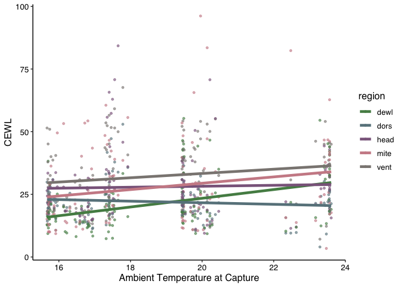<!-- -->

``` r
# glms
# CEWL ~ region + capture temp
glm7 <- lm(TEWL_g_m2h ~ region + temp_C_interpol,
           data = all_data_long)
summary(glm7)
```

    ## 
    ## Call:
    ## lm(formula = TEWL_g_m2h ~ region + temp_C_interpol, data = all_data_long)
    ## 
    ## Residuals:
    ##     Min      1Q  Median      3Q     Max 
    ## -28.520  -8.064  -2.364   5.490  67.412 
    ## 
    ## Coefficients:
    ##                 Estimate Std. Error t value Pr(>|t|)    
    ## (Intercept)       7.2932     3.7521   1.944 0.052366 .  
    ## regiondors        0.7332     1.5397   0.476 0.634082    
    ## regionhead        6.7182     1.5367   4.372 1.44e-05 ***
    ## regionmite        6.6003     1.5487   4.262 2.34e-05 ***
    ## regionvent       11.0003     1.5397   7.145 2.49e-12 ***
    ## temp_C_interpol   0.7444     0.1914   3.889 0.000111 ***
    ## ---
    ## Signif. codes:  0 '***' 0.001 '**' 0.01 '*' 0.05 '.' 0.1 ' ' 1
    ## 
    ## Residual standard error: 12.32 on 635 degrees of freedom
    ##   (59 observations deleted due to missingness)
    ## Multiple R-squared:  0.1202, Adjusted R-squared:  0.1133 
    ## F-statistic: 17.35 on 5 and 635 DF,  p-value: 4.053e-16

### CEWL \~ Capture Humidity

``` r
all_data_long %>% 
  ggplot(data = .) + 
  geom_point(aes(x = RH_percent_interpol,
                 y = TEWL_g_m2h, 
                 color = region
                 ), 
             size = 1, 
             alpha = 0.6) + 
  scale_colour_manual(values = c("palegreen4", "lightblue4", 
                                 "plum4", "lightpink3", "seashell4")) +
  stat_smooth(aes(x = RH_percent_interpol, 
                  y = TEWL_g_m2h, 
                  color = region
                  ), 
              formula = y ~ x, 
              method = "lm", 
              se = F, 
              size = 1.6, 
              alpha = 1 ) + 
  theme_classic() + 
  xlab("Ambient Relative Humidity at Capture") + 
  ylab("CEWL") + 
  theme(text = element_text(color = "black", 
                            family = "sans", 
                            size = 12),
        axis.text = element_text(color = "black", 
                                 family = "sans", 
                                 size = 10),
        legend.text.align = 0,
)
```

    ## Warning: Removed 59 rows containing non-finite values (stat_smooth).

    ## Warning: Removed 59 rows containing missing values (geom_point).

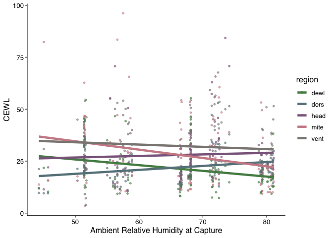<!-- -->

``` r
# glms
# CEWL ~ region + capture RH
glm8 <- lm(TEWL_g_m2h ~ region + RH_percent_interpol,
           data = all_data_long)
summary(glm8)
```

    ## 
    ## Call:
    ## lm(formula = TEWL_g_m2h ~ region + RH_percent_interpol, data = all_data_long)
    ## 
    ## Residuals:
    ##     Min      1Q  Median      3Q     Max 
    ## -26.684  -8.509  -2.316   5.975  67.353 
    ## 
    ## Coefficients:
    ##                     Estimate Std. Error t value Pr(>|t|)    
    ## (Intercept)         28.11219    3.39401   8.283 7.13e-16 ***
    ## regiondors           0.74798    1.55236   0.482    0.630    
    ## regionhead           6.72183    1.54938   4.338 1.67e-05 ***
    ## regionmite           6.61655    1.56148   4.237 2.60e-05 ***
    ## regionvent          10.99882    1.55235   7.085 3.70e-12 ***
    ## RH_percent_interpol -0.10296    0.04819  -2.137    0.033 *  
    ## ---
    ## Signif. codes:  0 '***' 0.001 '**' 0.01 '*' 0.05 '.' 0.1 ' ' 1
    ## 
    ## Residual standard error: 12.42 on 635 degrees of freedom
    ##   (59 observations deleted due to missingness)
    ## Multiple R-squared:  0.1057, Adjusted R-squared:  0.09863 
    ## F-statistic: 15.01 on 5 and 635 DF,  p-value: 6.09e-14

### CEWL \~ Abs Humidity

``` r
all_data_long %>% 
  ggplot(data = .) + 
  geom_jitter(aes(x = abs_humidity_g_m3_interpol,
                 y = TEWL_g_m2h, 
                 color = region
                 ), 
             size = 1, 
             alpha = 0.4) + 
  stat_smooth(aes(x = abs_humidity_g_m3_interpol, 
                  y = TEWL_g_m2h, 
                  color = region
                  ), 
              formula = y ~ x, 
              method = "lm", 
              se = F, 
              size = 1.6, 
              alpha = 1 ) + 
  theme_classic() + 
  xlab('Absolute Humidity at Capture (g / '*m^3~')') + 
  ylab(bquote('CEWL (g / '*m^2~h*')')) + 
  #annotate("text", x = 1, y = 65, label = "a", size = 6) +
  scale_color_brewer(palette = "Set2",
                     labels = c("Dewlap", "Dorsum",
                              "Head", "Mite Patch", "Ventrum"),
                     name = "") +
  ylim(1, 100) +
  xlim(8, 12) +
  theme(text = element_text(color = "black", 
                            family = "sans", 
                            size = 18),
        axis.text = element_text(color = "black", 
                                 family = "sans", 
                                 size = 14),
        legend.text = element_text(color = "black", 
                                 family = "sans", 
                                 size = 12),
        legend.text.align = 0,
        legend.position = c(0.15, 0.85)
         ) -> CEWL_abshum_fig
CEWL_abshum_fig
```

    ## Warning: Removed 59 rows containing non-finite values (stat_smooth).

    ## Warning: Removed 59 rows containing missing values (geom_point).

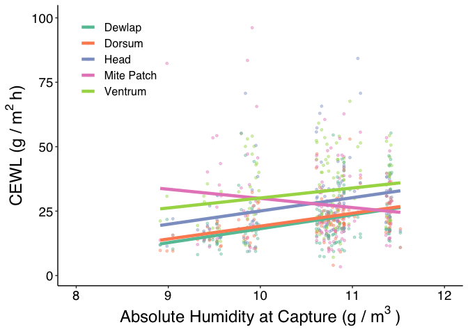<!-- -->

``` r
# export figure
#ggsave(filename = "CEWL_abshum_fig.tiff",
 #      plot = CEWL_abshum_fig,
  #     path = "./final_figures",
   #    device = "tiff",
    #   dpi = 1200,
     #  width = 6, height = 4)
```

model:

``` r
glm8.1 <- lm(TEWL_g_m2h ~ region + abs_humidity_g_m3_interpol,
           data = all_data_long)
summary(glm8.1)
```

    ## 
    ## Call:
    ## lm(formula = TEWL_g_m2h ~ region + abs_humidity_g_m3_interpol, 
    ##     data = all_data_long)
    ## 
    ## Residuals:
    ##     Min      1Q  Median      3Q     Max 
    ## -25.897  -7.797  -2.342   5.477  70.452 
    ## 
    ## Coefficients:
    ##                            Estimate Std. Error t value Pr(>|t|)    
    ## (Intercept)                -12.6946     8.0068  -1.585    0.113    
    ## regiondors                   0.7724     1.5359   0.503    0.615    
    ## regionhead                   6.7434     1.5330   4.399 1.28e-05 ***
    ## regionmite                   6.5698     1.5450   4.252 2.43e-05 ***
    ## regionvent                  11.0416     1.5359   7.189 1.84e-12 ***
    ## abs_humidity_g_m3_interpol   3.2118     0.7505   4.280 2.16e-05 ***
    ## ---
    ## Signif. codes:  0 '***' 0.001 '**' 0.01 '*' 0.05 '.' 0.1 ' ' 1
    ## 
    ## Residual standard error: 12.29 on 635 degrees of freedom
    ##   (59 observations deleted due to missingness)
    ## Multiple R-squared:  0.1245, Adjusted R-squared:  0.1176 
    ## F-statistic: 18.06 on 5 and 635 DF,  p-value: < 2.2e-16

### CEWL \~ Measurement Temperature

``` r
all_data_long %>% 
  ggplot(data = .) + 
  geom_point(aes(x = ambient_temp_C,
                 y = TEWL_g_m2h, 
                 color = region
                 ), 
             size = 1, 
             alpha = 0.6) + 
  scale_colour_manual(values = c("palegreen4", "lightblue4", 
                                 "plum4", "lightpink3", "seashell4")) +
  stat_smooth(aes(x = ambient_temp_C, 
                  y = TEWL_g_m2h, 
                  color = region
                  ), 
              formula = y ~ x, 
              method = "lm", 
              se = F, 
              size = 1.6, 
              alpha = 1 ) + 
  theme_classic() + 
  xlab("Ambient Temperature During Measurement") + 
  ylab("CEWL") + 
  theme(text = element_text(color = "black", 
                            family = "sans", 
                            size = 12),
        axis.text = element_text(color = "black", 
                                 family = "sans", 
                                 size = 10),
        legend.text.align = 0,
)
```

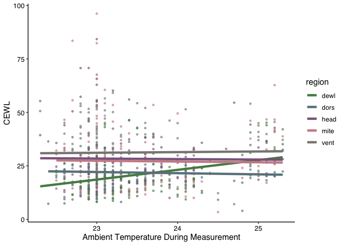<!-- -->

``` r
# glm
# CEWL ~ region + aquaflux measurement temp
glm9 <- lm(TEWL_g_m2h ~ region + ambient_temp_C,
           data = all_data_long)
summary(glm9)
```

    ## 
    ## Call:
    ## lm(formula = TEWL_g_m2h ~ region + ambient_temp_C, data = all_data_long)
    ## 
    ## Residuals:
    ##     Min      1Q  Median      3Q     Max 
    ## -25.050  -8.225  -2.480   5.646  69.266 
    ## 
    ## Coefficients:
    ##                Estimate Std. Error t value Pr(>|t|)    
    ## (Intercept)      4.1247    15.6912   0.263    0.793    
    ## regiondors       1.2673     1.4803   0.856    0.392    
    ## regionhead       7.6895     1.4778   5.203 2.58e-07 ***
    ## regionmite       6.5624     1.4910   4.401 1.25e-05 ***
    ## regionvent      10.6310     1.4803   7.182 1.78e-12 ***
    ## ambient_temp_C   0.7046     0.6677   1.055    0.292    
    ## ---
    ## Signif. codes:  0 '***' 0.001 '**' 0.01 '*' 0.05 '.' 0.1 ' ' 1
    ## 
    ## Residual standard error: 12.38 on 694 degrees of freedom
    ## Multiple R-squared:  0.09663,    Adjusted R-squared:  0.09012 
    ## F-statistic: 14.85 on 5 and 694 DF,  p-value: 7.403e-14

### CEWL \~ Measurement Humidity

Very interesting relationship\! Mite patch CEWL decreases as ambient
humidity increases, but every other location appears to increase. In
this case, an interaction term is warranted.

``` r
all_data_long %>% 
  ggplot(data = .) + 
  geom_point(aes(x = ambient_RH_percent,
                 y = TEWL_g_m2h, 
                 color = region
                 ), 
             size = 1, 
             alpha = 0.6) + 
  scale_colour_manual(values = c("palegreen4", "lightblue4", 
                                 "plum4", "lightpink3", "seashell4")) +
  stat_smooth(aes(x = ambient_RH_percent, 
                  y = TEWL_g_m2h, 
                  color = region
                  ), 
              formula = y ~ x, 
              method = "lm", 
              se = F, 
              size = 1.6, 
              alpha = 1 ) + 
  theme_classic() + 
  xlab("Ambient Relative Humidity During Measurement") + 
  ylab("CEWL") + 
  theme(text = element_text(color = "black", 
                            family = "sans", 
                            size = 12),
        axis.text = element_text(color = "black", 
                                 family = "sans", 
                                 size = 10),
        legend.text.align = 0,
)
```

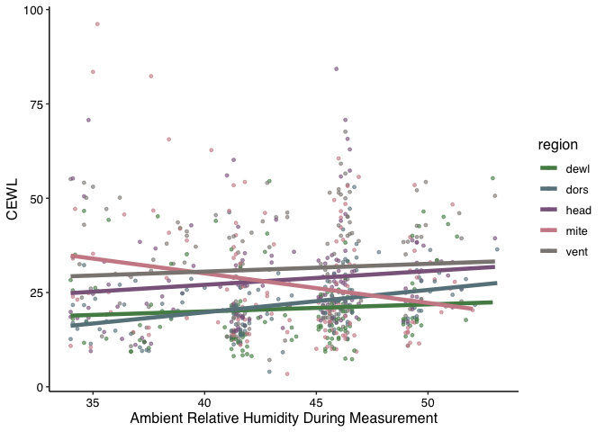<!-- -->

``` r
# glm
# CEWL ~ region + aquaflux measurement RH
glm9 <- lm(TEWL_g_m2h ~ region * ambient_RH_percent,
           data = all_data_long)
summary(glm9)
```

    ## 
    ## Call:
    ## lm(formula = TEWL_g_m2h ~ region * ambient_RH_percent, data = all_data_long)
    ## 
    ## Residuals:
    ##     Min      1Q  Median      3Q     Max 
    ## -24.032  -8.246  -2.406   6.024  62.330 
    ## 
    ## Coefficients:
    ##                                Estimate Std. Error t value Pr(>|t|)    
    ## (Intercept)                    12.55817   10.16068   1.236 0.216895    
    ## regiondors                    -16.53785   14.23939  -1.161 0.245875    
    ## regionhead                     -0.11549   14.18339  -0.008 0.993505    
    ## regionmite                     48.83842   14.52470   3.362 0.000815 ***
    ## regionvent                      9.73228   14.18940   0.686 0.493017    
    ## ambient_RH_percent              0.18577    0.23210   0.800 0.423773    
    ## regiondors:ambient_RH_percent   0.40736    0.32492   1.254 0.210375    
    ## regionhead:ambient_RH_percent   0.17906    0.32408   0.553 0.580766    
    ## regionmite:ambient_RH_percent  -0.96891    0.33149  -2.923 0.003581 ** 
    ## regionvent:ambient_RH_percent   0.02057    0.32432   0.063 0.949446    
    ## ---
    ## Signif. codes:  0 '***' 0.001 '**' 0.01 '*' 0.05 '.' 0.1 ' ' 1
    ## 
    ## Residual standard error: 12.24 on 690 degrees of freedom
    ## Multiple R-squared:  0.1229, Adjusted R-squared:  0.1115 
    ## F-statistic: 10.75 on 9 and 690 DF,  p-value: 1.047e-15

### CEWL \~ Wind Speed

``` r
all_data_long %>% 
  ggplot(data = .) + 
  geom_point(aes(x = Wind_mph_interpol,
                 y = TEWL_g_m2h, 
                 color = region
                 ), 
             size = 1, 
             alpha = 0.6) + 
  scale_colour_manual(values = c("palegreen4", "lightblue4", 
                                 "plum4", "lightpink3", "seashell4")) +
  stat_smooth(aes(x = Wind_mph_interpol, 
                  y = TEWL_g_m2h, 
                  color = region
                  ), 
              formula = y ~ x, 
              method = "lm", 
              se = F, 
              size = 1.6, 
              alpha = 1 ) + 
  theme_classic() + 
  xlab("Average Windspeed During Measurement") + 
  ylab("CEWL") + 
  theme(text = element_text(color = "black", 
                            family = "sans", 
                            size = 12),
        axis.text = element_text(color = "black", 
                                 family = "sans", 
                                 size = 10),
        legend.text.align = 0,
)
```

    ## Warning: Removed 59 rows containing non-finite values (stat_smooth).

    ## Warning: Removed 59 rows containing missing values (geom_point).

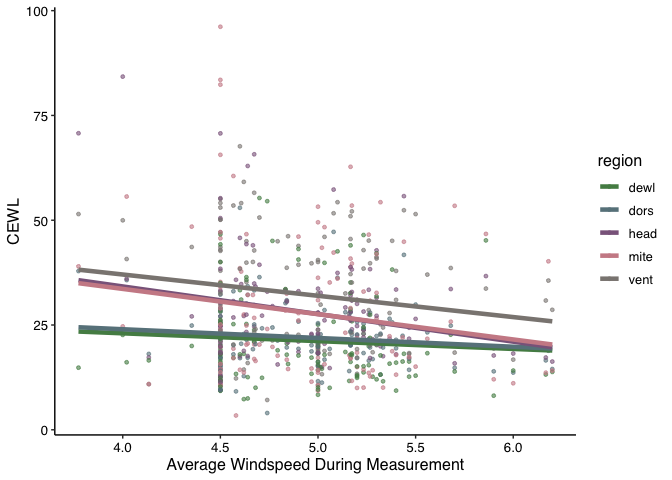<!-- -->

``` r
# glm
# CEWL ~ region + aquaflux measurement RH
glm10 <- lm(TEWL_g_m2h ~ region + Wind_mph_interpol,
           data = all_data_long)
summary(glm10)
```

    ## 
    ## Call:
    ## lm(formula = TEWL_g_m2h ~ region + Wind_mph_interpol, data = all_data_long)
    ## 
    ## Residuals:
    ##     Min      1Q  Median      3Q     Max 
    ## -26.071  -8.442  -2.135   5.888  66.332 
    ## 
    ## Coefficients:
    ##                   Estimate Std. Error t value Pr(>|t|)    
    ## (Intercept)        42.6795     5.5822   7.646 7.72e-14 ***
    ## regiondors          0.7384     1.5395   0.480 0.631636    
    ## regionhead          6.7110     1.5365   4.368 1.47e-05 ***
    ## regionmite          6.6311     1.5485   4.282 2.14e-05 ***
    ## regionvent         10.9815     1.5395   7.133 2.68e-12 ***
    ## Wind_mph_interpol  -4.3296     1.1062  -3.914 0.000101 ***
    ## ---
    ## Signif. codes:  0 '***' 0.001 '**' 0.01 '*' 0.05 '.' 0.1 ' ' 1
    ## 
    ## Residual standard error: 12.32 on 635 degrees of freedom
    ##   (59 observations deleted due to missingness)
    ## Multiple R-squared:  0.1205, Adjusted R-squared:  0.1135 
    ## F-statistic: 17.39 on 5 and 635 DF,  p-value: 3.7e-16

### CEWL \~ Solar Rad

  - Definitely could have an effect may be worth testing in the model

<!-- end list -->

``` r
all_data_long %>% 
  ggplot(data = .) + 
  geom_point(aes(x = Solar_rad_Wm2_interpol,
                 y = TEWL_g_m2h, 
                 color = region
                 ), 
             size = 1, 
             alpha = 0.6) + 
  scale_colour_manual(values = c("palegreen4", "lightblue4", 
                                 "plum4", "lightpink3", "seashell4")) +
  stat_smooth(aes(x = Solar_rad_Wm2_interpol, 
                  y = TEWL_g_m2h, 
                  color = region
                  ), 
              formula = y ~ x, 
              method = "lm", 
              se = F, 
              size = 1.6, 
              alpha = 1 ) + 
  theme_classic() + 
  xlab("Solar Radiation W/m^2") + 
  ylab("CEWL") + 
  theme(text = element_text(color = "black", 
                            family = "sans", 
                            size = 12),
        axis.text = element_text(color = "black", 
                                 family = "sans", 
                                 size = 10),
        legend.text.align = 0,
)
```

    ## Warning: Removed 59 rows containing non-finite values (stat_smooth).

    ## Warning: Removed 59 rows containing missing values (geom_point).

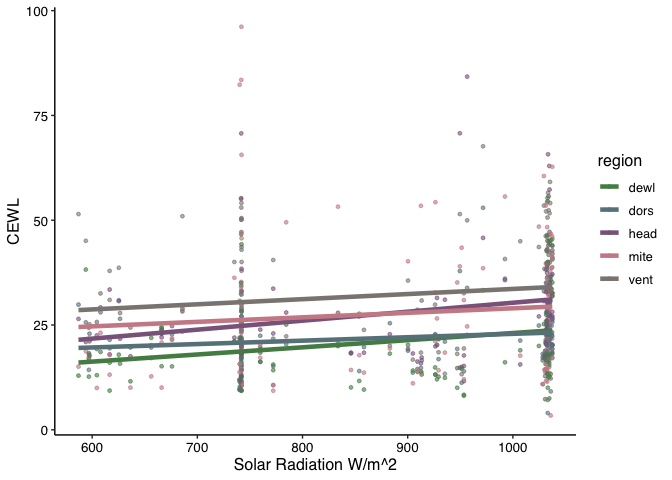<!-- -->

``` r
# glm
# CEWL ~ region + aquaflux measurement RH
glm11 <- lm(TEWL_g_m2h ~ region + Solar_rad_Wm2_interpol,
           data = all_data_long)
summary(glm11)
```

    ## 
    ## Call:
    ## lm(formula = TEWL_g_m2h ~ region + Solar_rad_Wm2_interpol, data = all_data_long)
    ## 
    ## Residuals:
    ##     Min      1Q  Median      3Q     Max 
    ## -27.147  -8.058  -2.265   5.786  70.442 
    ## 
    ## Coefficients:
    ##                         Estimate Std. Error t value Pr(>|t|)    
    ## (Intercept)             8.813533   3.001613   2.936  0.00344 ** 
    ## regiondors              0.766912   1.534194   0.500  0.61733    
    ## regionhead              6.750838   1.531269   4.409 1.22e-05 ***
    ## regionmite              6.563995   1.543269   4.253 2.42e-05 ***
    ## regionvent             11.044177   1.534212   7.199 1.72e-12 ***
    ## Solar_rad_Wm2_interpol  0.013937   0.003134   4.448 1.03e-05 ***
    ## ---
    ## Signif. codes:  0 '***' 0.001 '**' 0.01 '*' 0.05 '.' 0.1 ' ' 1
    ## 
    ## Residual standard error: 12.27 on 635 degrees of freedom
    ##   (59 observations deleted due to missingness)
    ## Multiple R-squared:  0.1265, Adjusted R-squared:  0.1196 
    ## F-statistic: 18.38 on 5 and 635 DF,  p-value: < 2.2e-16

### CEWL \~ Individual

``` r
all_data_long %>% 
  ggplot(data = .) + 
  geom_point(aes(x = individual_ID,
                 y = TEWL_g_m2h, 
                 color = region
                 ), 
             size = 1, 
             alpha = 0.6) + 
  scale_colour_manual(values = c("palegreen4", "lightblue4", 
                                 "plum4", "lightpink3", "seashell4")) +
  stat_smooth(aes(x = individual_ID, 
                  y = TEWL_g_m2h, 
                  color = region
                  ), 
              formula = y ~ x, 
              method = "lm", 
              se = F, 
              size = 1.6, 
              alpha = 1 ) + 
  theme_classic() + 
  xlab("Individual Lizard") + 
  ylab("CEWL") + 
  
  # just to get a better look
  # ylim(5, 40) +
  
  theme(text = element_text(color = "black", 
                            family = "sans", 
                            size = 12),
        axis.text = element_text(color = "black", 
                                 family = "sans", 
                                 size = 10),
        legend.text.align = 0,
)
```

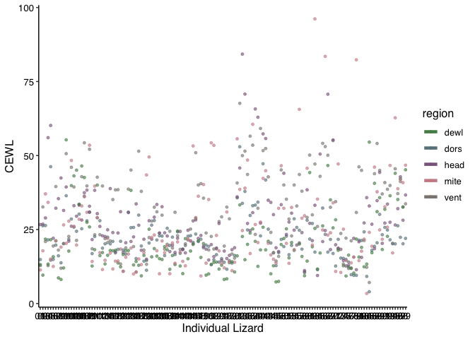<!-- -->

``` r
# glm
glm6 <- lm(TEWL_g_m2h ~ region + individual_ID,
           data = all_data_long)
summary(glm6)
```

    ## 
    ## Call:
    ## lm(formula = TEWL_g_m2h ~ region + individual_ID, data = all_data_long)
    ## 
    ## Residuals:
    ##     Min      1Q  Median      3Q     Max 
    ## -22.816  -5.077  -0.643   3.854  50.939 
    ## 
    ## Coefficients:
    ##                  Estimate Std. Error t value Pr(>|t|)    
    ## (Intercept)      10.62965    4.65806   2.282 0.022868 *  
    ## regiondors        1.24584    1.23107   1.012 0.311980    
    ## regionhead        7.45594    1.22779   6.073 2.34e-09 ***
    ## regionmite        6.51515    1.24173   5.247 2.21e-07 ***
    ## regionvent       10.50482    1.23088   8.534  < 2e-16 ***
    ## individual_ID02   6.86200    6.49416   1.057 0.291136    
    ## individual_ID03  11.22600    6.49416   1.729 0.084432 .  
    ## individual_ID04  11.80200    6.49416   1.817 0.069707 .  
    ## individual_ID05  15.76000    6.49416   2.427 0.015551 *  
    ## individual_ID06   1.17400    6.49416   0.181 0.856608    
    ## individual_ID07  10.99400    6.49416   1.693 0.091036 .  
    ## individual_ID08   4.13870    6.89089   0.601 0.548349    
    ## individual_ID09   3.29000    6.49416   0.507 0.612631    
    ## individual_ID10   6.33800    6.49416   0.976 0.329513    
    ## individual_ID100 24.64200    6.49416   3.794 0.000164 ***
    ## individual_ID101  6.42600    6.49416   0.990 0.322848    
    ## individual_ID102 22.00600    6.49416   3.389 0.000752 ***
    ## individual_ID103 17.71800    6.49416   2.728 0.006568 ** 
    ## individual_ID104 12.24400    6.49416   1.885 0.059901 .  
    ## individual_ID105 16.02400    6.49416   2.467 0.013909 *  
    ## individual_ID106 19.38600    6.49416   2.985 0.002960 ** 
    ## individual_ID107 25.55600    6.49416   3.935 9.37e-05 ***
    ## individual_ID108 17.07400    6.49416   2.629 0.008798 ** 
    ## individual_ID109 21.53240    6.21902   3.462 0.000577 ***
    ## individual_ID11   0.99600    6.49416   0.153 0.878163    
    ## individual_ID110 12.62400    6.49416   1.944 0.052413 .  
    ## individual_ID111 18.44000    6.49416   2.839 0.004685 ** 
    ## individual_ID112  6.36600    6.49416   0.980 0.327383    
    ## individual_ID113  6.23000    6.49416   0.959 0.337814    
    ## individual_ID114  2.77800    6.49416   0.428 0.668986    
    ## individual_ID115  5.48200    6.49416   0.844 0.398954    
    ## individual_ID116  7.24600    6.49416   1.116 0.265004    
    ## individual_ID117  6.14600    6.49416   0.946 0.344363    
    ## individual_ID118  5.29200    6.49416   0.815 0.415488    
    ## individual_ID119  5.96400    6.49416   0.918 0.358828    
    ## individual_ID12   3.47400    6.49416   0.535 0.592904    
    ## individual_ID120 -1.03400    6.49416  -0.159 0.873554    
    ## individual_ID122  2.15600    6.49416   0.332 0.740022    
    ## individual_ID123 11.21200    6.49416   1.726 0.084820 .  
    ## individual_ID124 13.95800    6.49416   2.149 0.032042 *  
    ## individual_ID125  2.32800    6.49416   0.358 0.720124    
    ## individual_ID126  1.10200    6.49416   0.170 0.865315    
    ## individual_ID127 11.38200    6.49416   1.753 0.080215 .  
    ## individual_ID128  3.79800    6.49416   0.585 0.558898    
    ## individual_ID129  1.74600    6.49416   0.269 0.788140    
    ## individual_ID13   3.72800    6.49416   0.574 0.566164    
    ## individual_ID130 13.29400    6.49416   2.047 0.041122 *  
    ## individual_ID131  7.06200    6.49416   1.087 0.277316    
    ## individual_ID132 10.52400    6.49416   1.621 0.105687    
    ## individual_ID133  8.18400    6.49416   1.260 0.208124    
    ## individual_ID134  3.37800    6.49416   0.520 0.603160    
    ## individual_ID135  8.50000    6.49416   1.309 0.191122    
    ## individual_ID136  3.20400    6.49416   0.493 0.621949    
    ## individual_ID137  5.39400    6.49416   0.831 0.406562    
    ## individual_ID138  0.87400    6.49416   0.135 0.892991    
    ## individual_ID139  3.75000    6.49416   0.577 0.563876    
    ## individual_ID14   2.51800    6.49416   0.388 0.698363    
    ## individual_ID140  7.12800    6.49416   1.098 0.272855    
    ## individual_ID141  2.15800    6.49416   0.332 0.739789    
    ## individual_ID142  0.09600    6.49416   0.015 0.988211    
    ## individual_ID143  2.54600    6.49416   0.392 0.695176    
    ## individual_ID144  5.41200    6.49416   0.833 0.404998    
    ## individual_ID145  5.85400    6.49416   0.901 0.367754    
    ## individual_ID146 12.60000    6.49416   1.940 0.052862 .  
    ## individual_ID147 16.33600    6.49416   2.515 0.012168 *  
    ## individual_ID148 12.30800    6.49416   1.895 0.058581 .  
    ## individual_ID149  6.24800    6.49416   0.962 0.336421    
    ## individual_ID15  11.07000    6.49416   1.705 0.088828 .  
    ## individual_ID150  1.26600    6.49416   0.195 0.845508    
    ## individual_ID16   3.68800    6.49416   0.568 0.570336    
    ## individual_ID17   8.87200    6.49416   1.366 0.172446    
    ## individual_ID18   7.51200    6.49416   1.157 0.247880    
    ## individual_ID19   2.38000    6.49416   0.366 0.714144    
    ## individual_ID20   3.87000    6.49416   0.596 0.551472    
    ## individual_ID21   1.35400    6.49416   0.208 0.834919    
    ## individual_ID24  -1.51800    6.49416  -0.234 0.815267    
    ## individual_ID26   3.96200    6.49416   0.610 0.542055    
    ## individual_ID27   1.69400    6.49416   0.261 0.794305    
    ## individual_ID29  -1.01000    6.49416  -0.156 0.876465    
    ## individual_ID30  -0.76200    6.49416  -0.117 0.906636    
    ## individual_ID31  21.07800    6.49416   3.246 0.001242 ** 
    ## individual_ID32  31.87800    6.49416   4.909 1.21e-06 ***
    ## individual_ID33  27.30600    6.49416   4.205 3.05e-05 ***
    ## individual_ID34  27.00600    6.49416   4.159 3.71e-05 ***
    ## individual_ID35  17.02800    6.49416   2.622 0.008981 ** 
    ## individual_ID36  14.56400    6.49416   2.243 0.025315 *  
    ## individual_ID37  24.83200    6.49416   3.824 0.000146 ***
    ## individual_ID38  18.23400    6.49416   2.808 0.005165 ** 
    ## individual_ID39  16.74000    6.49416   2.578 0.010203 *  
    ## individual_ID40  15.18600    6.49416   2.338 0.019721 *  
    ## individual_ID41  29.07600    6.49416   4.477 9.18e-06 ***
    ## individual_ID42  26.80000    6.49416   4.127 4.24e-05 ***
    ## individual_ID43  13.07400    6.49416   2.013 0.044577 *  
    ## individual_ID44   5.24400    6.49416   0.807 0.419728    
    ## individual_ID45   2.64800    6.49416   0.408 0.683614    
    ## individual_ID46  -2.37200    6.49416  -0.365 0.715063    
    ## individual_ID47   2.30200    6.49416   0.354 0.723120    
    ## individual_ID48  17.57000    6.49416   2.706 0.007030 ** 
    ## individual_ID50  15.71400    6.49416   2.420 0.015854 *  
    ## individual_ID51   9.60600    6.49416   1.479 0.139662    
    ## individual_ID52   4.54200    6.49416   0.699 0.484597    
    ## individual_ID53   9.44400    6.49416   1.454 0.146449    
    ## individual_ID54  10.15400    6.49416   1.564 0.118492    
    ## individual_ID55   9.11482    7.50557   1.214 0.225110    
    ## individual_ID57  19.13400    6.49416   2.946 0.003351 ** 
    ## individual_ID58   9.23200    6.49416   1.422 0.155709    
    ## individual_ID59  -1.49600    6.49416  -0.230 0.817896    
    ## individual_ID60  15.36400    6.49416   2.366 0.018334 *  
    ## individual_ID61  20.39120    6.89089   2.959 0.003217 ** 
    ## individual_ID62   7.66600    6.49416   1.180 0.238330    
    ## individual_ID63  28.07600    6.49416   4.323 1.82e-05 ***
    ## individual_ID64   3.00200    6.49416   0.462 0.644075    
    ## individual_ID65  20.23010    7.50557   2.695 0.007245 ** 
    ## individual_ID66  15.90600    6.49416   2.449 0.014623 *  
    ## individual_ID67  29.06741    6.89086   4.218 2.88e-05 ***
    ## individual_ID68  25.82400    6.49416   3.976 7.92e-05 ***
    ## individual_ID69  10.49000    6.49416   1.615 0.106816    
    ## individual_ID70  21.59000    6.49416   3.325 0.000944 ***
    ## individual_ID71   5.44800    6.49416   0.839 0.401883    
    ## individual_ID72   9.05600    6.49416   1.394 0.163730    
    ## individual_ID73  -0.09759    6.89086  -0.014 0.988706    
    ## individual_ID74   0.43600    6.49416   0.067 0.946497    
    ## individual_ID75  -1.07800    6.49416  -0.166 0.868221    
    ## individual_ID76  -0.96097    6.49891  -0.148 0.882502    
    ## individual_ID77  -2.07000    6.49416  -0.319 0.750038    
    ## individual_ID78  -1.13000    6.49416  -0.174 0.861927    
    ## individual_ID79  15.39600    6.49416   2.371 0.018093 *  
    ## individual_ID81   7.95600    6.49416   1.225 0.221058    
    ## individual_ID82   7.92800    6.49416   1.221 0.222685    
    ## individual_ID83   5.60600    6.49416   0.863 0.388381    
    ## individual_ID84  -0.98200    6.49416  -0.151 0.879863    
    ## individual_ID85   8.75800    6.49416   1.349 0.178018    
    ## individual_ID86   5.89612    6.89082   0.856 0.392563    
    ## individual_ID87  17.91600    6.49416   2.759 0.005993 ** 
    ## individual_ID88  19.86000    6.49416   3.058 0.002335 ** 
    ## individual_ID89  20.24200    6.49416   3.117 0.001922 ** 
    ## individual_ID90   8.34400    6.49416   1.285 0.199383    
    ## individual_ID91  15.88800    6.49416   2.447 0.014735 *  
    ## individual_ID92  13.32800    6.49416   2.052 0.040609 *  
    ## individual_ID93  18.61800    6.49416   2.867 0.004303 ** 
    ## individual_ID94   2.49175    7.50555   0.332 0.740024    
    ## individual_ID95  24.02000    6.49416   3.699 0.000238 ***
    ## individual_ID96  18.11000    6.49416   2.789 0.005475 ** 
    ## individual_ID97  22.30800    6.49416   3.435 0.000637 ***
    ## individual_ID98  15.10600    6.49416   2.326 0.020374 *  
    ## individual_ID99  21.08400    6.49416   3.247 0.001238 ** 
    ## ---
    ## Signif. codes:  0 '***' 0.001 '**' 0.01 '*' 0.05 '.' 0.1 ' ' 1
    ## 
    ## Residual standard error: 10.27 on 554 degrees of freedom
    ## Multiple R-squared:  0.5043, Adjusted R-squared:  0.3745 
    ## F-statistic: 3.886 on 145 and 554 DF,  p-value: < 2.2e-16

### CEWL \~ SVL

``` r
all_data_long %>% 
  ggplot(data = .) + 
  geom_point(aes(x = SVL_mm,
                 y = TEWL_g_m2h, 
                 color = region
                 ), 
             size = 1, 
             alpha = 0.6) + 
  scale_colour_manual(values = c("palegreen4", "lightblue4", 
                                 "plum4", "lightpink3", "seashell4")) +
  stat_smooth(aes(x = SVL_mm, 
                  y = TEWL_g_m2h, 
                  color = region
                  ), 
              formula = y ~ x, 
              method = "lm", 
              se = F, 
              size = 1.6, 
              alpha = 1 ) + 
  theme_classic() + 
  xlab("SVL") + 
  ylab("CEWL") + 
  theme(text = element_text(color = "black", 
                            family = "sans", 
                            size = 12),
        axis.text = element_text(color = "black", 
                                 family = "sans", 
                                 size = 10),
        legend.text.align = 0,
)
```

    ## Warning: Removed 44 rows containing non-finite values (stat_smooth).

    ## Warning: Removed 44 rows containing missing values (geom_point).

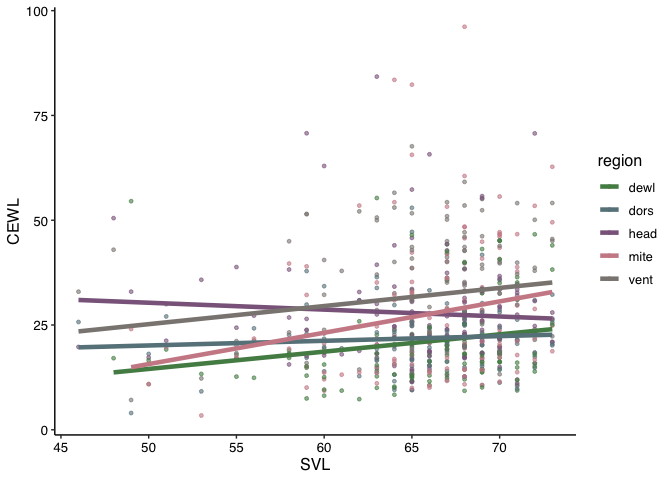<!-- -->

``` r
# glm
glm10 <- lm(TEWL_g_m2h ~ region + SVL_mm,
           data = all_data_long)
summary(glm10)
```

    ## 
    ## Call:
    ## lm(formula = TEWL_g_m2h ~ region + SVL_mm, data = all_data_long)
    ## 
    ## Residuals:
    ##     Min      1Q  Median      3Q     Max 
    ## -22.772  -8.243  -2.244   5.625  67.958 
    ## 
    ## Coefficients:
    ##             Estimate Std. Error t value Pr(>|t|)    
    ## (Intercept)   1.9692     6.3672   0.309  0.75722    
    ## regiondors    0.8336     1.5233   0.547  0.58443    
    ## regionhead    6.7535     1.5206   4.441 1.05e-05 ***
    ## regionmite    6.5226     1.5321   4.257 2.37e-05 ***
    ## regionvent   10.9830     1.5233   7.210 1.56e-12 ***
    ## SVL_mm        0.2898     0.0953   3.041  0.00245 ** 
    ## ---
    ## Signif. codes:  0 '***' 0.001 '**' 0.01 '*' 0.05 '.' 0.1 ' ' 1
    ## 
    ## Residual standard error: 12.33 on 650 degrees of freedom
    ##   (44 observations deleted due to missingness)
    ## Multiple R-squared:  0.111,  Adjusted R-squared:  0.1041 
    ## F-statistic: 16.23 on 5 and 650 DF,  p-value: 4.244e-15

### CEWL \~ Mass

Head has an opposite trend from all the other body regions, so we need
an interaction term.

``` r
all_data_long %>% 
  ggplot(data = .) + 
  geom_point(aes(x = mass_g,
                 y = TEWL_g_m2h, 
                 color = region
                 ), 
             size = 1, 
             alpha = 0.4) + 
  #scale_colour_manual(values = c("palegreen4", "lightblue4", 
   #                              "plum4", "lightpink3", "seashell4")) +
  stat_smooth(aes(x = mass_g, 
                  y = TEWL_g_m2h, 
                  color = region
                  ), 
              formula = y ~ x, 
              method = "lm", 
              se = F, 
              size = 1.6, 
              alpha = 1 ) + 
  theme_classic() + 
  xlab("Mass (g)") + 
  ylab(bquote('CEWL (g / '*m^2~h*')')) + 
  #annotate("text", x = 1, y = 65, label = "a", size = 6) +
  scale_color_brewer(palette = "Set2",
                     labels = c("Dewlap", "Dorsum",
                              "Head", "Mite Patch", "Ventrum"),
                     name = "") +
  ylim(1, 100) +
  xlim(2, 16) +
  scale_x_continuous(breaks = c(seq(2, 16, by = 2))) +
  theme(text = element_text(color = "black", 
                            family = "sans", 
                            size = 18),
        axis.text = element_text(color = "black", 
                                 family = "sans", 
                                 size = 14),
        legend.text = element_text(color = "black", 
                                 family = "sans", 
                                 size = 12),
        legend.text.align = 0,
        legend.position = c(0.15, 0.85)
         ) -> CEWL_mass_fig
```

    ## Scale for 'x' is already present. Adding another scale for 'x', which will
    ## replace the existing scale.

``` r
CEWL_mass_fig
```

    ## Warning: Removed 44 rows containing non-finite values (stat_smooth).

    ## Warning: Removed 44 rows containing missing values (geom_point).

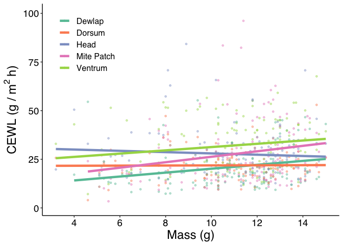<!-- -->

``` r
# export figure
#ggsave(filename = "CEWL_mass_fig.tiff",
 #      plot = CEWL_mass_fig,
  #     path = "./final_figures",
   #    device = "tiff",
    #   dpi = 1200,
     #  width = 6, height = 4)


# glm
glm11 <- lm(TEWL_g_m2h ~ region*mass_g,
           data = all_data_long)
summary(glm11)
```

    ## 
    ## Call:
    ## lm(formula = TEWL_g_m2h ~ region * mass_g, data = all_data_long)
    ## 
    ## Residuals:
    ##     Min      1Q  Median      3Q     Max 
    ## -22.116  -8.392  -2.366   6.139  67.902 
    ## 
    ## Coefficients:
    ##                   Estimate Std. Error t value Pr(>|t|)   
    ## (Intercept)        10.0978     4.7855   2.110  0.03524 * 
    ## regiondors         11.4597     6.7333   1.702  0.08925 . 
    ## regionhead         21.2355     6.6294   3.203  0.00143 **
    ## regionmite          2.1432     6.8724   0.312  0.75525   
    ## regionvent         12.7721     6.6836   1.911  0.05645 . 
    ## mass_g              1.0055     0.4280   2.349  0.01911 * 
    ## regiondors:mass_g  -0.9757     0.6024  -1.620  0.10582   
    ## regionhead:mass_g  -1.3371     0.5947  -2.249  0.02488 * 
    ## regionmite:mass_g   0.3995     0.6138   0.651  0.51542   
    ## regionvent:mass_g  -0.1646     0.5982  -0.275  0.78321   
    ## ---
    ## Signif. codes:  0 '***' 0.001 '**' 0.01 '*' 0.05 '.' 0.1 ' ' 1
    ## 
    ## Residual standard error: 12.26 on 646 degrees of freedom
    ##   (44 observations deleted due to missingness)
    ## Multiple R-squared:  0.1259, Adjusted R-squared:  0.1138 
    ## F-statistic: 10.34 on 9 and 646 DF,  p-value: 5.34e-15

### CEWL \~ Sex

``` r
all_data_long %>% 
  ggplot(data = .) + 
  geom_boxplot(aes(x = sex_M_F, 
                   y = TEWL_g_m2h, 
                   color = sex_M_F
                   ), 
               size = 1,
               alpha = 0.6) + 
  facet_wrap(~region) +
  scale_color_manual(values = c("royalblue1", "mediumorchid")) +
  scale_x_discrete(breaks = c(1,2,3)) +
  theme_classic() + 
  xlab("Sex") + 
  ylab("CEWL") + 
  theme(text = element_text(color = "black", family = "sans", size = 12),
        axis.text = element_text(color = "black", family = "sans", size = 10),
        legend.text.align = 0,
        legend.position = "none"
)
```

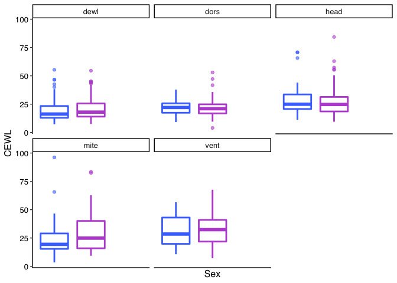<!-- -->

``` r
# glm
glm5 <- lm(TEWL_g_m2h ~ region + sex_M_F, 
           data = all_data_long)
summary(glm5)
```

    ## 
    ## Call:
    ## lm(formula = TEWL_g_m2h ~ region + sex_M_F, data = all_data_long)
    ## 
    ## Residuals:
    ##     Min      1Q  Median      3Q     Max 
    ## -25.241  -8.523  -2.427   6.047  69.231 
    ## 
    ## Coefficients:
    ##             Estimate Std. Error t value Pr(>|t|)    
    ## (Intercept)  20.3600     1.2926  15.751  < 2e-16 ***
    ## regiondors    0.8404     1.5330   0.548    0.584    
    ## regionhead    6.6960     1.5301   4.376 1.41e-05 ***
    ## regionmite    6.5687     1.5418   4.260 2.34e-05 ***
    ## regionvent   10.9679     1.5330   7.155 2.27e-12 ***
    ## sex_M_FM      1.0231     1.0308   0.993    0.321    
    ## ---
    ## Signif. codes:  0 '***' 0.001 '**' 0.01 '*' 0.05 '.' 0.1 ' ' 1
    ## 
    ## Residual standard error: 12.41 on 650 degrees of freedom
    ##   (44 observations deleted due to missingness)
    ## Multiple R-squared:  0.09969,    Adjusted R-squared:  0.09276 
    ## F-statistic: 14.39 on 5 and 650 DF,  p-value: 2.19e-13

### CEWL \~ Gravidity

``` r
all_data_long %>% 
  dplyr::filter(sex_M_F == "F") %>%
  ggplot(data = .) + 
  geom_boxplot(aes(x = gravid_Y_N, 
                   y = TEWL_g_m2h, 
                   color = gravid_Y_N
                   ), 
               size = 1,
               alpha = 0.6) + 
  facet_wrap(~region) +
  scale_color_manual(values = c("royalblue1", "mediumorchid")) +
  scale_x_discrete(breaks = c(1,2,3)) +
  theme_classic() + 
  xlab("Female Gravid or Not") + 
  ylab("CEWL") + 
  theme(text = element_text(color = "black", family = "sans", size = 12),
        axis.text = element_text(color = "black", family = "sans", size = 10),
        legend.text.align = 0,
        legend.position = "none"
)
```

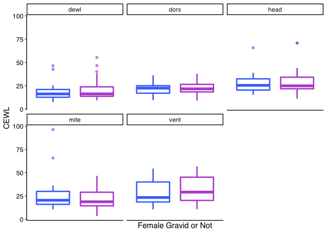<!-- -->

``` r
# glm
glm5 <- lm(TEWL_g_m2h ~ region + gravid_Y_N, 
           data = all_data_long)
summary(glm5)
```

    ## 
    ## Call:
    ## lm(formula = TEWL_g_m2h ~ region + gravid_Y_N, data = all_data_long)
    ## 
    ## Residuals:
    ##     Min      1Q  Median      3Q     Max 
    ## -20.808  -7.963  -2.657   4.874  72.433 
    ## 
    ## Coefficients:
    ##             Estimate Std. Error t value Pr(>|t|)    
    ## (Intercept)  20.2109     2.2158   9.121  < 2e-16 ***
    ## regiondors    1.5956     2.7356   0.583 0.560324    
    ## regionhead    8.7809     2.7508   3.192 0.001629 ** 
    ## regionmite    3.5165     2.7508   1.278 0.202532    
    ## regionvent   10.4965     2.7356   3.837 0.000165 ***
    ## gravid_Y_NY   0.4904     1.7475   0.281 0.779265    
    ## ---
    ## Signif. codes:  0 '***' 0.001 '**' 0.01 '*' 0.05 '.' 0.1 ' ' 1
    ## 
    ## Residual standard error: 12.68 on 210 degrees of freedom
    ##   (484 observations deleted due to missingness)
    ## Multiple R-squared:  0.09649,    Adjusted R-squared:  0.07498 
    ## F-statistic: 4.486 on 5 and 210 DF,  p-value: 0.000663

### CEWL \~ Week

``` r
CEWL %>% 
  ggplot(data = .) + 
  geom_boxplot(aes(x = as.factor(date), 
                   y = TEWL_g_m2h, 
                   color = as.factor(date)
                   ), 
               size = 1,
               alpha = 0.6) + 
  facet_wrap(~region) + # could not figure out how to change facet labels without changing underlying data
  scale_color_manual(values = c("royalblue1", "mediumorchid", "seagreen4",
                                "royalblue1", "mediumorchid", "seagreen4")) +
  scale_x_discrete(breaks = c(1,2,3)) +
  theme_classic() + 
  xlab("Date") + 
  ylab("CEWL") + 
  theme(text = element_text(color = "black", family = "sans", size = 12),
        axis.text = element_text(color = "black", family = "sans", size = 10),
        legend.text.align = 0,
        legend.position = "none"
)
```

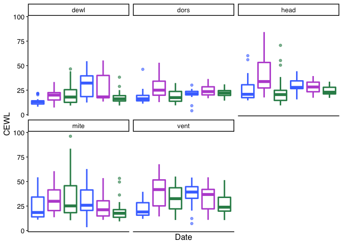<!-- -->

``` r
# glm
glm12 <- lm(TEWL_g_m2h ~ region + date,
           data = all_data_long)
summary(glm12)
```

    ## 
    ## Call:
    ## lm(formula = TEWL_g_m2h ~ region + date, data = all_data_long)
    ## 
    ## Residuals:
    ##     Min      1Q  Median      3Q     Max 
    ## -24.301  -8.267  -2.403   5.545  69.013 
    ## 
    ## Coefficients:
    ##               Estimate Std. Error t value Pr(>|t|)    
    ## (Intercept) -564.48665  606.92155  -0.930    0.353    
    ## regiondors     1.25433    1.48044   0.847    0.397    
    ## regionhead     7.66934    1.47785   5.190 2.77e-07 ***
    ## regionmite     6.57093    1.49115   4.407 1.22e-05 ***
    ## regionvent    10.61652    1.48044   7.171 1.91e-12 ***
    ## date           0.03121    0.03238   0.964    0.335    
    ## ---
    ## Signif. codes:  0 '***' 0.001 '**' 0.01 '*' 0.05 '.' 0.1 ' ' 1
    ## 
    ## Residual standard error: 12.39 on 694 degrees of freedom
    ## Multiple R-squared:  0.09639,    Adjusted R-squared:  0.08988 
    ## F-statistic: 14.81 on 5 and 694 DF,  p-value: 8.088e-14

### CEWL \~ holding time

``` r
all_data_long %>% 
  ggplot(data = .) + 
  geom_point(aes(x = hold_time,
                 y = TEWL_g_m2h, 
                 color = region
                 ), 
             size = 1, 
             alpha = 0.6) + 
  scale_colour_manual(values = c("palegreen4", "lightblue4", 
                                 "plum4", "lightpink3", "seashell4")) +
  stat_smooth(aes(x = hold_time, 
                  y = TEWL_g_m2h, 
                  color = region
                  ), 
              formula = y ~ x, 
              method = "lm", 
              se = F, 
              size = 1.6, 
              alpha = 1 ) + 
  theme_classic() + 
  xlab("Holding Time (minutes)") + 
  ylab("CEWL (g/m^2/hr)") + 
  theme(text = element_text(color = "black", 
                            family = "sans", 
                            size = 12),
        axis.text = element_text(color = "black", 
                                 family = "sans", 
                                 size = 10),
        legend.text.align = 0,
)
```

    ## Warning: Removed 69 rows containing non-finite values (stat_smooth).

    ## Warning: Removed 69 rows containing missing values (geom_point).

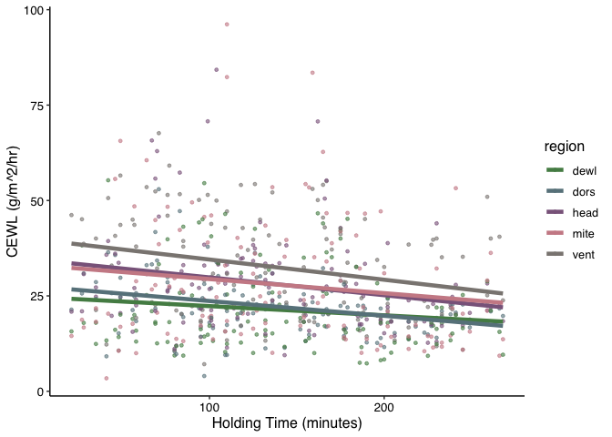<!-- -->

``` r
htime_CEWL_glm <- glm(data = all_data_long, 
                      TEWL_g_m2h ~ hold_time + region)
summary(htime_CEWL_glm)
```

    ## 
    ## Call:
    ## glm(formula = TEWL_g_m2h ~ hold_time + region, data = all_data_long)
    ## 
    ## Deviance Residuals: 
    ##     Min       1Q   Median       3Q      Max  
    ## -28.478   -8.358   -2.075    5.595   67.028  
    ## 
    ## Coefficients:
    ##              Estimate Std. Error t value Pr(>|t|)    
    ## (Intercept) 26.959458   1.533499  17.580  < 2e-16 ***
    ## hold_time   -0.039940   0.007607  -5.250 2.09e-07 ***
    ## regiondors   0.739758   1.545770   0.479    0.632    
    ## regionhead   6.610718   1.542773   4.285 2.12e-05 ***
    ## regionmite   6.566045   1.555010   4.223 2.78e-05 ***
    ## regionvent  11.034294   1.545762   7.138 2.63e-12 ***
    ## ---
    ## Signif. codes:  0 '***' 0.001 '**' 0.01 '*' 0.05 '.' 0.1 ' ' 1
    ## 
    ## (Dispersion parameter for gaussian family taken to be 150.5214)
    ## 
    ##     Null deviance: 108911  on 630  degrees of freedom
    ## Residual deviance:  94076  on 625  degrees of freedom
    ##   (69 observations deleted due to missingness)
    ## AIC: 4962.6
    ## 
    ## Number of Fisher Scoring iterations: 2

Holding time is still significant, even after regional differences are
accounted for.

## Conclusion

CEWL is/is not affected by: - *body region* - significant\! - osmolality
(hydration) - not significant - hematocrit (health) - not significant -
*cloacal temperature* at measurement - sig\! - *capture temp* - sig\! -
capture RH/absH - sig\! but we will only use *absolute humidity* since
it’s decoupled from temperature - measurement temperature and humidity -
nonsig - capture *wind speed* and *solar radiation* - sig\! - individual
ID - nonsig - *mass & SVL* - both sig\! - sex & gravidity - nonsig -
week/date - nonsig as a standalone variable - *hold time* -
significant\!

# LMMs

## Hydration

Based on the simple linear models and figures above, osmolality should
be predicted by sample eye, hemolysis, date/week, individual, capture
temperature, and capture absolute humidity.

Prep dataframe for computing models:

``` r
hydrat_mod_dat <- all_data_wide %>%
  dplyr::select(date, 
                individual_ID,
                osmolality_mmol_kg,
                temp_C_interpol,
                abs_humidity_g_m3_interpol,
                blood_sample_eye,
                hemolyzed
                ) %>%
  dplyr::filter(complete.cases(.))
```

### Multicollinearity

First, check for multicollinearity among independent variables:

``` r
pairs(hydrat_mod_dat)
```

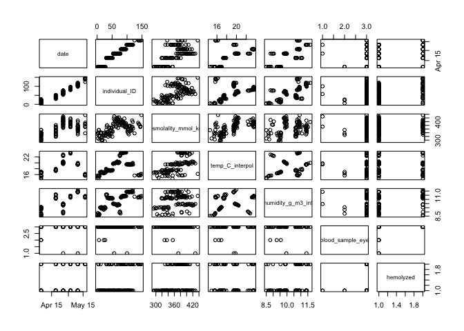<!-- -->

``` r
# also make another plot with r-sq values
# only continuous numeric variables work for this one
hydrat_mod_dat %>% 
  # select variables of interest
  dplyr::select(temp_C_interpol,
                abs_humidity_g_m3_interpol) %>% 
  # multicollinearity plot
  chart.Correlation(., histogram = F, pch = 19)
```

<!-- -->

Date and individual\_ID are collinear and should not both be used as
fixed effects. Temperature and absolute humidity are the only continuous
variables, and they are not badly collinear.

### Models & Selection

Start with all the variables that were significant individually in SLRs.

``` r
# model 1
hydrat_mod1 <- lme4::lmer(data = hydrat_mod_dat,
                          osmolality_mmol_kg ~ 
                           abs_humidity_g_m3_interpol*temp_C_interpol +
                            date + blood_sample_eye + hemolyzed +
                            (1|individual_ID)) 
```

    ## Warning in checkConv(attr(opt, "derivs"), opt$par, ctrl = control$checkConv, :
    ## Model failed to converge with max|grad| = 0.358813 (tol = 0.002, component 1)

    ## Warning in checkConv(attr(opt, "derivs"), opt$par, ctrl = control$checkConv, : Model is nearly unidentifiable: very large eigenvalue
    ##  - Rescale variables?

``` r
summary(hydrat_mod1)
```

    ## Linear mixed model fit by REML ['lmerMod']
    ## Formula: osmolality_mmol_kg ~ abs_humidity_g_m3_interpol * temp_C_interpol +  
    ##     date + blood_sample_eye + hemolyzed + (1 | individual_ID)
    ##    Data: hydrat_mod_dat
    ## 
    ## REML criterion at convergence: 1024.4
    ## 
    ## Scaled residuals: 
    ##        Min         1Q     Median         3Q        Max 
    ## -1.511e-03 -4.457e-04 -1.636e-05  3.707e-04  1.712e-03 
    ## 
    ## Random effects:
    ##  Groups        Name        Variance  Std.Dev.
    ##  individual_ID (Intercept) 4.048e+02 20.12012
    ##  Residual                  1.747e-04  0.01322
    ## Number of obs: 123, groups:  individual_ID, 121
    ## 
    ## Fixed effects:
    ##                                              Estimate Std. Error t value
    ## (Intercept)                                -2.974e+04  4.805e+03  -6.189
    ## abs_humidity_g_m3_interpol                  2.618e+01  1.837e+01   1.425
    ## temp_C_interpol                             3.005e+01  9.779e+00   3.073
    ## date                                        1.587e+00  2.609e-01   6.083
    ## blood_sample_eyeL                          -1.691e+01  1.892e+01  -0.893
    ## blood_sample_eyeR                          -2.731e+01  1.450e+01  -1.884
    ## hemolyzedY                                  8.454e+00  4.205e+00   2.011
    ## abs_humidity_g_m3_interpol:temp_C_interpol -2.344e+00  9.345e-01  -2.508
    ## 
    ## Correlation of Fixed Effects:
    ##             (Intr) ab___3_ tmp_C_ date   bld__L bld__R hmlyzY
    ## abs_hmd__3_  0.400                                           
    ## tmp_C_ntrpl  0.311  0.980                                    
    ## date        -0.999 -0.433  -0.344                            
    ## bld_smpl_yL -0.099  0.073   0.072  0.092                     
    ## bld_smpl_yR -0.087 -0.007  -0.006  0.083  0.760              
    ## hemolyzedY   0.240  0.077   0.093 -0.240 -0.059 -0.121       
    ## ab___3_:_C_ -0.279 -0.982  -0.996  0.313 -0.070  0.003 -0.081
    ## optimizer (nloptwrap) convergence code: 0 (OK)
    ## Model failed to converge with max|grad| = 0.358813 (tol = 0.002, component 1)
    ## Model is nearly unidentifiable: very large eigenvalue
    ##  - Rescale variables?

I think I should probably skip blood\_sample\_eye and hemolyzed in the
model. I can note they were significant in the paper as SLRs, but I
think they might be one of the problems throwing warnings in the model.

``` r
# model 2
hydrat_mod2 <- lme4::lmer(data = hydrat_mod_dat,
                          osmolality_mmol_kg ~ 
                           abs_humidity_g_m3_interpol*temp_C_interpol +
                            date + 
                            (1|individual_ID)) 
```

    ## Warning in checkConv(attr(opt, "derivs"), opt$par, ctrl = control$checkConv, :
    ## Model failed to converge with max|grad| = 0.128111 (tol = 0.002, component 1)

    ## Warning in checkConv(attr(opt, "derivs"), opt$par, ctrl = control$checkConv, : Model is nearly unidentifiable: very large eigenvalue
    ##  - Rescale variables?

``` r
summary(hydrat_mod2)
```

    ## Linear mixed model fit by REML ['lmerMod']
    ## Formula: osmolality_mmol_kg ~ abs_humidity_g_m3_interpol * temp_C_interpol +  
    ##     date + (1 | individual_ID)
    ##    Data: hydrat_mod_dat
    ## 
    ## REML criterion at convergence: 1051.4
    ## 
    ## Scaled residuals: 
    ##        Min         1Q     Median         3Q        Max 
    ## -1.757e-03 -5.114e-04 -7.810e-06  3.951e-04  2.193e-03 
    ## 
    ## Random effects:
    ##  Groups        Name        Variance  Std.Dev.
    ##  individual_ID (Intercept) 4.200e+02 20.49480
    ##  Residual                  2.881e-04  0.01697
    ## Number of obs: 123, groups:  individual_ID, 121
    ## 
    ## Fixed effects:
    ##                                              Estimate Std. Error t value
    ## (Intercept)                                -3.221e+04  4.726e+03  -6.815
    ## abs_humidity_g_m3_interpol                  2.200e+01  1.853e+01   1.187
    ## temp_C_interpol                             2.756e+01  9.853e+00   2.797
    ## date                                        1.720e+00  2.568e-01   6.699
    ## abs_humidity_g_m3_interpol:temp_C_interpol -2.133e+00  9.431e-01  -2.262
    ## 
    ## Correlation of Fixed Effects:
    ##             (Intr) ab___3_ tmp_C_ date  
    ## abs_hmd__3_  0.406                      
    ## tmp_C_ntrpl  0.309  0.980               
    ## date        -0.999 -0.439  -0.343       
    ## ab___3_:_C_ -0.278 -0.982  -0.996  0.312
    ## optimizer (nloptwrap) convergence code: 0 (OK)
    ## Model failed to converge with max|grad| = 0.128111 (tol = 0.002, component 1)
    ## Model is nearly unidentifiable: very large eigenvalue
    ##  - Rescale variables?

Still having some of the same errors… try scaling the continuous
variables.

``` r
hydrat_mod_dat_scaled <- hydrat_mod_dat %>%
  mutate(osml_scaled = scale(osmolality_mmol_kg),
         temp_scaled = scale(temp_C_interpol),
         abshum_scaled = scale(abs_humidity_g_m3_interpol))
```

``` r
# model 3
hydrat_mod3 <- lme4::lmer(data = hydrat_mod_dat_scaled,
                          osml_scaled ~ 
                           abshum_scaled*temp_scaled +
                            date + 
                            (1|individual_ID)) 
```

    ## Warning in checkConv(attr(opt, "derivs"), opt$par, ctrl = control$checkConv, :
    ## Model failed to converge with max|grad| = 0.0149028 (tol = 0.002, component 1)

    ## Warning in checkConv(attr(opt, "derivs"), opt$par, ctrl = control$checkConv, : Model is nearly unidentifiable: very large eigenvalue
    ##  - Rescale variables?

``` r
summary(hydrat_mod3)
```

    ## Linear mixed model fit by REML ['lmerMod']
    ## Formula: osml_scaled ~ abshum_scaled * temp_scaled + date + (1 | individual_ID)
    ##    Data: hydrat_mod_dat_scaled
    ## 
    ## REML criterion at convergence: 228.7
    ## 
    ## Scaled residuals: 
    ##        Min         1Q     Median         3Q        Max 
    ## -2.036e-03 -5.942e-04 -8.930e-06  4.571e-04  2.547e-03 
    ## 
    ## Random effects:
    ##  Groups        Name        Variance  Std.Dev. 
    ##  individual_ID (Intercept) 4.020e-01 0.6340266
    ##  Residual                  3.708e-07 0.0006089
    ## Number of obs: 123, groups:  individual_ID, 121
    ## 
    ## Fixed effects:
    ##                             Estimate Std. Error t value
    ## (Intercept)               -9.944e+02  1.486e+02  -6.690
    ## abshum_scaled             -4.828e-01  9.051e-02  -5.334
    ## temp_scaled                4.231e-01  6.596e-02   6.414
    ## date                       5.306e-02  7.931e-03   6.690
    ## abshum_scaled:temp_scaled -1.398e-01  6.150e-02  -2.273
    ## 
    ## Correlation of Fixed Effects:
    ##             (Intr) abshm_ tmp_sc date  
    ## abshum_scld  0.714                     
    ## temp_scaled  0.372  0.074              
    ## date        -1.000 -0.714 -0.372       
    ## abshm_scl:_ -0.312 -0.054 -0.030  0.311
    ## optimizer (nloptwrap) convergence code: 0 (OK)
    ## Model failed to converge with max|grad| = 0.0149028 (tol = 0.002, component 1)
    ## Model is nearly unidentifiable: very large eigenvalue
    ##  - Rescale variables?

I’m still getting the warning messages\! aghhhhh

**@Dr. Bodwin please help with this \! D: **

### Best Models

``` r
# save step 6 summary object
#osml_best_mod <- summary()
# extract stats table from summary object
#osml_best_mod_vals <- data.frame(osml_best_mod$coefficients)
# export 
#write.csv(osml_best_mod_vals, "osml_best_mod_vals.csv")
```

### Check LM Assumptions (Hydration Model )

First, get residuals:

``` r
#res_hydrat_mod <- hydrat_mod_dat %>% # scaled or not? 
 # mutate(y_hat = predict(),
  #       e = residuals())
```

Linearity and Equal Variance

Is the function **linear**? Is there **equal** variance of the
residuals? The residuals should be homoskedactic relative to y\_hat (or
x). We don’t care if there is a relationship between the residuals \~
dependent variable (actual y).

Plotting residuals shows us whether the data meets linearity and equal
variance assumptions:

``` r
#ggplot(data = res_hydrat_mod, aes(x = y_hat, y = e)) +
 # geom_point() + 
  #theme_classic() + 
  #xlab("predicted y (y-hat)") +
  #ylab("residuals (e)") +
  #ggtitle("Hydration Model 5") +
  #geom_hline(yintercept = 0)
```

Brown-Forsythe test to statistically check equal variance:

H0: normally distributed (non-sig test is GOOD) HA: NOT normally
distributed (reject nul == assumption not satisfied)

``` r
# need to create the right data & format first
#bf_data <- res_hydrat_mod %>%
#  dplyr::filter(complete.cases(temp_C_interpol)) %>%
#  dplyr::mutate(middle = median(temp_C_interpol),
#                side = temp_C_interpol > middle)
#bf_data$side <- as.factor(bf_data$side)

# now run test
#bf.test(formula = e ~ side, # y~x
 #       data = bf_data, # dataframe
  #      alpha = 0.05, # default 0.05
   #     na.rm = TRUE, # remove missing data before running?
    #    verbose = TRUE # print output to console?
     #   )
```

Equal variance is satisfied.

Now check normality. Is the distribution of residuals **normal**?

use Shapiro-Wilk normality test: H0: data is NOT significantly different
from normal distribution HA: data IS significantly different from normal
distribution

``` r
#simple.eda(res_hydrat_mod$e)
#shapiro.test(res_hydrat_mod$e)
```

### Transformations

### Conclusion

## CEWL

Based on the simple linear models and figures above, CEWL should be
predicted by: - body region - cloacal temperature at measurement -
capture temperature, absolute humidity, wind speed, and solar radiation
- mass & SVL - hold time (time between capture vs measurement)

Prep dataframe for models:

``` r
CEWL_mod_dat <- all_data_long %>% 
  # select variables of interest
  dplyr::select(date,
                hold_time,
                individual_ID,
                mass_g,
                SVL_mm, 
                TEWL_g_m2h,
                region,
                cloacal_temp_C,
                temp_C_interpol,
                abs_humidity_g_m3_interpol,
                Wind_mph_interpol,
                Solar_rad_Wm2_interpol
                ) %>%
  dplyr::filter(complete.cases(.))
```

### Multicollinearity

Check for multicollinearity among independent variables:

``` r
CEWL_mod_dat %>% 
  # get rid of dependent variable
  dplyr::select(-TEWL_g_m2h, -individual_ID) %>%
  # multicollinearity plot
  pairs(.)
```

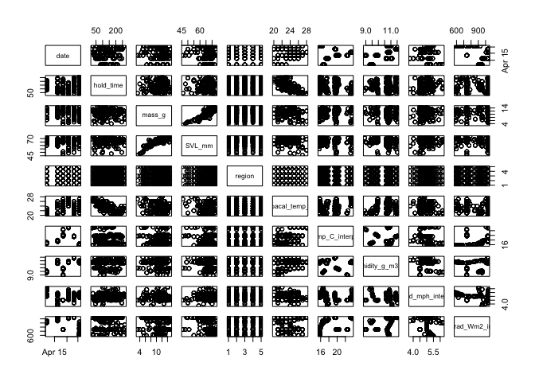<!-- -->

``` r
# also make another plot with r-sq values
# non-numeric variables don't work for this
CEWL_mod_dat %>% 
  # select variables of interest
  dplyr::select(-TEWL_g_m2h, -date, -region, -individual_ID) %>% 
  # multicollinearity plot
  chart.Correlation(., histogram = F, pch = 19)
```

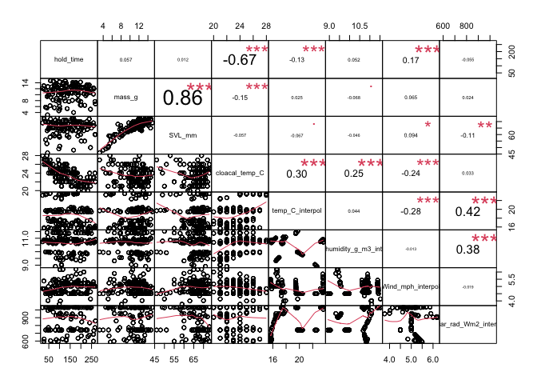<!-- -->

Mass and SVL are very collinear variables that should not be used in
combination. Cloacal temp and hold time are pretty collinear, which
makes sense; as we held them, they got cooler because they were inside
and not basking. Individual ID and absolute humidity are also pretty
collinear, but it’s less intuitive. Temperature and solar radiation, as
well as humidity and solar radiation, are each collinear pairs. We will
use model selection to figure out which variable from each collinear
pair is better to include in the model.

### Models & Selection

``` r
# model 1
CEWL_mod1 <- lme4::lmer(data = CEWL_mod_dat,
                       TEWL_g_m2h ~ hold_time + 
                       region * mass_g + SVL_mm +
                       cloacal_temp_C +
                       temp_C_interpol +
                       abs_humidity_g_m3_interpol +
                       Wind_mph_interpol +
                       Solar_rad_Wm2_interpol + 
                       (1|individual_ID)) 
summary(CEWL_mod1)
```

    ## Linear mixed model fit by REML ['lmerMod']
    ## Formula: TEWL_g_m2h ~ hold_time + region * mass_g + SVL_mm + cloacal_temp_C +  
    ##     temp_C_interpol + abs_humidity_g_m3_interpol + Wind_mph_interpol +  
    ##     Solar_rad_Wm2_interpol + (1 | individual_ID)
    ##    Data: CEWL_mod_dat
    ## 
    ## REML criterion at convergence: 4819.4
    ## 
    ## Scaled residuals: 
    ##     Min      1Q  Median      3Q     Max 
    ## -2.0461 -0.5672 -0.1141  0.3810  5.5517 
    ## 
    ## Random effects:
    ##  Groups        Name        Variance Std.Dev.
    ##  individual_ID (Intercept)  28.83    5.37   
    ##  Residual                  104.14   10.20   
    ## Number of obs: 631, groups:  individual_ID, 128
    ## 
    ## Fixed effects:
    ##                              Estimate Std. Error t value
    ## (Intercept)                -47.583923  20.021580  -2.377
    ## hold_time                    0.004967   0.014456   0.344
    ## regiondors                  12.029269   5.678852   2.118
    ## regionhead                  20.814636   5.577154   3.732
    ## regionmite                   2.639381   5.781607   0.457
    ## regionvent                  12.552698   5.629788   2.230
    ## mass_g                       1.143696   0.598505   1.911
    ## SVL_mm                       0.100939   0.246964   0.409
    ## cloacal_temp_C               2.211249   0.561583   3.938
    ## temp_C_interpol             -0.261957   0.313244  -0.836
    ## abs_humidity_g_m3_interpol   0.392229   1.226834   0.320
    ## Wind_mph_interpol           -2.916330   1.514522  -1.926
    ## Solar_rad_Wm2_interpol       0.014035   0.005317   2.640
    ## regiondors:mass_g           -1.041896   0.509406  -2.045
    ## regionhead:mass_g           -1.323614   0.501678  -2.638
    ## regionmite:mass_g            0.352987   0.517831   0.682
    ## regionvent:mass_g           -0.144369   0.505194  -0.286

    ## 
    ## Correlation matrix not shown by default, as p = 17 > 12.
    ## Use print(x, correlation=TRUE)  or
    ##     vcov(x)        if you need it

Check which variables to drop:

``` r
drop1(CEWL_mod1)
```

    ## Single term deletions
    ## 
    ## Model:
    ## TEWL_g_m2h ~ hold_time + region * mass_g + SVL_mm + cloacal_temp_C + 
    ##     temp_C_interpol + abs_humidity_g_m3_interpol + Wind_mph_interpol + 
    ##     Solar_rad_Wm2_interpol + (1 | individual_ID)
    ##                            npar    AIC
    ## <none>                          4852.8
    ## hold_time                     1 4850.9
    ## SVL_mm                        1 4851.0
    ## cloacal_temp_C                1 4866.5
    ## temp_C_interpol               1 4851.6
    ## abs_humidity_g_m3_interpol    1 4850.9
    ## Wind_mph_interpol             1 4854.7
    ## Solar_rad_Wm2_interpol        1 4858.1
    ## region:mass_g                 4 4860.8

Based on AIC, dropping SVL, hold time, temp, humidity, and/or wind speed
would result in a better model.

Start with SVL and hold time:

``` r
# model 2
CEWL_mod2 <- lme4::lmer(data = CEWL_mod_dat,
                       TEWL_g_m2h ~  
                       region * mass_g +
                       cloacal_temp_C +
                       temp_C_interpol +
                       abs_humidity_g_m3_interpol +
                       Wind_mph_interpol +
                       Solar_rad_Wm2_interpol + 
                       (1|individual_ID)) 
summary(CEWL_mod2)
```

    ## Linear mixed model fit by REML ['lmerMod']
    ## Formula: TEWL_g_m2h ~ region * mass_g + cloacal_temp_C + temp_C_interpol +  
    ##     abs_humidity_g_m3_interpol + Wind_mph_interpol + Solar_rad_Wm2_interpol +  
    ##     (1 | individual_ID)
    ##    Data: CEWL_mod_dat
    ## 
    ## REML criterion at convergence: 4812.1
    ## 
    ## Scaled residuals: 
    ##     Min      1Q  Median      3Q     Max 
    ## -2.0742 -0.5672 -0.1154  0.3854  5.5674 
    ## 
    ## Random effects:
    ##  Groups        Name        Variance Std.Dev.
    ##  individual_ID (Intercept)  28.13    5.304  
    ##  Residual                  104.14   10.205  
    ## Number of obs: 631, groups:  individual_ID, 128
    ## 
    ## Fixed effects:
    ##                              Estimate Std. Error t value
    ## (Intercept)                -41.482142  16.192100  -2.562
    ## regiondors                  11.995237   5.678054   2.113
    ## regionhead                  20.773712   5.575910   3.726
    ## regionmite                   2.654396   5.780323   0.459
    ## regionvent                  12.509795   5.628232   2.223
    ## mass_g                       1.316494   0.406700   3.237
    ## cloacal_temp_C               2.096334   0.382626   5.479
    ## temp_C_interpol             -0.245256   0.300221  -0.817
    ## abs_humidity_g_m3_interpol   0.597765   1.114886   0.536
    ## Wind_mph_interpol           -2.833675   1.495887  -1.894
    ## Solar_rad_Wm2_interpol       0.013101   0.004962   2.640
    ## regiondors:mass_g           -1.038778   0.509336  -2.039
    ## regionhead:mass_g           -1.319970   0.501577  -2.632
    ## regionmite:mass_g            0.351767   0.517728   0.679
    ## regionvent:mass_g           -0.140506   0.505065  -0.278

    ## 
    ## Correlation matrix not shown by default, as p = 15 > 12.
    ## Use print(x, correlation=TRUE)  or
    ##     vcov(x)        if you need it

``` r
# compare
anova(CEWL_mod2, CEWL_mod1)
```

    ## refitting model(s) with ML (instead of REML)

    ## Data: CEWL_mod_dat
    ## Models:
    ## CEWL_mod2: TEWL_g_m2h ~ region * mass_g + cloacal_temp_C + temp_C_interpol + 
    ## CEWL_mod2:     abs_humidity_g_m3_interpol + Wind_mph_interpol + Solar_rad_Wm2_interpol + 
    ## CEWL_mod2:     (1 | individual_ID)
    ## CEWL_mod1: TEWL_g_m2h ~ hold_time + region * mass_g + SVL_mm + cloacal_temp_C + 
    ## CEWL_mod1:     temp_C_interpol + abs_humidity_g_m3_interpol + Wind_mph_interpol + 
    ## CEWL_mod1:     Solar_rad_Wm2_interpol + (1 | individual_ID)
    ##           npar    AIC    BIC  logLik deviance  Chisq Df Pr(>Chisq)
    ## CEWL_mod2   17 4849.1 4924.7 -2407.6   4815.1                     
    ## CEWL_mod1   19 4852.8 4937.3 -2407.4   4814.8 0.3066  2     0.8579

AIC improved very slightly, but model 2 is not significantly better than
model 1.

Check drop terms again:

``` r
drop1(CEWL_mod2)
```

    ## Single term deletions
    ## 
    ## Model:
    ## TEWL_g_m2h ~ region * mass_g + cloacal_temp_C + temp_C_interpol + 
    ##     abs_humidity_g_m3_interpol + Wind_mph_interpol + Solar_rad_Wm2_interpol + 
    ##     (1 | individual_ID)
    ##                            npar    AIC
    ## <none>                          4849.1
    ## cloacal_temp_C                1 4875.5
    ## temp_C_interpol               1 4847.8
    ## abs_humidity_g_m3_interpol    1 4847.4
    ## Wind_mph_interpol             1 4850.9
    ## Solar_rad_Wm2_interpol        1 4854.3
    ## region:mass_g                 4 4857.0

Temperature, humidity, and wind should still be deleted.

``` r
# model 3
CEWL_mod3 <- lme4::lmer(data = CEWL_mod_dat,
                       TEWL_g_m2h ~
                       region * mass_g +
                       cloacal_temp_C +
                       Solar_rad_Wm2_interpol + 
                       (1|individual_ID)) 
summary(CEWL_mod3)
```

    ## Linear mixed model fit by REML ['lmerMod']
    ## Formula: 
    ## TEWL_g_m2h ~ region * mass_g + cloacal_temp_C + Solar_rad_Wm2_interpol +  
    ##     (1 | individual_ID)
    ##    Data: CEWL_mod_dat
    ## 
    ## REML criterion at convergence: 4820.2
    ## 
    ## Scaled residuals: 
    ##     Min      1Q  Median      3Q     Max 
    ## -2.0995 -0.5602 -0.1204  0.3872  5.5759 
    ## 
    ## Random effects:
    ##  Groups        Name        Variance Std.Dev.
    ##  individual_ID (Intercept)  28.58    5.346  
    ##  Residual                  104.14   10.205  
    ## Number of obs: 631, groups:  individual_ID, 128
    ## 
    ## Fixed effects:
    ##                         Estimate Std. Error t value
    ## (Intercept)            -55.33486   10.08122  -5.489
    ## regiondors              11.99731    5.67823   2.113
    ## regionhead              20.77713    5.57578   3.726
    ## regionmite               2.65756    5.78028   0.460
    ## regionvent              12.52015    5.62810   2.225
    ## mass_g                   1.28060    0.40682   3.148
    ## cloacal_temp_C           2.20253    0.34159   6.448
    ## Solar_rad_Wm2_interpol   0.01248    0.00402   3.105
    ## regiondors:mass_g       -1.03880    0.50935  -2.039
    ## regionhead:mass_g       -1.32031    0.50157  -2.632
    ## regionmite:mass_g        0.35139    0.51772   0.679
    ## regionvent:mass_g       -0.14121    0.50505  -0.280
    ## 
    ## Correlation of Fixed Effects:
    ##             (Intr) rgndrs regnhd regnmt rgnvnt mass_g clc__C S__W2_ rgnd:_
    ## regiondors  -0.281                                                        
    ## regionhead  -0.285  0.515                                                 
    ## regionmite  -0.279  0.496  0.500                                          
    ## regionvent  -0.288  0.511  0.520  0.495                                   
    ## mass_g      -0.505  0.616  0.626  0.599  0.621                            
    ## clocl_tmp_C -0.823 -0.006 -0.009  0.005 -0.005  0.092                     
    ## Slr_rd_Wm2_ -0.320  0.003  0.007 -0.004  0.012 -0.017 -0.035              
    ## rgndrs:mss_  0.274 -0.974 -0.501 -0.483 -0.497 -0.632  0.005 -0.003       
    ## rgnhd:mss_g  0.277 -0.500 -0.973 -0.486 -0.504 -0.641  0.008 -0.006  0.513
    ## rgnmt:mss_g  0.273 -0.484 -0.488 -0.975 -0.483 -0.617 -0.005  0.002  0.496
    ## rgnvnt:mss_  0.280 -0.497 -0.506 -0.482 -0.973 -0.638  0.004 -0.012  0.510
    ##             rgnh:_ rgnm:_
    ## regiondors               
    ## regionhead               
    ## regionmite               
    ## regionvent               
    ## mass_g                   
    ## clocl_tmp_C              
    ## Slr_rd_Wm2_              
    ## rgndrs:mss_              
    ## rgnhd:mss_g              
    ## rgnmt:mss_g  0.499       
    ## rgnvnt:mss_  0.517  0.496

``` r
# compare
anova(CEWL_mod3, CEWL_mod1)
```

    ## refitting model(s) with ML (instead of REML)

    ## Data: CEWL_mod_dat
    ## Models:
    ## CEWL_mod3: TEWL_g_m2h ~ region * mass_g + cloacal_temp_C + Solar_rad_Wm2_interpol + 
    ## CEWL_mod3:     (1 | individual_ID)
    ## CEWL_mod1: TEWL_g_m2h ~ hold_time + region * mass_g + SVL_mm + cloacal_temp_C + 
    ## CEWL_mod1:     temp_C_interpol + abs_humidity_g_m3_interpol + Wind_mph_interpol + 
    ## CEWL_mod1:     Solar_rad_Wm2_interpol + (1 | individual_ID)
    ##           npar    AIC    BIC  logLik deviance  Chisq Df Pr(>Chisq)
    ## CEWL_mod3   14 4847.4 4909.7 -2409.7   4819.4                     
    ## CEWL_mod1   19 4852.8 4937.3 -2407.4   4814.8 4.5956  5     0.4672

``` r
anova(CEWL_mod3, CEWL_mod2)
```

    ## refitting model(s) with ML (instead of REML)

    ## Data: CEWL_mod_dat
    ## Models:
    ## CEWL_mod3: TEWL_g_m2h ~ region * mass_g + cloacal_temp_C + Solar_rad_Wm2_interpol + 
    ## CEWL_mod3:     (1 | individual_ID)
    ## CEWL_mod2: TEWL_g_m2h ~ region * mass_g + cloacal_temp_C + temp_C_interpol + 
    ## CEWL_mod2:     abs_humidity_g_m3_interpol + Wind_mph_interpol + Solar_rad_Wm2_interpol + 
    ## CEWL_mod2:     (1 | individual_ID)
    ##           npar    AIC    BIC  logLik deviance Chisq Df Pr(>Chisq)
    ## CEWL_mod3   14 4847.4 4909.7 -2409.7   4819.4                    
    ## CEWL_mod2   17 4849.1 4924.7 -2407.6   4815.1 4.289  3     0.2319

Once again, the AIC is slightly lower, but the model is not
significantly better when compared to version 1 or 2.

Technically, cloacal temperature should be a random effect. We can also
check whether temp and humidity would be important as an interaction.

``` r
# model 4
CEWL_mod4 <- lme4::lmer(data = CEWL_mod_dat,
                       TEWL_g_m2h ~
                       region * mass_g +
                       temp_C_interpol:abs_humidity_g_m3_interpol +
                       Solar_rad_Wm2_interpol + 
                       (1|individual_ID) + (1|cloacal_temp_C)) 
summary(CEWL_mod4)
```

    ## Linear mixed model fit by REML ['lmerMod']
    ## Formula: 
    ## TEWL_g_m2h ~ region * mass_g + temp_C_interpol:abs_humidity_g_m3_interpol +  
    ##     Solar_rad_Wm2_interpol + (1 | individual_ID) + (1 | cloacal_temp_C)
    ##    Data: CEWL_mod_dat
    ## 
    ## REML criterion at convergence: 4816.6
    ## 
    ## Scaled residuals: 
    ##     Min      1Q  Median      3Q     Max 
    ## -2.3013 -0.5689 -0.1362  0.4051  5.5045 
    ## 
    ## Random effects:
    ##  Groups         Name        Variance Std.Dev.
    ##  individual_ID  (Intercept)  18.92    4.349  
    ##  cloacal_temp_C (Intercept)  32.38    5.690  
    ##  Residual                   104.17   10.207  
    ## Number of obs: 631, groups:  individual_ID, 128; cloacal_temp_C, 9
    ## 
    ## Fixed effects:
    ##                                             Estimate Std. Error t value
    ## (Intercept)                                -1.701609   6.351046  -0.268
    ## regiondors                                 12.595457   5.676079   2.219
    ## regionhead                                 21.057053   5.575113   3.777
    ## regionmite                                  2.991646   5.778945   0.518
    ## regionvent                                 12.845362   5.627254   2.283
    ## mass_g                                      1.016458   0.396487   2.564
    ## Solar_rad_Wm2_interpol                      0.010655   0.004467   2.385
    ## regiondors:mass_g                          -1.091014   0.509186  -2.143
    ## regionhead:mass_g                          -1.343248   0.501531  -2.678
    ## regionmite:mass_g                           0.319085   0.517627   0.616
    ## regionvent:mass_g                          -0.170210   0.504998  -0.337
    ## temp_C_interpol:abs_humidity_g_m3_interpol  0.007973   0.024296   0.328
    ## 
    ## Correlation of Fixed Effects:
    ##             (Intr) rgndrs regnhd regnmt rgnvnt mass_g S__W2_ rgnd:_ rgnh:_
    ## regiondors  -0.452                                                        
    ## regionhead  -0.461  0.515                                                 
    ## regionmite  -0.437  0.496  0.500                                          
    ## regionvent  -0.464  0.511  0.519  0.496                                   
    ## mass_g      -0.651  0.627  0.640  0.613  0.635                            
    ## Slr_rd_Wm2_ -0.203 -0.002  0.005 -0.006  0.006  0.002                     
    ## rgndrs:mss_  0.441 -0.974 -0.501 -0.483 -0.497 -0.644  0.002              
    ## rgnhd:mss_g  0.447 -0.500 -0.973 -0.486 -0.504 -0.656 -0.005  0.513       
    ## rgnmt:mss_g  0.427 -0.483 -0.488 -0.975 -0.483 -0.630  0.005  0.496  0.500
    ## rgnvnt:mss_  0.452 -0.497 -0.505 -0.482 -0.973 -0.652 -0.005  0.510  0.517
    ## tm_C_:___3_ -0.405  0.005 -0.001  0.004  0.007 -0.026 -0.559 -0.005  0.001
    ##             rgnm:_ rgnv:_
    ## regiondors               
    ## regionhead               
    ## regionmite               
    ## regionvent               
    ## mass_g                   
    ## Slr_rd_Wm2_              
    ## rgndrs:mss_              
    ## rgnhd:mss_g              
    ## rgnmt:mss_g              
    ## rgnvnt:mss_  0.496       
    ## tm_C_:___3_ -0.004 -0.007

``` r
# compare
anova(CEWL_mod3, CEWL_mod4)
```

    ## refitting model(s) with ML (instead of REML)

    ## Data: CEWL_mod_dat
    ## Models:
    ## CEWL_mod3: TEWL_g_m2h ~ region * mass_g + cloacal_temp_C + Solar_rad_Wm2_interpol + 
    ## CEWL_mod3:     (1 | individual_ID)
    ## CEWL_mod4: TEWL_g_m2h ~ region * mass_g + temp_C_interpol:abs_humidity_g_m3_interpol + 
    ## CEWL_mod4:     Solar_rad_Wm2_interpol + (1 | individual_ID) + (1 | cloacal_temp_C)
    ##           npar    AIC    BIC  logLik deviance  Chisq Df Pr(>Chisq)   
    ## CEWL_mod3   14 4847.4 4909.7 -2409.7   4819.4                        
    ## CEWL_mod4   15 4842.6 4909.3 -2406.3   4812.6 6.8441  1   0.008894 **
    ## ---
    ## Signif. codes:  0 '***' 0.001 '**' 0.01 '*' 0.05 '.' 0.1 ' ' 1

Model 4 is significantly better than model 3. But, which change was more
important? Check if we kept cloacal temperature as a fixed effect and
added the temp:humidity interaction effect:

``` r
# model 5
CEWL_mod5 <- lme4::lmer(data = CEWL_mod_dat,
                       TEWL_g_m2h ~
                       region * mass_g +
                       cloacal_temp_C +
                       temp_C_interpol:abs_humidity_g_m3_interpol +
                       Solar_rad_Wm2_interpol + 
                       (1|individual_ID)) 
summary(CEWL_mod5)
```

    ## Linear mixed model fit by REML ['lmerMod']
    ## Formula: 
    ## TEWL_g_m2h ~ region * mass_g + cloacal_temp_C + temp_C_interpol:abs_humidity_g_m3_interpol +  
    ##     Solar_rad_Wm2_interpol + (1 | individual_ID)
    ##    Data: CEWL_mod_dat
    ## 
    ## REML criterion at convergence: 4825.5
    ## 
    ## Scaled residuals: 
    ##     Min      1Q  Median      3Q     Max 
    ## -2.0872 -0.5621 -0.1208  0.3861  5.5728 
    ## 
    ## Random effects:
    ##  Groups        Name        Variance Std.Dev.
    ##  individual_ID (Intercept)  28.97    5.382  
    ##  Residual                  104.13   10.204  
    ## Number of obs: 631, groups:  individual_ID, 128
    ## 
    ## Fixed effects:
    ##                                              Estimate Std. Error t value
    ## (Intercept)                                -55.624755  10.165131  -5.472
    ## regiondors                                  11.996549   5.678277   2.113
    ## regionhead                                  20.777924   5.575678   3.727
    ## regionmite                                   2.658129   5.780178   0.460
    ## regionvent                                  12.508370   5.628148   2.222
    ## mass_g                                       1.283369   0.407499   3.149
    ## cloacal_temp_C                               2.249375   0.378925   5.936
    ## Solar_rad_Wm2_interpol                       0.013310   0.004943   2.693
    ## regiondors:mass_g                           -1.038594   0.509353  -2.039
    ## regionhead:mass_g                           -1.320421   0.501556  -2.633
    ## regionmite:mass_g                            0.351432   0.517715   0.679
    ## regionvent:mass_g                           -0.140100   0.505057  -0.277
    ## temp_C_interpol:abs_humidity_g_m3_interpol  -0.007923   0.027279  -0.290

    ## 
    ## Correlation matrix not shown by default, as p = 13 > 12.
    ## Use print(x, correlation=TRUE)  or
    ##     vcov(x)        if you need it

``` r
# compare
anova(CEWL_mod5, CEWL_mod4)
```

    ## refitting model(s) with ML (instead of REML)

    ## Data: CEWL_mod_dat
    ## Models:
    ## CEWL_mod5: TEWL_g_m2h ~ region * mass_g + cloacal_temp_C + temp_C_interpol:abs_humidity_g_m3_interpol + 
    ## CEWL_mod5:     Solar_rad_Wm2_interpol + (1 | individual_ID)
    ## CEWL_mod4: TEWL_g_m2h ~ region * mass_g + temp_C_interpol:abs_humidity_g_m3_interpol + 
    ## CEWL_mod4:     Solar_rad_Wm2_interpol + (1 | individual_ID) + (1 | cloacal_temp_C)
    ##           npar    AIC    BIC  logLik deviance Chisq Df Pr(>Chisq)
    ## CEWL_mod5   15 4849.3 4916.0 -2409.7   4819.3                    
    ## CEWL_mod4   15 4842.6 4909.3 -2406.3   4812.6 6.757  0

Model 4 is significantly better.

Compare model 4 to a new iteration without temp:humidity:

``` r
# model 6
CEWL_mod6 <- lme4::lmer(data = CEWL_mod_dat,
                       TEWL_g_m2h ~
                       region * mass_g +
                       Solar_rad_Wm2_interpol + 
                       (1|individual_ID) + (1|cloacal_temp_C)) 
summary(CEWL_mod6)
```

    ## Linear mixed model fit by REML ['lmerMod']
    ## Formula: TEWL_g_m2h ~ region * mass_g + Solar_rad_Wm2_interpol + (1 |  
    ##     individual_ID) + (1 | cloacal_temp_C)
    ##    Data: CEWL_mod_dat
    ## 
    ## REML criterion at convergence: 4811.1
    ## 
    ## Scaled residuals: 
    ##     Min      1Q  Median      3Q     Max 
    ## -2.2895 -0.5685 -0.1374  0.3975  5.5132 
    ## 
    ## Random effects:
    ##  Groups         Name        Variance Std.Dev.
    ##  individual_ID  (Intercept)  18.59    4.311  
    ##  cloacal_temp_C (Intercept)  32.91    5.736  
    ##  Residual                   104.17   10.206  
    ## Number of obs: 631, groups:  individual_ID, 128; cloacal_temp_C, 9
    ## 
    ## Fixed effects:
    ##                        Estimate Std. Error t value
    ## (Intercept)            -0.87280    5.79987  -0.150
    ## regiondors             12.58600    5.67559   2.218
    ## regionhead             21.06022    5.57480   3.778
    ## regionmite              2.98394    5.77859   0.516
    ## regionvent             12.83664    5.62677   2.281
    ## mass_g                  1.01975    0.39581   2.576
    ## Solar_rad_Wm2_interpol  0.01148    0.00369   3.113
    ## regiondors:mass_g      -1.09007    0.50914  -2.141
    ## regionhead:mass_g      -1.34342    0.50150  -2.679
    ## regionmite:mass_g       0.31980    0.51760   0.618
    ## regionvent:mass_g      -0.16935    0.50496  -0.335
    ## 
    ## Correlation of Fixed Effects:
    ##             (Intr) rgndrs regnhd regnmt rgnvnt mass_g S__W2_ rgnd:_ rgnh:_
    ## regiondors  -0.493                                                        
    ## regionhead  -0.505  0.515                                                 
    ## regionmite  -0.477  0.496  0.500                                          
    ## regionvent  -0.505  0.510  0.519  0.496                                   
    ## mass_g      -0.723  0.629  0.641  0.614  0.636                            
    ## Slr_rd_Wm2_ -0.565  0.001  0.005 -0.005  0.012 -0.014                     
    ## rgndrs:mss_  0.480 -0.974 -0.501 -0.483 -0.497 -0.645 -0.001              
    ## rgnhd:mss_g  0.490 -0.500 -0.973 -0.486 -0.504 -0.657 -0.005  0.513       
    ## rgnmt:mss_g  0.466 -0.483 -0.488 -0.975 -0.483 -0.632  0.004  0.496  0.500
    ## rgnvnt:mss_  0.491 -0.497 -0.505 -0.483 -0.973 -0.653 -0.011  0.510  0.517
    ##             rgnm:_
    ## regiondors        
    ## regionhead        
    ## regionmite        
    ## regionvent        
    ## mass_g            
    ## Slr_rd_Wm2_       
    ## rgndrs:mss_       
    ## rgnhd:mss_g       
    ## rgnmt:mss_g       
    ## rgnvnt:mss_  0.496

``` r
# compare
anova(CEWL_mod6, CEWL_mod4)
```

    ## refitting model(s) with ML (instead of REML)

    ## Data: CEWL_mod_dat
    ## Models:
    ## CEWL_mod6: TEWL_g_m2h ~ region * mass_g + Solar_rad_Wm2_interpol + (1 | 
    ## CEWL_mod6:     individual_ID) + (1 | cloacal_temp_C)
    ## CEWL_mod4: TEWL_g_m2h ~ region * mass_g + temp_C_interpol:abs_humidity_g_m3_interpol + 
    ## CEWL_mod4:     Solar_rad_Wm2_interpol + (1 | individual_ID) + (1 | cloacal_temp_C)
    ##           npar    AIC    BIC  logLik deviance  Chisq Df Pr(>Chisq)
    ## CEWL_mod6   14 4840.7 4903.0 -2406.3   4812.7                     
    ## CEWL_mod4   15 4842.6 4909.3 -2406.3   4812.6 0.1255  1     0.7231

Model 6 is not significantly better, and I think temp:humidity is an
important variable to consider, so model 4 will be kept as our best
model.

### Best Model

The best model is CEWL predicted by: - region \* mass\_g -
temp\_C\_interpol:abs\_humidity\_g\_m3\_interpol -
Solar\_rad\_Wm2\_interpol - individual\_ID and cloacal\_temp\_C as
random effects

``` r
# save model 4 summary object
CEWL_best_mod <- summary(CEWL_mod4)
# extract stats table from summary object
CEWL_best_mod_vals <- data.frame(CEWL_best_mod$coefficients)
# export 
write.csv(CEWL_best_mod_vals, "CEWL_best_mod_vals.csv")
```

### Check LM Assumptions (CEWL Model 4)

First, get residuals:

``` r
CEWL_mod_res <- CEWL_mod_dat %>%
  mutate(y_hat = predict(CEWL_mod4),
         e = residuals(CEWL_mod4))
```

Linearity and Equal Variance

Is the function **linear**? Is there **equal** variance of the
residuals? The residuals should be homoskedactic relative to y\_hat (or
x). We don’t care if there is a relationship between the residuals \~
dependent variable (actual y).

Plotting residuals shows us whether the data meets linearity and equal
variance assumptions:

``` r
ggplot(data = CEWL_mod_res, aes(x = y_hat, y = e)) +
  geom_point() + 
  theme_classic() + 
  xlab("predicted y (y-hat)") +
  ylab("residuals (e)") +
  ggtitle("CEWL Model 13 Residuals") +
  geom_hline(yintercept = 0)
```

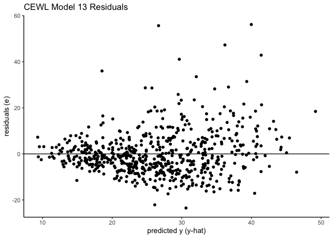<!-- -->

It’s definitely making a fan shape. :(

Brown-Forsythe test to statistically check equal variance:

H0: normally distributed (non-sig test is GOOD) HA: NOT normally
distributed (reject nul == assumption not satisfied)

``` r
# need to create the right data & format first
bf_data <- CEWL_mod_res %>%
  dplyr::mutate(middle_mass = median(mass_g), # mass
                side_mass = as.factor(mass_g > middle_mass),
                # solar radiation
                middle_sorad = median(Solar_rad_Wm2_interpol),
                side_sorad = as.factor(Solar_rad_Wm2_interpol > middle_sorad), 
                # temperature
                middle_temp = median(temp_C_interpol),
                side_temp = as.factor(temp_C_interpol > middle_temp),
                # absolute humidity
                middle_absh = median(Solar_rad_Wm2_interpol),
                side_absh = as.factor(Solar_rad_Wm2_interpol > middle_absh)
                )

# now run test
bf.test(formula = e ~ side_absh, # y~x
        data = bf_data, # dataframe
        alpha = 0.05, # default 0.05
        na.rm = TRUE, # remove missing data before running?
        verbose = TRUE # print output to console?
        )
```

    ## 
    ##   Brown-Forsythe Test (alpha = 0.05) 
    ## ------------------------------------------------------------- 
    ##   data : e and side_absh 
    ## 
    ##   statistic  : 0.03356754 
    ##   num df     : 1 
    ##   denom df   : 625.6028 
    ##   p.value    : 0.8546891 
    ## 
    ##   Result     : Difference is not statistically significant. 
    ## -------------------------------------------------------------

``` r
bf.test(formula = e ~ side_temp, # y~x
        data = bf_data, # dataframe
        alpha = 0.05, # default 0.05
        na.rm = TRUE, # remove missing data before running?
        verbose = TRUE # print output to console?
        )
```

    ## 
    ##   Brown-Forsythe Test (alpha = 0.05) 
    ## ------------------------------------------------------------- 
    ##   data : e and side_temp 
    ## 
    ##   statistic  : 0.1124953 
    ##   num df     : 1 
    ##   denom df   : 575.172 
    ##   p.value    : 0.7374433 
    ## 
    ##   Result     : Difference is not statistically significant. 
    ## -------------------------------------------------------------

``` r
bf.test(formula = e ~ side_sorad, # y~x
        data = bf_data, # dataframe
        alpha = 0.05, # default 0.05
        na.rm = TRUE, # remove missing data before running?
        verbose = TRUE # print output to console?
        )
```

    ## 
    ##   Brown-Forsythe Test (alpha = 0.05) 
    ## ------------------------------------------------------------- 
    ##   data : e and side_sorad 
    ## 
    ##   statistic  : 0.03356754 
    ##   num df     : 1 
    ##   denom df   : 625.6028 
    ##   p.value    : 0.8546891 
    ## 
    ##   Result     : Difference is not statistically significant. 
    ## -------------------------------------------------------------

``` r
bf.test(formula = e ~ side_mass, # y~x
        data = bf_data, # dataframe
        alpha = 0.05, # default 0.05
        na.rm = TRUE, # remove missing data before running?
        verbose = TRUE # print output to console?
        )
```

    ## 
    ##   Brown-Forsythe Test (alpha = 0.05) 
    ## ------------------------------------------------------------- 
    ##   data : e and side_mass 
    ## 
    ##   statistic  : 0.05819411 
    ##   num df     : 1 
    ##   denom df   : 629 
    ##   p.value    : 0.809452 
    ## 
    ##   Result     : Difference is not statistically significant. 
    ## -------------------------------------------------------------

Equal variance is satisfied for all 4 continuous predictor variables.

Now check normality. Is the distribution of residuals **normal**?

use Shapiro-Wilk normality test: H0: data is NOT significantly different
from normal distribution HA: data IS significantly different from normal
distribution

``` r
simple.eda(CEWL_mod_res$e)
```

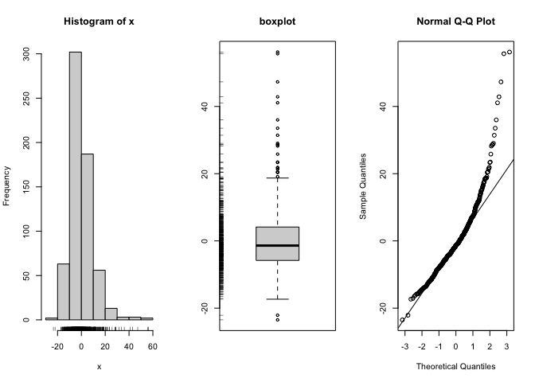<!-- -->

``` r
shapiro.test(CEWL_mod_res$e)
```

    ## 
    ##  Shapiro-Wilk normality test
    ## 
    ## data:  CEWL_mod_res$e
    ## W = 0.90299, p-value < 2.2e-16

not normal\!

### Test Transformations

Can I improve satisfaction of LM assumptions by transforming the
dependent variable?

``` r
CEWL_transf <- all_data_long %>%
  mutate(TEWL_sqrt = sqrt(TEWL_g_m2h),
         TEWL_log = log(TEWL_g_m2h))

# sqrt(TEWL)
CEWL_transf %>%
  ggplot(., aes(x = TEWL_sqrt)) +
  geom_histogram(color = "black", fill="steelblue", bins=50) + 
  theme_classic() +
  xlab("sqrt(CEWL)") + 
  ylab("Count") + 
  facet_wrap(~region)
```

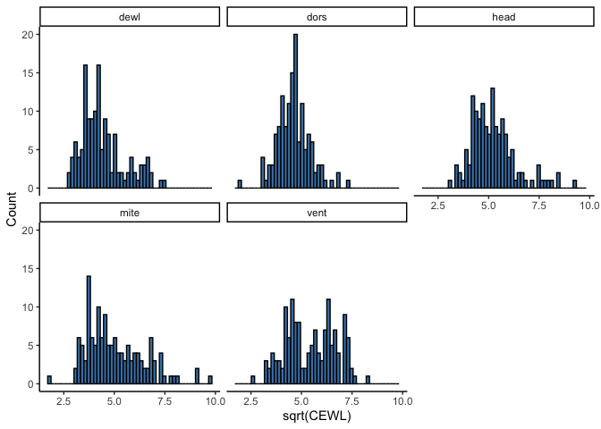<!-- -->

``` r
# log(temperature)
CEWL_transf %>%
  ggplot(., aes(x = TEWL_log)) +
  geom_histogram(color = "black", fill="steelblue", bins=50) + 
  theme_classic() +
  xlab("LOG(CEWL)") + 
  ylab("Count") + 
  facet_wrap(~region)
```

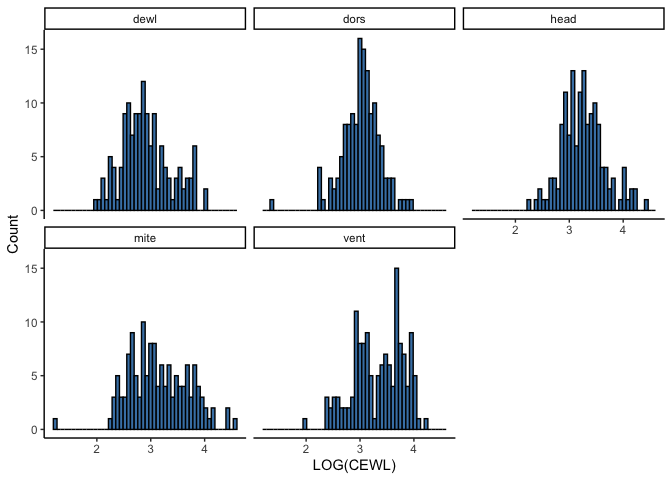<!-- -->

Log transforming seems to be pretty effective across body regions.

### Transform & Re-Model

I will log-transform CEWL and see whether it makes the models satisfy
LMM assumptions better.

Run CEWL model 4 with log-transformed CEWL:

``` r
# log-transformed model 4
CEWL_mod4_t <- lme4::lmer(data = CEWL_mod_dat,
                       log(TEWL_g_m2h) ~
                       region * mass_g +
                       temp_C_interpol:abs_humidity_g_m3_interpol +
                       Solar_rad_Wm2_interpol + 
                       (1|individual_ID) + (1|cloacal_temp_C)) 
summary(CEWL_mod4_t)
```

    ## Linear mixed model fit by REML ['lmerMod']
    ## Formula: 
    ## log(TEWL_g_m2h) ~ region * mass_g + temp_C_interpol:abs_humidity_g_m3_interpol +  
    ##     Solar_rad_Wm2_interpol + (1 | individual_ID) + (1 | cloacal_temp_C)
    ##    Data: CEWL_mod_dat
    ## 
    ## REML criterion at convergence: 647.9
    ## 
    ## Scaled residuals: 
    ##     Min      1Q  Median      3Q     Max 
    ## -4.6688 -0.5760 -0.0493  0.5513  4.0276 
    ## 
    ## Random effects:
    ##  Groups         Name        Variance Std.Dev.
    ##  individual_ID  (Intercept) 0.02524  0.1589  
    ##  cloacal_temp_C (Intercept) 0.06176  0.2485  
    ##  Residual                   0.12168  0.3488  
    ## Number of obs: 631, groups:  individual_ID, 128; cloacal_temp_C, 9
    ## 
    ## Fixed effects:
    ##                                              Estimate Std. Error t value
    ## (Intercept)                                 1.9028787  0.2276117   8.360
    ## regiondors                                  0.5808801  0.1940731   2.993
    ## regionhead                                  0.9282907  0.1905853   4.871
    ## regionmite                                  0.1343119  0.1975458   0.680
    ## regionvent                                  0.6168839  0.1923817   3.207
    ## mass_g                                      0.0517339  0.0137146   3.772
    ## Solar_rad_Wm2_interpol                      0.0004471  0.0001581   2.828
    ## regiondors:mass_g                          -0.0455884  0.0174091  -2.619
    ## regionhead:mass_g                          -0.0586167  0.0171444  -3.419
    ## regionmite:mass_g                           0.0077674  0.0176941   0.439
    ## regionvent:mass_g                          -0.0171802  0.0172641  -0.995
    ## temp_C_interpol:abs_humidity_g_m3_interpol  0.0001971  0.0008627   0.229
    ## 
    ## Correlation of Fixed Effects:
    ##             (Intr) rgndrs regnhd regnmt rgnvnt mass_g S__W2_ rgnd:_ rgnh:_
    ## regiondors  -0.431                                                        
    ## regionhead  -0.440  0.515                                                 
    ## regionmite  -0.417  0.496  0.500                                          
    ## regionvent  -0.443  0.511  0.520  0.495                                   
    ## mass_g      -0.624  0.620  0.633  0.606  0.628                            
    ## Slr_rd_Wm2_ -0.199 -0.002  0.004 -0.006  0.006  0.004                     
    ## rgndrs:mss_  0.420 -0.974 -0.502 -0.483 -0.497 -0.636  0.003              
    ## rgnhd:mss_g  0.427 -0.500 -0.973 -0.486 -0.504 -0.648 -0.004  0.513       
    ## rgnmt:mss_g  0.407 -0.483 -0.488 -0.975 -0.483 -0.623  0.005  0.496  0.500
    ## rgnvnt:mss_  0.431 -0.497 -0.506 -0.482 -0.973 -0.644 -0.005  0.510  0.517
    ## tm_C_:___3_ -0.401  0.005 -0.001  0.004  0.007 -0.030 -0.560 -0.006  0.001
    ##             rgnm:_ rgnv:_
    ## regiondors               
    ## regionhead               
    ## regionmite               
    ## regionvent               
    ## mass_g                   
    ## Slr_rd_Wm2_              
    ## rgndrs:mss_              
    ## rgnhd:mss_g              
    ## rgnmt:mss_g              
    ## rgnvnt:mss_  0.496       
    ## tm_C_:___3_ -0.004 -0.007

``` r
# compare
anova(CEWL_mod4_t, CEWL_mod4)
```

    ## refitting model(s) with ML (instead of REML)

    ## Data: CEWL_mod_dat
    ## Models:
    ## CEWL_mod4_t: log(TEWL_g_m2h) ~ region * mass_g + temp_C_interpol:abs_humidity_g_m3_interpol + 
    ## CEWL_mod4_t:     Solar_rad_Wm2_interpol + (1 | individual_ID) + (1 | cloacal_temp_C)
    ## CEWL_mod4: TEWL_g_m2h ~ region * mass_g + temp_C_interpol:abs_humidity_g_m3_interpol + 
    ## CEWL_mod4:     Solar_rad_Wm2_interpol + (1 | individual_ID) + (1 | cloacal_temp_C)
    ##             npar    AIC    BIC   logLik deviance Chisq Df Pr(>Chisq)
    ## CEWL_mod4_t   15  593.5  660.2  -281.75    563.5                    
    ## CEWL_mod4     15 4842.6 4909.3 -2406.28   4812.6     0  0

The transformed model is WAYYYY better\! :D

### Re-Check Assumptions (transformed model 4)

First, get residuals:

``` r
CEWL_t_mod_res <- CEWL_mod_dat %>%
  mutate(y_hat = predict(CEWL_mod4_t),
         e = residuals(CEWL_mod4_t))
```

Linearity and Equal Variance

Is the function **linear**? Is there **equal** variance of the
residuals? The residuals should be homoskedactic relative to y\_hat (or
x). We don’t care if there is a relationship between the residuals \~
dependent variable (actual y).

Plotting residuals shows us whether the data meets linearity and equal
variance assumptions:

``` r
ggplot(data = CEWL_t_mod_res, aes(x = y_hat, y = e)) +
  geom_point() + 
  theme_classic() + 
  xlab("predicted y (y-hat)") +
  ylab("residuals (e)") +
  ggtitle("CEWL Model 13 Residuals") +
  geom_hline(yintercept = 0)
```

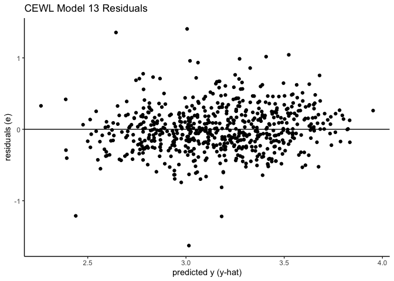<!-- -->

It looks much much better. :)

Brown-Forsythe test to statistically check equal variance:

H0: normally distributed (non-sig test is GOOD) HA: NOT normally
distributed (reject nul == assumption not satisfied)

``` r
# need to create the right data & format first
bf_data_t <- CEWL_t_mod_res %>%
  dplyr::mutate(middle_mass = median(mass_g), # mass
                side_mass = as.factor(mass_g > middle_mass),
                # solar radiation
                middle_sorad = median(Solar_rad_Wm2_interpol),
                side_sorad = as.factor(Solar_rad_Wm2_interpol > middle_sorad), 
                # temperature
                middle_temp = median(temp_C_interpol),
                side_temp = as.factor(temp_C_interpol > middle_temp),
                # absolute humidity
                middle_absh = median(Solar_rad_Wm2_interpol),
                side_absh = as.factor(Solar_rad_Wm2_interpol > middle_absh)
                )

# now run test
bf.test(formula = e ~ side_absh, # y~x
        data = bf_data_t, # dataframe
        alpha = 0.05, # default 0.05
        na.rm = TRUE, # remove missing data before running?
        verbose = TRUE # print output to console?
        )
```

    ## 
    ##   Brown-Forsythe Test (alpha = 0.05) 
    ## ------------------------------------------------------------- 
    ##   data : e and side_absh 
    ## 
    ##   statistic  : 0.1254358 
    ##   num df     : 1 
    ##   denom df   : 628.8019 
    ##   p.value    : 0.7233308 
    ## 
    ##   Result     : Difference is not statistically significant. 
    ## -------------------------------------------------------------

``` r
bf.test(formula = e ~ side_temp, # y~x
        data = bf_data_t, # dataframe
        alpha = 0.05, # default 0.05
        na.rm = TRUE, # remove missing data before running?
        verbose = TRUE # print output to console?
        )
```

    ## 
    ##   Brown-Forsythe Test (alpha = 0.05) 
    ## ------------------------------------------------------------- 
    ##   data : e and side_temp 
    ## 
    ##   statistic  : 0.008266216 
    ##   num df     : 1 
    ##   denom df   : 572.3244 
    ##   p.value    : 0.927589 
    ## 
    ##   Result     : Difference is not statistically significant. 
    ## -------------------------------------------------------------

``` r
bf.test(formula = e ~ side_sorad, # y~x
        data = bf_data_t, # dataframe
        alpha = 0.05, # default 0.05
        na.rm = TRUE, # remove missing data before running?
        verbose = TRUE # print output to console?
        )
```

    ## 
    ##   Brown-Forsythe Test (alpha = 0.05) 
    ## ------------------------------------------------------------- 
    ##   data : e and side_sorad 
    ## 
    ##   statistic  : 0.1254358 
    ##   num df     : 1 
    ##   denom df   : 628.8019 
    ##   p.value    : 0.7233308 
    ## 
    ##   Result     : Difference is not statistically significant. 
    ## -------------------------------------------------------------

``` r
bf.test(formula = e ~ side_mass, # y~x
        data = bf_data_t, # dataframe
        alpha = 0.05, # default 0.05
        na.rm = TRUE, # remove missing data before running?
        verbose = TRUE # print output to console?
        )
```

    ## 
    ##   Brown-Forsythe Test (alpha = 0.05) 
    ## ------------------------------------------------------------- 
    ##   data : e and side_mass 
    ## 
    ##   statistic  : 0.1065383 
    ##   num df     : 1 
    ##   denom df   : 625.8802 
    ##   p.value    : 0.7442292 
    ## 
    ##   Result     : Difference is not statistically significant. 
    ## -------------------------------------------------------------

Equal variance is still satisfied for all 4 continuous predictor
variables.

Now check normality. Is the distribution of residuals **normal**?

use Shapiro-Wilk normality test: H0: data is NOT significantly different
from normal distribution HA: data IS significantly different from normal
distribution

``` r
simple.eda(CEWL_t_mod_res$e)
```

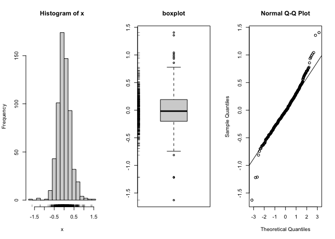<!-- -->

``` r
shapiro.test(CEWL_t_mod_res$e)
```

    ## 
    ##  Shapiro-Wilk normality test
    ## 
    ## data:  CEWL_t_mod_res$e
    ## W = 0.97767, p-value = 3.178e-08

Still not statistically normal… but the distribution looks a lot better.

### Conclusion

The best CEWL model should use log-transformed CEWL because this greatly
improves the model based on AIC and it allows the model to satisfy the
linearity assumption of LMM.

``` r
# save model 4 summary object
CEWL_best_t_mod <- summary(CEWL_mod4_t)
# extract stats table from summary object
CEWL_best_t_mod_vals <- data.frame(CEWL_best_t_mod$coefficients)
# export 
write.csv(CEWL_best_t_mod_vals, "CEWL_best_mod_vals.csv")
```

# What to Present in the Paper

  - figures (exported)
  - hct SLR
  - best osml mod (transformed?)
  - best CEWL mod (CEWL transformed)
